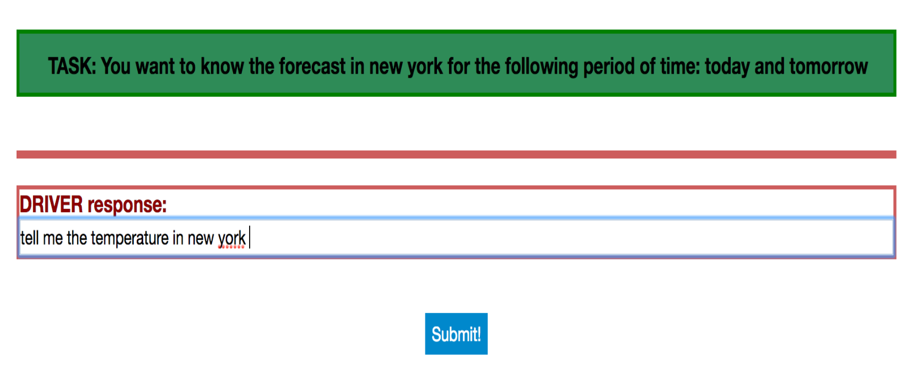
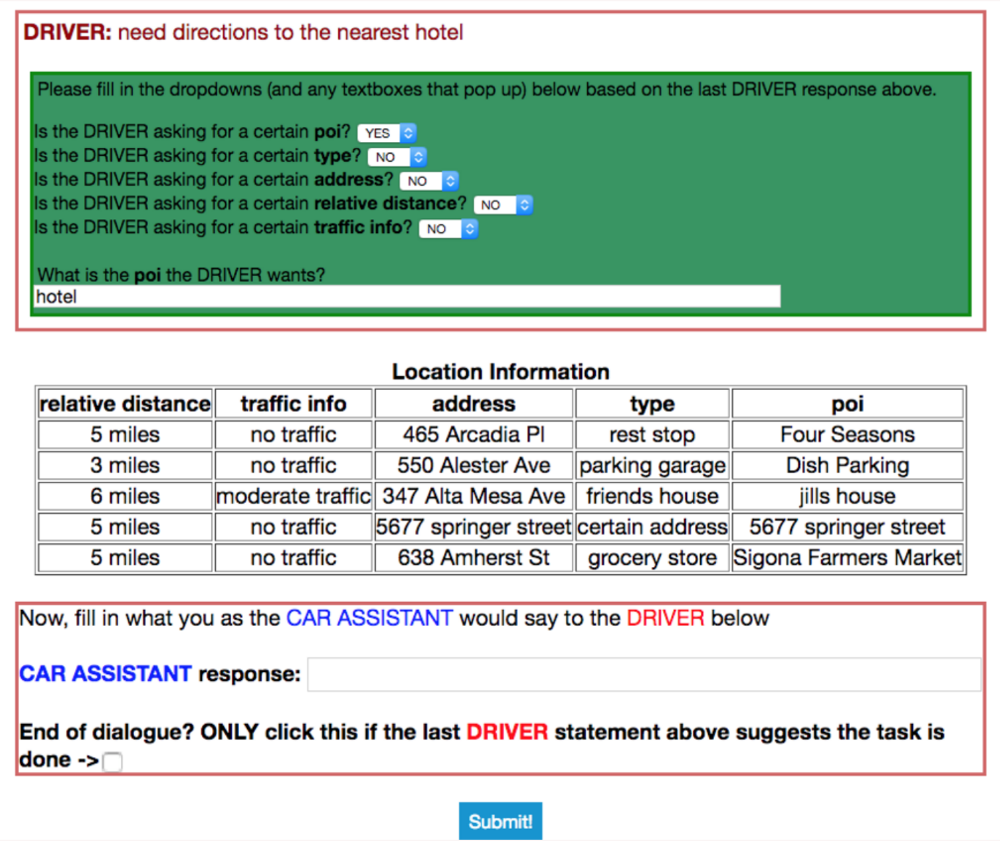

Task-oriented dialogue focuses on conversational agents that participate in user-initiated dialogues on domain-specific topics. Traditionally, the task-oriented dialogue community has often been hindered by a lack of sufficiently large and diverse datasets for training models across a variety of different domains. 

In an effort to help alleviate this problem, we release a corpus of *3,031 multi-turn dialogues in three distinct domains* appropriate for an in-car assistant: calendar scheduling, weather information retrieval, and point-of-interest navigation. Our dialogues are grounded through knowledge bases ensuring that they are versatile in their natural language without being completely free form. The dialogues include exchanges such as the following:

|         |            |  |
| ------------- |:-------------:| -----:|
| **DRIVER** | | I need to find the time and parties attending my optometrist appointment. |
| **CAR**      |     |  I have 3 appointments scheduled, with Alex, your sister, and Jeff. Which are you referring to? |
| **DRIVER**      |     | I want to know about the one that Alex is joining me at. |
| **CAR**      |     | That optometrist appointment is at 4 pm. |
| **DRIVER**      |     | Thanks |
| **CAR**      |     | No problem. |

## Data Collection

Our data was collected using a Wizard-of-Oz scheme inspired by that of [Wen et. al.](https://arxiv.org/abs/1604.04562) In our scheme, users had two potential modes they could play: *Driver* and *Car Assistant*. In the *Driver* mode, users were presented with a task that listed certain information they were trying to extract from the *Car Assistant* as well as the dialogue history exchanged between *Driver* and *Car Assistant* up to that point. An example task is presented in the *Driver* mode figure below. The *Driver* was then only responsible for contributing a single line of dialogue that appropriately continued the discourse given the prior dialogue history and the task definition.

Tasks were randomly specified by selecting values (*5pm, Saturday, San Francisco,* etc.) for three to five slots (**time, date, location,** etc.) that depended on the domain type. Values specified for the slots were chosen according to a uniform distribution from a per-domain candidate set.

In the *Car Assistant* mode, users were presented with the dialogue history exchanged up to that point in the running dialogue and a private knowledge base known only to the *Car Assistant* with information that could be useful for satisfying the Driver query. Examples of knowledge bases could include a calendar of event information, a collection of weekly forecasts for nearby cities, or a collection of nearby points-of-interest with relevant information. The *Car Assistant* was then responsible for using this private information to provide a single utterance that progressed the user-directed dialogues. The *Car Assistant* was also asked to fill in dialogue state information for mentioned slots and values in the dialogue history up to that point. We provide a screenshot of *Car Assistant* mode below:

Each private knowledge base had six to seven distinct rows and five to seven attribute types. The private knowledge bases used were generated by uniformly selecting a value for a given attribute type, where each attribute type had a variable number of candidate values. Some knowledge bases intentionally lacked certain attributes to encourage diversity in discourse.

While specifying the attribute types and values in each task presented to the *Driver* allowed us to ground the subject of each dialogue with our desired entities, it would occasionally result in more mechanical discourse exchanges. To encourage more naturalistic, unbiased utterances, we had users record themselves saying commands in response to underspecified visual depictions of an action a car assistant could perform. These commands were transcribed and then inserted as the first exchange in a given dialogue on behalf of the *Driver*. Roughly 1,500 of the dialogues employed this transcribed audio command first-utterance technique.

241 unique workers from Amazon Mechanical Turk were anonymously recruited to use the interface we built over a period of about six days.

## Data Statistics

Below we include statistics for our dataset:

|         |            |  |
| ------------- |:-------------:| -----:|
| **Training Dialogues** | | 2,425 |
| **Validation Dialogues**      |     |  302 |
| **Test Dialogues**      |     | 304 |
| **Calendar Scheduling Dialogues**      |     | 1,034 |
| **Navigation Dialogues**      |     | 1,000 |
| **Weather Dialogues**      |     | 997 |
| **Avg. # Utterances Per Dialogue**      |     | 5.25 |
| **Avg. # Tokens Per Utterance**      |     | 9 |
| **Vocabulary Size**      |     | 1,601 |
| **# of Distinct Entities**      |     | 284 |
| **# of Entity (or Slot) Types**      |     | 15 |

We also include some information regarding the type and number of slots per domain:

|         |   Calendar Scheduling  | Weather Information Retrieval | POI Navigation |
| ------------- |:-------------:| -----:| -----:|
| **Slot Types** | event, time, date, party, room, agenda | location, weekly time, temperature, weather attribute | POI name, traffic info, POI category, address, distance |
| **# Distinct Slot Values**      | 79 |  65 | 140 |

Our dataset was designed so that each dialogue had the grounded world information that is often crucial for training task-oriented dialogue systems, while at the same time being sufficiently lexically and semantically versatile. We hope that this dataset will be useful in building diverse and robust task-oriented dialogue systems!

## Download 

Our data is made publicly available for download at the following link: [dataset](http://nlp.stanford.edu/projects/kvret/kvret_dataset_public.zip)  
If you choose to use this dataset for your own work, please cite the following paper:  
> Mihail Eric and Lakshmi Krishnan and Francois Charette and Christopher D. Manning. 2017. Key-Value Retrieval Networks for Task-Oriented Dialogue. In *Proceedings of the Special Interest Group on Discourse and Dialogue (SIGDIAL)*. [https://arxiv.org/abs/1705.05414](https://arxiv.org/abs/1705.05414)
