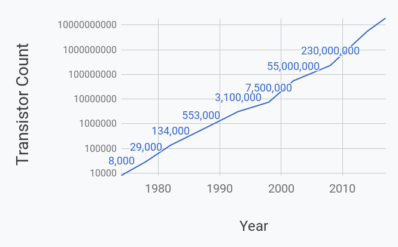

Nowadays it’s hard to go to any news source, social media outlet, or downtown bar without hearing the term artificial intelligence thrown around. Thanks to the wonder of [clickbaity articles](https://www.independent.co.uk/life-style/gadgets-and-tech/news/facebook-artificial-intelligence-ai-chatbot-new-language-research-openai-google-a7869706.html) and [outlandish journalism](https://www.youtube.com/watch?v=78-1MlkxyqI), artificial intelligence has become synonymous with everything from “that thing” Google and Facebook do (you know, “that thing”) to Skynet and the impending end of humanity as we know it.

That’s all well and good, but we are still left with some big questions. Why are we talking about this in 2018? Why do people suddenly care so much about artificial intelligence?

After all, Stanley Kubrick’s [Hal 9000](https://en.wikipedia.org/wiki/2001:_A_Space_Odyssey_%28film%29) was stirring the public imagination about artificial intelligence back in 1968! And if we want to go more 21st century with the references, Steven Spielberg’s touching film (literally titled [A.I. Artificial Intelligence](https://www.imdb.com/title/tt0212720/)) was released in 2001.

Moreover, even scientists were talking about AI back in the day. At a historic Dartmouth workshop in 1955, the great computer scientist John McCarthy is [credited](https://ai.stanford.edu/~nilsson/QAI/qai.pdf) with describing “the artificial intelligence problem...to be that of making a machine behave in ways that would be called intelligent if a human were so behaving.”

He also boldly proclaimed that a significant advance can be made in AI if “a carefully selected group of scientists work on it together for a summer.”

For those of you out there storing canned beans in the bunker for when the machines attack, don’t worry: after many, many summers, we aren’t even close to solving AI.

So then why did we choose to show up to the party now?

These are especially relevant questions given that many of the actual techniques we use in modern-day AI systems have been around for decades. Today deep learning is one of the predominant flavors of AI on the market, and many of its core ideas were discovered by David Rumelhart, Geoffrey Hinton, and others [back in the 1980s](https://www.nature.com/articles/323533a0).

Given all that backstory, I want to discuss how we got to this AI excitement we are feeling today, without appealing to the clickbait-lover inside all of us.

It’s fair to say that there are at least three reasons why the AI boom has drastically taken off in the past few years:

## 1. Modern-day computing power is changing the landscape of problems we can tackle

In 1965, Gordon Moore, the cofounder of Intel, [announced](http://www.lithoguru.com/scientist/CHE323/Moore1995.pdf) that the number of components on a computer chip would double every year. Indeed, the number of transistors on a chip is a good measure for the computing power of a machine.

This claim has become a self-fulfilling prophecy whereby industry chip developers have pursued aggressive technological development programs to sustain the pace of doubling transistor count **roughly every eighteen months**! Moore’s law has been consistently upheld for more than four decades.

<figure>
	
	<figcaption>Number of transistors on standard microprocessors over time. The y-axis uses a logarithmic scale, hence why the plot is roughly linear</figcaption>
</figure>

So what? You can put a lot more electric components on a chip hidden in my laptop. It’s not like I can count them. What’s the big deal?

This is an amazing feat not just because we’ve done it, but because of *what it enables us to do*. The dramatic increase in compute has allowed us to build far more powerful algorithms and tools that can perform orders of magnitude more computations per second.

Just to put things into perspective: it takes an equivalent amount of computations to answer [**one Google search query**](https://thenextweb.com/google/2012/08/28/fun-fact-one-google-search-uses-computing-power-entire-apollo-space-mission/) as all the calculations done in flight and on ground for the **entire NASA Apollo program**. That means that the compute it takes you to open a browser and search “what is covfefe?” would have sent mankind to the moon in 1969. That’s insane!

And that’s just CPU (central processing unit) power. Today GPUs (graphical processing units) are the go-to workhorse of building AI systems.

It turns out that for certain highly-optimized mathematical operations (such as matrix multiplication), GPUs can achieve speeds that are more than [**10 times faster than CPUs**](https://medium.com/@andriylazorenko/tensorflow-performance-test-cpu-vs-gpu-79fcd39170c).

<figure>
	<blockquote>
		
With all these new computational superpowers, just imagine the types of questions society can ask and problems it can address.

	</blockquote>
</figure>

Modern AI systems eat up compute like the Cookie Monster breaking a diet, so this technology has truly broadened our horizons. With all these new computational superpowers, just imagine the types of questions society can ask and problems it can address.

## 2. Dataset sizes have seen unprecedented growth

Deep learning has unequivocally become the de facto technique for building artificially intelligent systems, and these algorithms need data to be effective.

Recently, there have been a number of large public datasets that have become available across domains such as [image classification](http://image-net.org/about-overview) and [question answering](https://rajpurkar.github.io/SQuAD-explorer/). Public data is a wonderful resource that academic researchers, you, and I can use to work on cool projects and push the boundaries of human knowledge. 

Additionally, in our increasingly interconnected and global world, the amount of new data being created by individuals is immense! [Studies](https://blog.microfocus.com/how-much-data-is-created-on-the-internet-each-day/) indicate that in 2017, **over 500,000 comments are posted and nearly 150,000 photos are uploaded every minute** on Facebook alone.

Now pause. Let that last line sink in. 500,000 comments and 150,000 photos every minute. That is absolutely crazy!

You know how many photos were uploaded to online platforms every year back in 1969? You guessed right: 0.

The growing number of embedded systems (such as phones, tablets, etc.) and online platforms through which users interact have been and are going to continue to be rich sources of data.

In AI, it is a predominantly accepted folk wisdom that more data leads to better systems. All this data created on a daily basis is powering AI technologies that are helping us derive meaningful insights about our *behaviors, preferences, and desires*, in ways we have never been able to before.

## 3. Democratization of technological tools are enabling new and innovative solutions to problems

More data and increased compute is nice, but those are things most people don’t get excited about on their own.

Today, the emergence of cloud computing services such as Google Cloud, Microsoft Azure, and Amazon Web Services are making it easier than ever to build scalable, data-driven solutions to various problems. With these services, you can be sitting on your couch at home (or anywhere with WiFi for that matter), and within a few minutes you can have access to industry-grade computing power without burning a hole in your wallet.

In addition, today we are at a point where powerful scientific computing libraries such as [Scikit-learn](http://scikit-learn.org/stable/) and [Tensorflow](https://www.tensorflow.org/) are accessible to just about anyone with basic programming proficiency.

Whereas before deep learning and AI were typically only done by academics with PhDs, today anyone can download Tensorflow and build a neural network **in about an hour**.

Imagine that: being able to do something in an hour that previously would have taken multiple years of a higher education degree program.

As a further testament to the appeal of these libraries, as of this writing, **Tensorflow is the sixth most popular repository on [Github](https://github.com/search?q=stars:%3E1&s=stars&type=Repositories)** (popularity based on number of stars).

## When the Stars Align...
When momentous events happen in history, they are usually the product of years of slow build up, followed by some unforeseen occurrence that sets off a tsunami of change.

Consider as an example the French Revolution. It took years of poor harvests, unpopular taxation, increasing debt, and widening social rifts between the aristocracy and everyday citizens to stir the cauldron of change. However, it was the sudden storming of the Bastille that piggybacked off these circumstances to trigger one of the greatest political revolutions in human history.

In an analogous fashion, with AI, years of better compute power, increasing dataset sizes, and improved developer toolkits gradually set the stage for something transformative to happen.

All of these factors came together in 2012 when a team from the University of Toronto led by Geoff Hinton trained a deep learning model that **trounced the competition** in the ImageNet challenge.

<figure>
	<blockquote>
		
For academics, this type of an improvement is career-making. For the rest of the world, this type of an improvement is society-changing.

	</blockquote>
</figure>

ImageNet was an annual challenge held until 2017 that involved a number of tasks related to classifying and categorizing images. It was the premier competition for building systems with vision capabilities.

The object recognition portion of the challenge involved giving participating teams several million images labelled according to 1000 categories. The goal was to build a system that could produce the most correct labels for the given images.

<figure>
	
	<figcaption>An image from the ImageNet dataset. What is this a picture of?</figcaption>
</figure>

In the [2012 competition](http://www.image-net.org/challenges/LSVRC/2012/results.html), the Toronto team trained a deep learning model that achieved **16.4% error, compared to the previous best of 25.8%** (lower is better)!

For academics, this type of an improvement is career-making. For the rest of the world, this type of an improvement is society-changing.

All of a sudden, systems became good enough at vision where they could be confidently applied to a score of different problems. Today vision companies are appearing every other day claiming to solve a new problem. Moreover, these new-and-improved vision systems are [already powering](https://www.iotforall.com/computer-vision-applications-in-daily-life/) many of the technologies we use all the time.

The 2012 ImageNet Toronto system delivered an unheard of improvement in performance and is widely credited with re-inspiring interest in deep learning research as well as beginning the current artificial intelligence wave. 

Since that momentous achievement, the principles of deep learning have been applied to problems including [healthcare](https://cs.stanford.edu/people/esteva/nature/), [speech recognition](https://cloud.google.com/speech-to-text/), [translation](https://en.wikipedia.org/wiki/Google_Neural_Machine_Translation), [lip reading](https://www.newscientist.com/article/2113299-googles-deepmind-ai-can-lip-read-tv-shows-better-than-a-pro/), [self driving cars](https://devblogs.nvidia.com/deep-learning-self-driving-cars/), and so many other things.

The excitement is in the air both within academia as well as industry. There is an overwhelming belief that the current age of artificial intelligence has the potential to be the next major technological paradigm shift, similar to the birth of transistors, the rise of network routers, or the standardization of the web.

If artificial intelligence lives up to its promises, it will revolutionize the world as we know it.

*Thanks to [Sabera Talukder](https://twitter.com/SaberaTalukder) for all the helpful feedback and insights on early versions of this article.*
