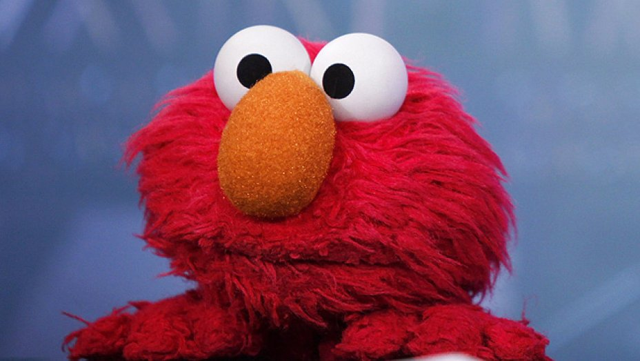
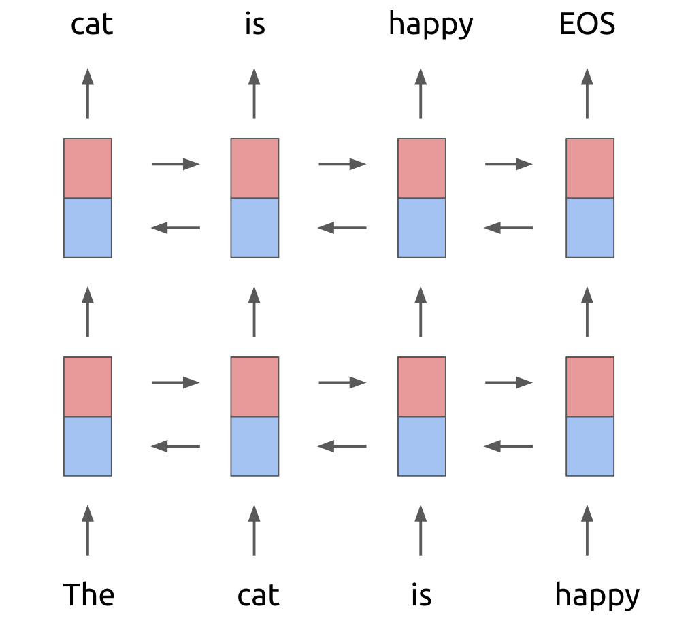
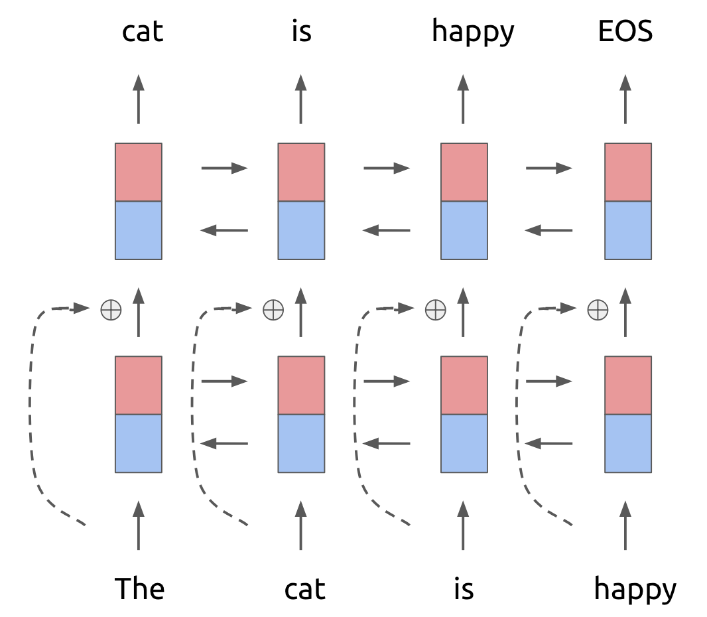
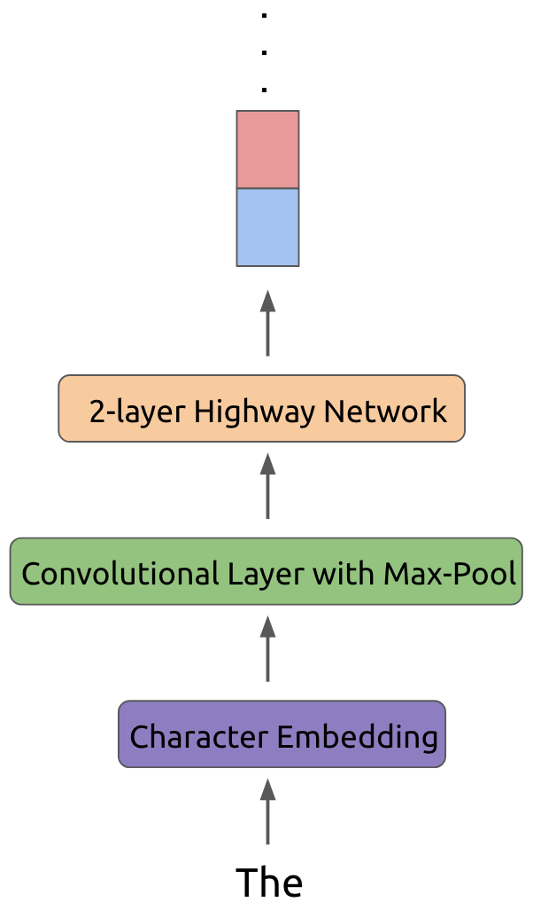
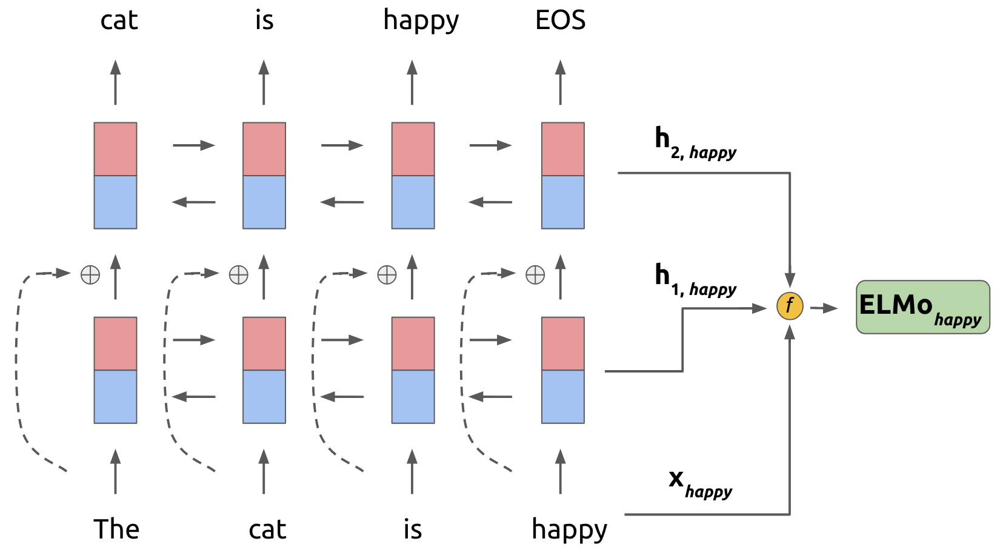

In this post, I will discuss a recent paper from [AI2](https://allenai.org/) entitled *Deep Contextualized Word Representations*
that has caused quite a stir in the natural language processing community due to the fact that the model proposed 
achieved state-of-the-art on literally every benchmark task it was tested on! These are **extremely** impressive results. 

This paper consolidates a lot of the work in large-scale neural language modelling
and extends previous results on pretrained embeddings for language tasks that includes [Word2Vec](https://en.wikipedia.org/wiki/Word2vec) and [GLoVe](https://nlp.stanford.edu/projects/glove/). It 
proposes a collection of new neurally-derived representations called **ELMo** (Embeddings from Language Models), and the TLDR
is quite simple:

1) **Embeddings learned from large-scale neural language models can be extremely effective representations for semisupervised transfer learning**
2) **Add ELMo vectors to basically any NLP task and see performance gains**

Now let's take a deeper dive into ELMo's details!

## How ELMo Works

The ELMo architecture begins by training a fairly sophisticated neural network language model, heavily inspired by previous work
on large-scale language models. 

If you are not familiar with language modelling, check out [this](https://en.wikipedia.org/wiki/Language_model), but the gist
is that a language model seeks to compute the probability of a word, given some prior history of words seen. Such models 
allow you to determine that if you see the phrase *I am going to write with a*, the word *pencil* seems to be a 
more reasonable next word than *frog*.

For the purposes of ELMo, the language model used begins with a 2-layer bidirectional LSTM backbone as follows:

<figure>
	
	<figcaption>An unravelled 2-layer bidirectional LSTM. The red box represents the forward recurrent unit, and the blue 
	represents the backward recurrent unit.</figcaption>
</figure>

*NOTE*: *As [Danqi Chen](https://www.cs.princeton.edu/~danqic/) pointed out, the diagram above is a bit misleading. The original ELMo paper runs separate multi-layer forward and backward LSTMs and then concatenates the representations at each layer. This is different then running a layer of forward and backward LSTM, concatenating, and then feeding into the next layer as the diagram above might suggest.*

Now, to this 2-layer network, a residual connection is added between the first and second layers (for a review of residual connections, check out this [beautiful paper](https://arxiv.org/abs/1512.03385)). 
The high-level intuition is that residual connections help deep models train more successfully. The language model
then looks as follows:

<figure>
	
	<figcaption>A residual connection is added between the first and second LSTM layers. The input to the first layer is added to
	its output before being passed on as the input to the second layer.</figcaption>
</figure>

Now, in traditional neural language models, each token in the first input layer (in this case *The cat is happy*) is converted
into a fixed-length word embedding before being passed into the recurrent unit. This is done either by initializing a word embedding
matrix of size *(Vocabulary size)* x *(Word embedding dimension)*, or by using a pretrained embedding such as GLoVe for each token.

However, for the ELMo language model, we do something a bit more complex. Rather than simply looking up an embedding in a word embedding matrix,
we first convert each token to an appropriate representation using *character embeddings*. This character embedding representation is then 
run through a convolutional layer using some number of filters, followed by a max-pool layer. Finally this representation is passed through a 2-layer 
[highway network](https://arxiv.org/abs/1505.00387) before being provided as the input to the LSTM layer. 

For more details about this process, 
[check out](https://arxiv.org/pdf/1508.06615.pdf). The gist of it works as follows:

<figure>
	
	<figcaption>Transformations applied for each token before being provided to input of first LSTM layer. We focus on only the first token
	and don't include the remainder of the model here for clarity.</figcaption>
</figure>

These transformations to the input token have a number of advantages. First off, using character embeddings allows us to pick 
up on morphological features that word-level embeddings could miss. In addition, using character embeddings ensures that we can form
a valid representation even for out-of-vocabulary words, which is a huge win. 

Next, using convolutional filters allows us
to pick up on n-gram features that build more powerful representations. The highway network layers allow for smoother information transfer 
through the input. 

This then forms the core of the ELMo language model. Phew! Now, if this is all the paper had presented there would be no
novel contributions, as the language model architecture is basically identical to [prior work](https://arxiv.org/abs/1602.02410). 

Where ELMo takes big strides is in **how we use** the language model once it is trained. 

Assume that we 
are looking at the $k^{\textrm{th}}$ word in our input. 
Using our trained 2-layer language model, we take the word representation $x_{k}$ as well as the bidirectional hidden layer 
representations $h_{1, k}$ and $h_{2, k}$ and combine them into a new weighted task representation. This 
look as follows:

<figure>
	
	<figcaption>An example of combining the bidirectional hidden representations and word representation for "happy" to get an
	ELMo-specific representation. Note: here we omit visually showing the complex network for extracting the word representation that we
	described in the previous section. </figcaption>
</figure>

To be more concrete about the mathematical details, the function *f* described performs the following operation on word $k$ of the input:

$$
ELMo_k^{task} = \gamma_k \cdot (s_0^{task}\cdot x_{k} + s_1^{task}\cdot h_{1,k} + s_2^{task} \cdot h_{2,k})
$$

Here the $s_i$ represent softmax-normalized weights on the hidden representations from the language model and $\gamma_k$ 
represents a task-specific scaling factor.

Note here that we learn a separate ELMo representation for each task (question answering, sentiment analysis, etc.) the model is being used for.
To use ELMo in a task, we first freeze the weights of the trained language model and then concatenate the $ELMo_k^{task}$
for each token to the input representation of each task-specific model. The weighting factors $\gamma_k$ and $s_i$ are then learned during
training of the task-specific model.

That is the essence of how ELMo works! A simple but **extremely powerful** idea. 

## How ELMo is Built

There are a few details worth mentioning about how the ELMo model is trained and used. 

First off, the ELMo language model is trained on a sizable dataset: the [1B Word Benchmark](https://arxiv.org/abs/1312.3005).
In addition, the language model really is large-scale with the LSTM layers containing 4096 units and the input embedding transform
using 2048 convolutional filters. Here, we can imagine the residual connection between the first and second LSTM layer was quite important for training.

Another significant detail is that fine tuning the language model on task-specific data (where applicable)
led to drops in perplexity and increases in downstream task performance. This is an important result as it attests to the importance
of domain transfer in neural models.

## Experiments

The experimental results really speak to the power of the ELMo concept. ELMo representations were added to existing 
architectures across six benchmark NLP tasks: question answering, textual entailment, semantic role labelling, named entity 
extraction, coreference resolution, and sentiment analysis. In **all** cases, the enhanced models achieved state-of-the-art performance!

|     **Task**    |   Previous SOTA | ELMo Results| 
| ------------- |:-------------:| -----:| 
| SQuAD (question/answering) | 84.4 | 85.8 | 
| SNLI (textual entailment)      | 88.6 |  88.7 |
| Semantic Role Labelling      | 81.7 |  84.6 |
| Coref Resolution      | 67.2 |  70.4 |
| NER      | 91.93 |  92.22 |
| SST-5 (sentiment analysis)      | 53.7 |  54.7 |

Some further analyses of ELMo demonstrated other interesting results. For example, ELMo is shown to increase the sample
efficiency of certain models considerably. In the case of semantic role labelling, adding ELMo to a baseline model made it
so that **98% fewer** parameter updates were required to achieve comparable development performance to the baseline model alone. Impressive!

 
## Final Thoughts

The ELMo paper follows in an increasingly interesting vein of deep learning research related to transfer learning and 
semisupervised learning. There is a strong desire in the research community to be able to leverage knowledge gained by a model
in one task to new tasks, rather than having to learn a new model from scratch each time.

We have already seen some tremendous results in computer vision transfer learning (as an 
example, check out my [post on R-CNN](/posts/object-detection-with-rcnn/)). It's basically folk wisdom that
pretraining on ImageNet is a great way to bootstrap a new model, especially when data is scarce in your desired task.

However, such all-encompassing results have thus far been quite elusive in natural language processing. ELMo is such an important
paper because it has taken the first steps in demonstrating that language model transfer learning may be the ImageNet equivalent
for natural language processing. It will be exciting to see how these results are built upon in the future!

