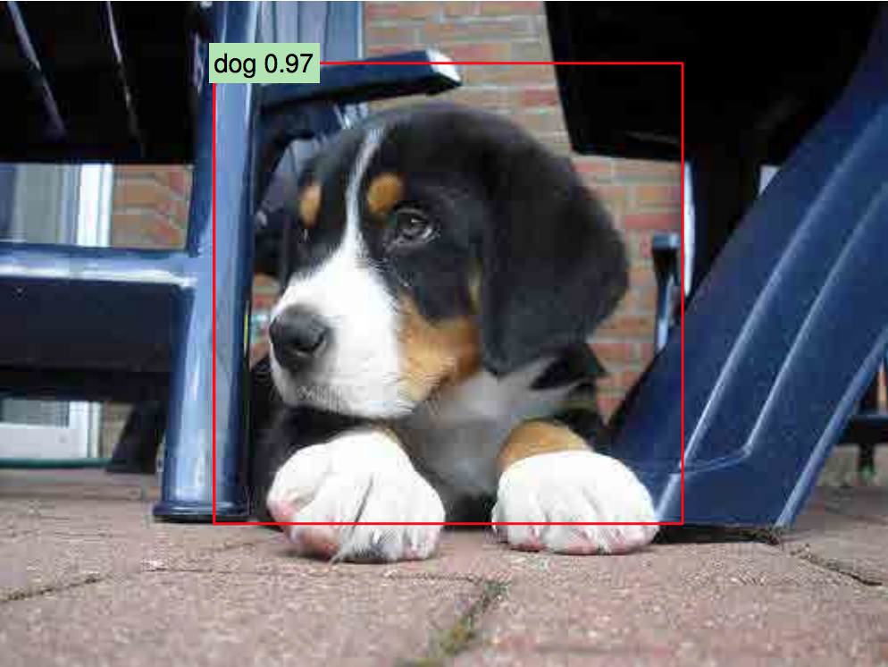
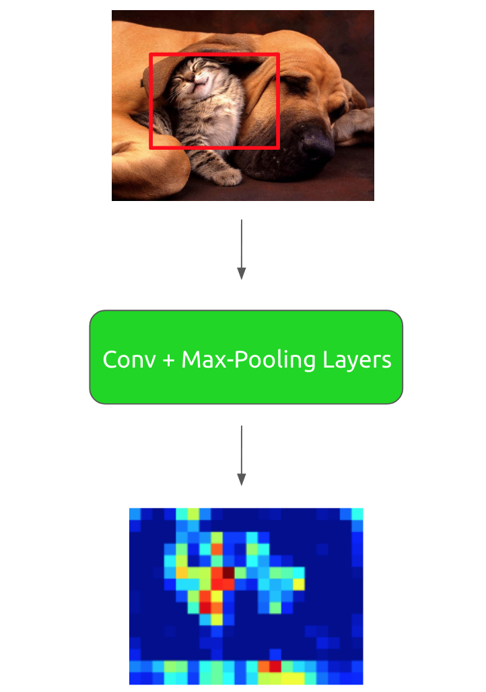
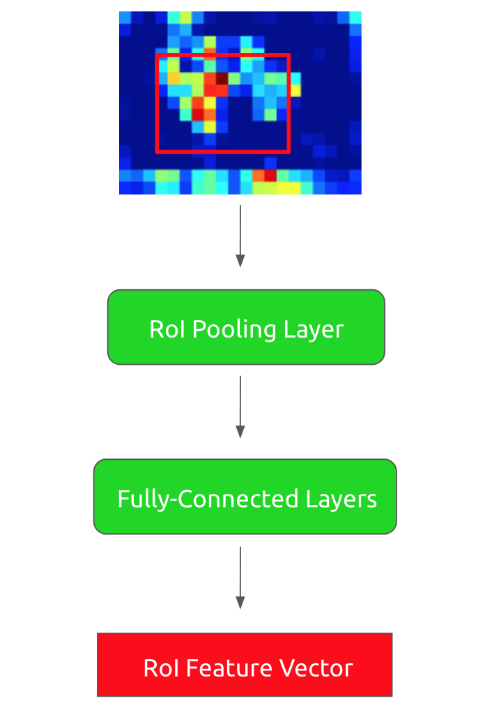
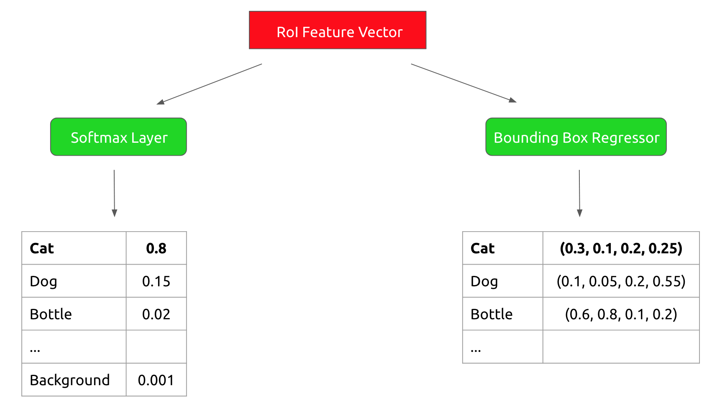
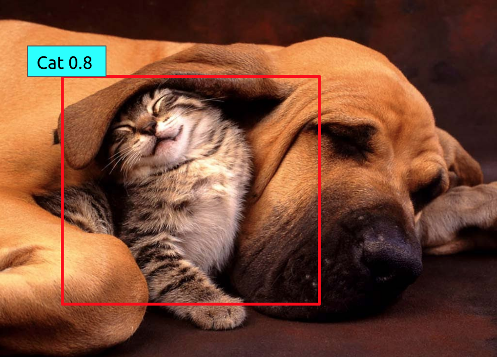

In this article, we will continue in the vein of classic object detection papers by discussing **Fast R-CNN**. Studying
this line of region proposal with convolutional network work is rewarding because it allows us to see an iterative
refinement on a collection of models, each seeking to address shortcomings in its predecessor. This, after all, is how 
science should work and so the R-CNN saga is an elegant one to thoroughly understand.

Since this work is a follow-up to the original R-CNN paper, I will assume familiarity with the details of that model.
If you want a refresher on how the ancestor R-CNN worked, I highly recommend checking out [this post](/posts/object-detection-with-rcnn).

The Fast R-CNN work set out to address a number of problems in the original R-CNN including: 
1) Training R-CNN is a multi-state pipeline which means it is a more unwieldy model to build and means sufficient training data is needed at several stages 
2) Training is slow because certain steps involve writing huge amounts of data to disk 
3) Object detection inference is really slow (~47 seconds/image for certain models *even with a GPU*)

Against that backdrop, Fast R-CNN proposed a hodge-podge of improvements and design modifications that improved the state-of-the-art
in object detection as well as the speed of real systems (more than **200x** speedup at inference time). 

As always, let's give our key takeaways from the paper:  
1) **Fast R-CNN created a single stage training pipeline making clever use of a multi-task loss function**
2) **Efficient training methods allowed for feature sharing across minibatches of samples, resulting in huge training speedups**
2) **No disk storage was needed for intermediate features because of the single-stage pipeline**

For a more detailed description of how Fast R-CNN works, read on!

## How Fast R-CNN Works

Let's start with our obligatory cute cat and dog photo: 

Pause. That's adorable... Ok, let's get back to what we're here to do.

Like the original R-CNN, the fast version also begins by extracting a set of around 2000 region proposals from the input image:

Now for each region proposal, we run it through a set of convolutional and max-pooling layers to extract a convolutional
feature map: 

Now, given this feature map, we run each region-of-interest (RoI) through what is called an **RoI pooling layer**. This layer
takes an $h$ x $w$ RoI region and runs max-pooling across a grid of sub-regions within the RoI. The output is a fixed $H$ x $W$ feature map, 
where $H$ and $W$ are hyperparameters that are constant across all RoIs, regardless of dimension. For example, $H$ x $W$ 
could be a $7$ x $7$ square. 

After we have run our convolutional feature map through the RoI pooling layer, we are guaranteed a fixed-length output regardless
of region proposal size. Therefore we can now execute a set of fully-connected layers to get an RoI feature vector. These
transforms look as follows:

Now we run that RoI feature vector through two sibling output layers: 
1) A softmax classifier that outputs probabilities
for the $K$ object classes of our training data plus a background class 
2) A bounding box regressor that outputs refined bounding box positions for 
each of the $K$ object classes.

This looks as follows:

With these class probabilities and refined bounding box coordinates, we can output our final detection results for the original region proposal: 

Neat! And that is the essence of how the fast R-CNN model works. We'll dive into some details regarding how to build the model 
next.

## How Fast R-CNN is Built 

As in the case of R-CNN, it is crucial to use a pretrained network to initialize Fast R-CNN. Therefore, when training
the system, we begin with a network pretrained on the ImageNet classification challenge. To adapt the model to the detection task,
we perform a number of transformations: 

1) Modify the pretrained network inputs to accept a list of images and a list of RoIs
for those images
2) Replace the last max-pooling layer of the pretrained network with an RoI pooling layer 
as discussed in the previous section
3) Replace the 1000-way ImageNet classification layer with two sibling output layers to enable a multi-task loss for training

The multi-task loss is one of the huge novelties of this work. It allows us to take the original R-CNN, which was a three-stage
training pipeline (train convolutional network, train SVM classifiers, and train bounding box regressors) and collapse it
into a single stage process. This is a very clever design choice for improving efficiency!

**DISCLAIMER: The next section is a bit math-heavy! Get a coffee and skip to the end if you aren't interested 🙂**
 
What is the exact form of this multi-task loss? Assume that we are training for an RoI with a ground-truth class
$g$ and a bounding-box regression target $r$. In addition, let $p$ be the output of our softmax sibling layer, which is a 
probability distribution over the $K$ data classes plus the background class. We can also denote the output of the regressor sibling layer as a set of $t^k=(t_x^k, t_y^k, t_w^k, t_h^k)$,
a bounding-box tuple for each class $k$. 

Our multi-task loss then looks as follows:

$$
L(p, g, t^g, r) = L_{cls}(p, g) + \lambda[g\geq 1]L_{loc}(t^g, r)
$$

Here $L_{cls}(p, g) = -\log p_g$, where $p_g$ denotes the probability of class $g$. In addition, $L_{loc}(t^g, r)$
denotes a smooth $L_1$ loss for the regression output defined as 

$$
   L_{loc}(t^g, r) = \displaystyle\sum_{i\in \{x, y, w, h\}}\textrm{smooth}_{L_1}(t_i^g - r_i)
$$

where 

$$
\textrm{smooth}_{L_1}(x) = \left\{
        \begin{array}{ll}
            0.5x^2 & \quad |x| < 1 \\
            |x| - 0.5 & \quad \textrm{otherwise}
        \end{array}
    \right.
$$

In addition, $\lambda$ denotes a hyperparameter (usually set to 1 in the paper) that determines the relative weight of the regression loss vs. the 
classification loss to the overall loss. The $[g\geq 1]$ simply tells us that there is no $L_{loc}$ defined for 
the *background* class. 

**PHEW! End of math-heavy section.**

Fast R-CNN also introduced a number of optimizations that sped up both training and testing time for the model. 

First off, rather than use training minibatches consisting completely of RoIs from different images (which leads to slow convergence),
Fast R-CNN samples a set of RoIs (around 64) from two images. This ends up being roughly **64x** faster than sampling one RoI
from 128 different images!

Another source of inefficiency for R-CNN-based architectures is that nearly half of the forward pass time 
for RoIs is spent computing fully-connected layers. As a result, in Fast R-CNN we replace the fully-connected layer
matrix multiplication with a [truncated singular value decomposition](http://langvillea.people.cofc.edu/DISSECTION-LAB/Emmie'sLSI-SVDModule/p5module.html),
resulting in additional speedups at the cost of small decreases in accuracy.

## Experiments

Fast R-CNN is such a nice architecture because in addition to significantly speeding up train/test time over R-CNN, it also 
achieved state-of-the-art performance on PASCAL VOC 2007, PASCAL VOC 2010, and PASCAL VOC 2012! On VOC 2007, Fast R-CNN
achieves a mAP of 70.0, compared to a previous best of 66.0. On VOC 2010, Fast R-CNN
achieves a mAP of 68.8, compared to a previous best of 67.2. On VOC 2012, Fast R-CNN
achieves a mAP of 68.4, compared to a previous best of 63.8. 

In the Fast R-CNN paper, there were also a number of experiments done that validated certain design decisions. For example,
the authors tried a few training variants including using only a classification loss and keeping classification parameters
frozen while using a pure regression loss. In all cases, the variants underperformed compared to a system trained on the joint
classification/regression loss described in the previous section.

Since Fast R-CNN replaced the SVM classifiers from the original R-CNN with a simple softmax classifier output, the authors
also showed that the system with a softmax classifier *consistently outperforms* the SVM-classifier-based model.

In another experiment, the authors tested the folk wisdom that more region proposals will always lead to better performance.
It turns out that in practice more proposals will lead to better accuracy **up to a point**, after which accuracy actually starts decreasing.

## Final Thoughts

Fast R-CNN introduced some key design choices that led to state-of-the-art object detection results as well as huge speed-ups
in training/testing time. I believe the use of a multi-task loss was *especially important* because it validated
a concise single-stage architecture. This trend toward models with a minimal number of stages reflects the 
push in deep learning research toward end-to-end systems that can learn complex tasks purely from supervised data in one go. 

In later posts, we will discuss the follow-up to this work which, for lack of a better name, is called Faster R-CNN. Stay tuned!
