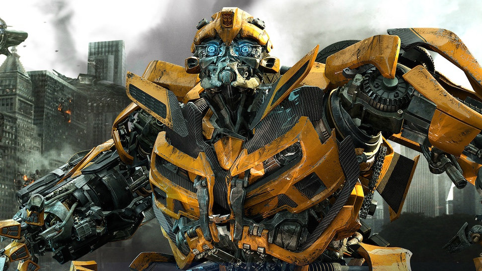
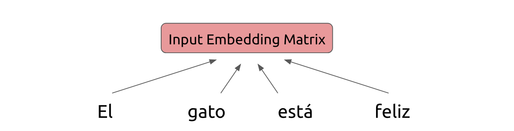
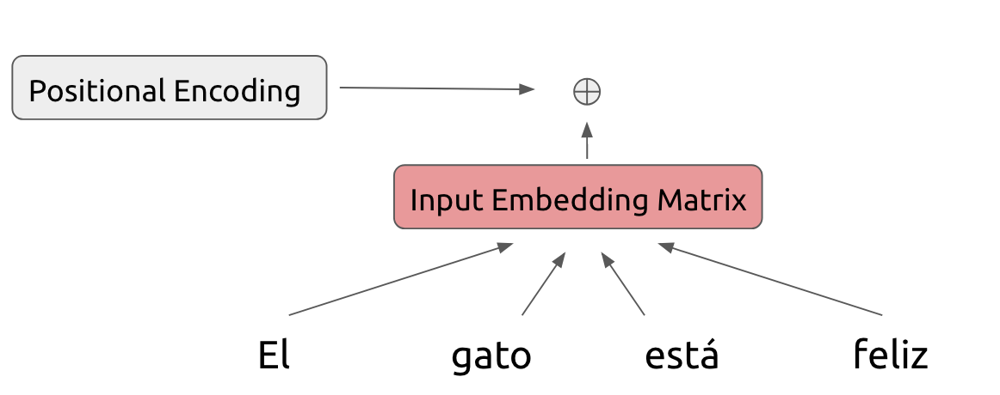
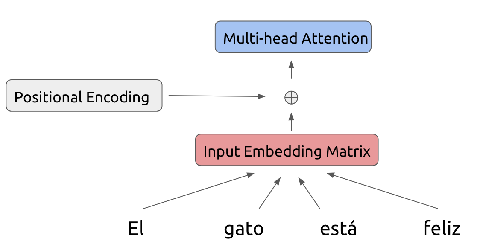
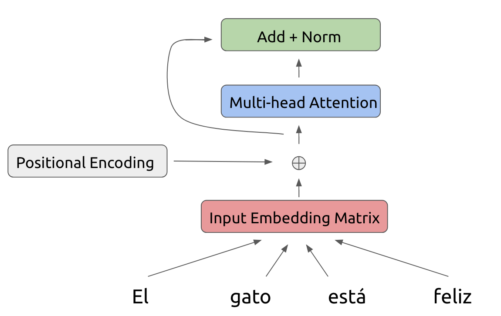
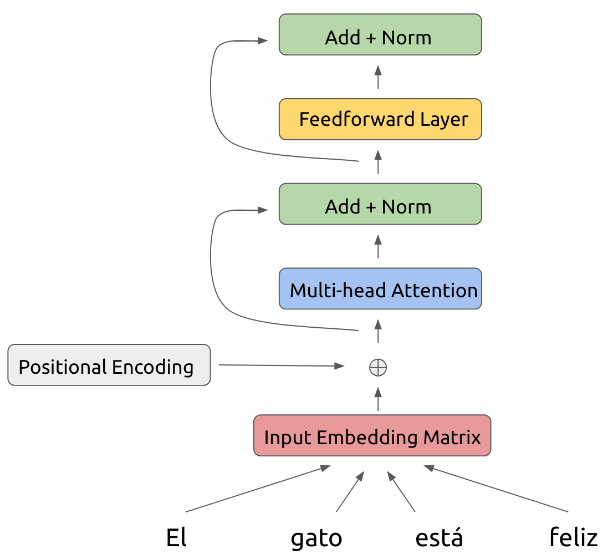
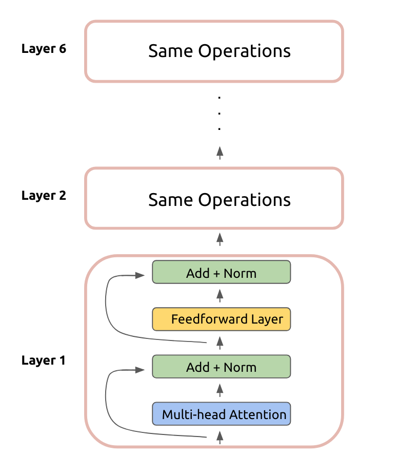
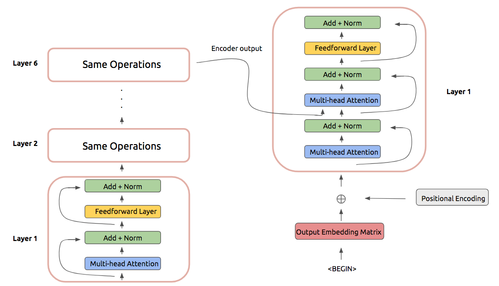
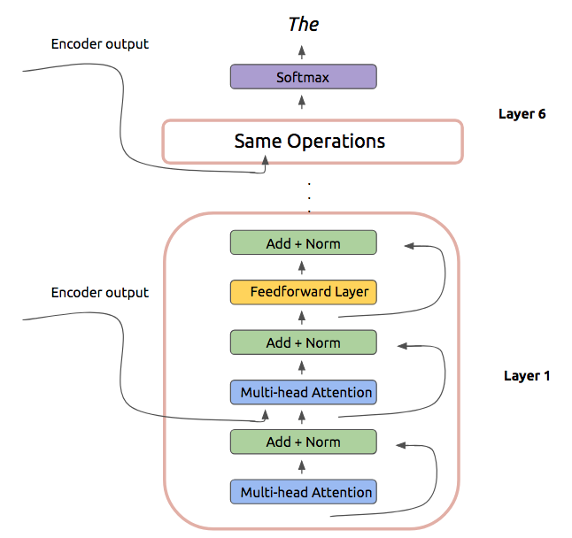
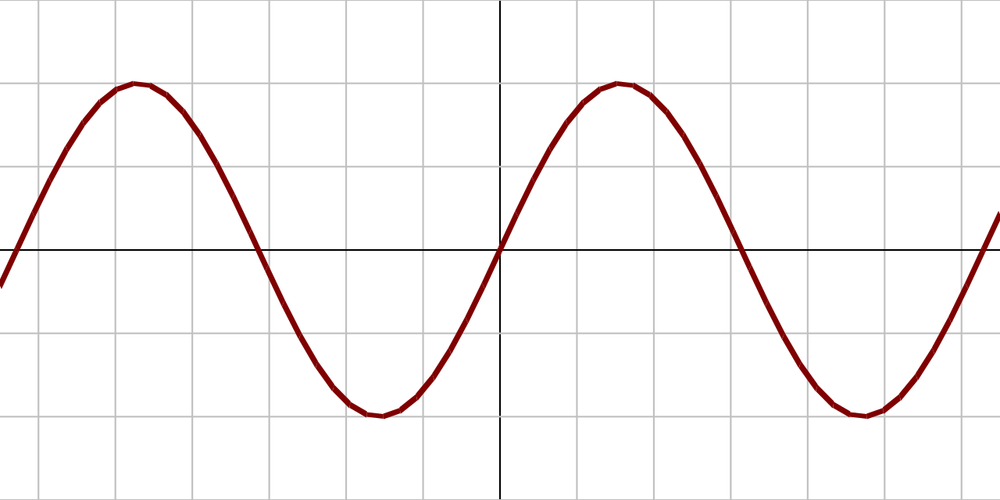

In this post, we will be describing a class of sequence processing models known as Transformers (...*robots in disguise*). 
Jokes aside, Transformers came out on the scene not too long ago and have rocked the natural language processing community because of
their pitch: state-of-the-art and efficient sequence processing **without recurrent units or convolution**. 

*"No recurrent units or convolution?! What are these models even made of?!"*, you may be exclaiming to unsuspecting strangers on the streets. 

Not much it turns out, other than a bunch of attention and feedforward operations. 

While the individual components that make up the Transformer model are not particularly novel, this is still a pretty dense paper with a lot
of moving parts. So our aim in this post will be to distill the model to its key contributions, without getting too stuck
in the details.

But first, the TLDR for the paper:
1) **Transformers demonstrate that recurrence and convolution are not essential for building high-performance natural language models**
2) **They achieve state-of-the-art machine translation results using a self-attention operation**
3) **Self-attention is a highly-efficient operation due to its parallelizability and runtime characteristics**

If that sounds exciting, read onward!

## How Transformers Work

While the Transformer does not use traditional recurrent units or convolutions, it still takes inspiration from 
sequence-to-sequence architectures where we encode some input and iteratively decode a desired output. 

How does this play out in practice? Let's focus on the encoder first. There are quite a few details to the process,
so don't get too lost in the details. All we are doing is encoding some inputs. (include smiley)

Assume we start with a certain phrase that we would like to translate from Spanish to English. The Transformer
begins by embedding the tokens of the Spanish phrase into a conventional embedding matrix:

Because the model makes no use of recurrence, we need some way to represent position-based information
in the model. Hence we add a positional encoding to this embedding matrix, whose exact form we will describe
in the next section:

Our modified input is fed into the first layer of the Transformer encoder. Within each encoder layer,
we perform a series of operations on the inputs. First off, we feed the input through a multi-head attention operation:

To this attention output, we also add a residual connection as well as perform a layer normalization step:

Now, we feed this result into a feedforward layer also using a residual connection and layer normalization:

This is the result of our first layer encoder operation! This is fed as the input to another
identical layer. In total, the Transformer encoder uses six stacked layers:

Now we can move on to the Transformer decoder. In practice, the decoder also uses six stacked layers
that perform a set of operations. These operations are largely identical to the encoder layer, except
for a few small differences:

- The first multi-head attention is a masked attention operation, where positions *after* the one being
considered are not included in the attention computation
- Another multi-headed attention operation is included that has the decoder inputs attend over the output 
of the encoder stack. This operation takes inspiration from traditional recurrent sequence-to-sequence models.

In practice this look as follows:

After performing these operations, we can predict the next token of our translated phrase:

And that's the Transformer!

## How Transformers Are Built

While the Transformer architecture may seem conceptually simple, the devil is of course in the details. To that end, there are 
quite a few aspects that warrant some further description.  

### Positional Encoding

The positional encoding added to the encoder and decoder inputs is the first question mark in the model. What's up with that?

Recall that the positional encoding is designed to help the model learn some notion of sequences and relative
positioning of tokens. This is important of course for language-based tasks and is necessary because we are not making use of any
traditional recurrent units.

In the Transformer architecture, the positional encoding is a vector described by the following equations:
$$
PE_{(pos,2i)} = \sin(\frac{pos}{10000^{2i/d_{model}}})
$$

$$ 
PE_{(pos,2i+1)} = \cos(\frac{pos}{10000^{2i/d_{model}}})
$$

Here the $i$ denotes the vector index we are looking at, $pos$ denotes the token, and $d_{model}$ denotes a fixed
constant representing the dimension of the input embeddings. Ok let's break it down further.

What this vector is basically saying is that for a given fixed vector index, as we vary the $pos$ (corresponding to 
tokens at different positions), we form a sinusoid:

This particular form for the positional encoding was chosen because the value for the encoding at a given position 
$PE_{pos+k}$ can be represented as a linear function of values for the encoding at earlier positions $PE_{pos}$. This 
follows from trigonometric identities and is equivalent to saying that a given token can learn to attend to earlier tokens
in a sequence. This is a **crucial** property for the Transformer.

### Multi-head Attention

The multi-head attention operation is one of the main contributions of this model. So let's dive into how it works.

At a high-level, an attention operation is designed to help a certain token in a natural language architecture focus on certain aspects of another part of the model,
usually another collection of tokens. Keep in mind that attention operations can be used in other problem domains like computer vision.

More formally, an attention takes a *query*, computes some weights with respect to a set of *keys*, and uses those weights
to form a weighted combination of a collection of *values*. In mathematical terms, the Transformer attention can be
described as:
$$
    \textrm{Attention}(Q, K, V) = \textrm{softmax}(\frac{QK^T}{\sqrt{d_k}})V
$$
where $Q$, $K$, and $V$ are the query, key, and value matrices respectively and $d_k$ is a fixed scaling constant. 

In the case of the encoder self-attention, the keys, values, and queries are all the same value, namely the output from
the previous layer of encoding.

In the case of the masked decoder self-attention, the same is true except that a mask is applied so that a position of decoding
can only attend to previous positions. 

In the case of the encoder-decoder self-attention, the keys and values are the output of the encoder layer stack and the
queries are the output of the previous decoder layer. 

The multi-head attention operation basically means that instead of applying an attention operation once, we will do it several
times (8 in the case of the Transformer model). Mathematically, this looks like:
$$
\textrm{MultiHead}(Q, K, V) = \textrm{Concatenate}(\textrm{head}_1, ..., \textrm{head}_h)W^O 
$$
$$
\textrm{head}_i = \textrm{Attention}(QW_i^Q, KW_i^K, VW_i^V)
$$
where $W_{*}^{*}$ are appropriately-dimensioned weight matrices. The beauty of the multi-head attention is that
the operation is easily parallelizable, which leads to reduced runtime. 

## Experiments

In spite of circumventing the traditional recurrent architectures, the Transformer is amazing because it is still able to 
outperform its recurrent counterparts. On the English-to-German and English-to-French WMT translation tasks, the Transformer achieves
state-of-the-art BLEU scores (41.8 on EN-FR and 28.4 on EN-DE). 

Not only that, but because of its highly parallelizable nature, the Transformer is able to do this at a significantly-reduced
numbers of FLOPs for training! So the Transformer is *better* and *faster*!

## Analysis 

This whole notion of self-attention is an essential one in the Transformer architecture. It 
Why is self-attention a desirable thing to use as the backbone of a model? 

One of the big advantages of self-attention is how efficient of an operation it is. A complexity comparison of 
self-attention to other conventional network operations illustrates this:

|     Layer Type    |   Layer Complexity | Sequential Operations| 
| ------------- |:-------------:| -----:| 
| Self-Attention | $O(n^2\cdot d)$ | $O(1)$ | 
| Recurrent      | $O(n\cdot d^2)$ |  $O(n)$ | 
| Convolutional | $O(k\cdot n \cdot d^2)$|  $O(1)$ | 

Above, layer complexity denotes the number of computations performed per layer. In this case, self-attention is more 
efficient than recurrence as long as the sequence length $n$ is less than the input embedding dimension $d$, which is
typically true.

The self-attention operation also connects all positions through a constant time number of computations, compared
to recurrence which requires linear-time computations. 

## Final Thoughts

The Transformer is a real rebel on the natural language deep learning scene because of how it eschews conventional network constructs
while still outperforming existing systems. It has challenged a lot of folk wisdom about the necessity of recurrence
in natural language models. Since being released, the Transformer has been extended and used in new architectures, most recently [BERT](https://arxiv.org/abs/1810.04805).
