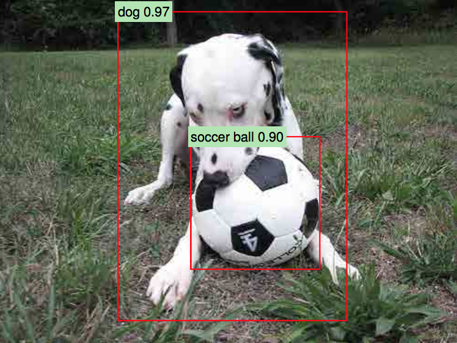
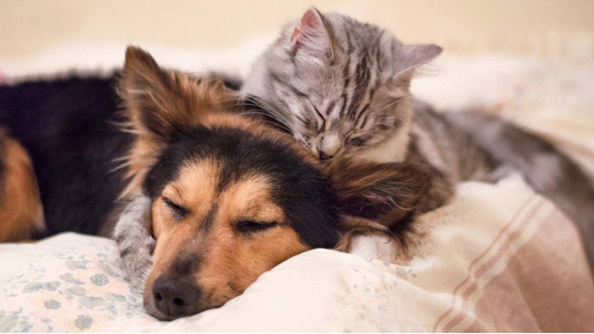
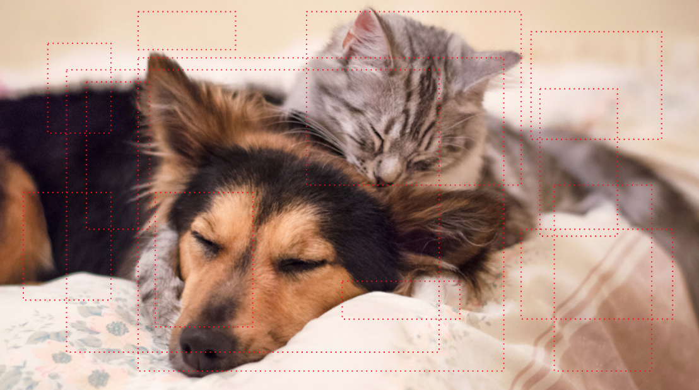
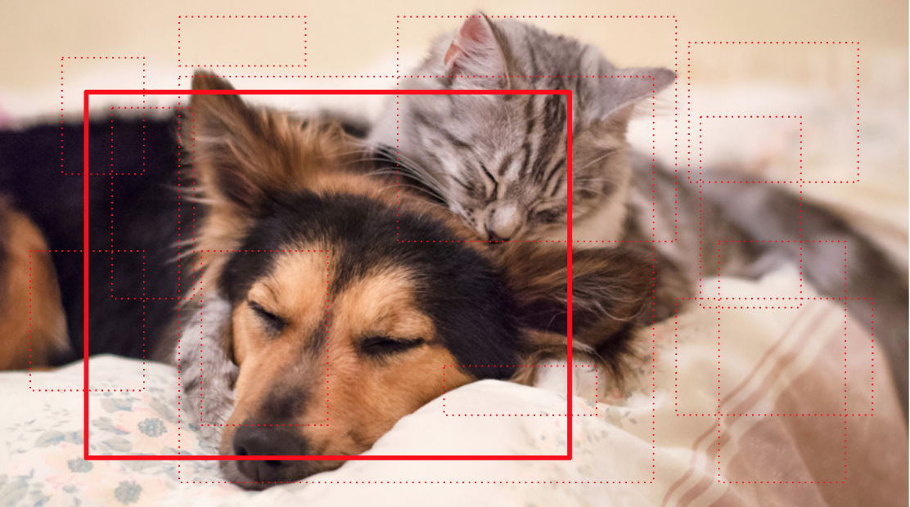
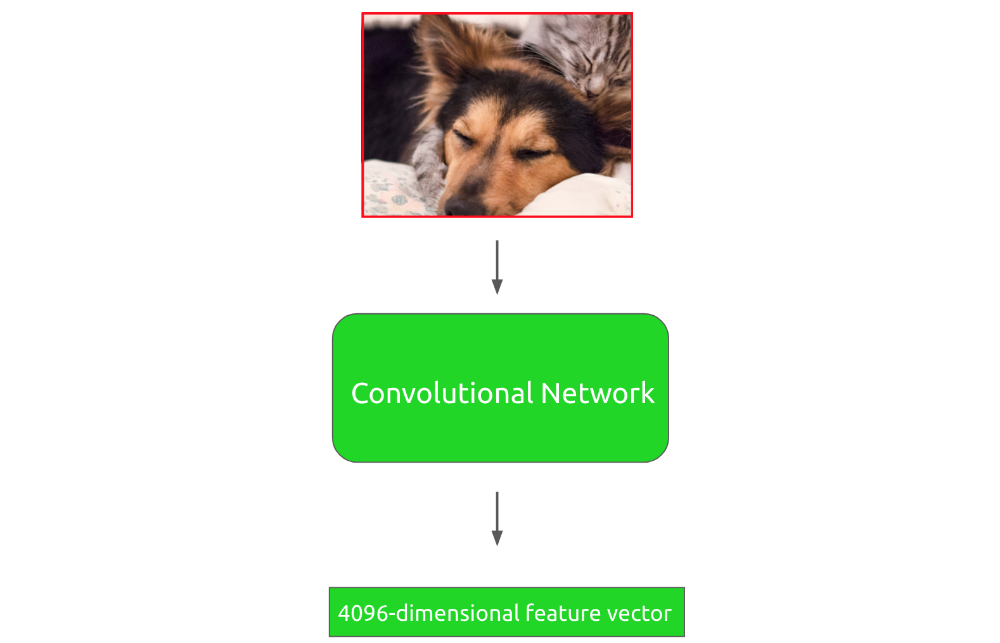
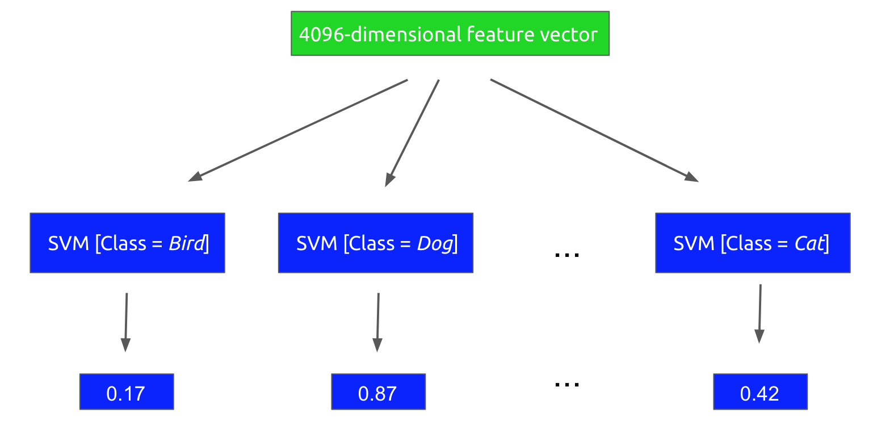
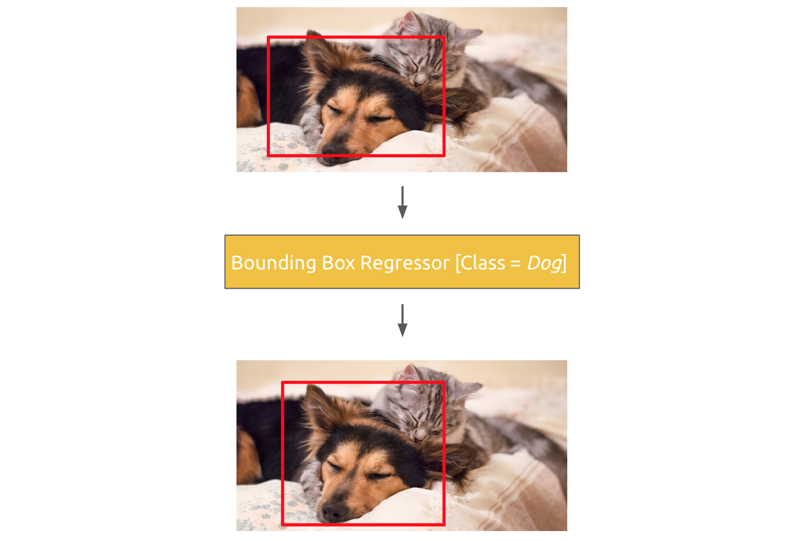
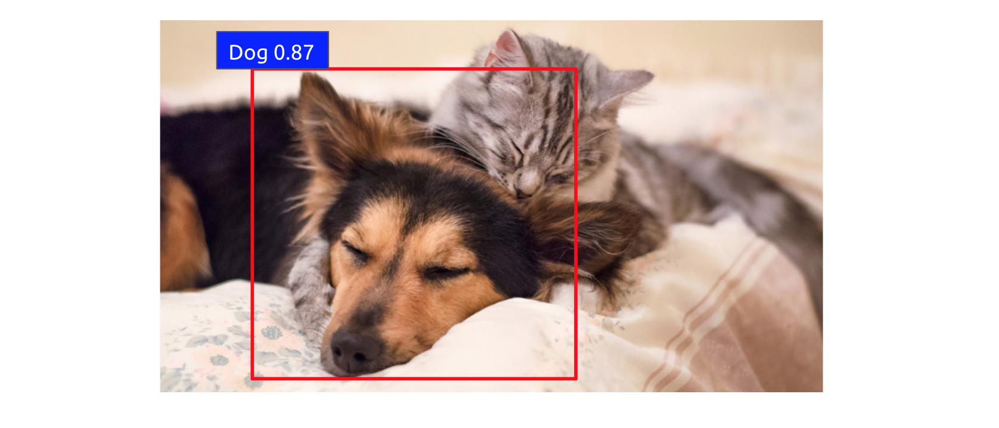
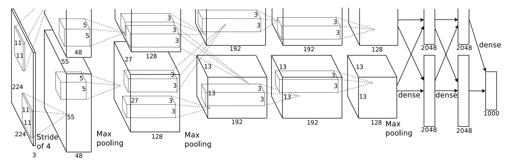

In this post, I want to discuss one of the seminal object detection architectures of the last decade: **region proposals with convolutional neural networks** 
(or R-CNN for short). R-CNN is one of the earliest models that piggybacked
off the computer vision deep learning revolution begun with the advent of [AlexNet](https://en.wikipedia.org/wiki/AlexNet).

When it was released, R-CNN completely trounced the existing state-of-the-art in object detection. Though it has since been
replaced by more powerful algorithms, the R-CNN paper still fundamentally changed the way in which people think about object
detection and its symbiotic relationship with deep learning. 

There is a lot to unpack in the [R-CNN paper](https://arxiv.org/abs/1311.2524), as the authors did a fantastic job of meticulously evaluating their model, running
ablation studies, making appropriate visualizations, etc. I am going to distill the paper's contents to what I believe are the most
salient kernels of insight. But I recognize we are all busy people 😉, so for those that want a super abbreviated 
version, here's a TLDR of the paper:

1) **Supervised pretraining using external data followed by domain-specific fine-tuning makes a huge difference with model performance**  
2) **Using convolutional networks to extract powerful feature representations from images changes the game in object detection**

... And for those that want a longer version, read onward! 

## How R-CNN Works
R-CNN is a sophisticated system with a lot of moving parts, so let's start our analysis of it at the end. 
When all is said and done, what does the final system actually look like?

As a motivating example, let's say we wanted to run an R-CNN object detection on the following image: 

Adorable, I know. The first step of the process involves extracting *region proposals* from the image, which 
are essentially smaller subimages that could potentially contain an object. There are a number of algorithms that can
be used to generate region proposals, though the one that R-CNN uses is called [*selective search*](http://www.huppelen.nl/publications/selectiveSearchDraft.pdf). This algorithm
iteratively combines subimages in a bottom-up fashion, using various image similarity metrics such as color and texture. 

R-CNN extracts around 2000 region proposals per image, which would look as follows:

Now R-CNN runs each proposal through a high-capacity [convolutional neural network](https://en.wikipedia.org/wiki/Convolutional_neural_network) to extract a learned
feature representation, which ideally holds meaningful information about the objects in the image. 

For example, the algorithm would take a proposal such as the following:

This proposal would be forward-propagated through a convolutional neural network to generate a 4096-dimensional feature
vector:

Afterwards, this feature vector is run through a collection of linear support vector machines (SVM for short), where each SVM
is designed to classify for a single object class. In other words, there is an SVM trained to detect *boat*, another 
one for *parrot*, etc. 

Each SVM outputs a score for the given class, indicating the likelihood that the region proposal
contains that class. Note, that the exact classes that can be identified depend on the dataset used for training.

This step of the process looks as follows: 

R-CNN will then label the region proposal with the class corresponding to the highest-scoring SVM, in this case
*dog*. 

After R-CNN has scored each region proposal with a class-specific SVM, the bounding box for the proposal is refined
using a class-specific bounding-box regressor. This could adjust the region in the following way:

When the process is finished, the detected object for the region could look as follows:

Note, this running example was only for a single region proposal. Running the algorithm on the other
regions should detect that there is also a cat in the image. 

With all that, we have completed an execution of R-CNN!

## How R-CNN is Built 
The running example from the last section showed us what it looks like when we have a trained, fresh-out-of-the-oven
R-CNN to detect objects with. But how do we actually get to a fully-fledged system? 

We will first focus on details regarding the convolutional neural network step of the R-CNN pipeline. The CNN used 
for the model is [AlexNet](https://papers.nips.cc/paper/4824-imagenet-classification-with-deep-convolutional-neural-networks.pdf),
a standard deep CNN with five convolutional layers and two fully-connected layers.

<figure>
	
	<figcaption>AlexNet architecture diagram, taken from the original paper</figcaption>
</figure>

One of R-CNN's biggest contributions is the use of *supervised pre-training* for object detection. When building the CNN
component, we first train it on a large auxiliary dataset such as the [ILSVRC 2012 classification dataset](http://image-net.org/challenges/LSVRC/2012/). 

Note, that this
dataset only contains *image-level labels*. In other words, the CNN is trained as if it is being used as a pure object
classifier rather than an object detector. The CNN is trained to the point where it is within a few percentage points of
the top-scoring performance of AlexNet. 

After this is done, we fine-tune the CNN parameters, using a domain-specific dataset. For the purposes of R-CNN object
detection, either the [PASCAL VOC dataset](http://host.robots.ox.ac.uk/pascal/VOC/) or the [ILSVRC 2013 detection dataset](http://image-net.org/challenges/LSVRC/2013/) is used
to further tune the CNN parameters.

Practically speaking, the 1000-way classification
layer of a typical AlexNet (for the 1000 classes in the ILSVRC 2012 dataset) is replaced with an (*N*+1)-way classification,
where *N* is the number of object classes in the new dataset being used and an extra class is added for the *background* 
label. *N* is 20 in the case of VOC and 200 in the case of ILSVRC 2013.

The CNN is then trained further using these domain-specific datasets. Each region proposal is considered a positive for the
class with which it has an [intersection-over-union](https://www.pyimagesearch.com/2016/11/07/intersection-over-union-iou-for-object-detection/) (IoU) of at least 0.5 with a ground-truth bounding box from the dataset. 

Next, the training of the linear SVM classifiers also employs the domain-specific dataset. However, in this case the definition of 
a positive/negative example is slightly different from the definition for the CNN training. In particular, a positive example is simply one of the ground-truth
bounding boxes for a given class, whereas a negative example is a region proposal which has an IoU of 
less than 0.3. In the original paper, these IoU thresholds were determined empirically, and picking them carefully turned out to have quite a difference
on R-CNN's performance.  

Finally, the bounding box regressors were built using regularized least squares regressors and a dataset of (*P*, *G*) pairs, where
*P* is a region proposal and *G* is a ground-truth bounding box. 

An important detail in this stage of training is how we determine
which ground-truth box maps appropriately to a given proposal, as this drastically affects how feasible the learning problem is. 
This entails a meaningful definition of *nearness*. For the purposes of R-CNN, a proposal *P* is assigned to the *G* with 
which it has maximal IoU overlap, as long as that overlap exceeds some empirically-determined threshold (0.6 in the case of the original R-CNN). 

These are all the training phases of R-CNN. It is worth noting that training the entire system is actually quite complex. There are effectively three separate steps of the 
training process that require data:
- CNN fine-tuning
- SVM classifier training
- Bounding box regressor training

## Experiments

When R-CNN first was proposed, it was a state-of-the-art object detector on a number of standard datasets, so it is worth mentioning
some of the model's achievements. 

The R-CNN architecture achieved a [mean average precision](https://medium.com/@jonathan_hui/map-mean-average-precision-for-object-detection-45c121a31173) (mAP) score
of 53.3% on the VOC 2012 dataset, which was an increase of **more than 30% over the previous best**. That is absolutely crazy!

In addition, the architecture achieved a mAP of 31.4% on the ILSVRC 2013 competition, substantially ahead of the second-best score of 24.3%.

What's also worth noting is the difference doing supervised pretraining with domain-specific fine-tuning made in terms of performance. This
design decision was tested in the context of the VOC 2007 dataset, and it resulted in an increase of 8.0 mAP percentage points!

Finally, comparing R-CNN to pure feature-based models indicated that R-CNN achieves a mAP that is more than 20% higher on PASCAL VOC. 

## Final Thoughts

R-CNN fundamentally changed the landscape of object detection at the time of its conception, and it has radically influenced
the design of modern-day detection algorithms. 

In spite of that, one of the major shortcomings of R-CNN was the speed
with which it worked. For example, as the original paper noted, simply computing region proposals and features would take *13 seconds per image on a GPU.*
This is clearly too slow for a real-time object detection algorithm. 

Follow-up work sought to reduce the runtime of the model, especially time spent on computing region proposals. We will discuss
these improved algorithms including Fast R-CNN, Faster R-CNN, and YOLO in subsequent blog posts. 

In the meantime, if you are interested in further checking out some of R-CNN's implementation details, you can [see the original repo](https://github.com/rbgirshick/rcnn).
