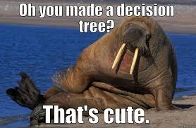
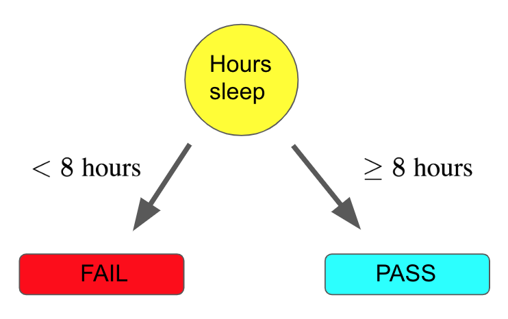
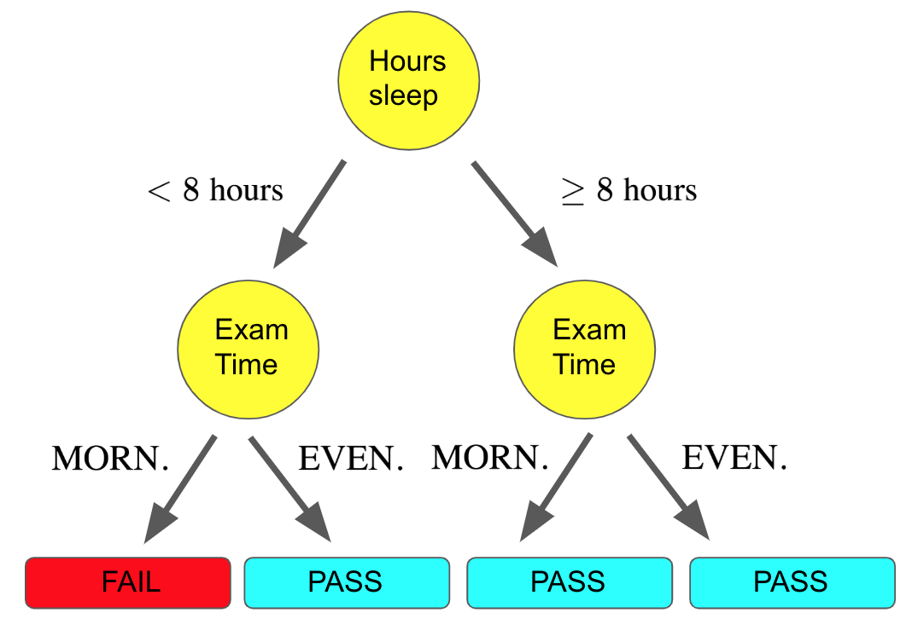
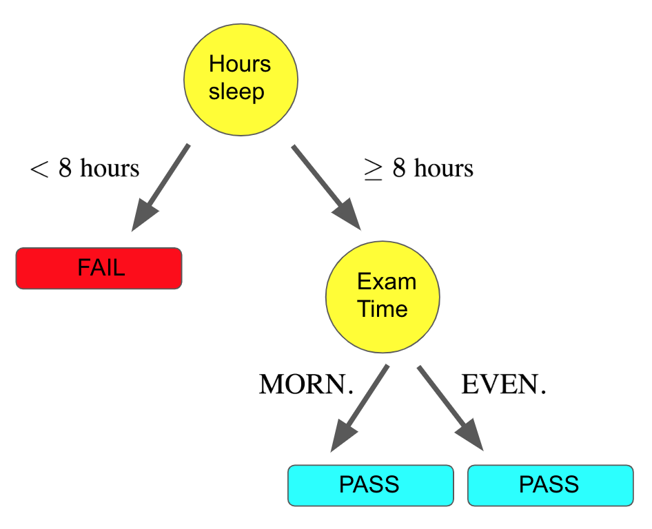

<figure>
    
</figure>

In this post we will discuss a wonderful model that is not only very powerful
but has very convenient interpretability. In fact, the underlying structure
of the model has very clear analogies to how humans actually make decisions.

The model we will be discussing
is called **decision trees**. Decision trees are so robust that some machine learning practitioners believe they offer the best out-of-the-box performance on new problem domains. Sound exciting? Let's dive in!

## Motivations

To motivate decision trees, let's start with a hypothetical problem: deciding whether or not we will pass our artificial intelligence exam this week. In other words we want to build a model that, given a dataset of past exam experiences, will output either a **YES** we will pass or **NO** we won't.
This will be done by extracting some features from the dataset. So what features seem relevant for this problem?

Well, for starters it may be important how much sleep we get the night before the exam. In particular,
if we get 8 or more hours of sleep, we have a much higher chance of doing well (no scientific evidence for this number but it sounds like it could be true). Now for an arbitrary exam that we want to classify, we could represent our logic as a flowchart:

Note, we could stop here if we wanted and let our entire model involve this single sleep question. But it seems like we could do better than this, since we are disregarding so many other possible indicators for success on our exam.
Let's continue to make our model more powerful!

Another possibly useful feature is whether the exam is in the morning
or evening. Perhaps we aren't really morning people and prefer to do things later in the day. We can continue to
build out our flowchart:

Notice how with this tree, there is a flow where we get less than 8 hours of sleep but the exam is in the evening and so we still pass! The behavior of our model for different features is all predicated on the dataset we are using to train the model.

In this case, we must have had a collection of past exam datapoints where we got less than 8 hours of sleep and took the exam in the evening, and hence we passed the exam.

Now, we could continue to build out our model in this fashion. We may utilize other attributes of our data such as the day of the week the exam is on.
It turns out this flow chart is our first **decision tree**!

Decision trees are defined by this hierarchical structure starting at some root. Note that here our tree is technically inverted, since it is growing downwards.

However, this is traditionally how decision trees are visualized.
At each level, we select a feature to use for a binary split of our data. At the leaves of the tree,
we predict one of the possible output labels of our problem.

Decision trees are a very nice model family because once we've built
the tree, it's relatively straightforward to understand how a model makes a prediction for a given input. It literally does so in the same way we would use a flowchart, starting at the top and traversing the branches according to the features of our input. Simple, right?

Well, yes, assuming we already have a tree built out. But how do we choose the features to split at each respective level of the tree? There are a lot of options, and they could drastically impact our model's predictions. We will explore how to build a decision tree next.

## Growing the Tree

It turns out that building an optimal tree is **NP-complete**, which is a fancy way of saying that given an arbitrary dataset, there is no *computationally efficient* way
to determine an optimal tree. Because of this, building a tree always involves
some sort of **greedy algorithm**.

What this means is that when we are building our tree, we will choose
features for splits with metrics based on *locally optimal* considerations rather than *globally optimal* ones. As a consequence, we may not get the absolute best-performing tree, but we get the benefit of an optimization procedure that can be completed in a reasonable amount of time.

There are many metrics for picking these features to split, but we will focus on one commonly used metric called **information gain**.

Information gain is very related to the concept of **entropy** in information theory. In general, decision tree algorithms using information gain seek to build a tree top-down by selecting at each level the feature that results in the **largest information gain**. First we define
the entropy of a tree $T$ as follows:

$$
\textrm{Entropy}(T) = -\displaystyle\sum_{i=1}^np_i\log p_i
$$

In our equation above, $p_i$ denotes the fraction of a given label in a set of datapoints in the tree. What does this mean?
To make this concrete, let's go back to our example of determining the outcome of our artificial intelligence exam.

Imagine that we had a training set of 20 examples (a lot of our friends have taken artificial intelligence courses). Recall that our example had two potential labels: **YES** we pass or **NO** we don't. Of those 20 samples, 12 friends passed, and 8 did not. Therefore, at the beginning of our tree building, before we have made any feature split, the entropy of our tree is:

$$
\textrm{Entropy}(T_{\textrm{original}}) = -\frac{12}{20}\log \frac{12}{20} - \frac{8}{20}\log\frac{8}{20}
$$
$$
\approx 0.2922
$$

How does this change when we choose a feature to split for our first level? Let's assume that when we split on whether or not we slept for 8 hours, we get two sets of datapoints.

For the set with less than 8 hours of sleep, we have 10 samples, of which 7 did not pass and 3 passed (this is why you need to get sleep before tests). For the set with 8 or more hours of sleep, we have 20 - 10 = 10 samples, of which 9 passed and 1 did not. Hence the entropy for the tree's children with this split is

$$
\textrm{Entropy}(\textrm{Split}_{<\textrm{8 hours}}) = -\frac{7}{10}\log \frac{7}{10} - \frac{3}{10}\log\frac{3}{10}
$$
$$
\hspace{0.16in}\approx 0.265
$$

for the set with less than 8 hours and

$$
\textrm{Entropy}(\textrm{Split}_{\geq\textrm{8 hours}}) = -\frac{9}{10}\log \frac{9}{10} - \frac{1}{10}\log\frac{1}{10}
$$
$$
\hspace{0.23in}\approx 0.1412
$$

for the set with 8 or more hours. Let $T$ be our original tree and $f$ be the feature
we are considering splitting on. The information gain is defined as follows:

$$
\textrm{Info Gain}(T, f) = \textrm{Entropy} - \textrm{Entropy}(T|f)
$$

In plain English, this is saying that the information gain is equal to the entropy of the tree before the feature split minus the weighted sum of the entropy of the tree's children made by the split. Ok, not quite plain English.

Let's make this concrete. For our example, the information gain would be:

$$
\textrm{Info Gain}(T, f) = 0.2922 - \frac{10}{20} \cdot 0.265 - \frac{10}{20}\cdot 0.1412
$$
$$
\hspace{-0.41in}\approx 0.0891
$$

Notice here that the $\frac{10}{20}$ fractions represent the weights on the entropies of the children, since there are 10 of the 20 possible datapoints in each child subtree.

Now when we are choosing a feature to split on, we compute the information gain for every single feature in a similar fashion and select the feature that produces the **largest information gain**.

We repeat this procedure at every single level of our tree, until some stopping criterion is met, such as when the information gain becomes 0. And that's how we build our decision tree!

## Pruning the Tree

The extraordinary predictive power of decision trees comes with a cost. In practice, trees tend to have **high variance**. Don't worry too much about what that means exactly for now, as we will discuss it in greater detail when we talk about the bias-variance tradeoff.

For our purposes, this means that trees can learn a bit too much of our training
data's specificity, which makes them less robust to new datapoints. This especially becomes a problem as we continue to grow out the depth of our tree, resulting in fewer and fewer datapoints in the subtrees that are formed. To deal with this issue, we typically employ some sort of **tree pruning** procedure.

There are a number of different ways of pruning our tree, though we will focus on a relatively simple one just to get a taste for what these pruning procedures look like. The procedure we will discuss is called **reduced error pruning**.

Reduced error pruning essentially starts with our fully-built tree and iteratively replaces each node with its most popular label. If the replacement does not affect the prediction accuracy, the change is kept, else it is undone. For example, assume we started with this tree:

reduced error pruning after one iteration, could leave us with this:

This would happen if the number of FAIL labels on the two left branches exceeded the number of PASS labels.
This could happen if there were 9 FAIL and 1 PASS points in the leftmost node, but only 1 FAIL and 3 PASS in the node next to it.
Hence we would replace these two nodes with the majority label, which is FAIL.

Note, after we have done this pruning, we could certainly continue to prune other nodes in the tree. In fact, we *should* continue to prune as long as our resulting trees don't perform worse.

There are many more complex pruning techniques, but the important thing to remember is that all these techniques are a means of cutting down (pun intended) on the complexity of a given tree.

## Final Thoughts

Now that we are wrapping up our tour of decision trees, we will end with a few thoughts. One observation is that for each split of our trees, we always used a binary split. You might feel that it seems very restrictive to only have binary splits at each level of the tree, and could understandably believe that a split with more than two children could be beneficial.

While your heart is in the right place, practically-speaking non-binary splits don't always work very well, as they fragment the data too quickly leaving insufficient
data for subsequent feature splits. Moreover, we can always also achieve a non-binary split with a series of consecutive binary splits, so it's not like non-binary splits give us any more expressive power.

Finally, while we only discussed a classification example, decision trees can also be applied to regression. This is yet another reason why they are so versatile!

*Shameless Pitch Alert: If you're interested in practicing MLOps, data science, and data engineering concepts, check out [Confetti AI](https://www.confetti.ai/?utm_source=personal-blog&utm_medium=web&utm_campaign=decision-trees) the premier educational machine learning platform used by students at Harvard, Stanford, Berkeley, and more!*
