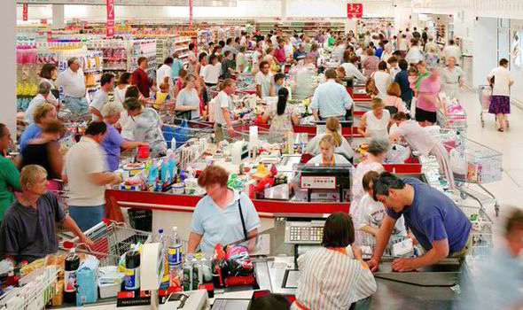

<figure>
    
</figure>

In this post, we will be exploring another example of an unsupervised learning algorithm: **market basket analysis**. Market basket analysis deals with the problem of analyzing the relationship between sets of items and how often they appear in certain baskets.

To make this description more concrete, one common use case for market basket analysis is
literally storing items in shopping baskets! Here we are concerned with studying customer's purchasing patterns.

We are particularly interested in rules for associating the presence of certain items
in a basket with the appearance of another item. For example, it might be useful for store managers to know that when customers buy chips and salsa, they also tend to buy guacamole. This could inform how items are laid out in a store or allow for more targeted item recommendations.

## A Flurry of Terminology

Now, how do we properly formalize these intuitions? Our study of market basket analysis will require introducing quite a bit of new terminology. The ideas themselves aren't super complicated, but it might be a bit tricky to keep all the new terms straight. Don't worry!
Just refer back to the definitions as necessary.

To make our analysis concrete, let's assume we are analyzing an admittedly small sample of data from a grocery store, where we have 4 customers' baskets, containing the following items: 

1) (cheese, pasta, carrots, potatoes, broccoli, chicken)
2) (chicken, pasta, tomatoes, carrots)
3) (chicken, broccoli, pasta, cheese)
4) (chocolate, water, carrots, sugar)

We define the **support** of an item (or a collection of items) to be the number of baskets in which it appears. For example, the support of $(chicken)$ is 3, since it appears in 3 baskets. Similarly, the support of $(chicken, pasta)$ is 3. A high support means an item or set of items
appear in a large number of baskets.

We can specify a numerical **support threshold**, and define a **frequent** itemset to be one whose support is equal to or greater than our support threshold.

This is important because we will want to do an analysis on itemsets that actually
appear in a reasonably large number of baskets, so that we can extract meaningful insights. What good is an analysis around something like *beets*, which probably only one customer bought all year? (Fine, I'm sure *at least* two people bought beets).

Our goal will then be to extract those frequent itemsets in our baskets. To do that, we define an **association rule** which is written as $M \rightarrow n$. Here $M$ is a certain itemset, and $n$ is a single item.

Therefore, an example of an association rule would be $(chicken, pasta) \rightarrow (cheese)$.
These rules allow us to compute some likelihood that the item $n$ is found in conjunction with those items in $M$.

To help quantify this notion, we also define the **confidence** of a rule as the ratio of the support of $(M, n)$ to the support of $M$.

So for our running example, the confidence of $(chicken, pasta) \rightarrow (cheese)$ is $\frac{2}{3}$, since $(chicken, pasta, cheese)$ appear in 2 baskets whereas $(chicken, pasta)$ appear in 3.

For some qualitative analysis of this metric, note that a particularly small confidence (something close to 0) implies a very unlikely association rule. An example of that would be $(broccoli) \rightarrow (chocolate)$. The highest confidence we could have is 1, which would happen if item $n$ appeared in every basket where $M$ appeared.

We can make the relationship between $M$ and $n$ even more powerful from a causal standpoint by introducing the concept of **interest**.

Interest is defined as the confidence of the association rule minus the fraction of baskets in which $n$ appears. In our running example, the interest of $(chicken, pasta) \rightarrow (cheese)$ would be $\frac{2}{3} - \frac{1}{2} = \frac{1}{6}$.

Notice that we want our interest to be as high as possible because that would suggest that having $(chicken, pasta)$ in your basket more directly implies you will have $(cheese)$ as well.

An interest of 0 would more closely suggest that every basket that has $(cheese)$ also happens to have $(chicken, pasta)$, which is not as meaningful from a causal standpoint.

Another *interesting* 🙂 case is where we have a negative interest. A negative interest implies
that the presence of $(chicken, pasta)$ discourages the presence of $(cheese)$.

## Putting It All Together

With all this terminology in place, we can now state that the core of useful market basket analysis boils down to finding association rules that hold with high confidence on itemsets with high support. Wow that's a mouthful!

This leads us to the most sophisticated algorithm we will see in our studies:
counting! Jokes aside, it turns out that finding association rules that have our desired properties effectively requires doing methodical counting of all possible combinations of itemsets over the set of all baskets.

The devil is in the details, however. Often the complexity in market basket analysis is not so much about any sophisticated math, as much as it is about dealing with analysis at scale.

Think about how many customer baskets there are in an average grocery store. It could be
hundreds of thousands in a month, and a basket could contain anywhere from a few to upwards of 50 items.

That means we have **A LOT** of data to process and store. Much of the algorithmic complexity in market basket analysis comes in algorithms to do this processing efficiently. We will defer discussion of these clever algorithms to another time!

## Final Thoughts

Before we finish this lesson, we will end with a few high-level notes about market basket analysis. It turns out this analysis technique is extremely useful and can be applied to a number of different problems.

One example includes doing large-scale processing of word documents where we are trying to extract words that can be lumped into concepts. In this case, our items are the words and the baskets are the
documents. Think about what kinds of association rules could be useful there.

Market basket analysis can also be applied to fraud detection where we can analyze the spending patterns of users. Here users' credit card purchases over a given time period could be baskets, and the things they purchase could be items.

There are many other uses, and the most amazing thing is that we are deriving very meaningful analyses completely in an unsupervised setting. No ground truth but still a lot of useful deductions. Neat!