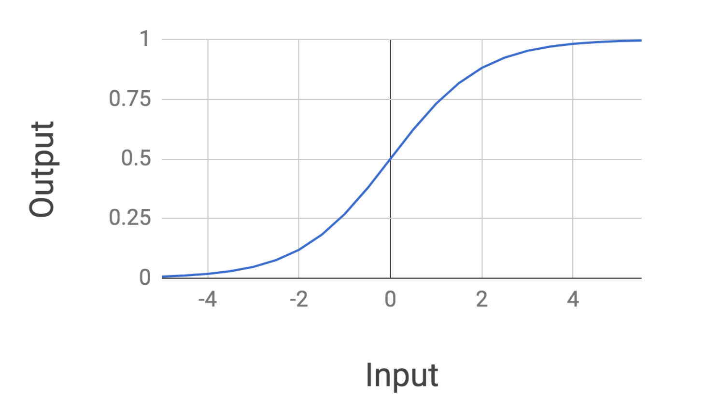
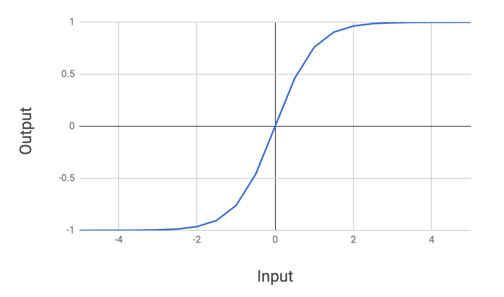
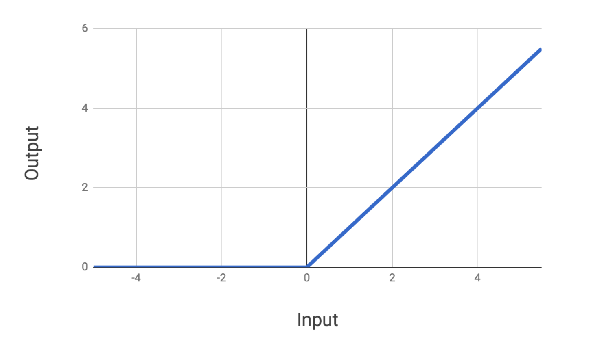
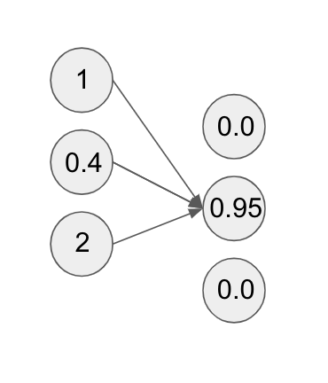

<figure>
    
</figure>

In a [previous post](/posts/deep-dive-into-neural-networks/), we went through a motivating example of a feedforward neural network from start to finish.
We introduced a lot of neural network concepts but also left out a lot of details related to activation functions, weight setting, and other aspects of neural network theory. In this post, we will make a
grab bag of all the points we missed. Let's get started!

## The Universal Approximator

Though we have introduced the neural network, we haven't really developed a sense for what makes these networks so
great.

For starters, neural networks are a ridiculously powerful model class that can represent a diverse collection
of functions. It has been mathematically shown that neural networks that have at least one layer are **universal approximators**.

What this means is that a neural network with at least a single layer *and* some nonlinear activation function can approximate
any continuous function. That result is insane! You could literally draw any random function off the top of your head
and a single-layer neural network could learn a representation of that function.

There's a big caveat, however. This is a **theoretical** result
which means that while a 1-layer network **could** learn any function,
whether you are able to get it to do that **in practice** is a separate question. It turns out that
it's quite hard to get a neural network to learn **any** function.

Our ability to do that is predicated on a number
of other factors, including whether or not we can get our cost function to converge and all of the additional considerations that we will discuss below. But the fact that literally the simplest neural network can do so much is already an impressive property of this model class.

## Weight Initialization

In our [last post](/posts/deep-dive-into-neural-networks/), we mentioned that at the beginning of neural training we initialized the weights of our model randomly. The truth is that is *literally* how the weights of our model are initialized (with a few bells and whistles).

An important point to understand is that we absolutely need the weights to be different for separate compute units of a given layer. If they were not, we would have identical compute units for a given layer, which would be like having a redundant feature. Randomizing
the weights allows us to get the necessary variety in the weights we need.

Because neural networks are so powerful,
they are also very susceptible to overfitting, so we want to *jitter* them a bit during learning. Random weight initialization
helps us achieve this. Therefore in practice we often initialize each parameter to a random value within some small range like $(-1, 1)$.

## Activation Functions

Recall that when we introduced our first neural network, an activation function was the function we applied to a value *after* computing
the linear sum of a set of a weights with a certain layer.

In particular, we used a sigmoid activation function to transform the linear sum
of each compute unit. We had previously encountered a sigmoid in our study of logistic regression. As a reminder,
let's recall the form of a sigmoid:

It turns out that we can use other functions for our neural network activation function, and some are actually preferred!
The only **really** important thing is that we use some function that performs a **nonlinear transform** on its input.

The way to see why this is important is imagine we had a 2-layer neural network that only applied a linear function between layers.
In that case, we could write the full network computation as $Linear_2(Linear_1(X)) = Linear(X)$. This means
applying a sequence of linear functions is equivalent to applying a single aggregated linear function. This would make it so that
our network could only learn linear functions!

In practice, sigmoids are not the go-to activation function to use because their outputs are not zero-centered and
their gradients quickly drop to 0 for very large and very small values. This makes them very finicky to use during network training.

Two other common activation functions used in neural networks are
the $\textrm{tanh}$ and the **rectified linear (ReLu)** unit. The $\textrm{tanh}$ function looks as follows:

Tanh looks very similar to the sigmoid except it is zero-centered. The ReLu activation looks as follows:

The ReLu is a nice well-behaved function that is easy to compute and allows for efficient training of networks.
In general, both the ReLu and tanh are used in place of the sigmoid because they result in superior training of networks.

## Regularization

Like any other supervised learning model, neural networks can be vulnerable to overfitting. In fact, because
they are so powerful, they can be even more vulnerable than other model families.

It turns out that we can use many of the same
regularization techniques we introduced previously to offset these effects. For example, we can modify the cost function we are optimizing during
training by adding an $L_1$ or $L_2$ regularization term.

However, there is one neural network-specific regularization technique
called **dropout**. The idea behind dropout is relatively straightforward, so much so, that it's astounding how well
it works in practice.

The basic idea behind dropout is that during the forward pass of our neural network, going from one layer to the next, we will
randomly inactivate some number of units in the next layer. To make this concrete, assume we had
the following neural network:

Applying dropout to the second layer of the neural network would look something like this:

While in the diagram, it looks like all we've removed is some arrows to the compute units, this has the effect of
actually *zeroing out* those compute units.

This is because we have essentially removed all the weights from the preceding input compute units to the output ones we are dropping.
When we apply dropout, we drop each compute unit with some probability we choose, typically somewhere between $0.1-0.5$. This probability is a hyperparameter we can tune during training. Furthermore, we can apply dropout to hidden layers of a network as well as input layers.

Dropout has the effect of breaking symmetry during the training process by preventing the neural network from
getting caught in local minima. It turns out this is an important effect because during training networks
can get stuck in local optima, missing out on superior solutions.

Dropout is a bit of a strange idea because we are effectively forcing the network to *forget a bit* of
what it knows during training. It's like saying "Hey neural network you're getting a little
too comfortable with this one feature. Forget about it for a bit." Note, here we are referring to compute units as features
because they effectively function as features.

When we are done training a network and ready to feed new inputs through our model, we will not drop any units from our network. Instead, we will scale output unit values by the dropout probability. This ensures that at test time, our units have the same expected value as they had during training.

Strange though it may be, in practice dropout is arguably the most effective regularization technique used for neural networks.

## The Power of Layers and Units

From the get-go, there are at least two degrees of freedom in determining the underlying architecture
of a feedforward network: the number of hidden layers and the number of units per layer.

As we increase the number of layers in a neural network, we increase its representational power. The same is true for the number of compute units per layer. It turns out we can make our networks arbitrarily powerful by just bumping up its number of layers and compute units
per layer.

However there is a downside to this that we must be aware of. The increase in power is offset by an increase in computational cost
(i.e. it is more expensive to train a model) as well as the fact that the models must be regularized more aggressively to
prevent overfitting.

## Loss Functions

In the past we have used the term cost function to refer to the mathematical function we are trying to optimize during training of a model.
Here we will use the term **loss function** as it is more common in neural network descriptions, though recognize that we are treating the two terms as equivalent.

When we introduced our feedforward model, we were quite ambiguous about the details of the loss function we were using
backpropagated during training. To make things concrete, we will discuss
one commonly used loss function for classification: **the cross-entropy loss**.

Assume that we are outputting one of three labels $[1, 2, 3]$ for a dataset $[(X_1, Y_1), ..., (X_n, Y_n)]$, then our loss function takes the following form:

$$
-\displaystyle\sum_{j=1}^n\displaystyle\sum_{c=1}^3 I_{j,c} \log(P_{j,c})
$$

Note that here $P_{j,c}$ refers to the probability of our model outputting label $c$ for the datapoint $j$. In addition, $I_{j,c}$ is an indicator variable which is equal to 1 if datapoint $j$ has a true label of $c$. For example,
this means that if $Y_3$ has a label of 2, then $I_{3,2}$ is 1 while $I_{3,1}$ and $I_{3,3}$ are 0.

Neural networks can also be used for regression, and in those cases we can use a least squares loss as we did for
linear regression.

## Other Training Tidbits

There are a few other tidbits of neural network training that are worth mentioning. First off, when we are training
a network with a given loss function it is crucial to ensure our gradient calculations are correct for backpropagation.

Because our gradients determine how much we should update certain weights so as to decrease our network's loss, if our
computed gradients are off, our network training could be either subpar or completely wrong! Our network loss function may
mistakenly never converge, so we really have to double check our math with these gradients.

In practice, today most libraries
used for building neural networks such as Tensorflow, PyTorch, etc. perform **automatic differentiation**. This
means that you don't actually have to mathematically derive gradients. Instead you just define your loss function and your model
architecture and the libraries perform all the gradient updates during backpropagation implicitly. Super neat!

On a related note, neural network convergence during training is tricky to get right sometimes. Even if we don't
make any errors in our gradients, networks have a tendency to get stuck in local optima during training. Because neural network
training is a nonconvex optimization problem, we are never sure that we have achieved the absolute global optimum for a problem.

It may also take really long for a network to converge to any sort of an optimum. Neural network training for certain types of
problems can take upwards of several weeks! Getting networks to train appropriately often requires us to tune various
hyperparameters such as dropout probabilities, the number of layers, the number of units per layer, and other related factors.

Finally, it is worth commenting about different gradient descent techniques. When training neural networks
and other machine learning models, two common gradient descent techniques we can use include **batch gradient descent** and **stochastic gradient descent**.

In batch descent, during an iteration of training we compute an aggregated gradient for a collection of datapoints that we use to update the weights. Batch descent generally leads to quite stable updates for each iteration of training, though each iteration takes a bit longer
since we have to compute gradients for a collection of points.

By contrast, with stochastic descent we only perform weight updates with the gradient computed for a **single datapoint at a time**. Stochastic descent leads to a much more jittery descent during training, though each update is very fast since it only involves one point.

## Final Thoughts

Phew! That was a lot of information spread across a wide variety of topics. At the end of the day, it is important to
recognize that neural networks require quite a bit of details to get right and use effectively on new problems.

Sometimes building neural network models is more an art than a science. That being said, there do exist some systematic ways
to build better models, many of which we have touched on in this post, so make sure to keep them in your machine learning toolkit!

*Shameless Pitch Alert: If you're interested in practicing MLOps, data science, and data engineering concepts, check out [Confetti AI](https://www.confetti.ai/?utm_source=personal-blog&utm_medium=web&utm_campaign=neural-network-grab-bag) the premier educational machine learning platform used by students at Harvard, Stanford, Berkeley, and more!*
