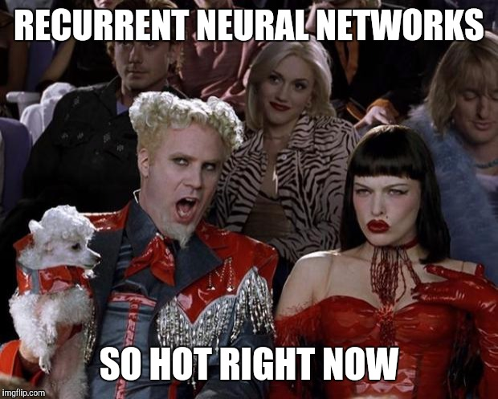
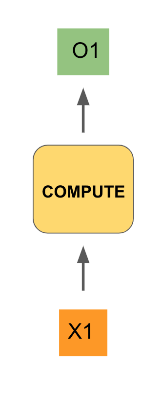
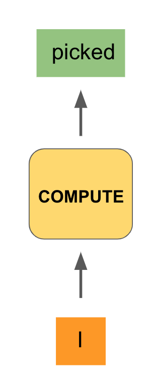
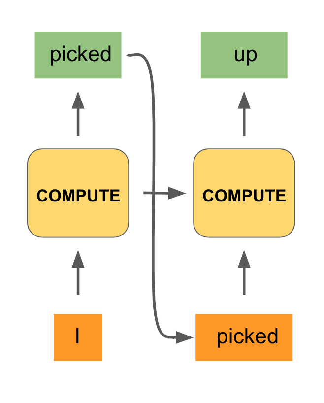
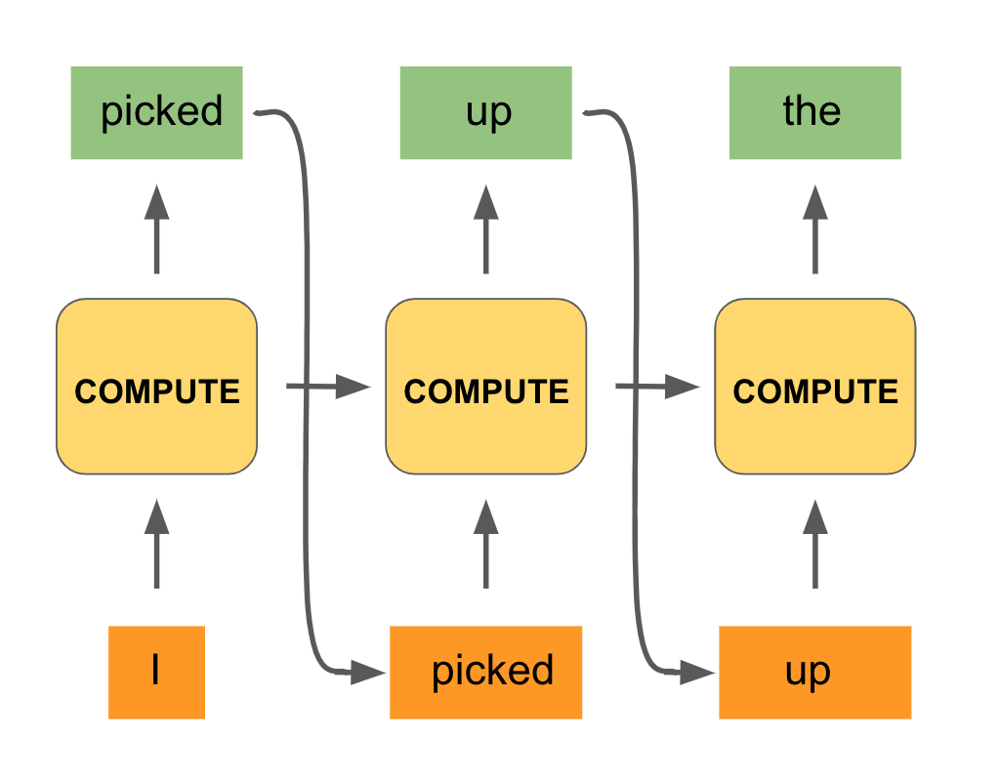
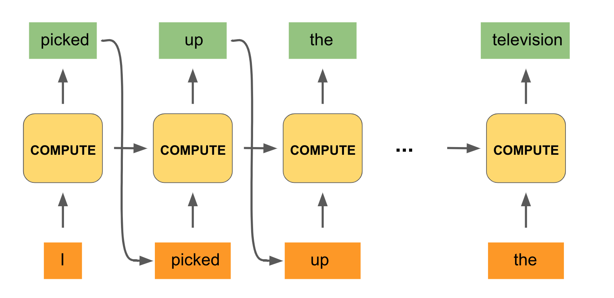
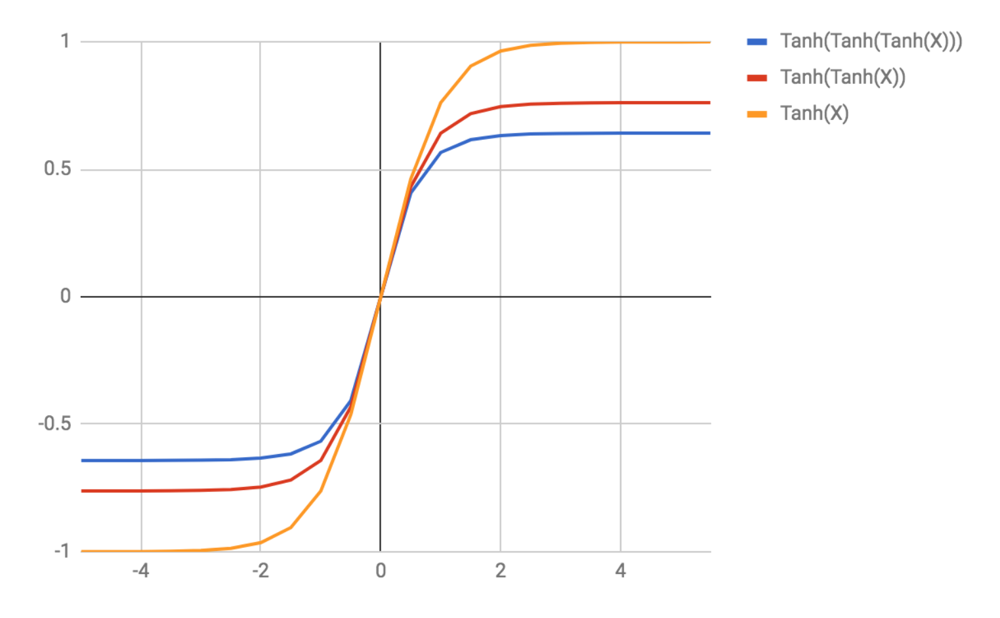

<figure>
    
    <figcaption>Source: Chelsea </figcaption>
</figure>

In this post, we continue our study of deep learning by introducing an exciting new family of neural networks called **recurrent networks**. Just
as convolutional networks are the de facto architecture for any vision-related
task, recurrent networks are *the* standard for language-related problems.

In fact, there has been a growing belief
among natural language researchers that recurrent networks can achieve state-of-the-art results
on just about *any* natural language problem. That is a tall order to fill for a single model class!

That being said, today on many
natural language tasks, recurrent networks do reign supreme. So what's the big deal behind these recurrent networks? Let's take a look.

## Motivations

Recurrent networks succeed in many natural language tasks because understanding natural language requires having some notion of memory, particularly
memory related to modelling sequences.

For example, if I gave you the sentence **"I picked up the remote controller on the couch and turned on the...,"** and
asked you to fill in the missing word, you would probably have no problem filling in a word like **"television."**

In order to do that, you had to process all the given words in sequence, associate the action of **"picking up"** to the **"controller"**, interpret
the situational context of a controller on a **"couch"**, and use that to inform what item could be **"turned on"** given this context. This level of processing is an absolutely amazing feat of the human mind!

Having a powerful sequential memory is essential here. Imagine if you were reading the sentence and by the time you got to the end, you had forgotten the beginning and all you remembered was **"turned on the"**.

It would be **MUCH** harder to fill in the right word with just that phrase. It seems like **"toaster"**, **"lawn mower"**, and **"drill"** could
all be valid responses given only the phrase **"turned on the."** The full context informs and narrows the space
of reasonable answers.

It turns out that neither feedforward neural networks nor convolutional networks are particularly good at representing sequential memory. Their architectures are not inherently designed to have sequential context intelligently inform their outputs. But let's say we wanted to build an architecture with that capability. What would such an architecture even look like?

## The Recurrent Unit

Let's try to design an appropriate architecture. Imagine that we are feeding an input, $X_1$, into some neural network unit, which we will leave as a black box for now.
That unit will do some type of computation (similar to our [feedforward](/posts/deep-dive-into-neural-networks/) or convolution layers from our previous posts) and produce an output value $O_1$. That could look as follows:

To make this even more concrete, our input could be the start of our phrase from above, namely the word **"I"**, and the output (we hope) would be **"picked"**:

Now that we have output **"picked"**, we would like to have that output inform the next step of computation of our network. This is analogous to when we are processing a sentence, our minds decide what word best follows from the previous words we've seen.

So we will feed in **"picked"** as the input of the next step. But that's not sufficient. When
we process the word **"picked"** and are deciding what comes next, we also use the fact that the previous two words were **"I picked."**

We are incorporating the full history of previous words. In an analogous fashion, we will use the computation generated by our black box in the first step to also inform the next step of computation.
This is done by integrating what is called a **hidden state** from the first compute unit into the second one (in addition to the token **"picked"**).

Here's what that would look like:

We can repeat this procedure for the third step of computation:

In fact, we can do the same process all the way to the end of the phrase, until our model outputs the desired word **"television."** Here is what the full computation would look like:

Notice that we are using the same black box unit for the computations of all the timesteps. And with that we have constructed the hallmark architecture of a recurrent network!

A recurrent network is said to **unroll** a computation for a certain number of timesteps, as we did for each word of the input phrase. The same compute unit is being used on all computations, and the most
important detail is that the computation at a particular timestep is informed not only by the input at the given timestep but by the context of the previous set of computations.

This context being fed in serves as an aggregated sequential memory that the recurrent network is building up. We haven't said much about what actually goes on within the compute unit.
There are a number of different computations that can be done within the compute unit of a recurrent network, but we can describe the vanilla case pretty succinctly.

Let $S$ denote
the sequential memory our network has built up, which is our **hidden state.** Our recurrent unit can then be described as follows:

$$
S_t = F(UX_t + WS_{t-1})
$$
$$
O_t = \textrm{Softmax}(V^TS_t)
$$

Here the function, $F$, would apply some sort of a nonlinearity such as $\textrm{tanh}$. $U$ and $W$ are often two-dimensional matrices that are multiplied
through the input and hidden state respectively. $V$ is also a two-dimensional matrix multiplied through the hidden state.

Notice also that the computation at a given timestep uses the hidden state
generated from the previous timestep. This is the recurrent unit making use of the past context, as we want it to.

Mathematically, the weight matrix $U$ has the effect of selecting how much of the current input we want to
incorporate, while the matrix $W$ selects how much of the former hidden state we want to use. The sum of their contributions
determines the current hidden state.

When we say we use the same recurrent unit per computation at
each timestep, this means that we use the exact same matrices $U$, $W$, and $V$ for our computations. These are the weights of our network.

As mentioned, the role of these weights is to modulate the importance of the input and the hidden state toward the output during the computations. These weights are updated during training via a loss function, as we did with the previous neural network families we studied.

And with that, we have endowed a neural network with sequential memory!

## Recurrent Unit 2.0

Well, almost. It turns out that in practice our vanilla recurrent networks suffer from a few pretty big problems. When we are training our recurrent network, we have to use some variant of a backpropagation algorithm as we did for our previous neural network architectures.

That involves calculating a loss function for our model outputs
and then computing a gradient of that loss function with respect to our weights. It turns out that when we compute our gradients through the timesteps, our network may suffer from this big problem called **vanishing gradients**.

As an intuition for this problem, imagine the following example of applying a $\textrm{tanh}$ nonlinearity
to an input several times:

Notice that the more times we apply the $\textrm{tanh}$ function, the more flat the gradient of the function gets for a given input. Applying a $\textrm{tanh}$ repeatedly is the analogue of performing a computation in our recurrent network for some number of timesteps.

As we continue to apply the $\textrm{tanh}$, our gradient is quickly going to 0. If our gradient is 0,
then our network weights won't be updated during backpropagation, and our learning process will be ineffective!

The way this manifests itself is that our network may not be able to have a memory of words it was inputted several steps back. This is clearly a problem.

To combat this issue, researchers have developed a number
of alternative compute units that perform more sophisticated operations at each timestep. We won't go into their mathematical details, but a few well-known and famous examples include the **long short-term memory (LSTM) unit** and the **gated recurrent unit (GRU)**. These units are specifically better at avoiding the vanishing gradient problem and therefore allowing for more efficient learning of longer term dependencies.

## Final Thoughts

To conclude our whirlwind tour of recurrent networks, let's leave with a few examples of problem spaces where they have been applied very successfully.

Recurrent networks have been applied to a variety of tasks including speech recognition (given an audio input, generate the associated text), generating image descriptions, and machine translation (developing algorithms for translating from one language to another). These are just a few examples, but in all cases, the recurrent network has enabled unprecedented performance on these problems.