<figure>
    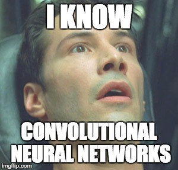
</figure>

About 9 years ago, the [ImageNet challenge](http://www.image-net.org/challenges/LSVRC/), an annual visual recognition competition was begun. In the challenge, teams 
were tasked with building the best object classifier on a collection of images from a set of 1000 possible object labels. 

In the year 2011, a team from the University of Toronto trounced the competition by introducing the world's first successful image recognition system built entirely
using neural networks.

This milestone helped to trigger the artificial intelligence wave that we are
currently experiencing. Today we are going to investigate the neural network architecture that was at the heart
of this revolutionary point in history. Excited? Let's get to it!

## Motivations

The neural network class that was at the heart of the deep learning revolution is called **convolutional neural networks**.
To motivate their design, we will start with the problem of image recognition. Consider the following image:

Our brains are amazing because we are able to just about instantaneously recognize that this image contains a cute puppy.
What allows us to recognize that this is a puppy?

Our brains are keen at picking up relevant features in an image,
scanning efficiently for the things that are necessary for us to differentiate the image. Consider a more complicated
example:

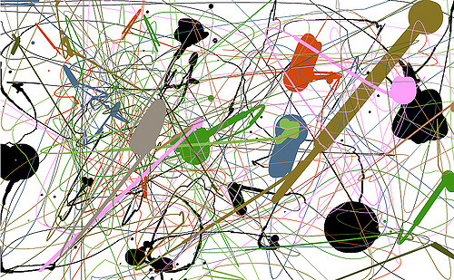

Here it's not immediately clear what this is a picture of, so we must analyze the picture more deliberately. We may
start at the upper left corner and scan horizontally, picking out details that seem relevant.

After we have scanned the entire image, our brain holistically tries to put together the pieces into some impression of the image subject.
This intuition for how our own vision system seems to work by scanning and picking out features will be a useful analogy
for convolutional networks.

## The Convolutional Layer

Let's revisit how we represent images mathematically. Recall that images can be represented as a 3-d tensor of (red, green, blue) color channels. Previously when we were studying [feedforward networks](/posts/deep-dive-into-neural-networks/) we collapsed this 3-d representation into a single dimensional vector. It turns out in practice this vector collapsing is not really done for images.

Instead imagine that we have some $4x4x3$ image and we keep it in its 3-dimensional format. We will aim to process our image by running it through a series of layerwise computations, similarly to how we did for feedforward networks. To do that we will take a $2x2x3$ tensor of weights, which we will call a **filter**, as follows:

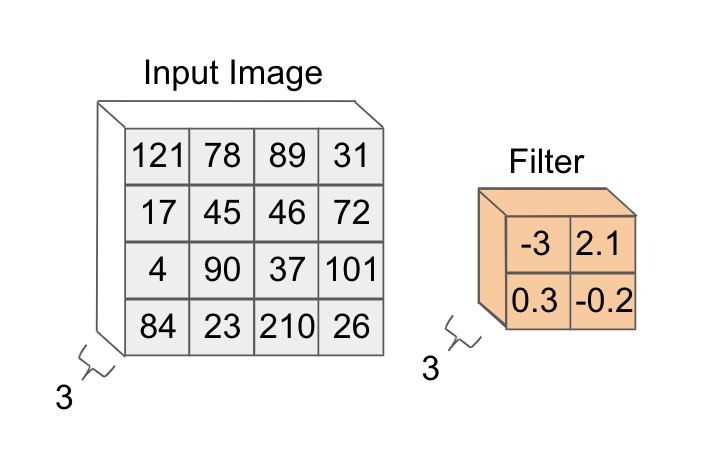

Let's begin by applying our filter to the upper left $2x2x3$ corner of the image. The way this is done is we chop up
our filter into 3 $2x2$ depth slices:

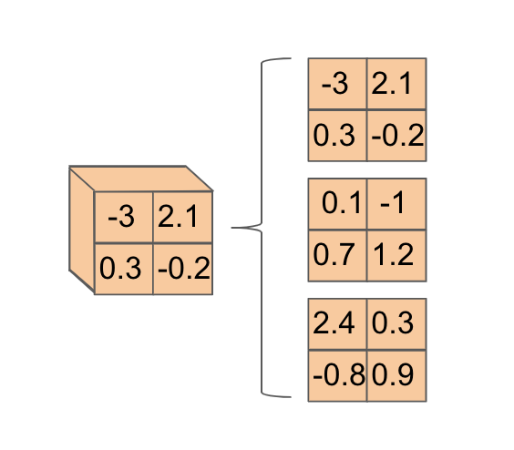

We do the same for the corner of the image we are interested in looking at:

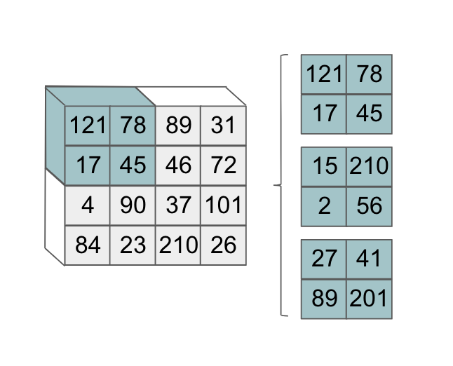

Then we take the pairs of (depth-wise) matching slices and perform an element-wise multiplication. At the end, we take the 3 values we get from these depth-wise operations and we sum them together. That looks as follows:

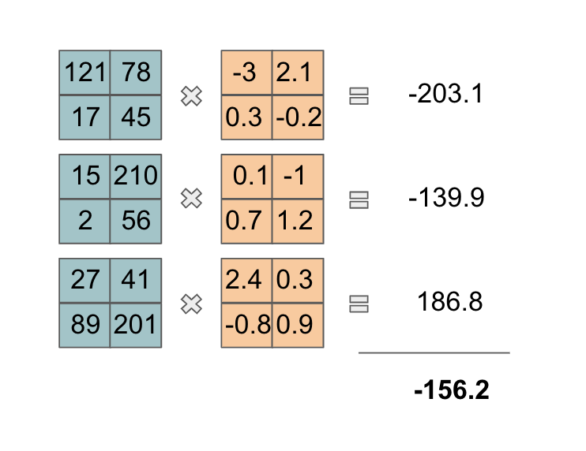

For those that are mathematically-inclined, we just took a 3-d dot product! This computed value will be the first element in the next layer
of our neural network. Now, we slide our filter to the right to the next $2x2x3$ volume of the image and perform the same operation:

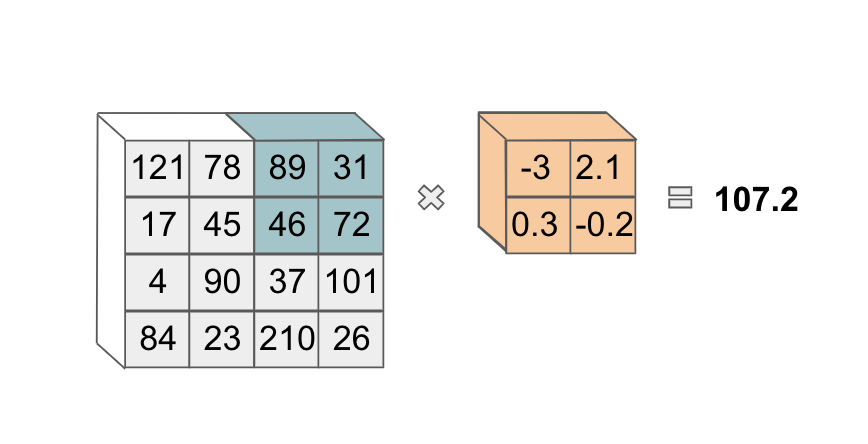

Note that we also could slide our filter over one pixel, rather than two as we have done. The exact number
of pixels that we slide over is a hyperparameter we can choose. After this, we move our filter to the lower-left corner of the image:

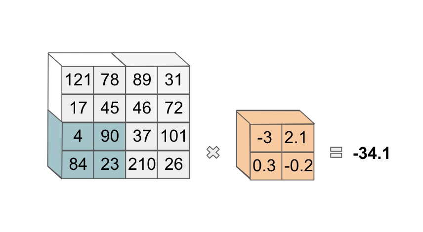

and compute the same operation. We then do the same operation again, after sliding our filter horizontally. At the end, we have
four values in this first slice of our next layer:

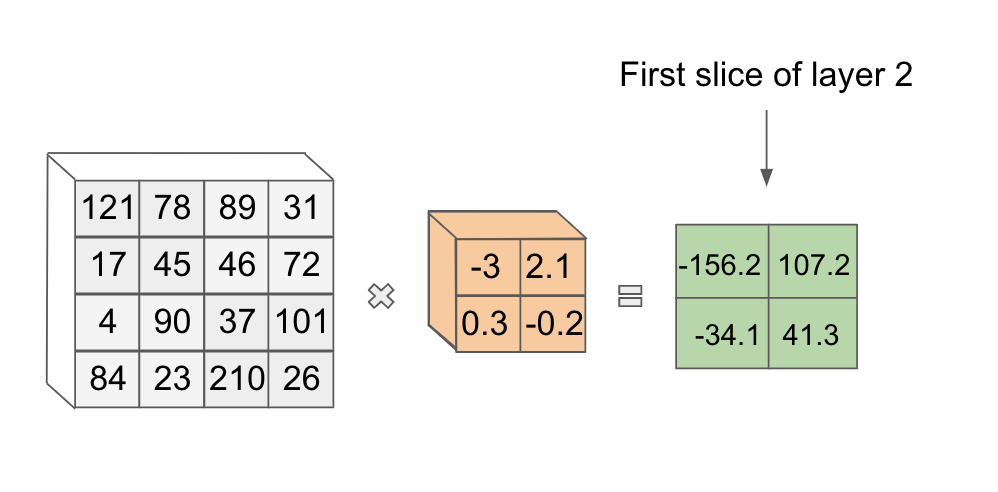

Exciting! This is our first example of a **convolution**! The results of applying this filter form one slice of this next layer in our network.

It turns out we can use another filter with new weights on this same image to get *another* slice in the next layer.

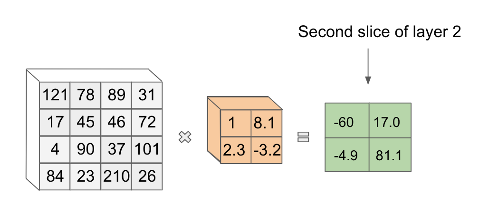

In theory we can use as many unique filters as we want in our convolution, though the number to use becomes a hyperparameter we can tune.

When we are done applying filters, the output of these filter operations are stacked together to get our complete next layer. If we had used 10 filters in the first layer of our running example, our second layer would be a $2x2x10$ tensor of values. This transformation from input to output using filter convolutions is appropriately called a **convolutional layer**.

Note that once we have our second layer, we can start from scratch and apply another convolutional layer if we so choose. Notice also that as we apply our convolutions, the length and width dimensions of our tensors tend to get smaller.

The depth of our output layer is equal to the number of filters we use for our transformation, so depending on
that number, we might also reduce the depth dimension. For this reason, convolutional layers can be viewed as a form of feature reduction.

One of the most elegant things about the convolution layer is that it has a very natural analogy to how humans compose their understanding of complex images.

When we see something like a puppy our visual understanding process may first pick out prominent points like eyes and the nose. It may then create a notion of edges that form the outline of the dog. We then may add textures to the outline and colors. This hierarchical process allows us to decompose images into smaller constituents that we use to build up our understanding.

In a similar fashion, convolutional networks can also learn hierarchical features as we go up the layers. Certain works have demonstrated
that when you actually visualize what is being learned at the layers of a convolutional network, we see visual entities of increasing complexity (points, lines, edges, etc.) as we go deeper into the network. This is really cool!

In addition to this nice intuitive design and interpretability, what else do we gain by using convolutions instead of our original feedforward fully connected layers? When we use convolutional layers, we also see a drastic reduction in the number of weights we need in a given layer.

Imagine if we collapsed a reasonably-sized image of dimensions $100x100x3$ into a 30,000-length vector. If we wanted to make a fully-connected layer, each compute unit in the first layer would be connected to every value in the input, creating 30,000 weights. If we had even a moderately-sized first layer of 100 units, we would have $30,000 \cdot 100 = 3,000,0000$ parameters just in the first layer! This clearly is not scalable.

On the other hand, if we didn't collapse the image and used a $5x5$ filter for a convolution, we would have $5 \cdot 5 \cdot 3 = 75$ weights per filter. Even if we used a relatively large number of filters like 200, we would have a total of $200 \cdot 75 = 15,000$ weights in the first layer which is a **huge** reduction! In this way, convolutional layers are more memory-efficient and compute-efficient when it comes to dealing with images.

## Convolutional Network Mechanics

There are a number of design decisions in the convolutional layer that we can play with that influence the network's learning
ability. For starters, we can certainly say a bit more about the dimensions of the filters applied.

In practice, we can see filter sizes anywhere from $1x1$ to upwards of $11x11$ in some research papers. Note also that when applying a $1x1$ filter, we wouldn't actually reduce the length and width dimensions of the layer we are convolving.

In addition, there's another design factor that we've used without formally defining. When we were sweeping our filter across the image in our motivating example, we were moving the filter over two pixels in a given dimension at a time as follows:

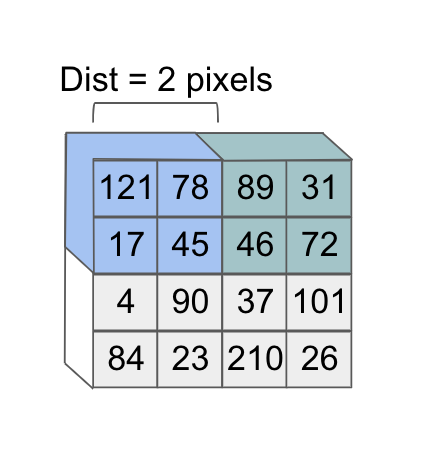

However, what if we had shifted over our filter by one pixel instead? Notice that this would determine a different subset of the image that the second feature would focus on:

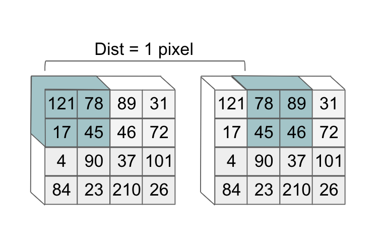

The value that determines how much we slide over our filter is called the **stride**. In practice, we often see that
using smaller stride values produce better performance on trained convolutional networks.

## Pooling Layers

In addition to convolutional layers, there is another commonly used layer in convolutional networks: the **pooling layer**.
The purpose of pooling layers is often to more aggressively reduce the size of a given input layer, by effectively cutting down on the number of features.

One of the most common types of pooling is called **max pooling**. As its names suggests, the max pooling layer takes the max value over an area of an input layer. This looks as follows:

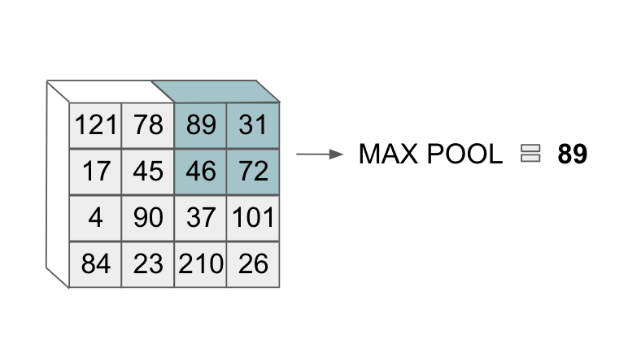

With pooling layers we also extend the operation depth-wise and apply it over a variably-sized area, as we did with convolutional filters.
For example, we could use max pooling over a $2x2$ area that determines the segment we are applying the operation to. The depth of the output volume does not change.

Zooming out, we must be careful when choosing the filter and stride size in our convolutional networks and operations such as max-pooling tend to throw away a lot of information in an input layer.

## The 2011 ImageNet Winner

With all that theory in place, we are now finally ready to revisit the 2011 ImageNet-winning entry. Historically, a lot of the architectures
that have won past ImageNet competitions have been given catchy names because gloating rights are a thing in machine learning 🙂!

The architecture that won ImageNet 2011 was called **AlexNet** after its principal creator Alex Krizhevsky. The architecture looked as follows:

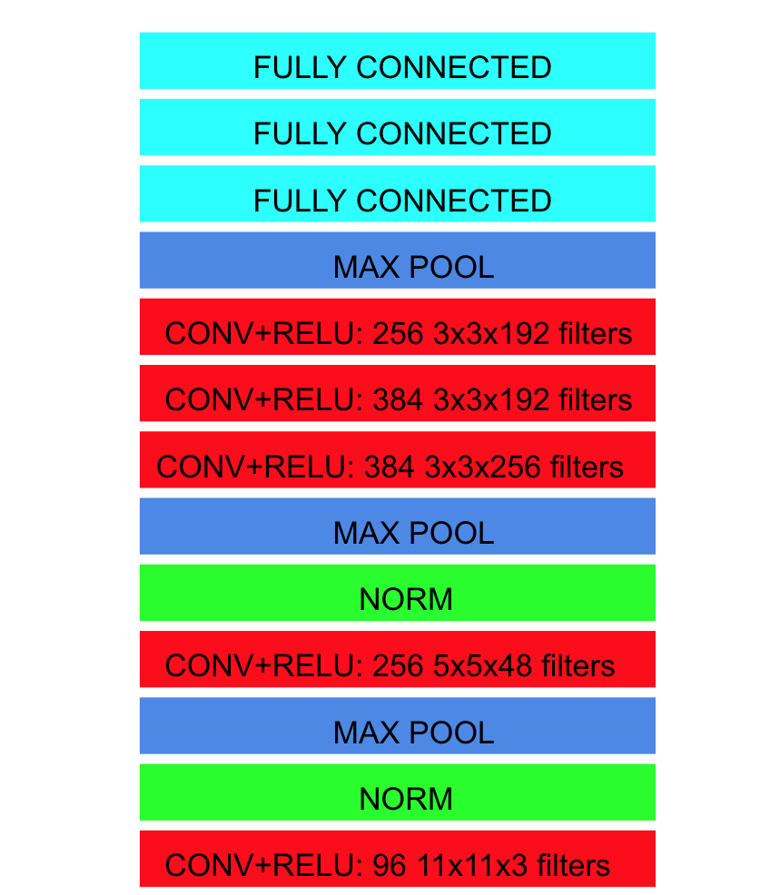

Here **norm** refers to a specific normalization operation that was introduced to help generalization. This particular operation
has fallen out of favor in convolutional network architectures since then.

In addition, **fully connected** refers to a feedforward layer we saw when we looked at feedforward neural networks. At the end of the last fully connected layer, the architecture outputted a probability distribution over 1000 labels, which is how many labels there were in the challenge.

An important thing to note is many of the ideas behind the architecture of AlexNet had been introduced previously. What AlexNet
added that was so revolutionary was increasing the depth of the neural network in terms of number of layers.

Typically as networks get more deep they get harder to train, but the University of Toronto team managed to effectively train a very deep network. Another novel contribution was the use of several stacked convolutional layers in a row, which had not been explored previously.

And with that, we've come full circle! From humble beginnings, we've successfully
discussed the model that triggered the modern-day resurgence of artificial intelligence. What a phenomenal milestone in our AI journey!

*Shameless Pitch Alert: If you're interested in practicing MLOps, data science, and data engineering concepts, check out [Confetti AI](https://www.confetti.ai/?utm_source=personal-blog&utm_medium=web&utm_campaign=convolutional-neural-networks) the premier educational machine learning platform used by students at Harvard, Stanford, Berkeley, and more!*
