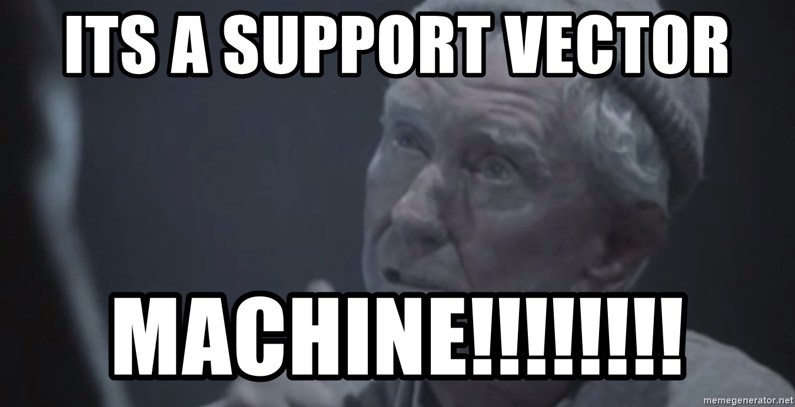
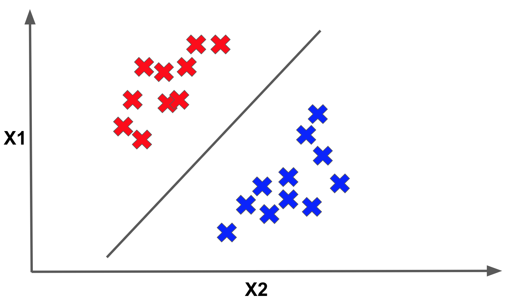
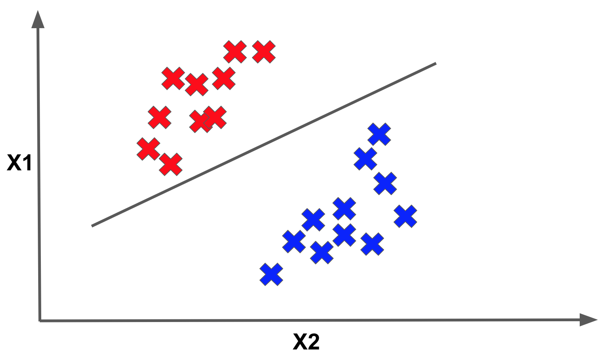
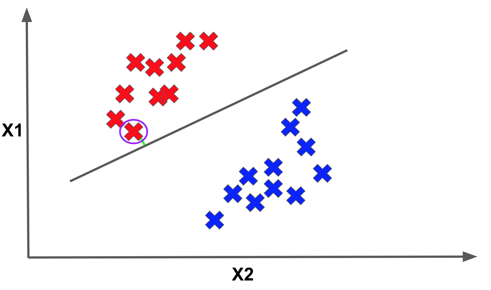
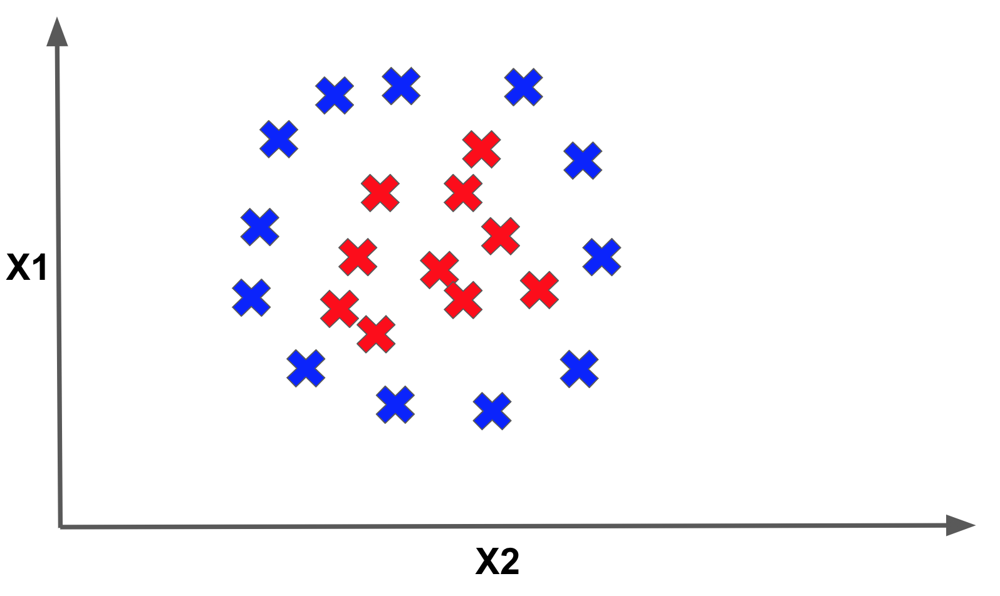
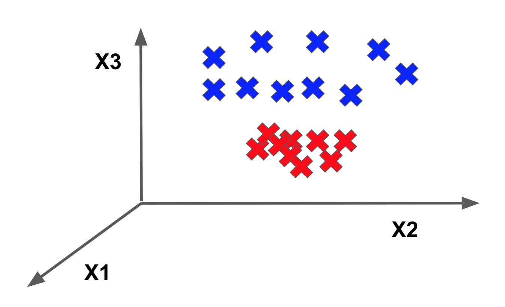
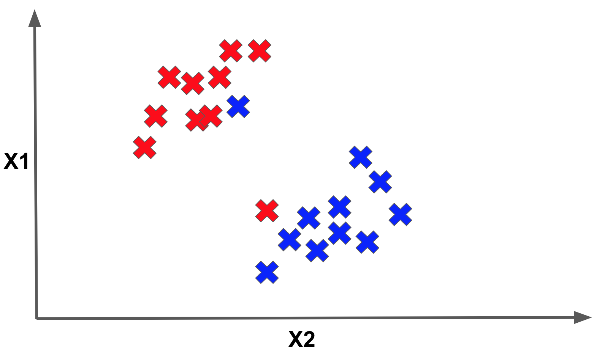
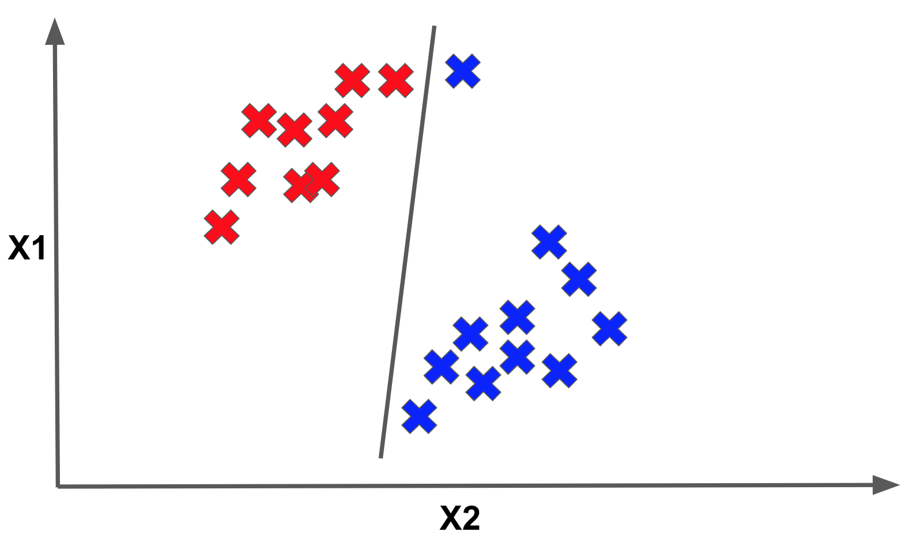

<figure>
    
</figure>

In this post, we will explore a family of classification algorithms that has a very different theoretical
motivation from [ones](/posts/fundamentals-of-linear-regression) [we've](/posts/introduction-to-logistic-regression) [seen](/posts/not-so-naive-bayes ) previously. We will be looking at **support vector machines**.

Back in the early 2000s
before deep learning surged to the forefront of AI, support vector machines were the cool kid on the block. Even today, support vector machines are still one of the best go-to algorithms
for a new classification task because of their powerful ability to represent very diverse types of statistical relationships in data as well as their ease of training.

## Max-Margin Motivations

Let's begin by motivating support vector machines. Recall our ridiculously overused classification problem: identifying whether a car is **cheap** or **expensive**, based on a set of features of that car.

Imagine that we are plotting some of our data in 2-dimensional feature space. In other words, we are only
extracting two features, $X_1$ and $X_2$, from each car for building our model.  Furthermore, let's label each point BLUE if it represents a car that is **cheap** and RED if it represents a car that is labelled **expensive**.

We will try to
learn a linear model of our features, parameterized by the weights $W_1$ and $W_2$. Our model will output BLUE if $W_1\cdot X_1 + W_2\cdot X_2 < 0$ and RED if $W_1\cdot X_1 + W_2\cdot X_2 >= 0$.

This model will describe a linear separator of a collection of data. That linear separator of our data could look as follows:

Here the datapoints above the line are classified as RED, while those below are classified as BLUE. The important thing to see is that this is *only one* possible linear separator of the data.
However, we could envision another separator that could separate the dataset into two colored halves just as well:

In fact, there are an *infinite* number of possible separators that would split the data perfectly! How do we choose among them? 

Consider how we decided to label a datapoint as RED or BLUE. We computed $W_1\cdot X_1 + W_2\cdot X_2$ and said if it was negative, we labelled the point BLUE. Otherwise
we labelled it RED. Intuitively, it seems that if the quantity $W_1\cdot X_1 + W_2\cdot X_2$ for a given point is 15, we are more confident that it should
be RED than one for which the quantity is 1.

Alternatively, the more negative the quantity is for a point the more confident we are that it should be BLUE. In fact, we can use this value to
judge our confidence for every single point!

Geometrically, this confidence for a point's label can be represented as the perpendicular distance from the point to the separator. Below we have designated the perpendicular distances
to the separator for several sample points with the GREEN lines:

Now imagine if we took the minimum distance to the separator across all the points in the dataset. This minimum value is called the **margin**. Below we show the point that achieves the margin for the given separator:

Optimal margins are at the core of support vector machine theory, and they inform how we will pick the "best" linear separator among the infinite choices. The way we will do this is by picking the linear separator that **maximizes the margin**.

Put another way, each separator defines a certain margin (i.e. an associated minimum perpendicular distance
to the separator). Then, among the infinite possible separators, we will pick the separator that maximizes the margin.

Make sure you really understand that last statement!
Support vector machines are often called **max-margin classifiers** for that exact reason. Given an optimal margin linear separator, the points with the smallest margins that are closest to the linear separator are called the **support vectors**.

## Training the SVM

So, how do we train a support vector machine? The full mathematical details to describe the cost function we want to optimize are a bit beyond the scope of this post, but we will
give a brief description of the training cost function.

Given a collection of datapoints $[(X_1, Y_1), (X_2, Y_2), ... , (X_n, Y_n)]$ (where $X$ are the input features
and $Y$ are the correct output labels) and a vector of weights $W$ for our input features, finding the optimal margin classifier amounts to solving

$$
\textrm{min}_W \frac{1}{2} ||W||^2 
$$
$$
\textrm{such that } Y_i(W^TX_i) \geq 1 \textrm{ for all } i = 1, ..., n
$$

This cost function is basically a fancy way of saying that we want maximize the margin, while ensuring the margin of each datapoint is greater than or equal to 1.

It turns out finding the optimum for this cost function is a convex optimization problem, which means there exist standard algorithms for solving the problem. This is good news
for us because it means optimally training a support vector machine is a tractable problem!

As a point of comparison, there exist some problems for
which we cannot find the optimal value in a computationally reasonable time. It may even take exponential time to find the optimum!

## The Kernel Trick

Thus far we have motivated support vector machines by only focusing on linear separators of data.
It turns out that support vector machines can actually learn nonlinear separators, which is why they are such a powerful model class!

To motivate this idea,
imagine that we have an input point with three features $X = (X_1, X_2, X_3)$. We can transform the 3-dimensional vector $X$ into a higher-dimensional
vector by applying a transformation function as follows: $T(X) = (X_1, X_2, X_3, X_1\cdot X_1, X_2\cdot X_2, X_3\cdot X_3)$.

Our transformation function did two things:
1) it created a 6-dimensional vector from a 3-dimensional one 
2) it added nonlinear interactions in our features by having certain new features be the squares of the original features.

Transforming features into a higher-dimensional space has some perks, namely that some data which is not linearly separable in a certain-dimensional space could become
linearly separable when we project it into the higher-dimensional space.

As a motivating example, consider the following data which is not linearly separable in 2-d space:

which becomes separable in 3-dimensional space through an appropriate feature transformation:

Such input feature transformations are particularly useful in support vector machines. It turns out that support vector machines formalize the notion of these feature transformation function through something called a **kernel**.

Without getting too much into the mathematical details, a kernel allows a support vector machine to learn using these transformed features in higher-dimensional space in a much more computationally efficient way. This is called the **kernel trick**.

Examples of kernels that are frequently used when learning a support vector machine
model include the [polynomial kernel](https://en.wikipedia.org/wiki/Polynomial_kernel) and the [radial basis function kernel](https://en.wikipedia.org/wiki/Radial_basis_function_kernel).

A really crazy mathematical property of the radial
basis function is that it can be interpreted as a mapping for an infinite-dimensional feature space! And yet we can still use it to do effective learning
in our models. That's insane

## Slacking Off 

Thus far, we have assumed that the data we are working with is always linearly separable. And if it wasn't to begin with, we assumed we could project it into a higher-dimensional feature space where it would be linearly separable and the kernel trick would do all the heavy lifting.

However, our data may not always be linearly separable. We may find ourselves in a situation as follows where it is impossible to linearly separate the data:

Moreover, recall that our original support vector machine cost function enforced the constraint that every point needs to have a margin greater than or equal to 1.

But perhaps this condition is too strict for all cases. For example, enforcing this condition for all points may make our model very susceptible to outliers as follows:

To combat this problem, we can introduce what are called **slack penalties** into our support vector machine objective that allow certain points to have margins potentially smaller than 1. With these penalties, our new cost looks as follows:

$$
\textrm{min}_W \frac{1}{2} ||W||^2  + K \cdot \sum_i s_i
$$
$$
\textrm{such that } Y_i(W^TX_i) \geq 1-s_i \textrm{ for all } i = 1, ..., n
$$
$$
s_i \geq 0 \textrm{ for all } i = 1, ..., m
$$

Here the $s_i$ are our slack variables. Notice that we have changed the expression we are trying to minimize. The value **K** is
what is called a *hyperparameter*.

In a nutshell, this means we can adjust **K** to determine how much we want our model to focus on minimizing the new term in our cost function or the old term.
This is our first example of a very important concept in machine learning called **regularization**.

We will discuss regularization in a lot more detail in the next section. For now, just understand that this new addition makes the support vector machine
more robust to nonlinearly-separable data.

## Final Thoughts

Support vector machines are very powerful model. They are great for handling linearly separable data and with their various extensions
can adequately handle nonlinearly separable data scenarios

As part of the machine learning toolkit, it is a great go-to model to try when
starting on a new problem. However, one of its downsides is that using certain kernels, such as the radial basis function kernel, can sometimes make the model
training slower, so be wary of that.

*Shameless Pitch Alert: If you're interested in practicing MLOps, data science, and data engineering concepts, check out [Confetti AI](https://www.confetti.ai/?utm_source=personal-blog&utm_medium=web&utm_campaign=support-vector-machines) the premier educational machine learning platform used by students at Harvard, Stanford, Berkeley, and more!*
