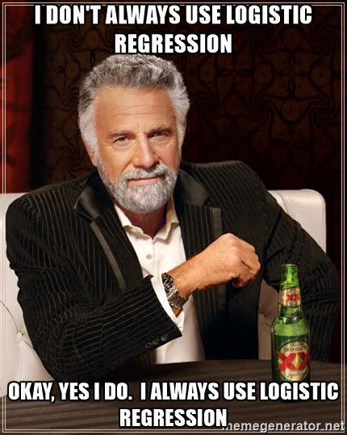
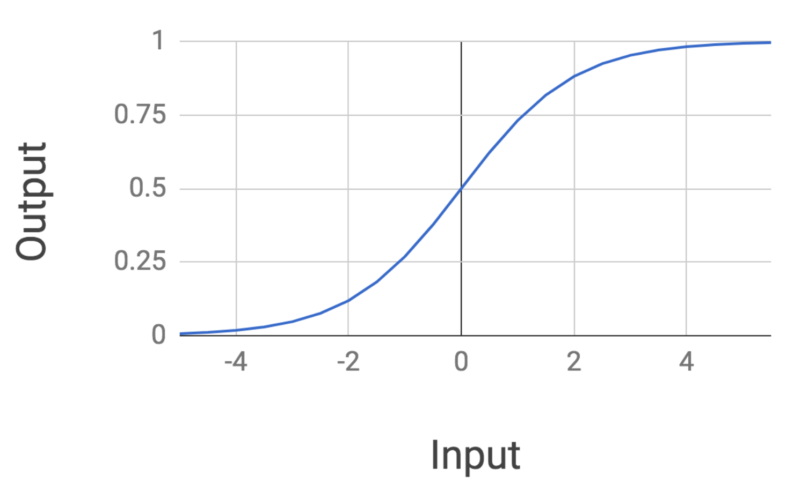

<figure>
    
    <figcaption>Source: Twitter</figcaption>
</figure>

In this post, we will continue with our study of supervised learning by exploring our first classification algorithm.
A vast majority of problems tackled in the real world involve classification, from
image labelling, to spam detection, to predicting whether it will be sunny tomorrow, so we are at an exciting milestone
in our study of artificial intelligence!

Ironically, the first **classification** algorithm we will investigate is called *logistic regression* 🤔.
Putting aside name confusion for now, the form of logistic regression we will look at is for binary classification
tasks, where we only output two possible labels.

          
## Model Definition
To motivate logistic regression, let us begin with a modified version of our running car example from the last post on [linear regression](/posts/fundamentals-of-linear-regression/).

Rather than build a system to predict the price of a car, we will build a system that is provided a set of features of a car
and will determine whether the car is *expensive* or *cheap*.
In particular, we will extract a few different features from the cars in our dataset such as:
* the size of the trunk,
* the number of miles driven
* who the car manufacturer is.

Let's call these features $X_1$, $X_2$, and $X_3$. We will consolidate these features into a single vector variable $X = (X1, X2, X3)$. These features will be fed into a mathematical function $F(X)$, to get a probability of whether or not the car is expensive.

In other words, we will compute $F(X)$ (where
the function $F$ is unspecified for now), and this will give us a probability between 0 and 1. We will
then say that if our probability is greater than or equal to 0.5, we will label our prediction, *expensive*, otherwise
it will be *cheap*. This can be expressed mathematically as follows: 

$$
\textrm{Prediction} = \begin{cases} 
      \textrm{expensive} & \textrm{if}\;\; F(X) \geq 0.5 \\
      \textrm{cheap} & \textrm{if} \;\; F(X) < 0.5 \\
   \end{cases}
$$

Note, we could have reversed the labels and said a probability greater than 0.5 is *cheap*
and it would not have made a difference. The only important thing is to be consistent once you've selected a labelling scheme!

So what exactly is going on in that $F(X)$ function? The logistic regression model describes the relationship between our input car features and the output probabilities through a very particular mathematical formulation. Given our input features $X_1$, $X_2$, and $X_3$ the formulation is as follows:

$$
F(X) = \frac{1}{1 + e^{-(A_1 \cdot X_1 + A_2 \cdot X_2 + A_3 \cdot X_3)}}
$$

where here the weights of our model that we have to learn are $A_1$, $A_2$, and $A3$. Ok, this gives us the mathematical form, but let's try to gain some visual intuition for the formulation. What does this function actually look like?

It turns out that this function of the inputs, which is called a *sigmoid*, has a very interesting form:

Notice how the mathematical form of the logistic regression function has a sort of elongated *S* shape. The probability returned
is exactly 0.5 when the input is 0, and the probability plateaus at 1 as our input gets larger. It also plateaus
at 0 as the inputs get much smaller.

Logistic regression is also interesting because we are taking our feature of inputs, transforming
them via a *linear* combination of the weights (namely $A1\cdot X1 + A2\cdot X2 + A3\cdot X3$), and then running them through a *nonlinear* function.

## Training the Model

How do we train the weights of a logistic regression model? Let's assume that we have a dataset of **n** cars with their associated
true labels: $[(X_1, Y_1), (X_2, Y_2), ... , (X_n, Y_n)]$. We won't dive into the mathematical details, but it turns out we can write an expression
for the total probability of our dataset which looks as follows:

$$
\textrm{Probability} = \displaystyle\prod_{i=1}^n (F(X_i))^{Y_i} \cdot (1 - F(X_i))^{1-Y_i}
$$

For our purposes, understand that our aim will be to maximize this probability. We can do by taking the derivative with
respect to our weights and setting the derivative to 0. We can then run gradient descent using our computed gradient
to get our optimal weights. This is analogous to the procedure used for numerically optimizing a linear regression model in the [linear regression post](./posts/fundamentals-of-linear-regression).

## Final Thoughts

Logistic regression can also be applied to problems with more than just binary outputs for a given set of inputs.
In this case, the model is called **multinomial logistic regression**.

For this post we have restricted ourselves to binary outputs because it is a natural
place to start. That being said, multinomial logistic regression is especially important
for more sophisticated models used in deep learning.

When is logistic regression useful? In practice, logistic regression is a very nice off-the-shelf algorithm
to begin with when you are doing any type of classification.

It has a fairly straightforward description, can be trained
fairly quickly through techniques such as gradient descent because of its nice derivative, and often works well
in practice. It is used frequently in biostatistical applications where there are many binary classification problems.

*Shameless Pitch Alert: If you're interested in practicing MLOps, data science, and data engineering concepts, check out [Confetti AI](https://www.confetti.ai/?utm_source=personal-blog&utm_medium=web&utm_campaign=introduction-to-logistic-regression) the premier educational machine learning platform used by students at Harvard, Stanford, Berkeley, and more!*
