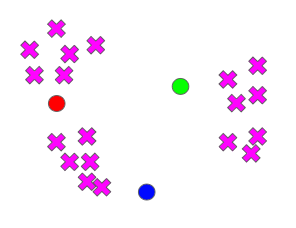
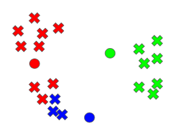
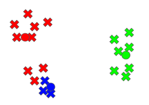
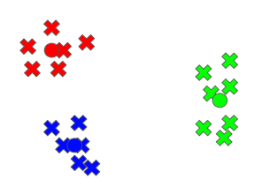

<figure>
    
    <figcaption>Source: WhatMatrix</figcaption>
</figure>

In this post, we are going to continue our study of unsupervised learning by taking our first look at data
clustering. To do so, we will describe **k-means clustering**, which is one of the most popular clustering algorithms
used by practitioners.

At a high-level, k-means clustering seeks to find a way to clump our dataset into some predefined
number of clusters using a well-defined notion of similarity among the datapoints. In this case, the
notion of similarity usually amounts to minimizing intra-cluster variation of the points across all the clusters. Let's investigate what this means in further detail.

## The Algorithm 

Let's say that we have $n$ datapoints in our
dataset: $(X_1, X_2, ..., X_n)$. Here we assume that each of the datapoints is already featurized and represented in its mathematical
vector notation.

We begin by selecting some number, $k$, of what are called **cluster centroids**. Let's denote these centroids $(C_1, C_2, ..., C_k)$.
Note that the centroids must have the same dimension as the points in our dataset. In other words, if each of our datapoints is a vector
of dimension 5, then our centroid will also be a vector of dimension 5.

The k-means algorithm then runs the following steps repeatedly:

  1) For every datapoint, find the centroid to which it is closest, according to a Euclidean distance metric.

  2) Once we have assigned each datapoint to a centroid we recompute each centroid $C_j$ by averaging the datapoints that have been
          assigned to $C_j$.

Let's give a bit more detail about these steps. For 1) if we start with $X_1$, we compute:

$$
(L_2(X_1, C_j))^2 \textrm{ for every } C_j \textrm{ in } (C_1, C_2, ..., C_k)
$$

Here $L_2(X_1, C_j)$ denotes the Euclidean (also known as $L_2$) distance we described in the lesson on regularization. After performing this calculation, we assign $X_1$ to the $C_j$ which produced the minimum value for this squared Euclidean distance. We repeat that procedure for every single datapoint.

The calculation in step 2) has the effect of adjusting the centroid to more
accurately reflect its constituent datapoints. In this way, the two steps constantly switch between assigning points to centroids and then
adjusting the centroids.

That's all there is to it! We repeat these two steps until our algorithm converges. What does convergence mean here?

Convergence occurs when no datapoints get assigned
to a new cluster during an execution of 1). In other words, the centroids have *stabilized*.

Below we include a visualization of the
algorithm executing for some number of iterations on a dataset. Let's say we have some data and we are trying to cluster it into three clusters.

We start with all our points unassigned to any centroids. The centroids are indicated in red, blue, green.

Now we assign the points to their nearest centroid:

We then adjust the centroids accordingly

We then repeat these steps until our centroids stabilize, at which point we are done. We should see three well-defined clusters:

K-means clustering is elegant because one can demonstrate mathematically that the algorithm is guaranteed to converge! Now you may be
thinking that something seems missing.

 We seem to have avoided one huge detail: how do we actually pick the initial cluster centroids for the algorithm?
 In particular, though k-means is guaranteed to converge, how do we know it is converging to the absolute optimal clustering?

The short answer is we don't. It turns out that centroid selection can pretty drastically impact the clustering produced by the algorithm. One example of a valid centroid selection algorithm that is used in practice is just to pick random centroids. Another one is to pick <Bold txt="k"/> points in our dataset that are spread far away from each other.

Because different centroid selection can impact the clustering, it is common to run k-means several times on a dataset using different selected centroids and picking the best clustering among them.

## Final Thoughts

While k-means is not super complicated, it is a very useful method for unsupervised learning. As one simple use case, imagine we were given a collection of unidentified essays.

We could represent each document as a vector, based on the frequency of words appearing in the essay. We could then apply k-means clustering to find which essays are most similar, and those could perhaps give us some indication of how many authors' writing is represented in the collection.

Perhaps we could even extract the centroids and compare them to essays whose authors we know and that could help us actually identify the unknown essays in our dataset!

This is just a small example of how useful k-means can be in practice. There are many more scenarios where it can be *extremely useful* for analyzing datasets where we don't have labels.
