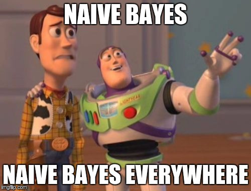

<figure>
    
    <figcaption>Source: Medium</figcaption>
</figure>

I hope you're excited to learn about another fantastic class of machine learning models: **Naive Bayes**.
Naive Bayes is wonderful because its core assumptions can be described in about a sentence, and yet it
is *immensely* useful in many different problems.

But before we dive into the specifics of Naive Bayes, we should spend some time discussing the difference
between two categories of machine learning models: **discriminative** and **generative** models.

## Beginnings

Naive Bayes will be the first generative algorithm we look at, though other common examples include hidden markov models,
probabilitistic context-free grammars, and the more hip generative adversarial networks.

Recall that in our [running](/posts/fundamentals-of-linear-regression) [car](/posts/introduction-to-logistic-regression) example of the past few posts, we are given
a dataset of cars along with labels indicating whether they are **cheap** or **expensive**.
From each car, we have extracted a set of input features such as the size of the trunk, the number of miles driven, and who the car manufacturer is.

We start from the distribution we are trying to learn $P(X_1, X_2, X_3, Y)$. We can expand the distribution using a few rules of probability along with Bayes' Rule:

$$
P(X_1, X_2, X_3, Y) = P(Y) \cdot P(X_1|Y) \cdot P(X_2|X_1, Y) \cdot P(X_3|X_1, X_2, Y)
$$

This formulation was derived from a few applications of the [chain rule of probability](https://en.wikipedia.org/wiki/Chain_rule_(probability)). Now we get to the big underlying assumption of the Naive Bayes model.

We now assume the input features are **conditionally independent given** the outputs. In English, what that
means is that for a given feature $X_2$, if we know the label $Y$, then knowing the value of an additional
feature $X_1$ doesn't offer us any more information about $X_2$.

Mathematically, this is written as $P(X_2|X_1, Y) = P(X_2|Y)$. This allows us to simplify the right side of our probability expression substantially:

$$
P(X_1, X_2, X_3, Y) = P(Y) \cdot P(X_1|Y) \cdot P(X_2|Y) \cdot P(X_3|Y)
$$

And with that, we have the expression we need to train our model!

## Naive Training

So, how do we actually train the model? In practice, to get the most likely label for a given input, we need to compute these values $P(X_1|Y)$, $P(X_2|Y)$, etc.
Computing these values can be done through the very complicated process of counting! 🙂

Let's take a concrete example to illustrate the procedure. For our car example, let's
say $Y$ represents **cheap** and $X_1$ represents the feature of a car's manufacturer.

Let's say we have a new car manufactured by **Honda**. In order to compute $P(X_1=\textrm{Honda}|Y=\textrm{cheap})$, we simply count all the times in our dataset
we had a car manufactured by **Honda** that was **cheap**. 

Assume our dataset had 10 cheap, Honda cars. We then normalize that value by the total number of cheap
cars we have in our dataset. Let's say we had 25 cheap cars in total. We thus get $P(X_1=\textrm{Honda}|Y=\textrm{cheap}) = 10 / 25 = 2/5$.

We can compute similar expressions (e.g. $P(X_2=\textrm{40000 miles driven}|Y=\textrm{cheap})$) for all the features of our new car.
We then compute an aggregated probability that the car is **cheap** by multiplying all these individual expressions together.

We can compute a similar
expression for the probability that our car is **expensive**. We then assign the car the label with the higher probability. That outlines how we both train
our model by counting what are called *feature-label co-occurrences* and then use these values to compute labels for new cars.

## Final Thoughts

Naive Bayes is a super useful algorithm because its extremely strong independence assumptions make it a
fairly easy model to train. Moreover, in spite of these independence assumptions, it is still extremely powerful
and has been used on problems such as spam filtering in some early version email messaging clients.

In addition, it is a widely used technique in a variety of natural language processing problems such as document classification (determining
whether a book was written by Shakespeare or not) and also in medical analysis (determining if certain patient
features are indicative of an illness or not).

However the same reason Naive Bayes is such an easy
model to train (namely its strong independence assumptions) also makes it not a clear fit for certain other problems. For example,
if we have a strong suspicion that certain features in a problem are highly correlated,
then Naive Bayes may not be a good fit.

One example of this could be if we are using the language in an email message
to label whether it has positive or negative sentiment, and we use features for whether or not a message contains certain words.

The presence of a given swear word would be highly correlated with the appearance of any other swear word, but Naive Bayes would disregard this correlation by making false independence assumptions. Our model could then severely underperform because it is ignoring information about the data. This is something to be careful about when using this model!
