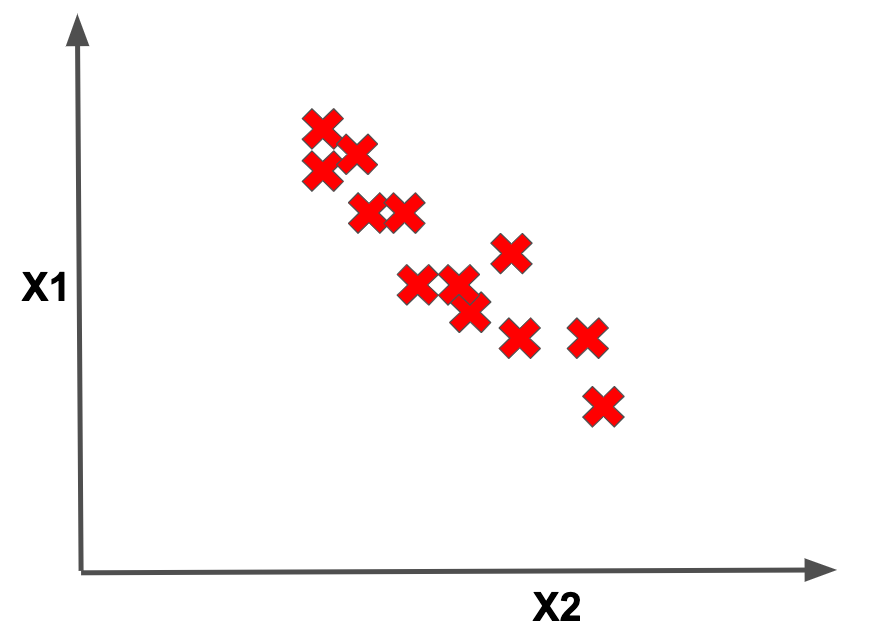
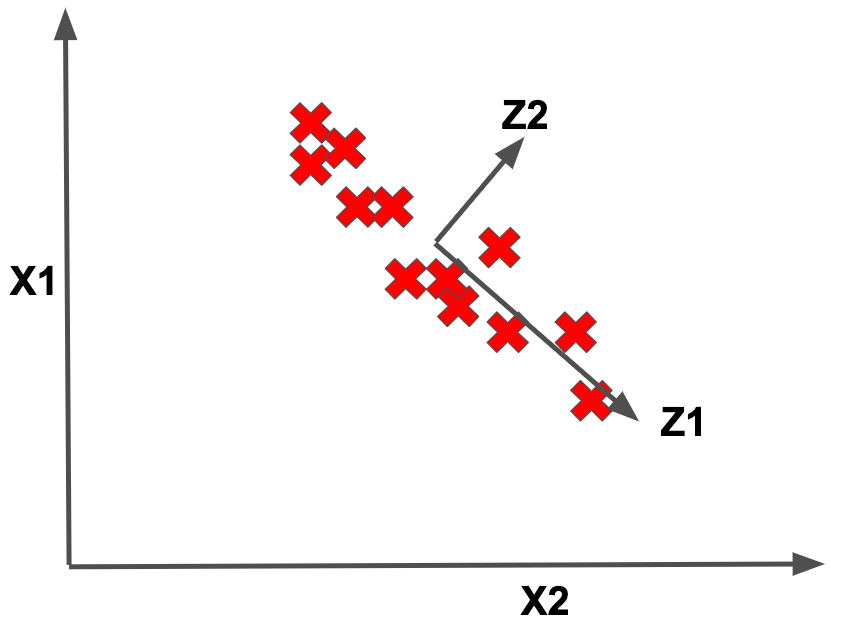

<figure>
    
</figure>

This lesson will introduce us to **principal components analysis**, which is going to be our first
example of a data **dimensionality reduction** technique. While that might sound really fancy, at its core dimensionality
reduction is a fairly intuitive technique.

## Motivations

To motivate it, let's imagine we have a featurized dataset consisting of
the points $(X_1, X_2, ..., X_n)$. So far in past posts, we have never spent too much time talking about the dimensionality of our
datapoints, or in other words, the number of features per datapoint. We have largely imagined that our data consisted of
a handful of manually-chosen features, maybe on the order of 5-20 or so.

But for many problems, our feature sets span upwards
of *thousands of features*! As an example, consider a problem where we are analyzing some collection of text documents.

For such a problem, it is perfectly reasonable to featurize each document by the number of occurrences of each unique word. In other
words, if **the** appears 3 times in the document and **cat** appears 5 times, we would have two separate features with values
3 and 5 respectively. Notice how in this case, our feature set could conceivably be equal in size to the number of words
in the English dictionary, which is **over 100,000 words!**

Once we are dealing with high-dimensional data, we face a number of new challenges related to the computational cost of training a
model or memory costs related to storing data on disk. Another question that naturally comes up is: do we have any redundancy in our features?

We derive features from data because we believe that those features contain information that
will be useful for learning the outputs of our models. But if we have multiple features that encode similar information,
then those extra features don't help us learn a better model and may in fact just incur additional noise.

As an example,
imagine that we are training a model to determine whether a given car is cheap or expensive, and we have one feature that is
the size of the trunk in cubic feet and another feature that is the number of shopping bags that can fit in the trunk.

While these features aren't exactly the same, they are still **very related** and it certainly seems like we
wouldn't have a less powerful model if we removed one of these features.

## Welcoming PCA
Dimensionality reduction is a technique by which
we seek to reduce each datapoint to a smaller feature set, where we preserve the information in each datapoint. For a little
more visual intuition about what dimensionality reduction could look like, imagine a dataset with two primary
features (and their associated axes) that looks as follows:

Notice how in this example, it seems that we really only need a single axis (rather than two) to represent our entire dataset, namely $Z_1$ below:

This means that we could project each datapoint on this new axis $Z_1$. Notice how except for a little bit of *wiggle*
along the $Z_2$ direction that we don't capture, our dataset could be represented in terms of this new single *pseudofeature*. Now the
big qustion is: how do we pick this $Z_1$ axis to use for representing our dataset?

And here we finally get to **principal components analysis** (or PCA for short). PCA is an algorithm whereby we find these
axes along which the feature of a dataset can be more concisely represented. These axes are called the <Bold txt="principal components"/>.
How does the algorithm find these principal components?

Well, in order to gain some intuition for the algorithm, let's revisit our running example of the dataset above. While we deduced that $Z_1$ above was a good axis along which to project our data so as to reduce the dimensionality, imagine if we had picked $Z_2$ instead.

It certainly feels like this is an inferior, fairly non-representative, axis along which to reduce our dataset. So what makes
our original $Z_1$ a better axis than this alternate $Z_2$?

The PCA algorithm claims that we want to project our data onto an axis
where the **variance of the datapoints is maximized**.  The **variance** of a dataset roughly measures how far each point is from the dataset mean. Notice how the variance of our data projected onto $Z_1$ certainly is larger than that of the data projected onto $Z_2$.

In the second case, much of the data coalesces to a few very close points, which seems like this dimensionality reduction is making us lose some information.

Now that we know that PCA seeks to find the axis that maximizes the variance of our projected data, we're going to drop a bit of math to formalize this notion.

For the 1-dimensional case, imagine that we have a dataset $(X_1, X_2, ..., X_n)$. Maximizing the variance of the data is equivalent to finding the unit-vector, $v$, that maximizes:

$$
\frac{1}{n} \displaystyle\sum_{i=1}^n (X_i^Tv)^2
$$

Finding this $v$ can be done pretty efficiently using some linear algebra properties that we won't go into for now.
Once we are done, this $v$ is our first principal component!

The second principal component would be the axis that
maximizes the variance on the data **after** we have removed the influence of the first principal component. If we
extracted $k$ principal components, these components would define a $k$-dimensional subspace that maximizes the variance of our data.

## Final Thoughts

In practice, when we are reducing our dataset we will choose some reasonable number of principal components to extract. In this
way we could take each datapoint consisting of maybe 1000 features and represent it as a compressed vector of maybe 20 values
(if we chose to extract 20 principal components). That is pretty awesome!

Because of this, PCA is often a go-to technique for data
preprocessing before any model training is done. Alternatively PCA can be used to visualize very high-dimensional data by projecting it into
maybe 2 or 3 dimensions, to gain some insights into what the data represents.

One last practical note regarding PCA is that it is common to normalize the dataset before running the algorithm, by subtracting out the dataset mean
and also ensuring that the features are using the same units (you don't want to have a feature that is a distance in meters and one in feet). After
that normalization is done, we can run the PCA algorithm as described above.
