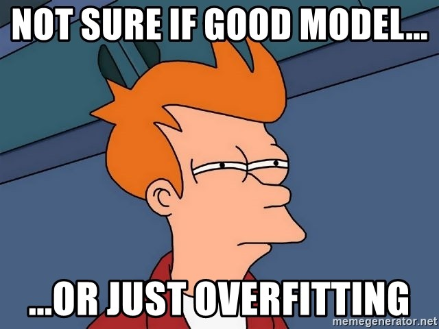

<figure>
    
</figure>

In this post, we will continue with our odyssey through practical machine learning methodology by discussing **model regularization**. Regularization is an immensely important principle in machine learning and one of the most powerful ones in the practitioner's toolkit. Excited? Let's get started!

Regularization is another way to address the ever-present problem of model generalization. It is a technique
we apply to deal with model overfitting, particularly when a model is overspecified for the problem we are tackling.

We have actually already seen regularization previously. Recall that when we were studying [support vector machines](/posts/support-vector-machines), we introduced
slack variables to make the model less susceptible to outliers and also make it so that the model could handle non-linearly separable
data.

These slack variables represented a means of regularizing the model, through what we will show later is called **$L_1$ regularization**.

There are many types of regularization, some that can be applied to a broad range of models, and others that we will see
are a bit more model-class specific (such as dropout for neural networks).

## $L_2$ Regularization

Traditionally when we are building a supervised model, we have some number of features we extract
from our data. During training, we learn weights that dictate how important each feature is for our model.

These weights tune the strength of the features through interactions ranging from the simple linear ones (as in the case of
linear regression) to more complex interactions like those we saw with [neural networks](/posts/convolutional-neural-networks).

For the time being, let's assume
that we are dealing with linear regression. Therefore, we have a weight vector $A = (A_1, A_2, ..., A_k)$ for our $k$ features. **$L_2$ regularization** is
the first type of regularization we will formally investigate, and it involves adding the square of the weights to our cost function.

What that looks like in mathematics is as follows: Recall that for linear regression we were trying to minimize the value of the least-squares cost:

$$
C(X) = \frac{1}{2} \cdot \displaystyle\sum_{i=1}^n(F(X_i) - Y_i)^2
$$

Adding an $$L_2$$ penalty, modifies this cost function to the following:

$$
C(X) = \frac{1}{2} \cdot \displaystyle\sum_{i=1}^n(F(X_i) - Y_i)^2 + L\cdot \displaystyle\sum_{i=1}^kA_i^2
$$

So, this cost function involves optimizing this more complex sum of terms. Notice that now our model must ensure
that the squared magnitude of its weights don't get too big, as that would lead to a larger overall value of our cost.

In practice, having smaller weight magnitudes serves the purpose of ensuring
that any single feature is not weighted **too** heavily, effectively smoothing
out our model fit. This is **exactly** what we want to do to prevent overfitting.

You may have noticed that we also have this extra term $L$ that we multiply through in our $L_2$ penalty. $L$ as you may remember is
called a *hyperparameter* and is something that is typically tuned (i.e. a good value is chosen) during cross-validation or model training.

We can do some simple analysis to understand how $L$ affects our cost. If $L$ is
really, really small (as in close to 0), it's as if we are not at all applying an $L_2$ penalty and our cost function
degenerates to the original cost function we were optimizing before.

However, if $L$ is really, really big, then our cost
will focus solely on minimizing the value of our $L_2$ penalty. In practice, this amounts to sending all of our
weights toward 0. Our model basically ends up learning nothing!

This makes sense because if we
focus very hard on counteracting the effects of overfitting, we may effectively end up underfitting. In practice, there is a sweet
spot for the $L$ parameter which depends on our data and problem.

A quick note on terminology: you may also sometimes see $L_2$ regularization referred to as **ridge regression**, though for
our purposes we will continue to call it $L_2$ regularization.
While we focused on linear regression to introduce $L_2$ regularization, practically speaking this technique can be applied
to many other model classes.

## $L_1$ Regularization

We can now move on to discussing **$L_1$ regularization**. This technique is conceptually similar to $L_2$ regularization,
except instead of adding the term

$$
L\cdot \displaystyle\sum_{i=1}^kA_i^2
$$

to our cost, we add the term

$$
L\cdot \displaystyle\sum_{i=1}^k|A_i|
$$

That's it! As mentioned previously,
we've already seen $L_1$ regularization in our slack variables in the support vector machine cost. Notice how with
our $L_1$ regularization term, we can use the same logic for tuning the $L$ parameter as with $L_2$ regularization.

While $L_1$ regularization seems pretty similar mathematically, it has quite different implications for feature selection. It turns
out that one of the consequences of using $L_1$ regularization is that many weights go to 0 or get really close to 0.

In that sense, $L_1$ regularization induces **stricter sparsity in our feature set**. This effectively means that many of the features aren't counted
at all in our model. This makes it more like a traditional **feature selection** algorithm,
as compared to $L_2$ regularization that achieves a smoother continuous set of weights for our feature set.

## Final Thoughts

In addition to these regularization techniques, there are **many** more ways to regularize a model out there, which
we won't cover. In practice, the type of regularization you use very often depends on how you want to control your feature set. But regardless,
it is a hugely important technique to keep under your belt as you venture into the machine learning jungle!