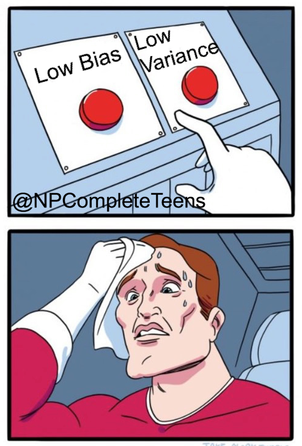
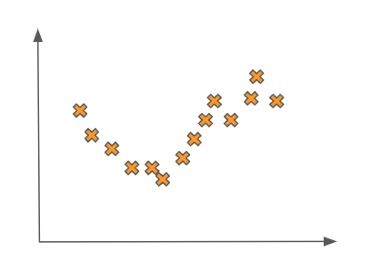
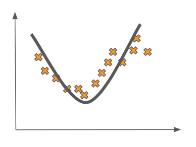
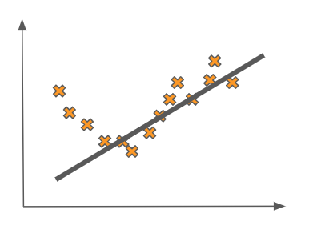
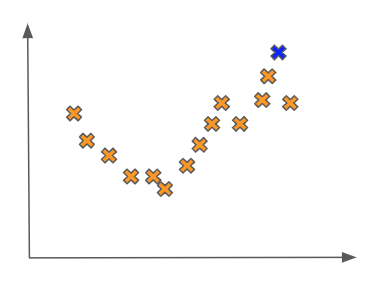
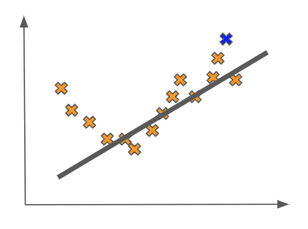
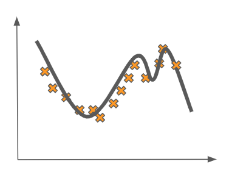
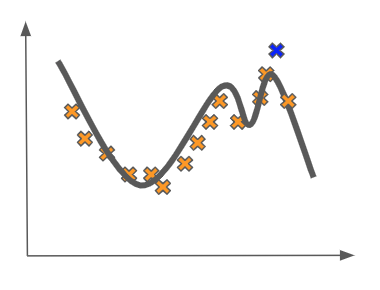
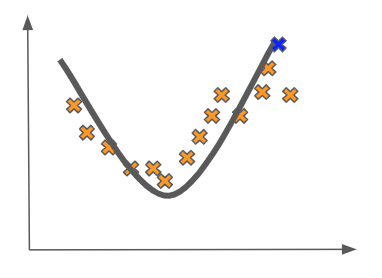

<figure>
    
</figure>

In this lesson, we are going to take a deeper dive into some of the theoretical guarantees behind building supervised
learning models. We are going to discuss the **bias-variance tradeoff** which is one of the most important principles
at the core of machine learning theory.

Besides being important from a theoretical standpoint, the bias-variance
tradeoff has very significant implications for the performance of models in practice. Recall that when we are building a supervised model, we typically
train on some collection of labelled data.

After the training is done, we really want to evaluate the model on data it never saw during
training. The error incurred on *unseen* data tests a model's ability to generalize, and hence it is called the **generalization error**. The
generalization error will be an important idea in the remainder of this section and in our broader machine learning journey.

As we begin our discussion on the bias-variance
tradeoff, we will be posing the following questions: how good can the performance of any machine learning model ever get on
a problem? In other words, is it possible to reduce the generalization error of a model on unseen data to 0?

## Motivations

Before we dive into these questions, let's motivate them by looking at some concrete examples of data.
Imagine that we had a training set that looked as follows:

If we are trying to learn an accurate supervised learning model on this data, it seems that something
like a quadratic fit would be pretty good. Fitting a quadratic-like function to this data would look like this:

This seems reasonable. But why does this seem more reasonable than a linear fit like the one below?

One thought we may have is that this linear fit seems to not really pick up on the behavior of the data we have. In other
words it seems to be ignoring some of the statistical relationships between the inputs and the outputs.

We may even be so bold as to say that the fit is *overly simplistic*. This simplicity of the model would be especially pronounced if we received
a new point in the test set, which could be from the same statistical distribution. This point could look as follows:

In this case, our linear fit would clearly do a poor job of predicting a value for the new input as compared to the true value of
its output:

In the machine learning lingo, we say that this linear fit is **underfitting** the
data. As a point of comparison, now imagine that we fit a more complex model to the data, like some higher-order polynomial:

Here, we have the opposite problem. The model is fitting the data **too** well. It is picking up
on statistical signal in the data that probably is not there. The data was probably sampled from something like a quadratic function with some noise,
but here we are learning a far more complicated model.

We see that this model gives us poor generalization error when we see
how far the test point is from the function:

In this case, we say that we are **overfitting** the data.

Compare the last fit's poor generalization to our quadratic fit on the data with the test point:

This is clearly much better!

## Formalizing Model Error

Now we are ready to formalize the notion of bias and variance as they pertain to a model's generalizability.
It turns out that in supervised learning there are always three sources of error we have to deal with when we are trying to build the most general model.

One source of error is called the **irreducible error**, which
is caused by the inherent noisiness of any dataset. This source of error is entirely out of our control and hence irreducible.

The two sources of error that we *can* control are **bias** and **variance**, and they are basically always competing.

The nature of this somewhat confrontational relationship is that **incurring a decrease in one of these sources of error is always coupled with incurring an increase in the other**. This can actually be demonstrated mathematically, though we will gloss over this derivation for now.

What do these sources of error actually mean? Bias is caused when we make some incorrect assumptions in our model. In this way, it is analogous to human bias.

Variance is caused when our algorithm is really sensitive to minor fluctuations in the training set of our data. In the examples we presented above, the complex polynomial fit is said to have a high variance (and hence a lower bias).

This is because it is really sensitive to the nature of the training data, capturing a lot of its perceived behavior. Too sensitive, in fact,
because we know the behavior it is capturing is deceptive. This becomes clear when we are presented with a new test datapoint.

We can also get models with high variance when our model has more features than there are datapoints. In this case, such models tend to be
overspecified, with too many sources of signal but not enough data to reinforce the true signal.

Meanwhile, the linear fit in our motivating example is said to have a high bias (and hence a lower variance). It captures very little of the behavior in the training data, making oversimplifying assumptions about the relationship between the features and the output labels. This is evidenced by the fact that the model believes the data was generated by a line when in fact we as omniscient bystanders know it has a quadratic relationship.

## Final Thoughts

So what does all this mean for our attempts to get the best model? In practice, this means that there will always be these dual
sources of error (bias and variance) that we will have to balance and calibrate.

We can never hope to get perfect generalization, but through empirical analyses we can try to reduce the bias by adding more complexity to our model or reduce the variance by simplifying some of the assumptions of the model.

We will discuss exact techniques on how to do this in later lessons. The important thing for now is to be aware of the existence of these two sources of error and how they affect our model's generalizability.