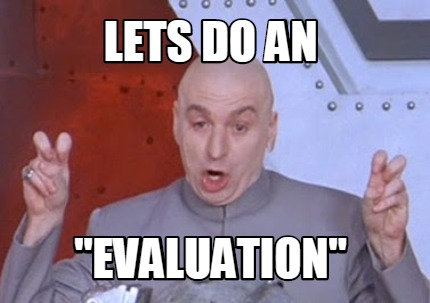

<figure>
    
</figure>

Thus far in our study of various machine learning models, we have often alluded to evaluating our models. Evaluation
has been especially relevant when training and performing cross-validation.

Evaluation is also very important when we
have successfully trained a model and are ready to say "Based on such-and-such measure, this is the quality of this model."

Metrics in other situations usually refer to evaluating some measure of success that allows us to quantitatively compare one value
against another.

For example when we are talking about stock analysis, we may refer to metrics such as the price-to-earnings ratio
of a company's stock, or we may refer to a company's market capitalization.

What do such metrics look like for machine learning models?
It turns out there are a few commonly-used evaluation metrics both for classification and regression. This lesson will introduce
a few of these metrics and describe what they are meant to capture.

## Accuracy

<Bold txt="Accuracy"/> is one of the most fundamental metrics used in classification. In its most basic terms, accuracy computes
the ratio of the number of correct predictions to the total number of predictions:

$$
\textrm{Accuracy} = \frac{\# \textrm{Correct Predictions}}{\textrm{Total } \# \textrm{ Predictions}}
$$

For example, if we are doing a binary classification predicting the likelihood that a car is cheap or expensive,
we may predict for a dataset of five cars **(CHEAP, CHEAP, EXPENSIVE, CHEAP, EXPENSIVE)**.

If in reality the cars are **(CHEAP, CHEAP, CHEAP, EXPENSIVE, EXPENSIVE)**,
then our accuracy is $\frac{3}{5} = 60\%$. In this case our model is not doing a great job of solving the task.

Generally, accuracy is a good place to start with classification tasks. Sometimes, however, it is not a sufficient metric. When is that the case? To answer this question,
we have to introduce a little more terminology.

In classification, a **true positive** is a positive label
that our model predicts for a datapoint whose true label is also positive.
For our running example, we can denote a **CHEAP** prediction
as a positive one, so our model had 2 true positives.

A **true negative** is when our model accurately makes a negative
prediction. In our running example, there are 2 **EXPENSIVE** cars of which our model labels 1 correctly, so the number of true negatives
is 1.

A **false positive** is when our model predicts a positive label but the true label is negative.
In the example, our model predicts **CHEAP** a single time when in fact the label was **EXPENSIVE**, so we have 1 false positive.

Similarly, a **false negative** is when our model predicts a negative label but the true label was positive. In our example,
our model predicts **EXPENSIVE** once when in fact the label was **CHEAP**, so the number of false negatives is 1.

With these definitions
in place, we can actually rewrite our definition of accuracy. Letting **TP = True Positive**, **TN = True Negative**, **FN = False Negative**, and **FP = False Positive** we have:

$$
\textrm{Accuracy} = \frac{TP + TN}{TP + TN + FP + FN}
$$

Given this definition, we see that our accuracy is $\frac{2 + 1}{2 + 1 + 1 + 1} = 60\%$ as we had before.

So why introduce
all this terminology? All these new terms will help us to understand when accuracy is lacking as a metric.

Consider the example
of car classification from several lessons ago, and imagine that we are classifying a dataset of 100 cars. Let's say that our model has 2 true positives,
1 false positive, 7 false negatives, and 90 true negatives.

In this case, our model's accuracy would be $\frac{2 + 90}{2 + 90 + 7 + 1} = 92\%$.
That sounds great, right? Well, maybe at first.

But let's think about the label distribution of our car dataset. It turns out we have
90 + 1 = 91 **EXPENSIVE** cars but only 2 + 7 = 9 **CHEAP** cars. Hence our model identified 90 of the 91 **EXPENSIVE** cars as **EXPENSIVE**, but only 2 of the 9 **CHEAP** cars as **CHEAP**.

This is clearly a problem, where our accuracy metric is giving us an incorrect signal about the quality of our model.

It turns out that when we
have a large disparity in our label distribution (91 **EXPENSIVE** cars vs. 9 **CHEAP** cars), accuracy is not a great metric to use. In fact if our system
had literally only predicted **EXPENSIVE** for every new car it received as an input, it would still have had a **91% accuracy**.

But clearly not all cars are **EXPENSIVE**. It turns out we need a more fine-grained metric to deal with this issue.

## $F_1$ Score

The **$F_1$ score** does a better job of handling the label-disparity issue we encountered with accuracy. It does this by leveraging
two measures: **precision** and **recall**. These two quantities are defined as follows:

$$
\textrm{Precision} = \frac{TP}{TP + FP}
$$
$$
\textrm{Recall} = \frac{TP}{TP + FN}
$$

For our 100-car dataset above, the precision of our model would be $\frac{2}{2 + 1} = 66.6\%$, while the recall would be $\frac{2}{2 + 7} = 22.2\%$. Ouch!

The $F_1$ score is then defined as:

$$
F_1 = 2\cdot \frac{\textrm{Precision} \cdot \textrm{Recall}}{\textrm{Precision} + \textrm{Recall}}
$$

Our current model would receive an $F_1$ score of $33.3\%$. All of a sudden our model seems **MUCH** worse. That's a good thing because the model learned to completely disregard predicting one entire label in our
dataset. This is really bad. Hence the $F_1$ score penalized it substantially.

In practice, when it comes to classification tasks, the $F_1$ score is more
often used as a metric because it gives a more balanced measure of a model's performance.

## Mean Absolute Error

Let's shift gears a bit to discuss a commonly-used metric for regression tasks: **mean absolute error**. If on a 3 point dataset,
we have a model outputting the values $Y_1$, $Y_2$, $Y_3$ and the true values are $G_1$, $G_2$, $G_3$,
then the mean absolute error is defined as:

$$
\textrm{Mean Absolute Error} = \frac{\sum_{i=1}^3 |y_i - g_i|}{3}
$$

in other words, the average of the absolute errors. More concretely, if our model outputted $(0.1, -1.3, 0.8)$ and the true values are $(-0.4, -0.3, 1)$, then
the mean absolute error would be:

$$
\textrm{MAE} = \frac{|0-1 - (-0.4)| + |-1.3 - (-0.3)| + |0.8 - 1|}{3}
$$
$$
\hspace{-1.15in}\approx 0.767
$$

While relatively straightforward, mean absolute error is a standard way of assessing the quality of regression models.

## Final Thoughts

The collection of metrics we discussed is only meant to provide a taste of the ways we can evaluate models. There are many, many
more means of performing evaluation that are used by the scientific community.

While we introduced all these different metrics, we never discussed what a *good* score for a metric is. It turns
out there is no one golden number for any metric. The score you should be aiming for is, of course, as close to perfect as possible. However,
how reasonable perfection is depends mainly on your data, how complex it is, how learnable your problem is, etc.

Another important thing to remember is
never to put all your eggs in one basket when evaluating a model and assume that excellent performance on a single metric
definitely demonstrates the superiority of a model.

We'll end this lesson with a relevant note of caution from economist
Charles Goodhart: *When a measure becomes a target, it ceases to be a good measure.*

*Shameless Pitch Alert: If you're interested in practicing MLOps, data science, and data engineering concepts, check out [Confetti AI](https://www.confetti.ai/?utm_source=personal-blog&utm_medium=web&utm_campaign=model-evaluation) the premier educational machine learning platform used by students at Harvard, Stanford, Berkeley, and more!*
