<figure>
    
</figure>

In this post, we will take our first deep dive into deep learning. Because deep learning
is primarily the study of neural networks, we will spend the next few posts exploring the ins-and-outs of various classes
of neural network models that each have different architectures and use-cases.

In this post, we will be studying
the most vanilla flavor of neural networks: **feedforward neural networks**. Consider this diagram of running an image
through some neural network-based classifier to determine it's an image of a dog:

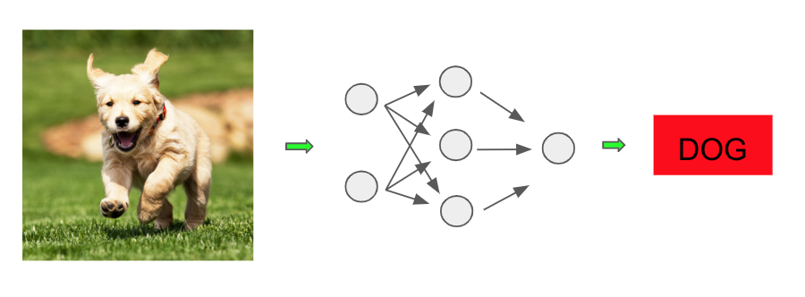

The network in the middle is the main engine doing our classifying, and it turns out this is our first example of a 
feedforward neural network. So what's going on here? Let's dive in and see!

## Building Up the Network

Let's zoom in on just the model from our image:

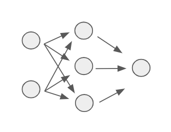

We can label each component of this feedforward network as follows:

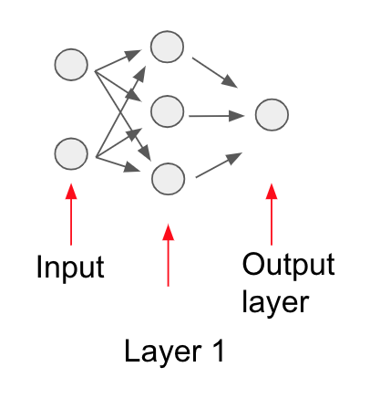

It turns out this network is performing certain layer-based
computations. To understand what each layer is doing, we must first begin at the start of the model computation,
which is where we provide the input data.

Recall that we can represent each point in a dataset through some featurized representation, and this is typically where we start
when providing the point to a machine learning model. The exact features we extract often depend on the
problem domain.

In the case of image classification, a common representation of an image is as a 3-d matrix (also known as a *tensor*)
of red/green/blue pixel values.
Therefore if our image is $100$x$100$ pixels, each pixel would
consist of 3 values, one representing the strength of each of the red, green, and blue color channels. Our image
represented as a $100$x$100$x$3$ grid of values would look as follows:

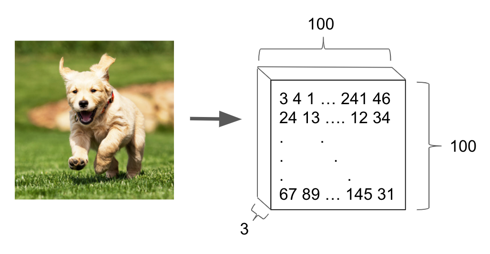

We can further collapse this 3-d representation into a single vector of $100\cdot 100\cdot 3 = 30,000$ values. We do this
merely for convenience, without modifying any of the underlying information:

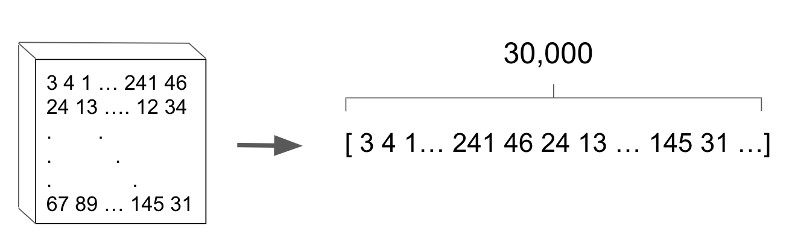

For the sake of our example, rather than operating on a $100,000$-d vector, imagine that we use a smaller representation of the picture consisting of a 3-d vector: $V = (1, 0.4, 2)$. Here we have picked these values arbitrarily.

Now let's take a 3-d weight vector $W = (-1, 0.2, 1)$ and compute the sum $W_1 \cdot V_1 + W_2 \cdot V_2 + W_3 \cdot V_3 = -1 \cdot 1 + 0.2 \cdot 0.4 + 1 \cdot 2 = 1.08$.

Now let's further feed that sum through a sigmoid function:

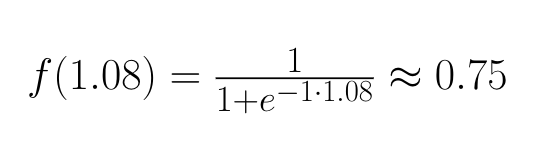

We then set that result as the value of the circle in the first layer:

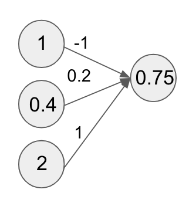

This result is our first example of a **neuron** in the neural network terminology. Because the term **neuron** is a
gross abuse of the biological term (and we don't want to annoy any of our neuroscience friends), let's just call it a **compute unit** for
our purposes.

Now let's use a new weight vector $W_2 = (3, 0.3, -0.1)$ and perform the same computation with our feature vector, namely
taking a linear sum and feeding it through a sigmoid function. If we repeat this computation with the new weight vector, we should get the result $0.81$,
which becomes the value of the second compute unit in our new layer:

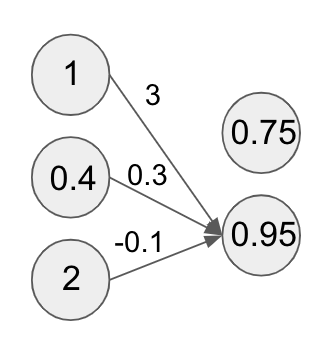

We can repeat this computation for as many compute units as we want. The important thing is to use a different weight vector for each compute
unit.

Let's say we repeat this computation for 3 units in total with some weight vectors getting the following values:

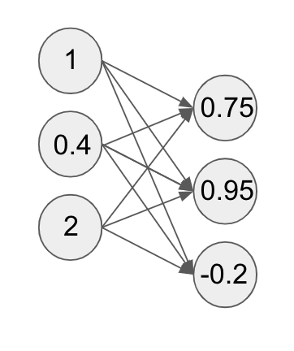

Congratulations! These computed values form the first layer of our neural network! These intermediate layers of a neural network after the layer where the inputs
are fed in are called **hidden layers**.

This particular layer of computations also has a special name: a **fully connected layer**. Again we can have as many compute units as we want
in the layer, and that number is something we can tune so as to maximize performance.

In addition, the sigmoid function we chose to
run our linear sum through has a special name in the neural network community: an **activation function**. It turns out we can
easily choose different activation functions to feed our linear sum through. We will explore a few commonly used variants in the next post.

One last note:
we didn't really mention how we chose the values of our weight vectors. This seems like an important detail to mention because the weights
determine how certain features get upweighted (or downweighted) at a given compute unit. The truth is we picked them randomly, and
this is basically what is done in practice (with a few caveats which we will discuss later).

Now that we have this vector of 3 compute units at the
first layer of our network, why not repeat the same set of operations as before?

So that's what we do. We pick new weights per compute unit, take
a linear sum with the vector of values from the first layer, and run the result through a sigmoid function. This gives us the following:

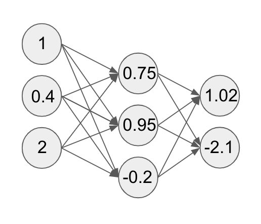

Nice! This is the second layer of our network! Let's assume that we are doing a 3-way classification task where we are trying to predict whether
an image is of a **cat**, a **dog**, or **neither**.

Therefore we want to end up with three values that give us the probability for the values **cat**, **dog**,
and **neither**. Let's run our second layer through another similar set of computations. This will give us a distribution over three values as follows:

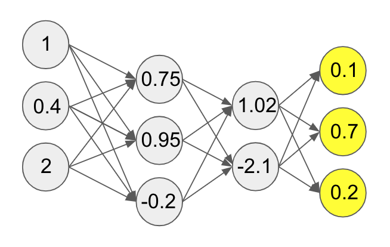

This set of computations through the layers of our network is called the forward pass. Now we finally see why these are called feedforward
networks: we are **feeding** values **forward** through the network.

One important note on hidden layers and compute units per layer of a neural network. In general, the number of layers
and the number of units are both hyperparameters that we can adjust as necessary to achieve the best generalization error in our network.

## Backpropagating Errors

These computations are all nice and good if our network
predicts the right value for a given input. However, it seems pretty unlikely that if our weights were randomly chosen that our model would know to predict
the right value.

So what's missing? It turns out our feedforward pass is only half the story. We have said nothing about how to actually train the model
using our data. Let's assume that during our forward pass our neural network made a mistake and instead predicted a **cat**:

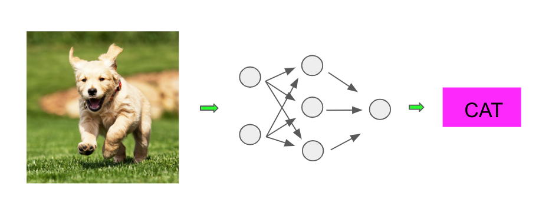

It turns out that though our network made a mistake, we can still compute a cost for the values that our network computed. Intuitively it seems
that if our network predicted $(0.35, 0.45, 0.2)$ for **(dog, cat, neither)** that is *less wrong* than if it had predicted $(0.1, 0.8, 0.1)$.

So we can formally associate a value for this level of *wrongness* using a cost function, similar to what we did previously with models such as linear regression. We will discuss some details about the possible cost functions we can use for different tasks in later posts.

For now let's assume the cost calculated is 5. Neural networks as we have defined have a special property called **differentiability**, which
means we can compute derivatives of the cost function with respect to all the weights. Woah, that was a mouthful.

We won't
go into the nitty-gritty details, but let's take the weights of the the first compute unit of the final layer (of the neural network in our running example). We can compute gradients indicating how much we should update these weights to get closer to predicting the right value (thereby lowering the value of the cost function).

Below, the gradient of the first unit with respect to the weights in the preceding layer flow backwards. This is indicated by the red arrows:

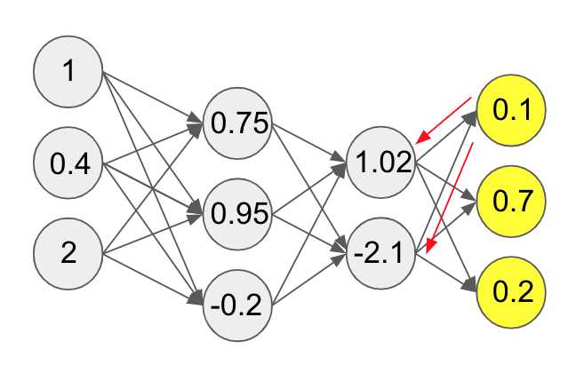

Once we have these gradients, we update the weights as necessary. Notice how here the end result is being used to send information backward in the network.
This backward flow of signal is called **backpropagation**.

It turns out we can compute these gradients for all the weights in a given layer.
Once we have computed the gradients and updated the weights in the last layer, we compute the derivatives and update the weights in the second layer.

We can continue this all the way to the first layer. These backpropagation updates are
done using gradient descent. In practice, we update all the weights in the entire network for some number of iterations until our cost function decreases
as much as we would like.

## Final Thoughts

This concludes our (hopefully) gentle introduction to feedforward neural networks. While they may be the most vanilla
networks, in practice feedforward networks can be successfully applied on many regression and classification tasks. Though we used the example of image classification,
we can apply feedforward networks to many other problem domains.

In general, the compute units in neural network hidden
layers learn many powerful representations of the data during training.
In the next lessons we will be building out some of the details of neural network theory.

*Shameless Pitch Alert: If you're interested in practicing MLOps, data science, and data engineering concepts, check out [Confetti AI](https://www.confetti.ai/?utm_source=personal-blog&utm_medium=web&utm_campaign=deep-dive-into-neural-networks) the premier educational machine learning platform used by students at Harvard, Stanford, Berkeley, and more!*
