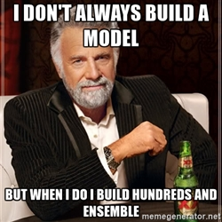
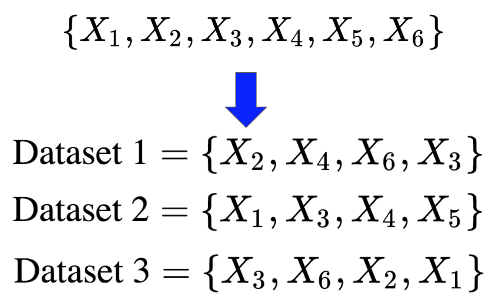
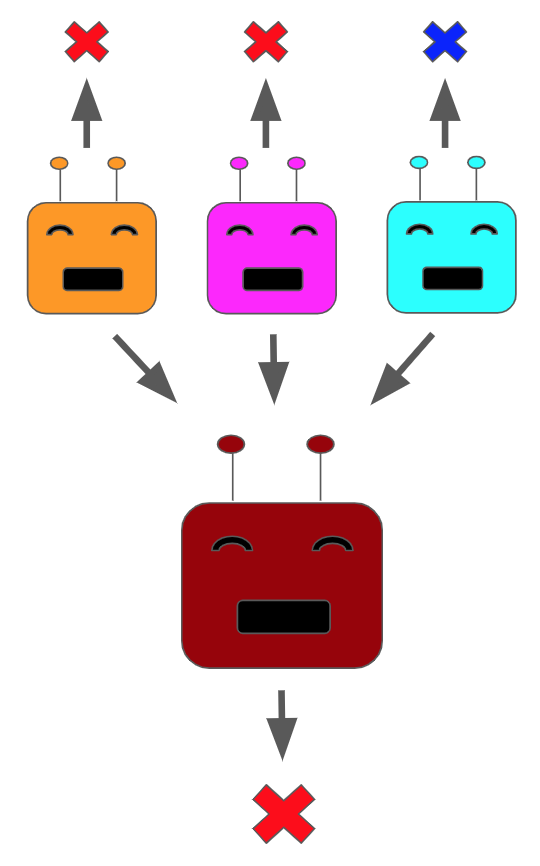
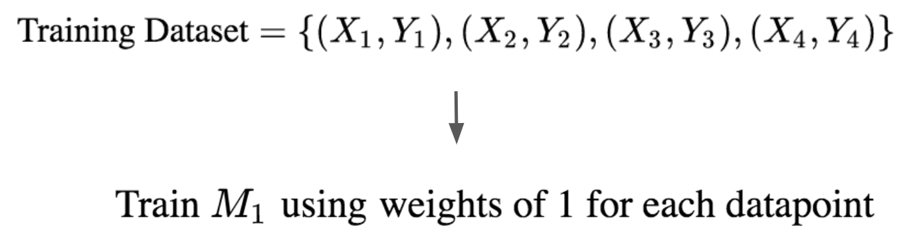
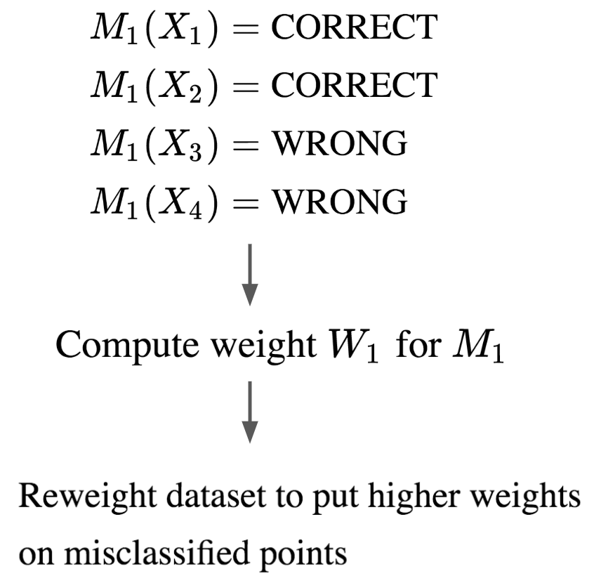
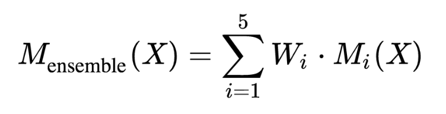

<figure>
    
    <figcaption>Source: Analytics Vidhya</figcaption>
</figure>

As its name suggests, the core idea of **ensembling** is about combining a collection of models
to get a more performant model. This is analogous to the idea of combining individual
musical instruments to get an orchestral ensemble of harmonious sounds. This lesson will be about how we can
achieve that harmonious sound in machine learning 🙂.

Ensembling is an extremely powerful technique
and is often a surefire way to squeeze out a few percentage points of performance on any task you tackle.

For example, the winning entries of the Netflix challenge in 2007 were all sophisticated ensembled systems.
Ensembling often can either help us get a more performant model or help address issues of overfitting by
reducing our model variance.

## Put the Model in the Bag

The first technique for ensembling we will study is called **bagging** or **b**ootstrap **agg**gregat**ing**.
How does it actually work?

Say we have a dataset containing **N** datapoints. Traditionally, we would train a single model
on this dataset, using some type of dataset splitting or cross-validation to assess the model's generalization error.

With bagging, we take our dataset and generate **K** bootstrapped smaller datasets by randomly sampling some number **M** of datapoints with replacement from the original dataset. Phew that was a mouthful!

Let's take a concrete example to illustrate our point. Assume we have a dataset
consisting of $N=6$ points and we want to generate $K=3$ smaller datasets with $M=4$ points each. That would look as follows:

Note that because we are randomly sampling *with replacement*, points may be repeated in the smaller datasets. These smaller datasets are called **bootstrapped datasets**.

Now we train a separate model per bootstrapped dataset. When we are done we will have a mega model. When we want to label a new input,
we run it through each of the models trained on the bootstrapped datasets, called **bootstrapped models**. We then average their outputs.

In the case of classification, we can simply take the majority label output by the bootstrapped models.

In the case of regression, we can numerically average the bootstrapped models' outputs. An ensemble of three bootstrapped classification models with their predictions being aggregated would look as follows:

For some high-level intuition about bagging, consider that
by having each bootstrapped model learn using datapoints that are a subset of the total dataset, we allow for each model to learn
some statistical regularities without overemphasizing any particular behavior.

In other words, by having many small models
we cast a wider net in capturing the full dataset behavior. Bagging is often employed with decision trees, though it can be
applied to any model class.

## Getting a Boost

**Boosting** is a very different flavor of ensembling that is also extremely powerful. Many different boosting algorithms have
been developed, though here we will focus on one of the more canonical techniques: **adaboost**. As with bagging, boosting involves training a collection of models on a dataset, though the exact procedure is very different.

Let's describe the procedure through a concrete example. Assume we have 4 points in our training dataset, and we are building a model for a binary classification task.

We start off by associating a numerical weight with
each of the datapoints and use the weighted dataset to train a model. Let's call this trained model $M_1$. Note the weights begin with the same value, which we will just set to 1 for now. This looks as follows:

Next we compute how many of the datapoints our model miscalculated. This miscalculation error is used to associate a weight
for the entire model $M_1$, which we will call $W_1$.

Furthermore, we now update all the weights on the dataset, upweighting those which were
mispredicted and downweighting the others. This looks as follows:

We now use this newly weighted dataset to train a fresh model $M_2$. This is then used to compute a new weight for $M_2$, which we will call $W_2$.

We continue this procedure of reweighting the dataset, training a new model, and then using the prediction error to associate a model weight.

Let's say we run this for 5 iterations. At the end, when we are predicting for a new input $X$, we take the predictions of our models $M_1$, ..., $M_5$ and form a majority vote as follows:

In practice, the weights determined for the models tend to favor those models which were more accurate classifiers
on the dataset. When we are building our initial "naive" models in the early stages of boosting, we are perfectly okay
with training underperformant models.

In fact, that is what makes boosting such a beautiful and elegant technique: it demonstrates
that you can take a collection of weak models and combine them to form a strong model.

Additionally, because we are training multiple models on effectively diverse datasets, we tend to reduce
overfitting in our final boosted model.

## Random Forests

We will now very briefly spend some time discussing a concrete ensembled model that is one of the best go-to models to employ
for new tasks. This technique is called **random forests**, and it is an ensembling strategy for decision trees.

Random forests are often used to address overfitting that can happen in trees. It does this by performing a type of **feature bagging**. What this means is that during the procedure, we train individual trees on bootstrapped subsets of the data as in traditional bagging.

However, the trees that are created only use a random subset of the total feature set when they are being built. Recall that this is different from
how trees are traditionally built, where during building we consider the full set of features for each split. Using a subset of the features at each split has the effect of even more strictly decorrelating the trees across the smaller datasets.

At the end, the new trees are combined as in normal bagging to form our mega model. Random forest are very nice models because they get the expressive power of decision trees but combat the high variance that trees are susceptible to.

## Final Thoughts

We will end this lesson with a few additional notes. While ensembling is very powerful, it can be a very costly operation. This is because
oftentimes in ensembling techniques we must train many models on a given dataset.

Because of this ensembling is often only used when you are trying to squeeze
out a bit more performance on a certain problem. That being said, it is a fantastic technique for reducing overfitting in models.