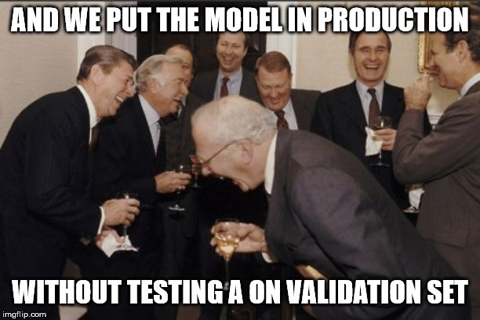
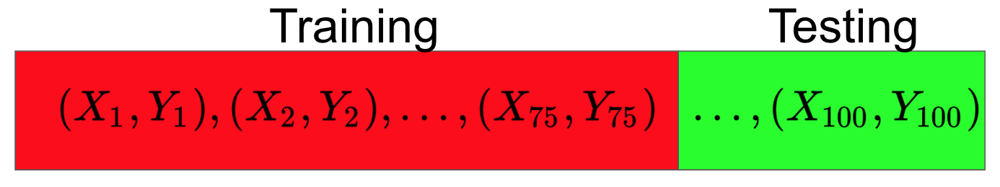

<figure>
    
    <figcaption>Source: Towards Data Science</figcaption>
</figure>

In this post, we are going to be continuing our discussion of practical machine learning
principles, specifically as they pertain to the details of **model selection**. This selection is often done by assessing the generalization error of a model as compared to other models.

Note that in this lesson, we are making *no assumptions* about the particular model
class we are dealing with, how many features, etc. In fact, the principles we will discuss could be applied to a collection
comprised of diverse model classes such as logistic regression, support vector machines, neural networks, and anything else.

For this lesson, we are more concerned with how we can use the
data we have and the models we have built to pick the best one, irrespective of model specifics. So let's get to it!

## Motivations

Let's imagine that we have a classification dataset consisting of 100 datapoints and their associated labels. We want to pick the best
model from among a support vector machine and a logistic regression to use.

One seemingly reasonable place to start is to take the support vector machine, train it on the entire dataset, and once it is trained
see how many errors it makes on the original 100 datapoints it was trained on.

We could then do the same for the logistic regression, and then at the end compare the number of errors each model makes. Perhaps the support vector machine
makes 10 incorrect classifications and the logistic regression makes 13, so we pick the support vector machine.

While this may seem like a reasonable way to model select, it is actually **very flawed**. Why?

It turns out when we are building a performant machine learning model, we are really most interested in the model's **generalization** ability. Recall that this refers to the model's error when tested
on data it has **never seen** before.

We don't actually care how the model
performs on data it has been trained on because that will just encourage selection of the model
that *overfits on the training data* the most. As we saw in our discussion on the bias-variance tradeoff, such a model could completely misrepresent the true nature of the data we are analyzing in our problem. So what do we do to combat this issue?      

## Fixing Model Selection

Imagine that instead of using the full 100 datapoints we have for training our models,
we randomly select 75 of them to be our training set and the remaining 25 to be our testing set.

Now, as expected, we only train each of our models using the training set, and then we evaluate each of them **just once** on the testing
set, **once we have completed training**. The error that each model incurs on the testing set will then determine which model we
pick.

This strategy avoids our problem from before and also gives us a much more reasonable means of assessing model generalization error.
In practice, when we use this **held-out-test-set** strategy, we will typically hold out anywhere from $10-30\%$ of our data set for
testing purposes.

Another common strategy that is used is to split up your dataset into three sets: training set, validation set, and testing set.

Using this type of division, we would train on our training set and use the validation set to get some sense for the generalization error
of our models. Then finally, once we selected the model that performed best on the validation set, we would evaluate it once on the testing set to get an absolute value for the model's performance.

This is often the strategy that is employed during machine learning competitions, where
the training and validation sets of some data is released, and the testing set is not even given to the competitors.

Instead, once a competitor wants to submit their best performing model, they submit it and then the model's score is the error it incurs on the hidden
testing set.

## Dealing With Data Sparsity

What is the issue with these schemes for evaluating a model? Notice that when we are splitting up our dataset into a training/testing set for example,
we are basically deciding that the testing set will not be used at all, except for evaluation at the end. In a sense, we are almost throwing away some
of our data which we can't use to train our model.

But there are many domains where data collection is very expensive, such as medical imaging. Imagine if our entire dataset
consisted of 10 examples! Could we really afford to train a model using 8 or fewer data points?  To do so would negatively impact
how good of a model we could train.

In this way, the schemes we have discussed are perfectly valid *when* we have a lot of data to spare. So is model
selection doomed without sufficient data? Thankfully there is another very commonly used method called **k-fold cross-validation** that
resolves our problem.

The way k-fold cross-validation works is by splitting up our dataset into some number of equally-sized partitions called **folds**. Let's make
this concrete by assuming we are using 4 folds. This means we are going to train and evaluate each model 4 times.

During the first iteration, we are going to take the first fold as follows:

That first fold will function as our testing set. In other words, we will train on all of the remaining data, **except** that first fold, and then at the end test our model on that fold. This will give us some error that we will call $E_1$.

In the second iteration, we take the second fold of our data as follows:

and again train on all the data *except* that second fold. At the end of training, we then test on that second fold, giving us a new error: $E_2$. We then repeat this for the remaining folds:

Training on all but the third fold and then testing on the third fold

give us an error $E_3$. And finally repeating for the fourth fold

give us an error $E_4$.

Once we have tested on all the 4 folds, we compute the final generalization
error of our model as the average of $E_1$, $E_2$, $E_3$, and $E_4$.

One important note is that each fold is an independent run, where we train a new model *from scratch*.
This means no model weights are transferred between folds.

In practice, we can use as many folds as we want, depending on the size of our dataset.
In situations of extreme data sparsity, we can even use what is called **leave-one-out cross validation**.

This is a special case of cross-validation, where each fold is literally a single datapoint! So during one iteration of training,
we train on all but one datapoint, and then test on that datapoint. Notice that this strategy would
use $n$ folds where $n$ is the number of points in our dataset.

However, for most use cases using anywhere from **$5-10$ folds** is often reasonable, and can give us a sufficient
sense for the generalization error of a given model.

K-fold cross-validation is a nice solution to our original problem, but it also has its downsides. In particular, when we use k-fold cross-validation we have to actually train and evaluate our system using each of the folds.

Training and testing for each of the folds can be a very computationally expensive operation, which means that model selection can take very long. It then becomes very important to pick a reasonable number of folds (a good number but not too many) when you are performing cross-validaton.

## Final Thoughts

As we finish up this lesson, keep in mind that all these model evaluation and selection algorithms are used
extensively in practice. It is basically guaranteed that anytime you are building a new model, you will inevitably
employ one of these techniques. Which technique you use will depend on your data and problem characteristics, so remember
to be flexible to all the options.

*Shameless Pitch Alert: If you're interested in practicing MLOps, data science, and data engineering concepts, check out [Confetti AI](https://www.confetti.ai/?utm_source=personal-blog&utm_medium=web&utm_campaign=machine-learning-model-selection) the premier educational machine learning platform used by students at Harvard, Stanford, Berkeley, and more!*
