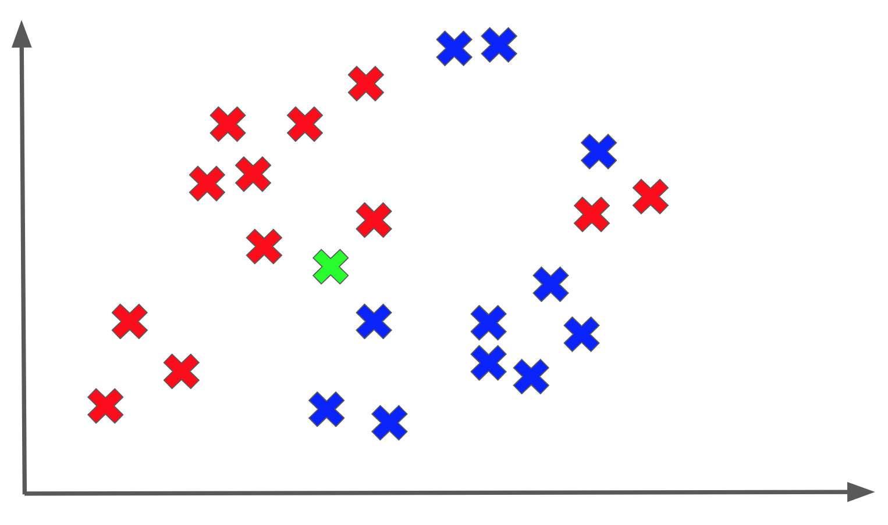
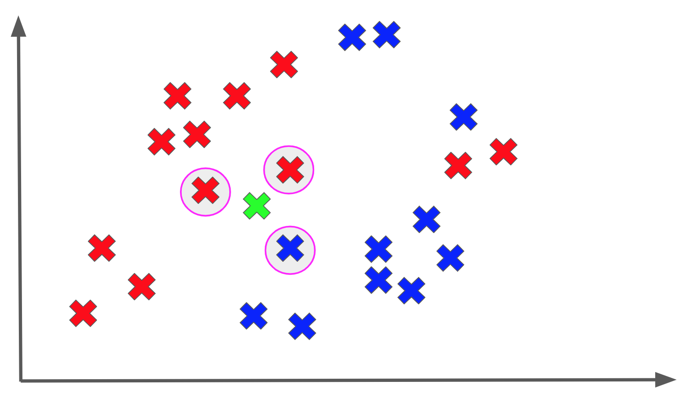
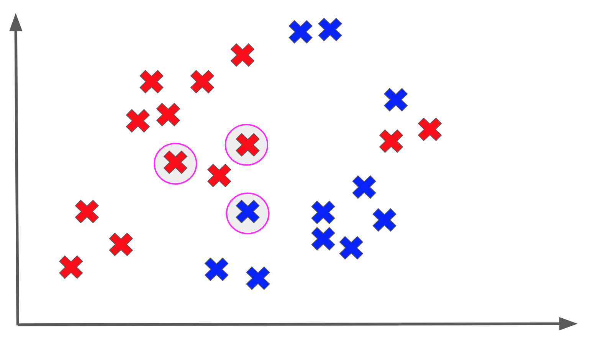

<figure>
    
</figure>

In this post, we are going to study an interesting flavor of supervised learning models known as **k-nearest neighbors**.

K-nearest neighbors is a bit of an outlier among models since it doesn't formally have a training procedure! Because of this, it is
a relatively straightforward model to explain and implement.

## The Model

K-nearest neighbors works as follows: assume we receive a new datapoint, $P$, that we are trying to predict an output for. To compute the output for this point, we find some number
of datapoints in the training set that are closest to $P$, and we assign the majority label of its neighbors to $P$.

Woah, that was a mouthful! Let's break this down with a diagram. Assume we are dealing with a binary classification task, and we are trying to predict a label
for an unknown $P$ (shown in GREEN) as follows:

Let's say we use the **3 nearest neighbors** to classify our unknown point:

Among the 3 nearest neighbors of $P$, the majority output is a red X, so we assign the RED label to $P$:

And that's basically k-nearest neighbors in a nutshell! The really important thing to realize is that we are not *really* fitting a model to our data.

What I mean is that because we need to find the labels of a point's nearest neighbors when we are trying to classify it, we actually need to *always* keep track of *all* of our training data.

Typically when we are training a supervised model, we understand that the training process may take a lot more time than the testing process, which is the point where
we release a model to the wild to predict outputs for new points.

In fact, we hope that will be the case because training is always something that we expect will be done before deployment on our own time, and then the testing becomes important when we deploy the new model to the real world.

However, k-nearest neighbors turns that intuition upside down. Training time is **basically 0**, except perhaps for the cost of storing our training set somewhere.
In exchange, testing time is actually quite substantial because for each new point, we need to find the nearest neighbors to it. This literally requires
computing the distance from our point to every single point in the training set *every time*. This could take **a long time** if our training set is large.

## Some Mechanics

While k-nearest neighbors is a relatively straightforward model, there are still a few details worth discussing with regards to how it is used in practice.

First off, we should discuss what distance metric we use for determining proximity of neighbors. In practice, when we are computing the distance between
two points, we tend to use an $L_2$ (also known as *Euclidean*) distance, although other distance metrics such as $L_1$ (also known as *Manhattan*) can be used.

Given two points $U = (U_1, U_2, ..., U_n)$ and $V = (V_1, V_2, ..., V_n)$ these distance are defined as follows:

$$
L_2(U, V) = \sqrt{(U_1 - V_1)^2 + ... + (U_n - V_n)^2}
$$
$$
L_1(U, V) = |(U_1 - V_1)| + ... + |(U_n - V_n)|
$$

The distance metric chosen often depends on the nature of our data as well as our learning task, but $L_2$ is an often used default.

Another detail worth discussing is what the optimal choice of $k$, namely the number of neighbors we use, is. In practice, using a smaller number of neighbors, such as $k=1$, makes for a model that can may *overfit* because it will be very sensitive to the labels of its closest neighbors.

We have discussed overfitting in greater detail [in previous posts](/posts/bias-variance-tradeoff/).
As we increase the number of neighbors, we tend to have a smoother, more robust model
on new data points. However, the ideal value of $k$ really depends on the problem and the data, and this is typically a quantity we tune as necessary.

## Final Thoughts

K-nearest neighbors is a unique model because it requires you to keep track of <Ital txt="all"/> your training data *all* the time. It is conceptually simple and data-intensive. As a result, it is often used as a baseline model in problems with small to moderate-sized datasets.

Furthermore, while we used a classification example to motivate the algorithm, in practice k-nearest neighbors can be applied to both classification *and* regression.