In this post, we are going to learn about Venus, my deep learning computer and how I built it. More specifically, I will describe how I went from a collection of hardware parts:

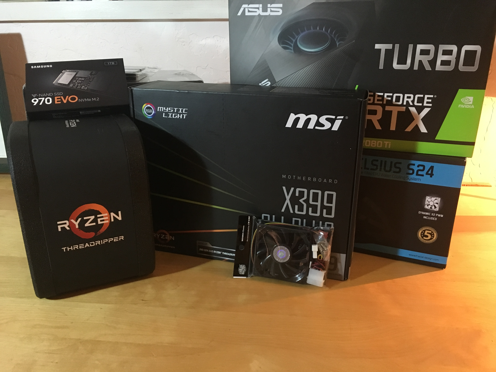

to a functional system, running Ubuntu 18.04 and able to train GPU-accelerated deep learning architectures:

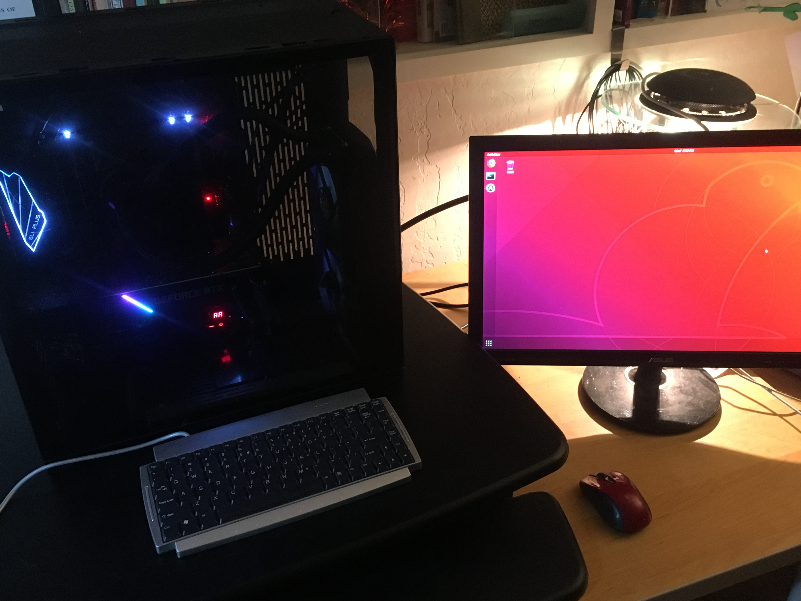

Along the way, I will describe at a high-level what each hardware component of a computer does and how I navigated the landscape of selecting parts for a functional build.

TODO (mihail): ADD NAVIGATABLE MENU ITEMS
TODO (mihail): Add more emojis


## A Brief Introduction

While there are numerous build descriptions out there showing how people constructed their own deep learning rigs, as I went about consulting some of them, I often felt there was some crucial component missing. As you start on your build journey, it's easy to get mired in the weeds of hardware terminology. Should I pick an M.2 SSD or will SATA suffice? Can I get away with HDD? How many PCIe x16 slots do I need? Should I pick DDR4-3000 or DDR4-2400 memory? 2080Ti or 1080Ti GPU? All this lingo can be very overwhelming especially for newcomers to hardware. 

But before we start name-dropping so that we sound smart, let's get our bearings. You're here reading this because you care about deep learning, right? So what is the backbone of any deep learning architecture?

Allow me to drastically oversimplify for a moment. At the core of every deep learning model there is roughly the following loop:

```
dataset = TrickyDataset()
model = AwesomeModel()
for datapoint in dataset:
  processed = process(datapoint)
  loss = model.forward(processed)
  loss.backward()
  model.update()
```

But what about the train dataset and the validation dataset?? What about your number of epochs?! What about your optimization algorithm?!? 

Yes, yes I know. It's a deliberate simplification to illustrate what is at the core of most deep learning models (and in a sense modern AI by extension). Putting aside the fluff for now, as deep learning whisperers this is our bread and butter. This loop will be our motivation through this post, guiding our discussion.

My goal in this post is certainly to describe what each computer hardware components means and is responsible for. But more importantly, I want to explain how they fit into the framework of what we really care about building: a functional and efficient system for training diverse models. Without that context, we might as well be throwing together random parts with no real aim in mind. Builds happen for a reason (deep...), and they bring with them various tradeoffs based on circumstances. Since we are in the business of deep learning, that end goal will be our North Star. 

With that in mind, we will come back to this simplistic deep learning procedure often throughout this post.

## A Hardware Odyssey

Now that the intro is out of the way, let's dive into the first major part of a build: picking the parts. As you read this section, keep in mind that there are *many* different combinations of parts that could all lead to completely functional and durable builds. To a first approximation, many of the parts are swappable (which is truly one of the marvels of computer architecture design). However there are some components that are fairly coupled to each other (more on that later...). To weed out any incompatilities in the parts you pick, I highly recommend browsing and constructing your build via [PCPartPicker](https://pcpartpicker.com/). 

Typically a deep learning build will consist of the following components: CPU, GPU, motherboard, RAM, disk storage, computer case, power supply, and a CPU (and optionally GPU) cooler. So let's dive into each of these pieces and learn some terminology along the way!

### CPU

The CPU or central processing unit (also referred to as a *processor*) is one of the compute workhorses of any machine. In fact, it is one of the central components (yes names make sense some times). A computer can exist and function perfectly well without a GPU. In fact, most common consumer machines do. However, a machine **can not** exist without its CPU. You can play sports without chiselled abs, but you can't play without a heart!

At its core (:D), the CPU is responsible for taking instructions from an application and performing computations. These instructions are typically fetched from a computer's RAM.

You'll often see the performance of a CPU measured in terms of its clock speed which is the 2.4GHz (or whatever) you'll see on a CPU's product description. This roughly determines the number of instructions the CPU can perform per second and influences how quickly it can process a set of instructions. 

Nowadays modern CPUs have been built to contain multiple of what are called *cores*. A core effectively is a self-contained processing unit within a CPU that can handle an independent task. Thus if you have 4-cores, your CPU can in principle handle four independent tasks simultaneously which clearly can speed up its computing output.

Another neat bit of technology that can also speed up your CPU is *threading*. This refers to the process of taking a physical core and breaking it up into a certain number of virtual cores. Thus a four-core system might have support enabled for eight threads, which allow it to boost the number of simultaneous operations it can perform every second. While threads give your computer's operating system the *illusion* of multiple logical cores for a single core, in practice this is just a product of clever software and you are still bounded by the physical limitation of how many cores you have. Thus, the speedups from additional threads don't scale as linearly as additional physical cores in a CPU do.

Here we encounter our first fork in the road. In CPU-world the rough equivalent of the Window-Mac split is choosing between an Intel or an AMD processor. Serious computer enthusiasts will go to war for their choices, but I'm going to be annoyingly simplistic in my generalization. For a long time, Intel dominated the CPU market offering higher-quality, more performant chips. Nowadays, with the introduction of AMD's Ryzen and Threadripper series of chips, the playing field is a lot more level. In general, today the consensus is that AMD offers comparable CPUs for cheaper. As a comparison, the AMD Threadripper 1920x is a 3.6GHz/12-core processor going for \$250 while an Intel i9-9900K is a 3.6GHz/8-core going for ~$490.

But we're getting a bit mired in details. Let's bring it back to what we care about again. In the deep learning loop above, the CPU will be the main driving force behind any data preprocessing (tokenization of text, manipulating raw image data, etc.) in line 2. So if you want snappy preprocessing that can feed data to your GPU to munch on, you'll want a solid CPU. This is especially important to ensure that your GPU utilization is as high as it can be, namely so that there aren't any periods of time where the GPU is waiting idly for some compute tasks to show up as its doorstep from the CPU. 

The number of cores ends up being crucial here as well, as if you are processing a particularly large dataset you will want to be able to parallelize these operations, since there's only so much gain to be had from higher clock speeds. 

Now, with all that in mind, how did that manifest itself into the decision-making process for my machine? I ended up opting for the AMD Threadripper 1920x which seemed like a good bang-for-your-buck choice, with many favorable reviews online. It has a base clock rate of 3.5GHz and can go up to 4.0GHz. Additionally at 12 cores and 24 threads supported, it offers plenty of opportunity for massively parallel data processing. Also its name is particularly awesome! 😎

### RAM

Let's now discuss RAM (Random Access Memory), or *main memory* as it is often called. RAM is the address space your computer uses for all the tasks it is actively running. So when you are reading this post in a browser, the application responsible for running the browser is being held in RAM. The same goes for when you are listening to Spotify, working on an Excel spreadsheet, or loading up data for processing. Reading something from RAM is significantly faster than reading it from disk (described in the next section). By [some benchmarks](https://www.directionsmag.com/article/3794), RAM data access is on the order of nanoseconds ($10^{-9}$) while disk access is measured in milliseconds ($10^{-3}$)! 

So RAM seems like the bomb-dot-com right? Well, yes, it is but RAM brings with it a few major caveats. First off, RAM is substantially more expensive than disk per unit volume. Secondly, RAM must always be connected to power to retain its data (referred to as *volatility*). This means when you turn off your computer, everything stored in RAM is lost, which is not the case for disk. This means that RAM is not a good medium for persistent storage. 

What does the modern-day market look like for picking RAM? The most recent incarnation of RAM that people use is called *DDR4*. It now holds the throne, having usurped it from its ancestor DDR3. DDR4 boasts higher data transfer rates at lower voltages. RAM is typically named in terms of its clock cycle rating. For example, when you are purchasing DDR4 RAM, you might see it annotated as DDDR-2400 which is simply a frequency value indicating that it performs 2.4 billion cycles per second. A higher frequency value allows for faster data access and writes when the memory is interacting with the CPU. 

Bringing it back to our topic of interest, RAM is important in the deep learning capacity in two ways. First having a good amount of RAM (measured in terms of GB) is important because this is where your data will be read into before it is passed on to the CPU for processing. In fact, there's a joke in the software engineering community that any programmatic speed issue can be solved with more RAM. While this might be true, it's a pretty expensive fix!

A second way in which RAM is important is that it's clock cycle frequency determines how quickly data can be fetched or stored in the memory. In our deep learning loop above, when we call `dataset = TrickyDataset()` we are effectively loading the dataset into main memory. From there, when we are doing `for datapoint in dataset`, we are loading instances of the data from this memory for processing. If you don't have enough RAM and you are loading a big dataset, your machine may either crash or it will default to swap memory, which effectively means it is being stored on disk and is therefore much slower to interact with.

For my build I purchased 64GB of DDR4-3000 RAM (stored as separate sticks of 16GB), though of course you should adjust this to meet your needs. This is quite a bit bigger than the 16GB of RAM that often come with higher end consumer machines. While I'm not a huge fan of brute-force hardware workarounds for inefficient software, it's nice to have that option.

### Disk Storage

Now let's talk about disk storage. As mentioned previously, disk is your machines persistent storage. When you save files on your computer, theses are saved to disk for obvious reasons. Imagine if you lost all your files when you turned off your computer! 🤬

There are two primary types of disk storage. Hard drive disks (or HDD) are disks that consist of moving physical parts. They are fairly old-school and big, consisting of a spinning disk with a header that reads/writes data off of it. 

On the other hand, solid state drives (or SSD) do not have moving parts. They are flash-based, faster, smaller, and more expensive than HDDs. Within the world of SSDs, there is another major factor to consider when choosing what type of component to buy. It turns out there are two different methods a PC can use to read data from an SSD: SATA 3 and NVMe. SATA 3 involves actually connecting a data/power cable into your motherboard whereas the NVMe protocol involves connecting to a PCIe slot on the board. 

Ok, what are all the practical implications of these different terms? Some benchmarks cite that HDDs can sustain an average of 80-160 MB/second of data read/write speeds, SATA 3 SSDs about 550 MB/second, and NVMe SSD up to 3500 MB/second. Those are pretty large differences!

There's one other small piece of terminology to be aware of. You'll sometimes see the term M.2 SSDs. This simply refers to the form factor of the SSD (the physical shape of the hardware component), and hence you can have M.2 SSDs that use either the SATA 3 or NVMe protocols. 

Now, what does this all mean for deep learning systems. The disk storage can determine how quickly your system boots up, if that's where you have allocated your operating system. Additionally, since your datasets for training will always reside on some flavor of disk storage, picking HDD/SATA 3 SSD/NVMe SSD can drastically influence how quickly your data can be loaded into RAM (the `dataset = TrickyDataset()` line in our loop above). 

One point that's worth bringing up: you might think that since your datasets may be able to lie entirely in main memory, the choice of disk storage is not as important, since any latency this incurs is only a one-time cost. That is not entirely true, because in the event that your dataset can not be loaded entirely into RAM (which is often the cast for huge datasets), you will have to process it lazily by continuously reading from disk. In these situations, your choice of disk type is much more significant.

With all that in mind, when it come to choosing a disk storage option, I decided to go for a 1 TB M.2 NVMe SSD. This will allow me to load any (potentially large) datasets I use very quickly for model training.


### GPU

And now we get to the main workhorse of any deep learning build: the GPU (or graphical processing unit). One thing that's worth mentioning before we dive into GPU details, is that no part of a deep learning train loop strictly requires a GPU. You can certainly get away with training systems using nothing but a CPU. However, the nature of deep learning architectures makes them especially amenable to GPU computation workloads. For example by [some benchmarks](https://medium.com/@andriylazorenko/tensorflow-performance-test-cpu-vs-gpu-79fcd39170c), using a GPU can speed up model training times by over 10x as compared to a CPU. That's the difference between training a model in a day and 1.5 *weeks*!

Now that you're hopefully very committed to supplementing your deep learning build with a solid GPU, let's dive deeply into some considerations. There are a several things that impact a GPU's performance: the number of tensor cores it has, its memory bandwidth, the amount of GPU memory it has, and whether it has 16-bit capabilities. 

The number of tensor cores roughly correlates to the GPU's raw processing power, namely how many operations it can compute every second. The  memory bandwidth determines how quickly data can be transferred to the GPU for processing. The amount of memory is like the GPU's equivalent of RAM, namely how much space the GPU has for performing CUDA operations. 16-bit capabilities are a recent addition in some GPU architectures which allow them to handle mixed-precision training. This essentially means you can represent weights and losses with 16-bit floats rather than 32-bit floats, which allows you to train larger models in shorter times.

To make it concrete, in our loop above, the GPU memory will determine whether the `model = AwesomeModel` will be able to fit entirely on the GPU. As dataset and model sizes have been on an increasing trend upwards in recent years, there is value in having a GPU with a solid amount of memory. In addition, the GPU's raw compute power will determine how quickly it can go through forward (`loss = model.forward(processed)`) and backward passes (`loss.backward()`).  

What does the space of consumer GPUs then look like? There have been some [incredibly helpful posts](https://timdettmers.com/2019/04/03/which-gpu-for-deep-learning/) benchmarking the performance of various GPUs across a number of deep learning architectures. There the RTX 2060 is shown to be the most cost-effective choice. I chose to use a RTX 2080Ti, as I wanted something with more computer firepower. In addition, at 11Gb of memory compared to the RTX2060's 6GB, I felt the RTX 2080Ti was substantially better for training many of the larger scale models that dominate modern deep learning. 

One small additional note I want to include: if you're thinking of eventually upgrading to multiple GPUs in your build, it's useful to pick a GPU with blower-style single-fan design, which essentially allows the GPU to expel hot air out of the computer case. If you have two GPUs stacked next to each other and one is expelling hot air into the other one, this can unnecessarily increase the other GPU's temperature which can hurt its performance. The Asus Turbo 2080Ti edition includes blower style fans. 

### Motherboard

The motherboard is the circuit board upon which all your other goodies sit and the medium by which all of your various components talk to each other and receive power. Motherboards come with different specifications depending on what you want and need as well as what your other hardware components are. 

First off, you want to ensure that your motherboard is compatible with your CPU. This is often expressed in terms of the *chipset* the motherboard supports in its specification. In the case of the AMD Threadripper series, you'll want to look for a motherboard that supports the X399 chipset. This is a very important detail to be mindful of!

Another important aspect of motherboards it their form factor, which roughly determines their size and hence how many slots/ports they have for various components to connect to. The largest form factor is ATX, and it will give you the most flexibility for integrating various components and upgrading your system. 

Different motherboards also support different numbers of PCIe expansion slots. PCIe is essentially an interface standard that provides slots on motherboards which can be used for connecting high-speed components like GPUs. GPUs typically are connected to PCIe x16 slots, and so if you want to include one or multiple GPUs in your system, you want to ensure there are sufficient PCIe x16 slots provided. 

Finally, motherboards also have different number of slots for attaching RAM. Depending on what you want in your system, you should make sure to check the max RAM supported on a motherboard. 

For the purposes of my build, I used an MSI X399 SLI Plus Motherboard. While I only used 64GB of RAM for my build, this motherboard supports going up to 128GB should I choose to upgrade. It supports DDR4 RAM, has sufficient M.2 slots, and provides 4 PCIe x16 slots (so up to 4 GPUs can be added).

### Cooler

A deep learning machine at peak performance will typically run pretty hot, with the GPU crunching gradients and the CPU processing data. Therefore you should make sure to pick reliable cooling solutions. You definitely want to use a separate cooler for your CPU (and optionally one for your GPU). 

Within the world of CPU cooling, you can either go with air cooling (where you are essentially just blowing fans on top of your CPU) or water cooling (where water is circulated in a loop between a heat source and a cooling radiator). Water coolers tend to be quieter and are more efficient for dissipating heat, whereas air coolers are easier to deal with and a bit larger. 

I chose to go with a water cooler, specifically the Fractal Design Celsius S24 model.

### Computer Case

The computer case will be the home for your build, so make sure you make your components comfortable. 🙂 Here it's important to ensure that your case supports your motherboard's form factor. In addition, you want to make sure that it has enough expansion slots so that you can fit as many GPUs as you want.

For my build, I used the Lian Li PC-11 Full Tower Case which provides 8 expansion slots for up to 4 GPUs. 

### Power Supply

Finally you need a decent power supply to, well, power all of the components we have been talking about. The two things to think about when picking a power supply is its max supported wattage and its efficiency rating.

As a rough heuristic for how much wattage you need for your build, consider that a typical GPU will use \~250W, a CPU will use \~200W, and other peripherals may use \~200W. 

Additionally, different power supplies have different efficiency ratings. This rating is computed as the wattage provided to the system divided by the total wattage drawn from a wall socket. So a power supply with 80\% efficiency would supply 80W for every 100W it draws. This mainly determines how much you'll be paying to provide your machine with the needed power.

There are also some more fine-grained designations for power supplies (bronze, silver, gold, etc.) that basically dictate the supplies efficiency at different load percentages. 

For my build, I may have gone a bit overkill with my power supply choice. I ended up using a 1600W EVGA SuperNova. Given that I only have a single GPU for now, this is certainly a far higher max supported wattage than I need. My saving grace here is that I do hope to expand my system in the future to handle more GPUs, so it's nice to have that leeway in what the power supply is capable of. A good power supply also can last for a very long time, so I'm sure this piece will persist across several builds.

Phew! And with that, we are officially done with our hardware odyssey. Let's get to some actual computer building!


## Fitting the Lego Blocks Together

After you've done the harder job of picking the hardware components for your system, putting the pieces together is like big-person Lego block fitting. One piece of overarching advice I have for the physical building is to *carefully* read the manuals for your various components. Some are more important than others (I read the motherboard manual page-to-page), but in general, when in doubt, consult the relevant manual.

My workflow for getting the machine roughly involved 1) setting the motherboard up outside the case 2) disassembling and prepping the case 3) mounting the motherboard and 4) connecting any relevant cables appropriately. You are, of course, not required to do it this way so do whatever makes the most sense to you.

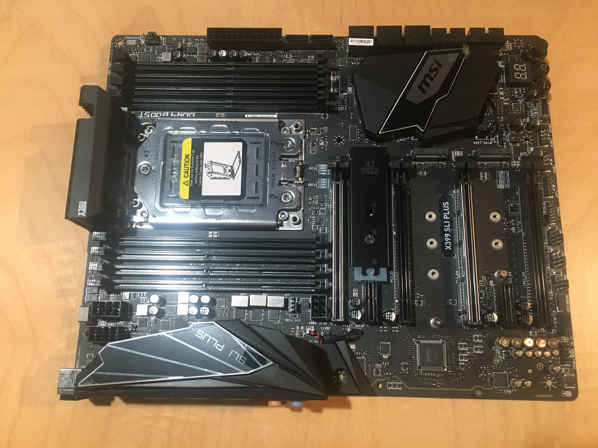

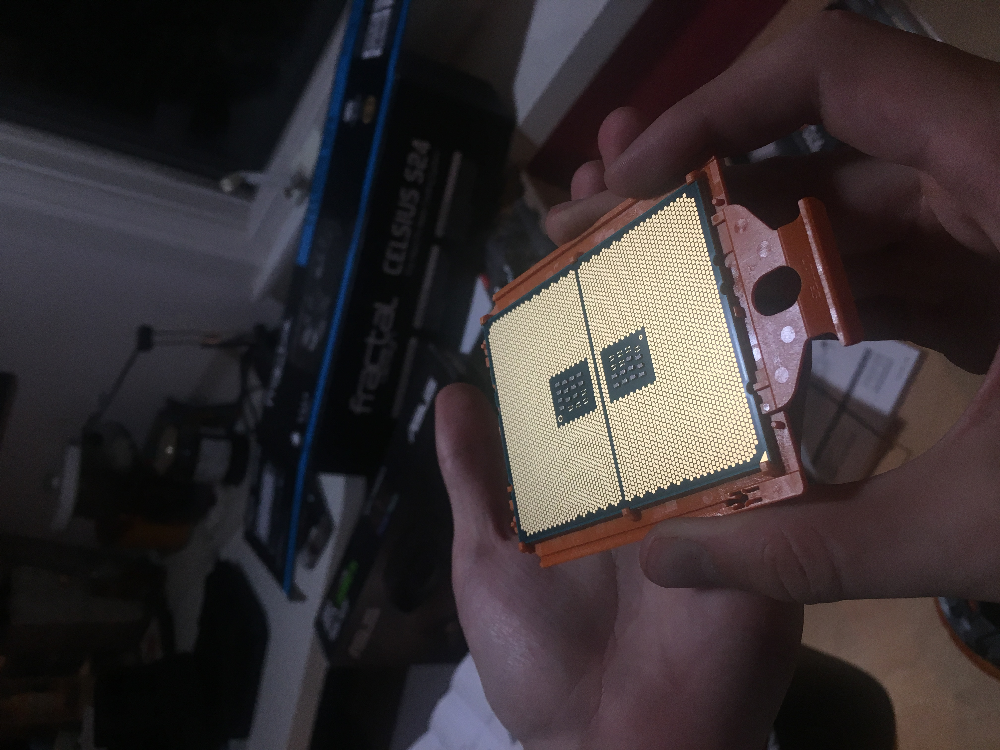

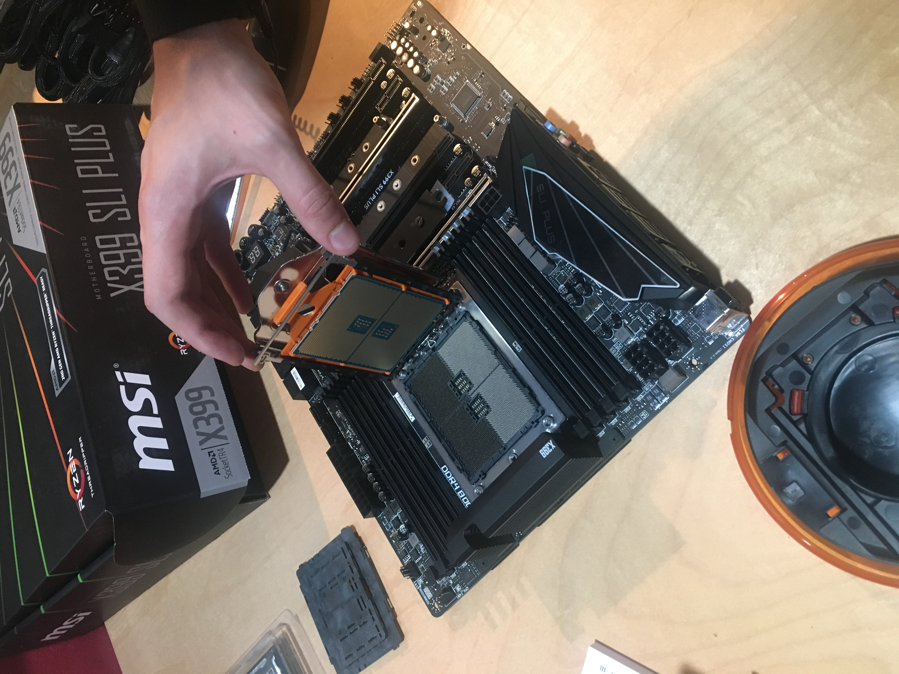

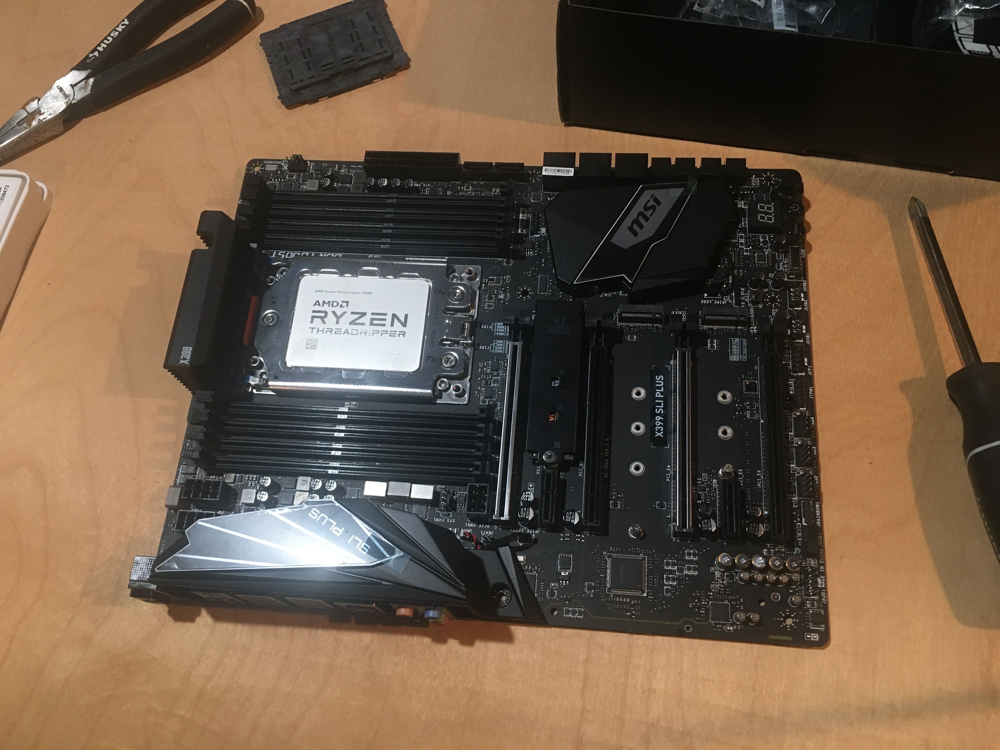

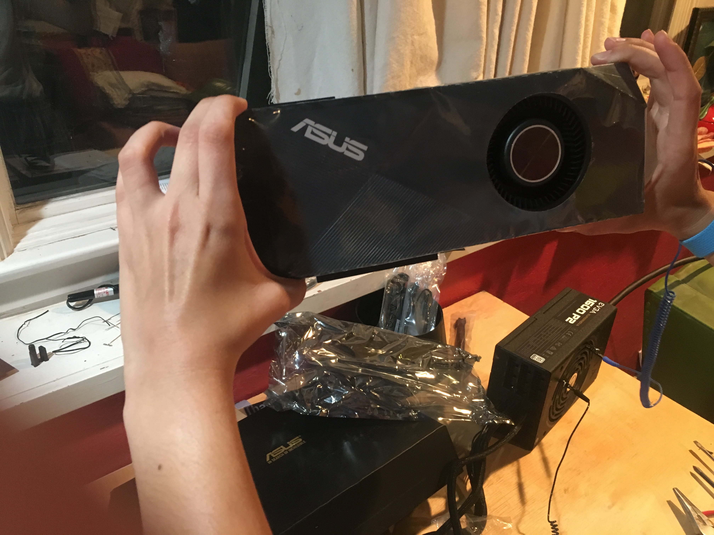


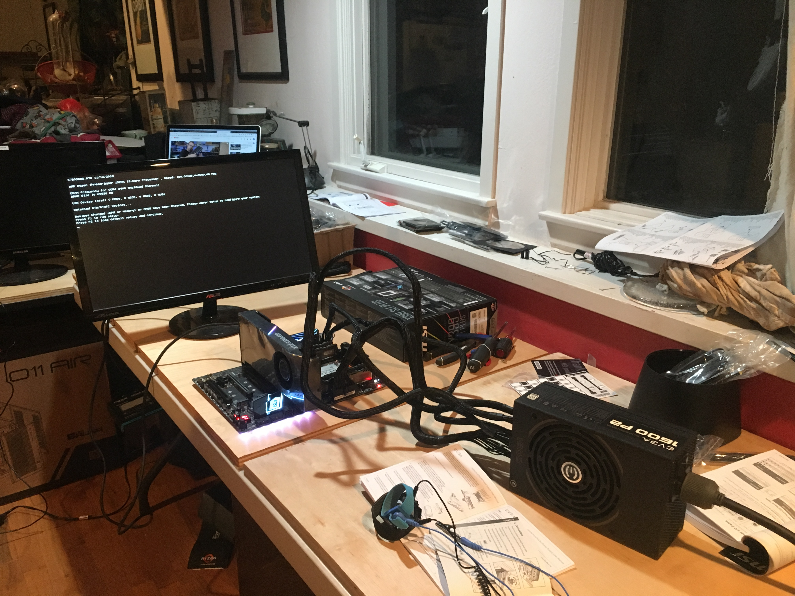

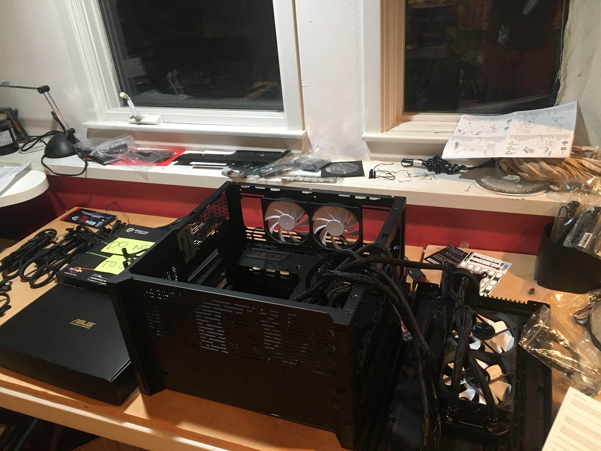

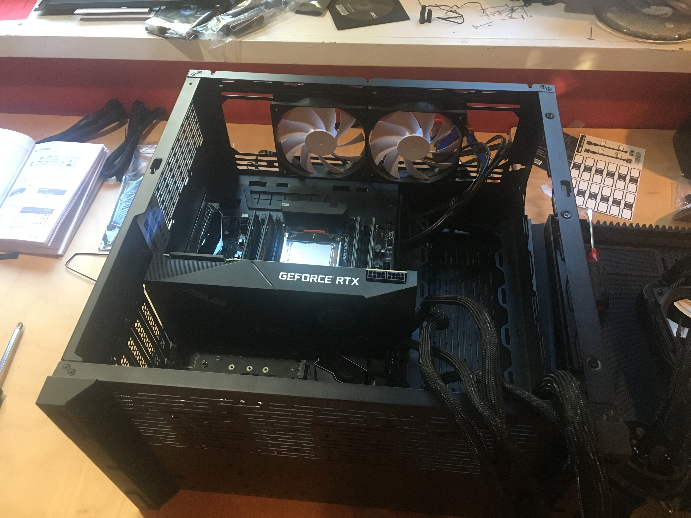

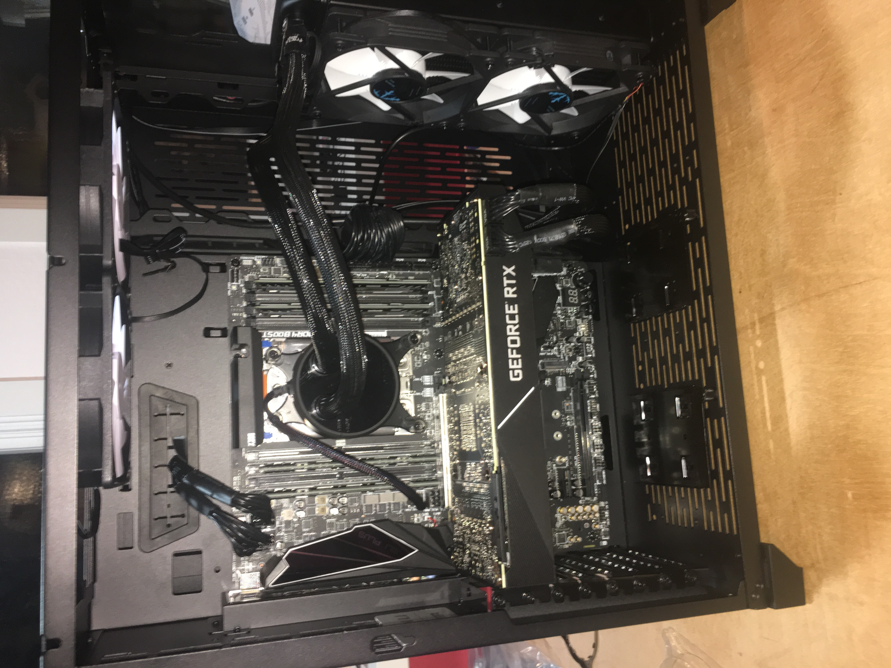

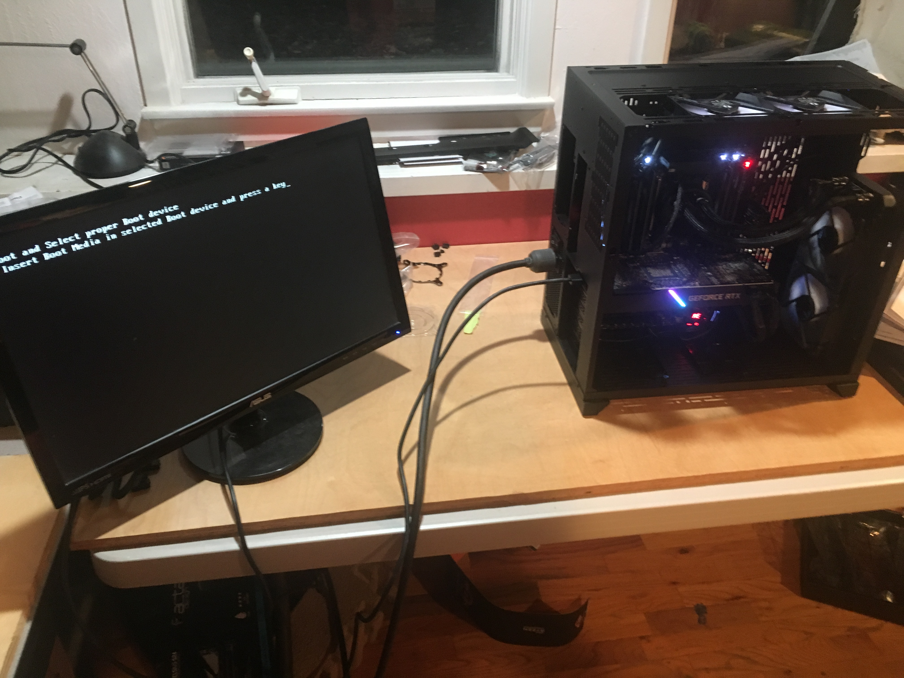


* Good lesson: do a debug setup to see the system POST

## Software Installation

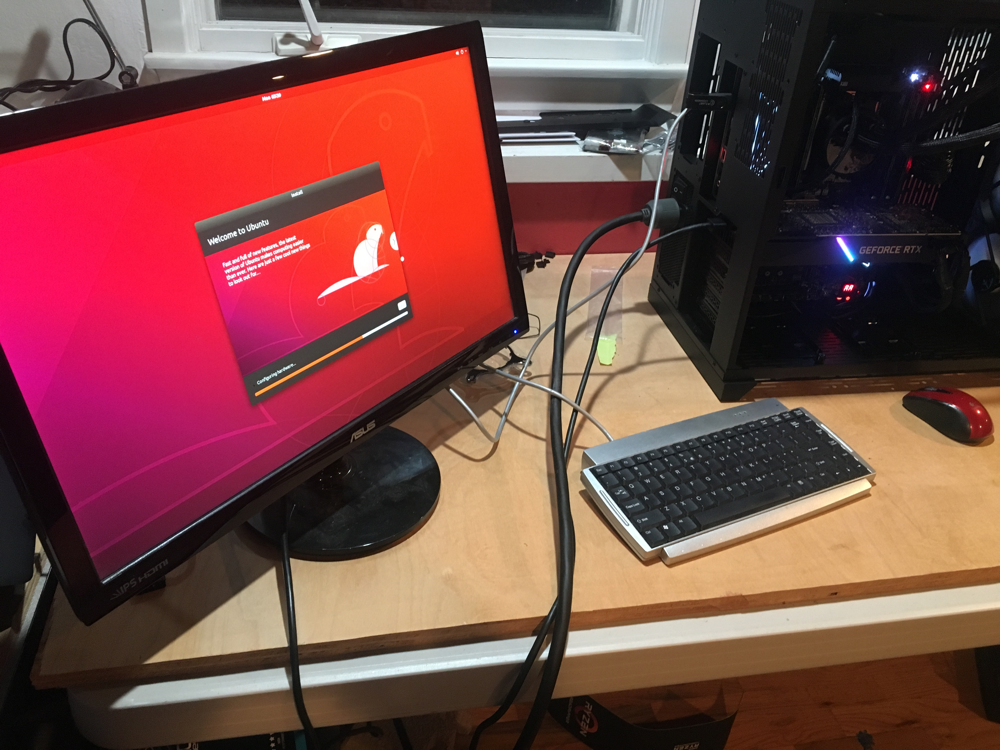


* Ubuntu installation
* Getting Nvidia drivers setup


## Benchmarking

## Why "Venus"?

Why would I name my deep learning machine, Venus? Well, around the time I began shopping for computer parts I had just come back from a trip to Florence, Italy. Florence is a truly gorgeous city home to historical artwork, including Botticelli's *The Birth of Venus*.


A truly beautiful piece. In ancient mythology Venus was claimed to have been born of a sea-foam, and in Botticelli's masterwork she is depicted as arriving to the shore on a shell after her birth.

Now around the same time I was looking around for parts, I discovered videos of Nazaré, Portugal. For those that don't know, Nazaré is a coastal town admired by surfers internationally because it boasts some of the largest waves on the planet, with some reaching upwards of 60 feet in size!


When you see [videos of waves at Nazaré](https://www.youtube.com/watch?v=Ftok14M5p8g), it is truly awe-inspiring. The sheer force, the pure might of nature crashing onto the shore, something equally frightening and enticing. 

And here is where this artistic and natural juxtaposition fascinated me. The idea that such waves, so incredible and destructive in their might could break and birth something so refined and elegant as a goddess. 

My build certainly packs a computational punch with components named *Turbo* and *ThreadRipper*. But I want the system to honor the notion that amazing things happen when power meets poise, when force meets finesse, when science meets art. 

Hence, Venus. 

Now before I continue to wax philosophical, let's wrap this post up so you can get on with your day.

* Thanks to [Sabera Talukder](https://twitter.com/SaberaTalukder) for her help with the build. 
* Thanks to other builds people wrote up (Jeff Chen + Tim Dettmers)

https://blog.slavv.com/the-1700-great-deep-learning-box-assembly-setup-and-benchmarks-148c5ebe6415

## Power supply
* 250W per GPU

## GPU
1080Ti Founder edition first
2080TI (Asus Turbo) next

## CPU
* https://www.amazon.com/gp/product/B01GUAJQ08/ref=as_li_tl?ie=UTF8&tag=slavml-20&camp=1789&creative=9325&linkCode=as2&creativeASIN=B01GUAJQ08&linkId=307562c96e03a8eb16e5a4b1860753f9

* CPU will dictate the motherboard you need
* AMD Threadripper CPU = X399 chipset motherboard, Intel 7900X CPU = X299 chipset motherboard
* AMD vs Intel CPU?
* 12 core machine


## RAM
* https://www.amazon.com/gp/product/B0134EW44S/ref=as_li_tl?ie=UTF8&tag=slavml-20&camp=1789&creative=9325&linkCode=as2&creativeASIN=B0134EW44S&linkId=c90104f2910ada98be9b61fa7a2ff43e
* DDDR4 is latest version
* DDR4-3200 memory -- 4x16Gb configuration (3200 is speed)
* you increase the speed at which memory transfers information to other components
* RAM speed measured in Megahertz to be processed with processor's clock speed
* Faster RAM speeds allow your processor to access the data stored on it quicker, giving your system a boost in processor performance
* Column Access Strobe (CAS) latency, or CL, is the delay time of your RAM receiving a command and then being able to issue it
* Those numbers indicate how many clock cycles it takes for the RAM to respond to the command

## Hard Drive
4x PCIe lanes for the M.2 SSD
NVMe SSD (3GBps, 0.02ms seek) >> SATA SSD (550 MBps, 0.2ms seek)
1 TB M.2 SSD
* SSD is flash storage and has no moving parts
* as a result are smaller and take up less space in PC case
* HDD is made of magnetic tape and has mechanical parts inside
* laptops are increasingly using M.2 SSDs because they take up less room than traditional, 2.5-inch SATA drives (M.2 shaped like stick of gum)
* determines reads/writes to disk
* If you’re reading data from a file on a disk, the processor needs to wait for the file to be read (the same goes for writing)
* Advantages of SSD
  * Boot times will be significantly reduced.
  * Launching applications will occur in a near-instant.
  * Saving and opening documents won't lag.
  * File copying and duplication speeds will improve.

## Case
* https://www.amazon.com/gp/product/B01F6U86FE/ref=as_li_tl?ie=UTF8&tag=slavml-20&camp=1789&creative=9325&linkCode=as2&creativeASIN=B01F6U86FE&linkId=262d081ec348194f087dac1485c1ee06

## Power supply
* https://www.tomshardware.co.uk/evga-supernova-1600-p2-1600w-power-supply,review-33121-10.html
* efficiency important
* PSU will use what it needs, not always max

## Cooling
* as soon as the GPU hits a temperature barrier – often 80 °C – the GPU will decrease the speed so that the temperature threshold is not breached

What are PCI lanes
* PCI: Peripheral Component Interconnect
* bus in computer is communication system that transfers data between components in computer
* bus connecting cpu and main memory is system bus
* SATA ports in modern computers, which allow a number of hard drives to be connected without the need for a card
* local bus provides very fast throughput
* PCI is a 64-bit bus, though it is usually implemented as a 32-bit bus. It can run at clock speeds of 33 or 66 MHz.
* PCI-Express: point-to-point switching connection. This means that a direct connection between two devices (nodes) on the bus is established while they are communicating with each other. Basically, while these two nodes are talking, no other device can access that path. By providing multiple direct links, such a bus can allow several devices to communicate with no chance of slowing each other down.
* x1, x4, x8, x16 determine number of data transmission lanes

* For multi-gpu builds (up to 4 gpus) --> 40-44 PCIe Lanes
* GPU would require 16 PCIe lanes to work at full capacity
* 4x PCIe lanes for Gigabit ethernet
* https://www.pugetsystems.com/labs/hpc/PCIe-X16-vs-X8-for-GPUs-when-running-cuDNN-and-Caffe-887/


## Notes
* form factor is a specification of its layout and physical dimensions
* Nvidia lowers clock rate of GPU as it gets hot
* overclocking means setting your CPU and memory to run at speeds higher than their official speed grade.
* https://hackernoon.com/how-to-create-your-own-deep-learning-rig-a-complete-hardware-guide-7cdc71e174aa