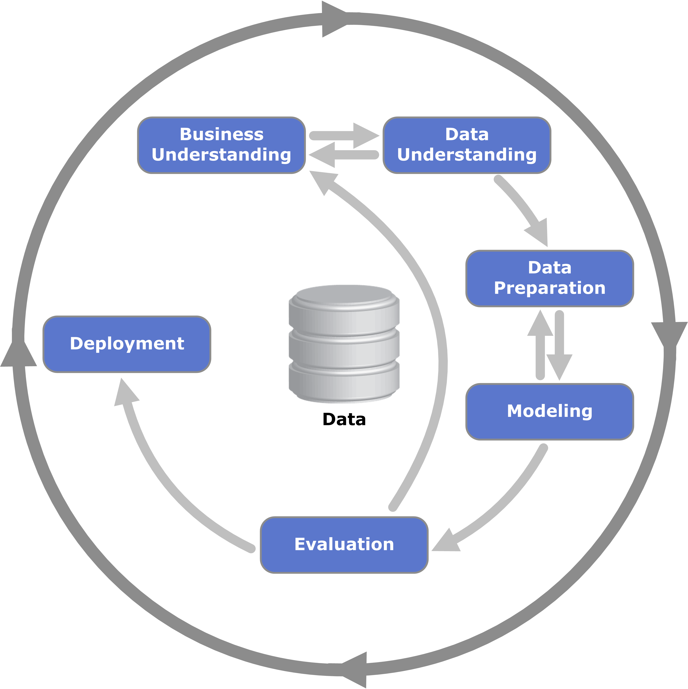
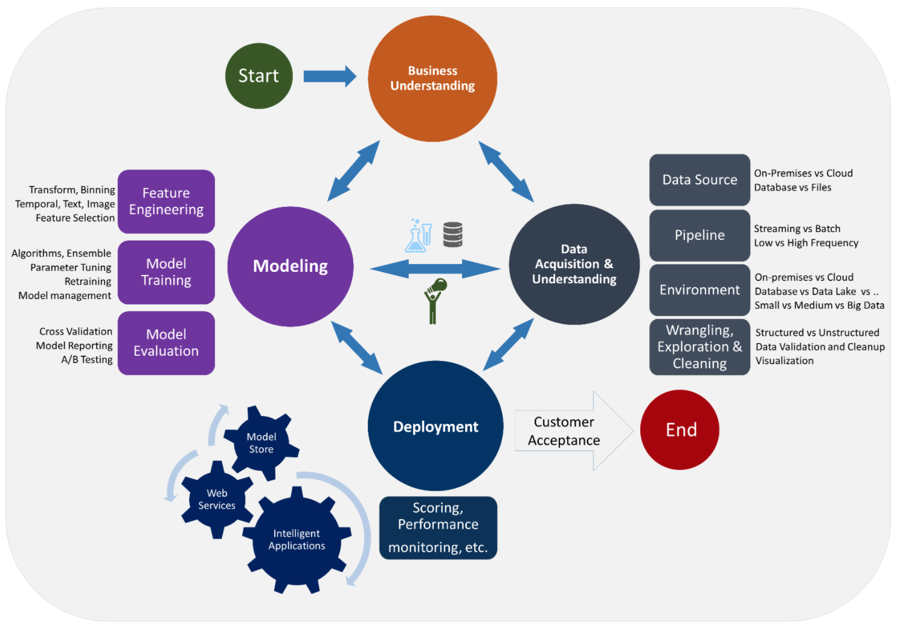

<figure>
    
</figure>

In this post, I'm going to describe what the data science life cycle is and why it's important for any organization seeking to deliver data-driven value to its business. 

But first, let's start with definitions. 

If you're not familiar with this concept, the **data science life cycle** is a formalism for the typical stages any data science project goes through from initial idea through to delivering consistent customer value. 

In this way, the data science life cycle provides a set of guidelines by which any organization can robustly and confidently deliver data-driven value in its services.

The remainder of this post will explain why the life cycle exists, how it compares to other frameworks, and also provide a detailed run-through of its steps and how you should think through them as you introduce data science into your organization.

## Why Should You Care About the Data Science Life Cycle? 

Let's begin by discussing some motivations. 

Why does the data science life cycle exist and what can it do for your team?

When data science started becoming popular in the early 2010s, organizations small and large hurried onto the band wagon motivated by [FOMO](https://en.wikipedia.org/wiki/Fear_of_missing_out). 

It was easy (and still is!) to look around you and see your peers "doing data science" and think "well, I better get on this or I'll be left in the dust."

What often happened as a consequence is that groups hired a bunch of folks claiming their expertise was in data science, plopped them in their offices, and said "do data science with our data." 

No processes. 

No accountability. 

No organizational structure to enable these individuals to actually deliver on their competencies. 

The result was [widespread disillusionment](https://www.kdnuggets.com/2018/04/why-data-scientists-leaving-jobs.html). 

It should then come as no surprise that many reports claim nearly [90% data science projects never see the light of day](https://venturebeat.com/2019/07/19/why-do-87-of-data-science-projects-never-make-it-into-production/).

Now that all the morbid stuff is out of the way, I should emphasize that there is hope! 

I do genuinely believe that data science **when done right** has the ability to revolutionize how many traditional business services and practices operate. 

[Independent studies](https://hai.stanford.edu/sites/default/files/ai_index_2019_report.pdf) have shown that there is tremendous data-driven market value to capture across diverse sectors. 

The key to unlocking this value is **doing it right**, and this is why formalisms like the data science life cycle are so important.

Data science is going through a maturation phase where many best practices for doing data science are being developed and refined. 

In this way, I believe the field is becoming less of a science (which we typically connote with crazy hair-brained experiments that will either blow up our labs or result in time travel) and more of an engineering (more associated with careful design, steady work, and iterative progress). 

The data science life cycle is crucial because it forms the core playbook for this evolved **Data Science 2.0**.

More concretely, the data science life cycle helps to answer the following questions:
- How do you avoid ad-hoc, ill-defined data science work (what some organizations call [dark art data science](https://www.dominodatalab.com/static/gfx/uploads/domino-managing-ds.pdf))?
- How do you foster a high-impact, fast-iteration, data-driven culture in your team?
- How do you make data science teams adopt effective engineering team practices?
- How can you integrate [agile software development](https://en.wikipedia.org/wiki/Agile_software_development) in your day-to-day?
- How do you actually organize a data science team in terms of roles and responsibilities (especially important for data science product managers, team leads, and organization-level chief data officers)?

## Historical Background

The idea of a data science life cycle, a standardized methodology to apply to any data science project, is not really that new. 

In fact as early as the 1990s, data scientists and business leaders from several leading data organizations proposed CRISP-DM, or Cross Industry Standard Process for Data Mining. 

CRISPR-DM was an early predecessor to today's data science life cycle, and as we'll see later it provided a very similar framework to its modern incarnation.

In the CRISPR-DM standard, a data science project consisted of the following steps:
- Business Understanding
- Data Understanding
- Data Preparation
- Modeling
- Evaluation
- Deployment

<figure>
    
</figure>

## Breaking Down the Modern Data Science Life Cycle

Let's now go into more detail about each step of the modern data science life cycle. 

To make this very concrete, let's say that we are a news aggregation website (called Readit) where news is curated and contributed by our users. 

However, not all of our users are well-intentioned and many promote news that is verifiably false. 

Sometimes this clickbaity false news ends up on our home page, and our users complain about the quality of the page, so our engagement metrics suffer.

Oh no! 

Desperate to ensure that our users don't leave Readit in droves, we hire a team of human content moderators, people whose job it is to read through submitted posts and take them down if they are false. 

This works fine for a time, but since our site is becoming so popular our moderators are struggling to keep up with the usage. 

There has to be a better way. 

Can we somehow use data to build an automated moderation solution that can flag false material?

Let's walk through what applying the data science life cycle would look like for our site's problem. Note this problem is very closely based off of [this series of blog posts](/posts/setting-up-a-machine-learning-project/).

As we go through each step, we will emphasize the step's goals and expected outputs (i.e. deliverables). 

Our analysis will be modelled off of the [team data science process](https://docs.microsoft.com/en-us/azure/machine-learning/team-data-science-process/lifecycle) spearheaded by Microsoft.

### Business Understanding

Our project begins with developing a **business understanding**. Here we will ask a number of fundamental questions:

- What are the specific business problems we want to address?
- What does our ideal solution look like (i.e. what are the outputs we want the solution to produce)?
- What metrics will we use to define *success*?
- What relevant data sources will we use (either existing or ones we have to create)?

The central idea of establishing business understanding is carving out a niche for your project. 

You want to ensure that you are not only solving an important business problem but that it is tractable to tackle it given your resources. You also want to able to clearly define what success will look like.

Many organizations flounder in this first stage because they haven't articulated what constitutes success, which comes down to well-defined business and science metrics. 

For the purposes of our Readit problem, our business understanding may look something like this:

**What are the specific business problems we want to address?**

We want to reduce the number of instances of fake news that are surfaced to our users. 

This can involve building an automated tool that can flag potentially fake news to help our moderators in doing their jobs. 

**What does our ideal solution look like (i.e. what are the outputs we want the solution to produce)?**
 
We can imagine a browser plugin that our moderators use that will automatically flag potentially fake news so they don't have to open every link. 

Here our system can produce a binary label for each link (**FAKE** or **NOT FAKE**).

**What metrics will we use to define *success*?**

From a science standpoint, we can emphasize certain metrics like accuracy of the system predictions. 

We can be even more specific and say that we want to have a very high precision system, which is aggressive on flagging potentially fake sources (low false negative rate). 

This is because we expect that our moderators will still be a final stage of human verification on the articles flagged by our system. 

From a business standpoint, we want to track how many instances of fake news are reported by our users (for the same number of human moderators). 

We can also track more high-level user engagement metrics, which we hope will go up as a consequence of integrating this system.

**What relevant data sources will we use (either existing or ones we have to create)?**

By virtue of using human moderators for some time, we hope that we've already collected a dataset of articles labelled as **FAKE**. We can leverage this dataset for training and evaluating our machine-learned model. 

If this dataset is small, we can augment it with additional samples by using crowdsourced workers through a platform like [Amazon Mechanical Turk](https://www.mturk.com/). 

By the time you are done with this stage, you want to have a clear plan in a document answering the above questions. [This](https://github.com/Azure/Azure-TDSP-ProjectTemplate/blob/master/Docs/Project/Charter.md) is a good template to check out.

### Data Acquisition and Exploration

Now that we have a sense for the overall business problem we are trying to solve, the next step is to actually acquire our dataset, explore its properties, and ingest it into a format that is ready for downstream analytics and model building.

Here we will want to address some of the following questions:

- Do we need to clean the data?
- What characteristics of the data are important and can be used for our problem?
- How can we set up the appropriate data infrastructure to enable downstream tasks?

Getting a feel for our data is crucial because this will ultimately determine if we have what we need to actually build robust data-driven solutions for our use case. 

For our Readit fake news detection, the answers may look like this:

**Do we need to clean the data?**

Since our original data source is curated by our human moderators we hope it is of reasonable quality. 

However, some of our data may be from content moderators during their training, so may be mislabeled. 

Alternatively due to a technical glitch, our backend may have logged some information incorrectly. These are all things we need to check for.

**What characteristics of the data are important and can be used for our problem?**

This question is very related to the problem of [exploratory data analysis](https://en.wikipedia.org/wiki/Exploratory_data_analysis). 

Here we may discover that certain URLs/domains tend to especially produce large amounts of fake news. Or particularly long article titles are indicative of fakeness. 

The goal here is to determine whether we have enough signal in our data to reasonably solve our problem, or if we need to augment it in some way. 

For an example of what kinds of analyses to run on a dataset, check out [this post](https://www.mihaileric.com/posts/performing-exploratory-data-analysis/).

**How can we set up the appropriate data infrastructure to enable downstream tasks?**

A successful data project always needs to have sufficiently robust data infrastructure.

Without solid data engineering work up front, you risk running into numerous technical issues in later stages of the project's life cycle. 
 
For our purposes, we will want to develop automated pipelines that [extract, transform, and load](https://en.wikipedia.org/wiki/Extract,_transform,_load) the original moderated data into some appropriately-designed [data warehouse](https://aws.amazon.com/data-warehouse/). 
 
Here, tools like [Apache Airflow](https://airflow.apache.org/) tend to be very helpful. 

By the time we are done with this stage, we should have a clean, thoroughly-analyzed dataset. 

We can codify your learnings in a **data report** such as [this one](https://github.com/Azure/Azure-TDSP-ProjectTemplate/blob/master/Docs/Data_Report/DataSummaryReport.md).

### Research and Modeling

Now that our data is understood, we can finally get to the predictive modeling. This is the work that will eventually enable an automated solution to our original problem. 

Here we will perform [feature engineering](https://en.wikipedia.org/wiki/Feature_engineering) on our preprocessed dataset by applying any relevant domain insights and ultimately produce a model that can be served in production. 

A few questions that can guide this stage:

- What features are most predictive for our problem?
- Which model should we use?
- How well does our model perform in offline metrics?

In the case of our fake news scenario:

**What features are most predictive for our problem?**

We can apply some domain insights to determine an optimal set of features to provide to our model. Those might include the sentiment of the article, what topic it deals with, or what the news source is. 

**Which model should we use?**

We don't want to overcomplicate the initial model, since we are just trying to get to a fully-fledged model pipeline. This will enable us to trigger a [data flywheel](https://www.cbinsights.com/research/team-blog/data-network-effects/). 

For our problem, we can start with a relatively solid out-of-the-box model such as a [random forest](https://en.wikipedia.org/wiki/Random_forest).

**How well does our model perform in offline metrics?**

Assessing our model with appropriate offline metrics is important as it will help us choose the best models to promote to production where they can be evaluated in an online fashion. 

Here we will want to evaluate our models on standard metrics like accuracy.

For an example of what running through this modelling stage looks like from a technical standpoint, check out [this post](/posts/machine-learning-project-model-v1/).

After this stage is done, we will want to report our findings about this initial model in a **model report**. [Here](https://github.com/Azure/Azure-TDSP-ProjectTemplate/blob/master/Docs/Model/Model%201/Model%20Report.md) is a good template for what to report. 

### Delivery and Deployment

Once we have a functional model built, we can move toward the next stage of deploying our model to production. 

The key here is about **model operationalization** which often involves exposing some sort of an API that enables online consumption of model outputs.

It's also important to note that once you have deployed your model, your work is still not done! 

Continuously monitoring its performance is crucial as we want to ensure there is no regression in performance. 

Typically this is done by making data-specific checks like whether or not the output distributions are shifting over time. 

This is referred to as [distribution shift](https://d2l.ai/chapter_multilayer-perceptrons/environment.html) and is often the result of the data distribution seen during training not matching that seen during deployment.

Questions to consider in this stage include:
- What technologies should we use for deployment?
- What do we need to monitor in our deployed model to ensure it remains functional?

For the Readit fake news problem our answers will look something like this:

**What technologies should we use for deployment?**

Since we want to create a browser-side app that can surface predictions about fakeness, we will want to expose a [REST API](https://en.wikipedia.org/wiki/Representational_state_transfer) that will produce model outputs with acceptable latency. 

There are a number of different frameworks you can use depending on your language of choice. If using Python, [Flask](https://flask.palletsprojects.com/en/1.1.x/) and [FastAPI](https://fastapi.tiangolo.com/) are good choices for API development.

**What do we need to monitor in our deployed model to ensure it remains functional?**

Monitoring how often our model incorrectly makes a prediction will be useful. 

Outside of that, it is important to monitor system-level metrics like utilization of resources, memory, CPU, P90/P99 latencies, etc.

For an example of deploying a model for our use case, check out [this post](/posts/machine-learning-project-model-deployment/).

### Consumer Acceptance

Now that we have deployed our model, we can hand-off the project to whichever downstream consumer will make use of it. 

In the Readit case, the deployed system would be provided to our content moderators to help them with their jobs. 

Depending on if your downstream consumer is an external organization, you can also provide an exit report like [this one](https://github.com/Azure/Azure-TDSP-ProjectTemplate/blob/master/Docs/Project/Exit%20Report.md). 

With that step complete, we have successfully gone through the data science life cycle. 

Here are all the stages depicted in one diagram (PC to [this article](https://docs.microsoft.com/en-us/azure/machine-learning/team-data-science-process/overview)):

<figure>
    
</figure>

Today data science as a practice has matured, and it should not be treated like alchemy.

Hopefully you now feel comfortable organizing your data science projects to ensure that the appropriate data-driven value can be delivered. 

 

