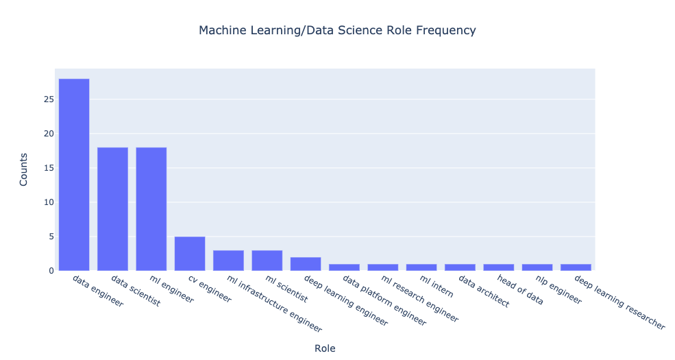
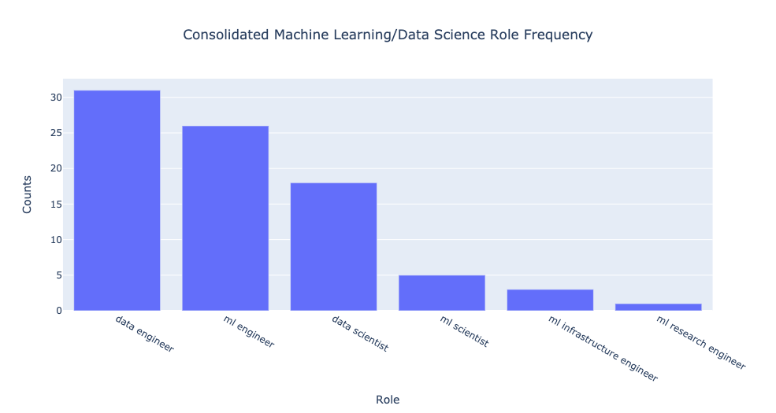
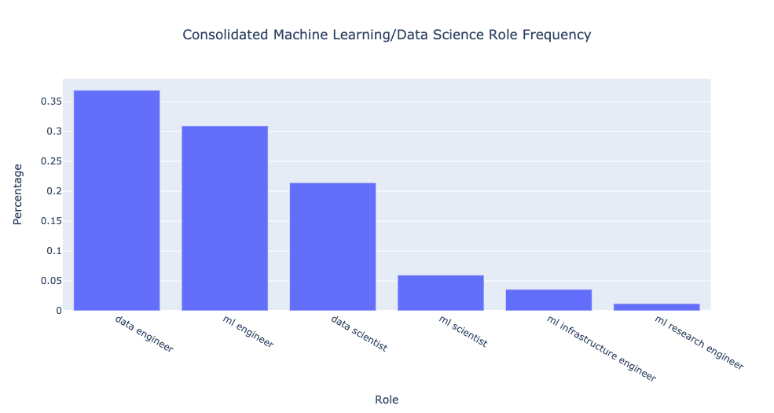
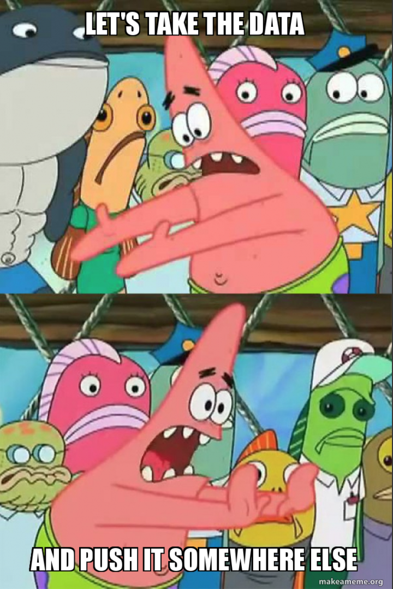

<figure>
    
</figure>

Data. It's everywhere and we're [only getting more of it](https://techjury.net/blog/how-much-data-is-created-every-day/#gref). For the last 5-10 years, *data science* has attracted newcomers near and far trying to get a taste of that forbidden fruit. 

But what does the state of *data science* hiring look like today?

Here's the gist of the article in two-sentences for the busy reader.

**TLDR**: There are **70% more open roles** at companies in *data engineering* as compared to *data science*. As we train the next generation of data and machine learning practitioners, let's place more emphasis on engineering skills.

***

As part of my work developing an [educational platform](https://www.confetti.ai) for data professionals, I think a lot about how the market for data-driven (machine learning and data science) roles is evolving. 

In talking to dozens of prospective entrants to data fields including students at top institutions around the world, I've seen a tremendous amount of confusion around what skills are most important to help candidates stand out in the crowd and prepare for their careers. 

When you think about it, a *data scientist* can be responsible for any subset of the following: machine learning modelling, visualization, data cleaning and processing (i.e. SQL wrangling), engineering, and production deployment. 

How do you even begin to recommend a study curriculum for newcomers?

Data speaks louder than words. So I decided to do an analysis of the data roles being hired for at every company coming out of [Y-Combinator](https://www.ycombinator.com/) since 2012. The questions that guided my research:

- What data roles are companies most frequently hiring for?
- How in-demand is the conventional *data scientist* that we talk about so much?
- Are the same skills that started the data revolution relevant today?

If you want the full details and analysis, read on. 

## Methodology

I chose to do an analysis of YC portfolio companies that claim to make some sort of data work part of their value proposition. 

Why focus on YC? Well, for starters, they do a good job of providing an easily searchable (and scrapable) [directory of their companies](https://www.ycombinator.com/companies/). 

In addition, as a particularly forward-thinking incubator that has funded companies from around the world across domains for over a decade, I felt they provided a representative sample of the market with which to conduct my analyses. That being said, take what I say with a grain of salt, as I didn't analyze super-large tech companies.

I scraped the homepage URLs of every YC company since 2012, producing an initial pool of ~1400 companies. 

Why stop at 2012? Well, 2012 was the year that [AlexNet](https://en.wikipedia.org/wiki/AlexNet) won the ImageNet competition, effectively kickstarting the machine learning and data-modelling wave we are now living through. It's fair to say that this birthed some of the earliest generations of data-first companies.

From this initial pool, I performed keyword filtering to reduce the number of relevant companies I would have to look through. In particular, I only considered companies whose websites included at least one of the following terms: AI, CV, NLP, natural language processing, computer vision, artificial intelligence, machine, ML, data. I also disregarded companies whose website links were broken. 

Did this generate a ton of false positives? Absolutely! But here I was trying to prioritize high recall as much as possible, recognizing that I would do a more fine-grained manual inspection of the individual websites for relevant roles.

With this reduced pool, I went through every site, found where they were advertising jobs (typically a *Careers*, *Jobs*, or *We're Hiring* page), and took note of every role that included data, machine learning, NLP, or CV in the title. This gave me a pool of about 70 distinct companies hiring for data roles. 

One note here: it's conceivable that I missed some companies as there were certain websites with very little information (typically those in stealth) that might actually be hiring. In addition, there were companies that didn't have a formal *Careers* page but asked that prospective candidates reach out directly via email. 

I disregarded both of these types of companies rather than reach out to them, so they are not part of this analysis.

Another thing: the bulk of this research was done towards the final weeks of 2020. Open roles may have changed as companies update their pages periodically. However, I don't believe this will drastically impact the conclusions drawn. 

## What Are Data Practitioners Responsible For?

Before diving into the results, it's worth spending some time clarifying what responsibilities each data role is typically responsible for. Here are the four roles we will spend our time looking at with a short description of what they do:

- *Data scientist*: Use various techniques in statistics and machine learning to process and analyse data. Often responsible for building models to probe what can be learned from some data source, though often at a prototype rather than production level. 
- *Data engineer*: Develops a robust and scalable set of data processing tools/platforms. Must be comfortable with SQL/NoSQL database wrangling and building/maintaining ETL pipelines.
- *Machine Learning (ML) Engineer*: Often responsible for both training models and productionizing them. Requires familiarity with some high-level ML framework and also must be comfortable building scalable training, inference, and deployment pipelines for models.
- *Machine Learning (ML) Scientist*: Works on cutting-edge research. Typically responsible for exploring new ideas that can be published at academic conferences. Often only needs to prototype new state-of-the-art models before handing off to ML engineers for productionization.

## How Many Data Roles Are There?

So what happens when we plot the frequency of each data role that companies are hiring for? The plot looks  like this:

<figure>
    
</figure>

What immediately stands out is how many more open *data engineer* roles there are compared to traditional *data scientists*. In this case, the raw counts correspond to companies hiring **roughly 55% more** for data engineers than data scientists, and roughly the same number of machine learning engineers as data scientists.

But we can do more. If you look at the titles of the various roles, there seems to be some repetition. 

Let's only provide coarse-grained categorization through role consolidation. In other words, I took roles whose descriptions were roughly equivalent and consolidated them under a single title. 

That included the following set of equivalence relations: 

- *NLP engineer* $\approx$ *CV engineer* $\approx$ *ML engineer* $\approx$ *Deep Learning engineer* (while the domains might be different, the responsiblities are roughly the same)
- *ML scientist* $\approx$ *Deep Learning researcher* $\approx$ *ML intern* (the internship description very much seemed research-focused)
- *Data engineer* $\approx$ *Data architect* $\approx$ *Head of data* $\approx$ *Data platform engineer*

<figure>
    
</figure>

If we don't like dealing with raw counts, here are some percentages to put us at ease:

<figure>
    
</figure>

I probably could have lumped *ML research engineer* into one of the *ML scientist* or *ML engineer* bins, but given that it was a bit of a hybrid role, I left it as is. 

Overall the consolidation made the differences even more pronounced! There are **~70%** more open *data engineer* than *data scientist* positions. In addition, there are **~40%** more open *ML engineer* than *data scientist* positions. There are also only **~30%** as many *ML scientist* as *data scientist* positions. 

## Takeaways

*Data engineers* are in increasingly high demand compared to other data-driven professions. In a sense, this represents an evolution for the broader field. 

When machine learning become hot 🔥 5-8 years ago, companies decided they need people that can make classifiers on data. But then frameworks like [Tensorflow](https://www.tensorflow.org/) and [PyTorch](https://pytorch.org/) became really good, democratizing the ability to get started with deep learning and machine learning. 

This commoditized the data modelling skillset. 

Today, the bottleneck in helping companies get machine learning and modelling insights to production center on data problems. 

How do you annotate data? How do you process and clean data? How do you move it from A to B? How do you do this every day as quickly as possible?

<figure>
    
</figure>

All that amounts to having good engineering skills. 

This may sound boring and unsexy, but old-school software engineering with a bend toward data may be what we really need right now. 

For years, we've become enamored with the idea of data professionals that breathe life into raw data thanks to cool demos and media hype. After all, when was the last time you saw a [TechCrunch](https://techcrunch.com/) article about an ETL pipeline? 

If nothing else, I believe solid engineering is something we don't emphasize enough in data science job training or educational programs. In addition to learning how to use *linear_regression.fit()*, learn how to write a unit test too!

So does that mean you shouldn't study data science? No. 

What it means is that competition is going to be tougher. There are going to be fewer positions available for what is looking to be an abundance of newcomers to the market trained to do data science. 

There will always be a need for people that can effectively analyze and extract actionable insights from data. But they have to be good. 

Downloading a pretrained model off the Tensorflow website on the [Iris dataset](https://scikit-learn.org/stable/auto_examples/datasets/plot_iris_dataset.html) probably is no longer enough to get that data science job. 

It's clear, however, with the large number of *ML engineer* openings that companies often want a hybrid data practitioner: someone that can build and deploy models. Or said more succinctly, someone that can use Tensorflow but can also build it from source.

Another takeaway here is that there just aren't that many ML research positions. 

Machine learning research tends to get its fair share of hype because that's where all the cutting-edge stuff happens, all the [AlphaGo](https://deepmind.com/research/case-studies/alphago-the-story-so-far) and [GPT-3](https://openai.com/blog/openai-api/) and what-not. 

But for many companies, especially early-stage ones, the bleeding-edge state-of-the-art may not be what's needed anymore. Getting a model that's 90% of the way there but can scale to 1000+ users is often more valuable to them. 

That's not to say that there isn't an important place for machine learning research. Absolutely not. 

But you'll probably find more of those kinds of roles at industry research labs that can afford to take capital-intensive bets for long stretches of time rather than at a seed-stage startup trying to demonstrate product-market fit to investors as it raises a Series A. 

If nothing else, I believe it's important to make the expectations of newcomers to data fields reasonable and calibrated. We must acknowledge that [data science is different now](https://veekaybee.github.io/2019/02/13/data-science-is-different/). I hope this post was able to shed some light on the state of the field today. It's only when we know where we are that we know where we need to go. 

*Shameless Pitch Alert: If you're interested in cool generative AI tools, I'm currently building the [most advanced AI-powered image and video editor](https://storia.ai/lab?utm_source=website&utm_campaign=mihail-personal-page) which has been used by thousands of marketers, designers, and creatives to drastically improve their speed and quality of visual asset creation.*

*This article has been graciously translated to [Chinese](https://mp.weixin.qq.com/s/WEaj0htYNzi1Q4E9wzvq3g) and [Japanese](https://itnews.org/news_contents/we-need-data-engineers-not-data-scientists) through a community effort.*
