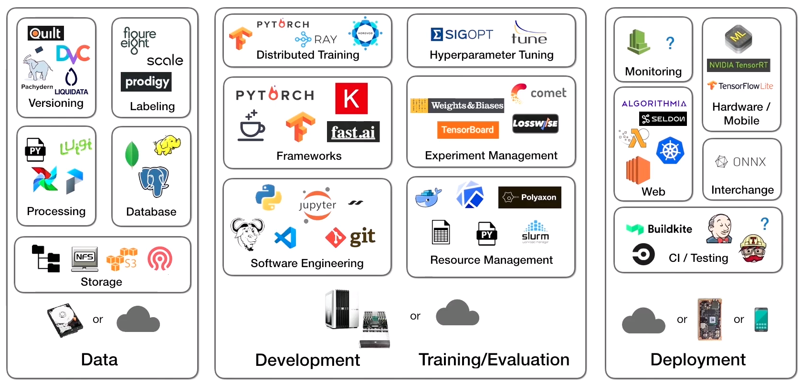

<figure>
    
</figure>

In this first of a series of posts, I will be describing how to build a machine learning-based fake news detector from scratch. That means I will literally construct a system that learns how to discern reality from lies (reasonably well), using nothing but raw data. And our project will take us all the way from initial setup to deployed solution. Full source code [here](https://github.com/mihail911/fake-news).

I'm doing this because when you look at the state of tutorials today, machine learning projects for beginners mean copy-pasting some sample code off the [Tensorflow](https://www.tensorflow.org/) website and running it through an overused benchmark dataset.

In these posts, I will describe a viable sequence for carrying a machine learning product through a realistic lifecycle, trying to be as true as possible to the details. 

I will go into the nitty-gritty of the technology decisions, down to how I would organize the code repository structure for fast engineering iteration. As I progress through the posts, I will incrementally add code to the [repository](https://github.com/mihail911/fake-news) until at the end I have a fully functional and deployable system.

These posts will cover all of the following:

1. Ideation, organizing your codebase, and setting up tooling (this post!)
2. [Dataset acquisition and exploratory data analysis](/posts/performing-exploratory-data-analysis/)
3. [Building and testing the pipeline with a v1 model](/posts/machine-learning-project-model-v1)
4. Performing error analysis and iterating toward a v2 model
5. Deploying the model and connecting a continuous integration solution

With that let's get started!

## Building Machine Learning Systems is Hard

There's no easy way to say this: building a fully-fledged ML system is complex. Starting from the very beginning, the process for a functional and useful system contains at least all of the following steps:

1. Ideation and defining of your problem statement
2. Acquiring (or labelling) of a dataset 
3. Exploration of your data to understand its characteristics 
4. Building a training pipeline for an initial version of your model
5. Testing and performing error analysis on your model's failure modes
6. Iterating from this error analysis to build improved models
7. Repeating steps 4-6 until you get the model performance you need
8. Building the infrastructure to deploy your model with the runtime characteristics your users want
9. Monitoring your model consistently and use that to repeat any of steps 2-8

Sounds like a lot? It is. 

And here's what the current machine learning tooling/infrastructure landscape looks like (PC to [FSDL](https://course.fullstackdeeplearning.com/)): 

<figure>
    
</figure>

When you couple the inherent complexity of building a machine learning product with the myriad tooling decision points, it's no surprise that many companies report [87% of their data science projects never making it into production](https://venturebeat.com/2019/07/19/why-do-87-of-data-science-projects-never-make-it-into-production/)! 

Any of the steps 1-9 above introduce numerous places where a project can hit an insurmountable roadblock, and the breadth of technologies and skills required to deliver on a successful project make amassing a team able to deliver equally challenging. 

It's hard, but that's the current reality of bringing data-driven value to the world. 

My hope is that this series of posts will provide a realistic perspective on what it takes to do ML in the wild.

Note, while I will describe in full-detail our solution to the problem, this is only *a* solution not *the* solution. Building machine learning projects, like all engineering work, entails a series of tradeoffs and design decisions, but I think there is value in showing a valid sequence through the full machine learning lifecycle even if your exact steps may differ.
 
## Defining Your Machine Learning Problem

Arguably the most important step in creating a machine learning application is the problem definition. This means both determining what problem you want your application to solve (the value add) as Ill as how you will measure success (your metrics). 

Given that this is an election year where many people across the US will be looking to form their opinion about candidates through various internet outlets, for the purposes of this project, I will tackle the problem of **fake news detection**. In the modern day, fake statements are more prevalent and are able to spread more virally than ever before.

To help alleviate this problem, I will want to build an application that can assess the truthfulness of statements made by either political speakers or social media posts. 

Once completed, I would ideally like to deploy our project as a web browser extension that can be run in realtime on statements that users are reading on their pages. 

As far as metrics is concerned, if our tool can automatically detect whether a statement is true or false on a random web page with **at least 50%** accuracy, then I will consider our project a success. Typically success if measured by some sort of business metric, but since I don't have a formal metrics like that, this (somewhat arbitrary) threshold for accuracy will suffice. 

## Organizing Your Repository and Tooling

Now that I have our product goal and metrics defined, let's describe how I will organize our application code repository. I'm choosing to spend some time talking about this because there is not a clear consensus in the community on best practices for organizing machine learning projects. 

This makes it very difficult to quickly look at new projects and understand how the separation of concerns is defined, making collaboration and iteration sloIr. 

As a counterpoint, consider the convention around how Java projects are structured. Because of a community agreed-upon consensus, any Java programmer can jump into a new codebase and immediately know where to find what. 

In lieu of a common convention, I will describe practices for organizing machine learning projects, born out of my experience with various projects over the years. The full source code can be found at [this repository](https://github.com/mihail911/fake-news). 

At the top-level, our repository will be structured as follows:

```
fake-news/
    assets/
    config/
    data/
        raw/
        processed/
    deploy/
    fake_news/
        model/
        utils/
    model_checkpoints/
    notebooks/
    scripts/
    tests/
    LICENSE
    README.md
    requirements.txt
```

Here is what each each item is responsible for:


**assets**: This will store any images, plots, and other non-source files generated throughout the project.

**config**: I will include any configuration files needed for model training and evaluation here. 

**data**: This will store our fake news data in both its raw (untouched from the original source) and processed (featurized or updated for our usecase) form.


**deploy**: This will store any files needed for our deployment including Dockerfiles, etc.


**fake_news**: This will store all the source for building, training, and evaluating our models.


**model_checkpoints**: This will store the model binaries that I train and eventually want to deploy. 


**notebooks**: This will store any Jupyter notebooks used for any data analysis.


**scripts**: This will store any one-off scripts for generating model artifacts, setting up application environments, or processing the data.

**tests**: Here I will include any unit tests, integration tests, and data tests to ensure the correctness of our system.  


**LICENSE**: Our software license.


**README.md**: A high-level description of our project.


**requirements.txt**: This will store the code dependencies for our project. This is a standard practice for Python-based projects, which our application will be.


For now our requirements.txt is pretty simple, but I will highlight two dependencies that I will certainly need: [pytest](https://docs.pytest.org/en/stable/) (a library I will use for our code testing) and [dvc](https://dvc.org/) (a tool I will use for data and train pipeline versioning). 


I will also be using an [Anaconda environment](https://docs.conda.io/projects/conda/en/latest/user-guide/tasks/manage-environments.html) to isolate our project dependencies, so they do not interfere with our local system-level dependencies. Dependency isolation is a generally good practice when building new applications, as they not only ensure clean working environments but they make it easier to quickly move and recreate applications on different host servers.


And with that organization completed, we are ready to move on to the [next step](/posts/performing-exploratory-data-analysis/) of getting our dataset and doing some exploratory data analysis. 
