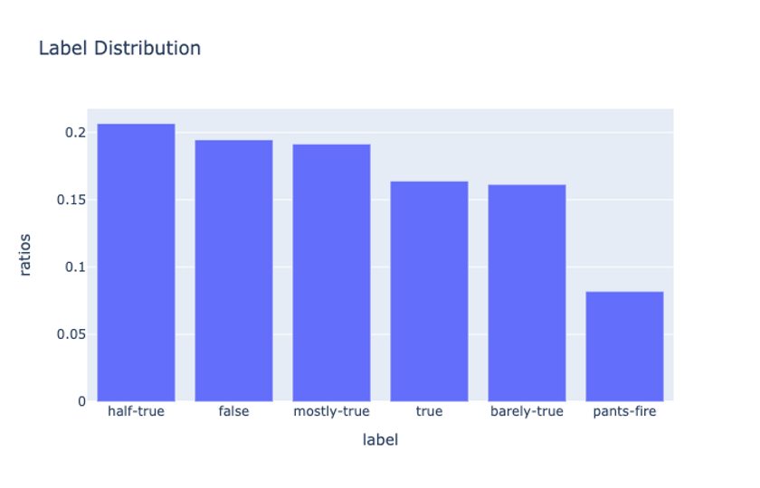
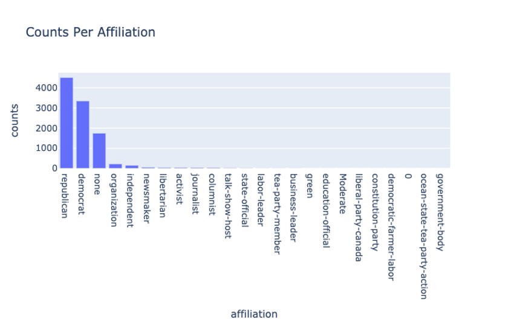
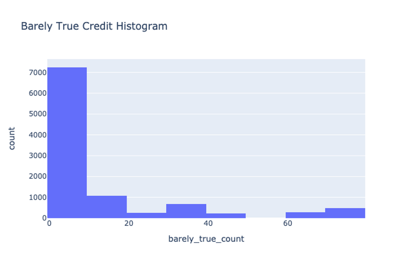
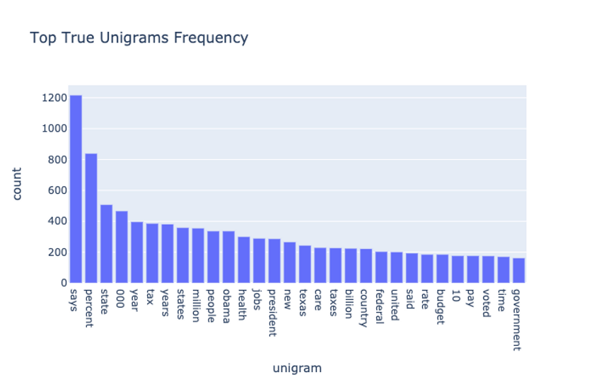
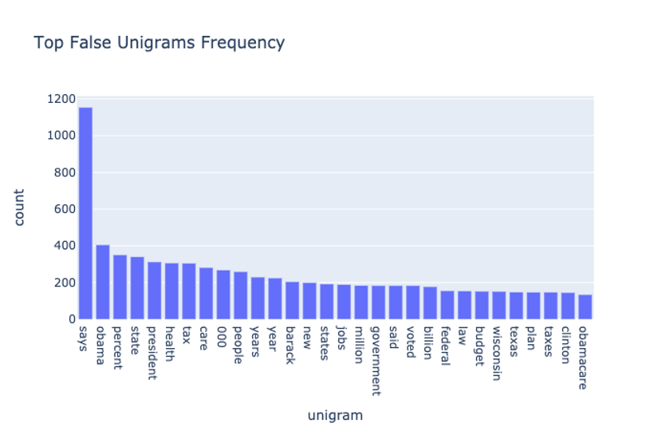
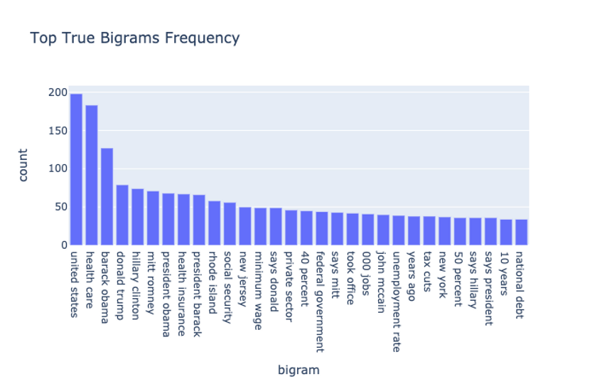
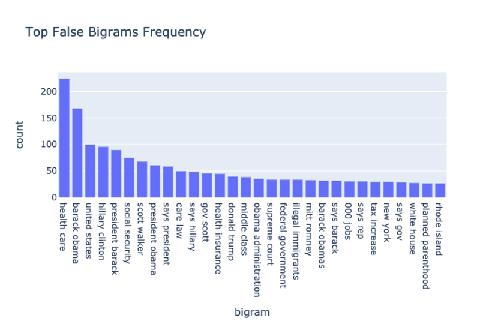
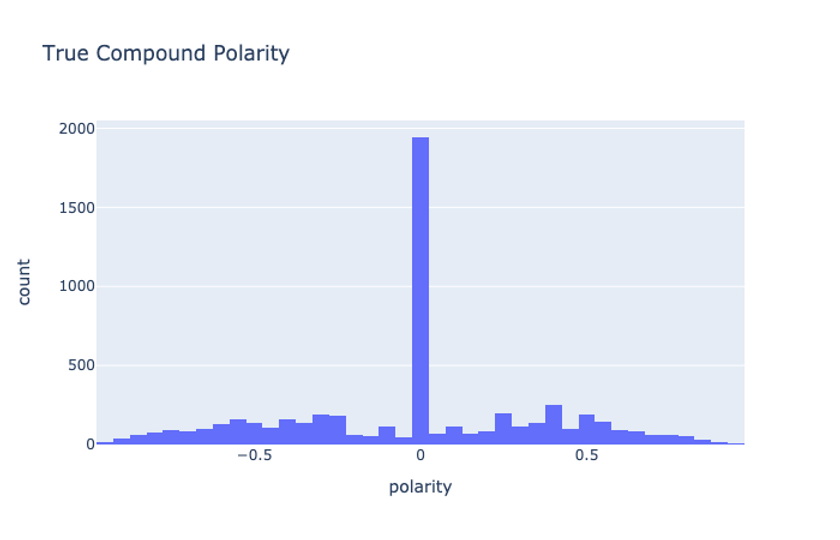
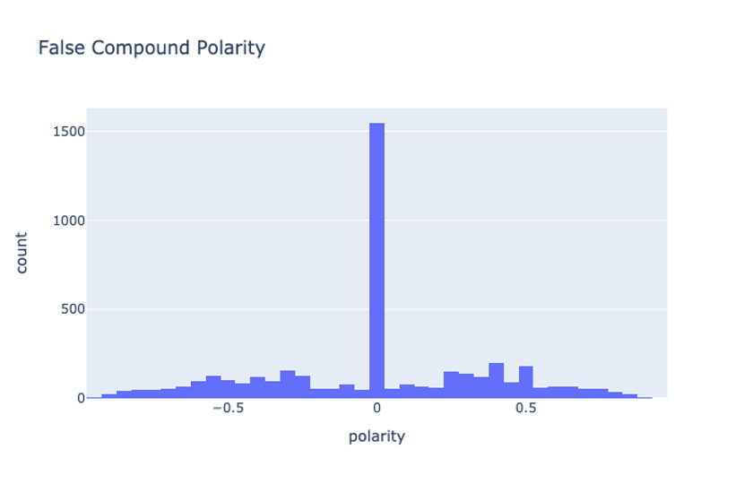

<figure>
    
</figure>

In this post, we will continue where our [last post](/posts/setting-up-a-machine-learning-project/) left off and tackle the next phase of the full machine learning product life cycle: getting an initial dataset and performing exploratory data analysis. 


As a quick refresher, remember that our goal is to apply a data-driven solution to a problem taking it from initial setup through to deployment. The phases we will conduct include the following:


1. [Ideation, organizing your codebase, and setting up tooling](/posts/setting-up-a-machine-learning-project/)
2. **Dataset acquisition and exploratory data analysis (this post!)**
3. [Building and testing the pipeline with a v1 model](/posts/machine-learning-project-model-v1)
4. [Performing error analysis and iterating toward a v2 model](/posts/machine-learning-project-error-analysis-model-v2/)
5. [Deploying the model and connecting a continuous integration solution](/posts/machine-learning-project-model-deployment/)

Full source code is [here](https://github.com/mihail911/fake-news).

## Getting Your Initial Dataset

Data is the heart of any machine learning project. Having high quality data with your desired characteristics can be the difference between a product that does what you want it to and one that is nonfunctional. 


In practice, having the right data is even more important for final success than the exact modelling algorithm you use. 

So rather than spend too much time developing complex models, your time is often better spent just cleaning up your labels. This is a belief that many AI experts hold:

<figure>
    
</figure>

Recall that our goal is to build a fake news detection system that can detect the truthfulness of snippets of text from different sources including political debates, social media platforms, etc. We are going to want to learn a model in a supervised fashion, so where can we get labelled data? 


In the early stages of a project, we want to acquire a reasonably-sized dataset that we can use to build a v1 of a system including an end-to-end pipeline. 

Every step of the machine learning lifecycle is iterative and will be refined as the project unfolds. Therefore our dataset doesn't have to be massive, but it does have to be large enough to exhibit the properties that we want. 


There are a few options here. We can either:

1. Use a crowdsourcing platform such as [Amazon Mechanical Turk](https://www.mturk.com/) to have humans curate and label our data.
2. Use an existing publicly-available dataset. 


(1) is typically a more necessary option if we are tackling an entirely new problem for which we have no appropriate data. It is **not**, however, the first option I recommend starting with as bootstrapping a functional labelling system and training workers can be a costly, time-consuming process.


Thankfully there are [many resources](https://twitter.com/mihail_eric/status/1338894832798846977) out there that provide lists of public datasets. In our case, fake news detection has been a problem of growing research interest so there are a [number of datasets](https://github.com/sumeetkr/AwesomeFakeNews) that have emerged. 

After some exploration, I found that the [Liar Liar Dataset](https://www.aclweb.org/anthology/P17-2067/) released in ACL 2017 has the characteristics we want. 

It has a little under 13K labelled statements from various contexts off of [POLITIFACT.COM](http://politifact.com/). The original dataset actually has a 6-way labelling scheme from PANTS-FIRE to TRUE, though for our purposes we consolidate the labels to a binary classification setting (TRUE/FALSE). We use an augmented version of the dataset available on [this repository](https://github.com/Tariq60/LIAR-PLUS). 

## Exploratory Data Analysis

Once we have a first version of our data, we need to perform exploratory data analysis (EDA) which is a skill that every *data scientist/machine learning engineer should have*. At a high-level, the goal of EDA is to probe our data in as many ways as possible to gain an understanding for its characteristics. A few questions that can guide our exploration:

1. What is the label distribution? Do we have a balanced/imbalanced dataset?
2. What are the distributions of feature values?
3. Are there any features that are malformed?

Among other things, the goals of these questions are to derive insights about our data that can ultimately inform our modellng choices such as features or algorithms to use.

Note that all of the code for our EDA is available in the Jupyter notebook provided at [the project repo](https://github.com/mihail911/fake-news). 

## Clean Data - A Machine Learning Myth

Before getting into the real heart of our EDA, it's worth pointing out that no dataset is perfectly clean. 

Data is laden with inconsistencies, outliers, biases, and noise that make the job of modelling a lot more difficult. Even when you are taking curated research datasets, it's always worth doing some sanity-checking of your model before you start drawing meaningful conclusions.

As an example, when we try to load up the data using the following code:

```python
import pandas as pd

columns = ["id", "statement_json", "label", "statement", "subject", "speaker", "speaker_title", "state_info", "party_affiliation", "barely_true_count", "false_count", "half_true_count", "mostly_true_count", "pants_fire_count", "context", "justification"]

pd.read_csv(TRAIN_PATH, sep="\t", names=columns)
```

Pretty standard stuff using the wonderful data analysis library [Pandas](https://pandas.pydata.org/). When we check the number of records in our data frame, we expect to see 10269, matching the reported number of train examples in the paper. 

To our great surprise, we see only around ~10240 records. Weird!


After plotting the number of tokens in the statements for each datapoint, we see some strangely large values, on the order of >400 tokens. Given that the average sentence length in the data is supposed to be ~18 tokens, these are some pretty extreme outliers. 


After pinpointing these extreme datapoints, we find that there are actually multiple datapoints concatenated together. 

Certain statements included quotations where there were opening **"** characters but no closing ones, so the *read_csv* function was interpreting multiple rows as a single example. We have some malformed inputs!


After correcting for these inputs, we find there are no more outliers, though we end up with around 10280 inputs. In the end we use the data in this form because as long as the data passes basic sanity checks, it's fine for our purposes.

It is worth mentioning, however, that the repo from which we got the data wasn't the official one from the original paper's author (we couldn't find the exact original source).


The takeaway here is always **be critical of your data**. You can never have a perfect dataset, but you should strive to eliminate as much noise as possible. 

## Analyze the Basics

It's always good to start your EDA with some basic statistics about your corpus. This includes things like inspecting the distributions of various column values, checking the label distribution, etc.


For example, inspecting the label distributions we see the following:

<figure>
    
</figure>

So the labels are roughly equally-distributed, though the proportion of extremely false statements (PANTS-FIRE) is quite a bit smaller than the others. 


When we binarize the labels (converting *half-true*, *mostly-true*, and *true* to **True** and the remainder as **False**), we find the following proportions

```
True     0.562037
False    0.437963
```

so here the distribution is slightly skewed toward the True examples. This is something to keep in mind when we are computing metrics for our models.

When we look at the counts for the party affiliations of each statement:

<figure>
    
</figure>

we see that there are slightly more Republican-affiliated statements than Democratic ones, and there is a heavy long-tail for these affiliations. 

Even more interesting is when we look at the label distributions between Republican and Democrat statements. 

Republican:

```
True     0.502329
False    0.497671
```

and Democrat:

```
True     0.661584
False    0.338416
```

Notice here that the Democrat statements are often more True than False, especially as compared to the Republicans. 

We should, of course, be cautious not to draw any political conclusions about this. This is just a property of our specific dataset, and in particular this indicates that party affiliation may be a meaningful feature to include for our model to learn from (though this can certainly incur bias). 

Our dataset also provides an interesting set of metadata which the original paper called the "credit history." This refers to the historical counts of statements made by each speaker binned into a set of 5 truthfulness columns: 

```
barely_true_count
false_count
half_true_count
mostly_true_count
pants_fire_count
```

As an example, when we form a histogram of the **barely_true** credit values:

<figure>
    
</figure>

we see that the there is a long-tail of "barely true" credit scores. This inspires certain features we can use such as a bucketized feature for the scores of a given speaker making a statement.


There are many more explorations around these summary statistics that we defer to the in-depth notebook [provided in the Git repo](https://github.com/mihail911/fake-news/tree/master/notebooks). 

## Ngram analysis

While looking at provided columns and metadata can be enlightening, we haven't even looked at the main piece of our data: each True/False statement itself! 

We will want to give our model a lot of textual signals to learn from, and we hope that there is abundant information in the words spoken by speakers that allude to their truthfulness.

For starters, it's always helpful to compute ngram measures such as the most frequently seen unigram and bigrams in the data. We further split up this analysis by computing separate distributions for True and False statements:

<figure>
    
</figure>

<figure>
    
</figure>

<figure>
    
</figure>

<figure>
    
</figure>

A few observations: *Obama*, *Hillary Clinton*, *Donald Trump*, and other political individuals and phrases shows up a lot in both True and False statements. 

This suggests the importance of providing ngram features, including [TF-IDF](https://en.wikipedia.org/wiki/Tf%E2%80%93idf) weighted ones to the model to learn from.

## Topic Modelling

Topic modelling is a powerful way to condense a set of documents in a corpus into a semantically meaningful collection of "topics." By finding these abstract topics (which are often just a set of words that are computed according to certain algorithms), we can derive information about how the data in our collection is organized, the most meaningful terms, and other useful tidbits.


While there are [many](https://en.wikipedia.org/wiki/Non-negative_matrix_factorization) [techniques](https://en.wikipedia.org/wiki/Latent_Dirichlet_allocation) for doing topic modelling, for our purposes we will use [latent semantic analysis](https://en.wikipedia.org/wiki/Latent_semantic_analysis). 

At a high-level, latent semantic analysis (LSA) performs a singular-value decomposition on a document-term frequency matrix. Using the components from the decomposition, we can find the words that are most representative of a topic. 

Extracting the top 10 words for 5 topics in the True statement data gives:

```
Topic 0: 
[('percent', 0.34464524012281295), ('says', 0.30132880648218413), ('tax', 0.17585257561512502), ('000', 0.17534865441102257), ('state', 0.1743821531756155), ('years', 0.1638552485840526), ('year', 0.15978257526126505), ('health', 0.1521997932095661), ('jobs', 0.15111344244457206), ('obama', 0.1502565628492749)]


Topic 1: 
[('percent', 0.7147932277701732), ('income', 0.12292209559014365), ('rate', 0.11947746156087194), ('40', 0.07836459868284175), ('unemployment', 0.07249685594090727), ('highest', 0.06126899271791158), ('states', 0.06052914167731957), ('90', 0.055331297705095484), ('10', 0.054496853315023394), ('pay', 0.0528855047620674)]


Topic 2: 
[('health', 0.6095048304030245), ('care', 0.5181143381533385), ('insurance', 0.19926938355170798), ('percent', 0.1863990020367275), ('plan', 0.09857701298125203), ('americans', 0.08701353302014009), ('reform', 0.07815927428119611), ('law', 0.06629286306519296), ('coverage', 0.06455653402501327), ('people', 0.05571378367086508)]


Topic 3: 
[('jobs', 0.40952483390513433), ('000', 0.32419497914363604), ('million', 0.20361692010242105), ('created', 0.17787622644104148), ('new', 0.1506654783724265), ('year', 0.13305717478436657), ('state', 0.11280816373260406), ('lost', 0.09901837802308187), ('sector', 0.09493722237307789), ('years', 0.08751004627702176)]


Topic 4: 
[('states', 0.47359401856755434), ('united', 0.3512656365719258), ('highest', 0.22736719216620133), ('tax', 0.21850834850140224), ('says', 0.18937354394887032), ('world', 0.18532121455569744), ('rate', 0.18234371717868292), ('corporate', 0.09636049150872673), ('country', 0.09483733643589806), ('texas', 0.08358476101701441)]
```

and in the False statement data gives:

```
Topic 0: 
[('says', 0.3714031210752551), ('health', 0.25917374999504533), ('obama', 0.24357514528885899), ('care', 0.23890482796898854), ('president', 0.20407151781973248), ('percent', 0.1816533702375591), ('tax', 0.1811791626006288), ('barack', 0.180412359933636), ('state', 0.153691618323912), ('000', 0.13400312098799377)]


Topic 1: 
[('health', 0.536210716576261), ('care', 0.5094262003452869), ('law', 0.15795738233166845), ('insurance', 0.1189815077865269), ('government', 0.0948405139293412), ('reform', 0.07583208914639702), ('plan', 0.0571723780007409), ('affordable', 0.05232879396516892), ('takeover', 0.049964987377783224), ('federal', 0.04730984644222644)]


Topic 2: 
[('obama', 0.43365698510629047), ('barack', 0.3683637278155912), ('president', 0.3557462438849415), ('health', 0.2529532448451656), ('care', 0.24143428231060846), ('obamas', 0.0743852714467124), ('law', 0.06291036690344873), ('muslim', 0.04879033398556757), ('insurance', 0.03653688942513638), ('going', 0.033928110988280254)]


Topic 3: 
[('says', 0.3960084913425308), ('tax', 0.249262344555487), ('taxes', 0.19666370462817578), ('voted', 0.16835499387452063), ('clinton', 0.131367845361437), ('security', 0.13072185362071098), ('hillary', 0.12899305434241498), ('social', 0.12387317212174848), ('plan', 0.1049255400231567), ('raise', 0.10216444513175903)]


Topic 4: 
[('tax', 0.5549838848364304), ('percent', 0.3076014926087387), ('increase', 0.2078991243182675), ('taxes', 0.1452840347665292), ('history', 0.1122942055528075), ('income', 0.10702462595752976), ('middle', 0.09901709072174511), ('class', 0.09503787037255178), ('rate', 0.09331600113636787), ('largest', 0.09258907148909247)]
```

We can see that in the True data, Topic 2 seems to revolve around healthcare related terms, Topic 3 deals with jobs, and Topic 4 roughly deals with taxes. 

The presence of these topics indicate that we can provide some specialized features to our model using topic-specific lexicons (i.e. does a statement include the presence of healthcare or tax-related terms).

## Sentiment Analysis

In order to understand the emotional content and tone of a statement (which should be indicative of its truthfulness), we can apply sentiment analysis. Here we will apply a very performant sentiment analysis algorithm called VADER which is optimized for social media text and is described [in this paper](http://comp.social.gatech.edu/papers/icwsm14.vader.hutto.pdf). 

While the nature of our data isn't quite social media in the traditional Twitter/Facebook snippet sense, VADER is nice because it provides a real-valued composite sentiment score as well as separate positivity/negativity scores that we can plot. 

When we compare the compound sentiment score between True and False statements:

<figure>
    
</figure>

<figure>
    
</figure>

we see that there is a slight difference in the scores. This is not obvious from the plots but something we can conclude by looking at the raw compound score summary statistics provided [in our notebook](https://github.com/mihail911/fake-news/tree/master/notebooks). 


According to VADER there are some sentiment differences between True and False statements, though perhaps not as large as we might expect. When inspecting some of the examples in the data, we notice that there aren't necessarily that many very emotionally-charged phrases said by speakers, certainly not many that use social media types of expression (excessive punctuation, capitalization, etc.) 

That being said, it still may be worth exploring the usage of sentiment scores as features in our models.

## Conclusion

That brings us to the close of our EDA on this dataset. We have gained a lot of interesting insights about the data characteristics, many which inspired possible features we should look at. After all, this is the point of EDA and why it's one of most crucial first steps in a machine learning development cycle. 

Our [next post](/posts/machine-learning-project-model-v1/) will build on our insights to construct our first model for the task along with a fully-tested training pipeline. 
