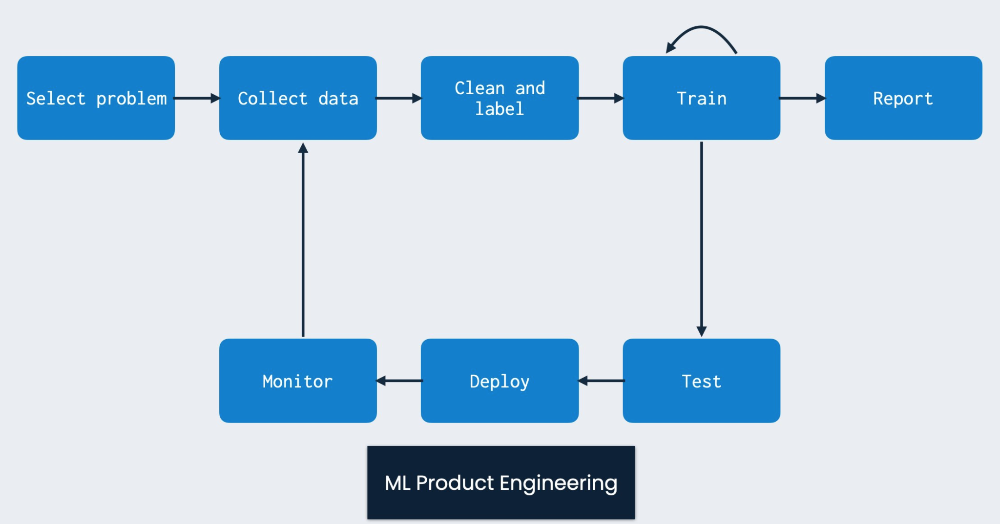
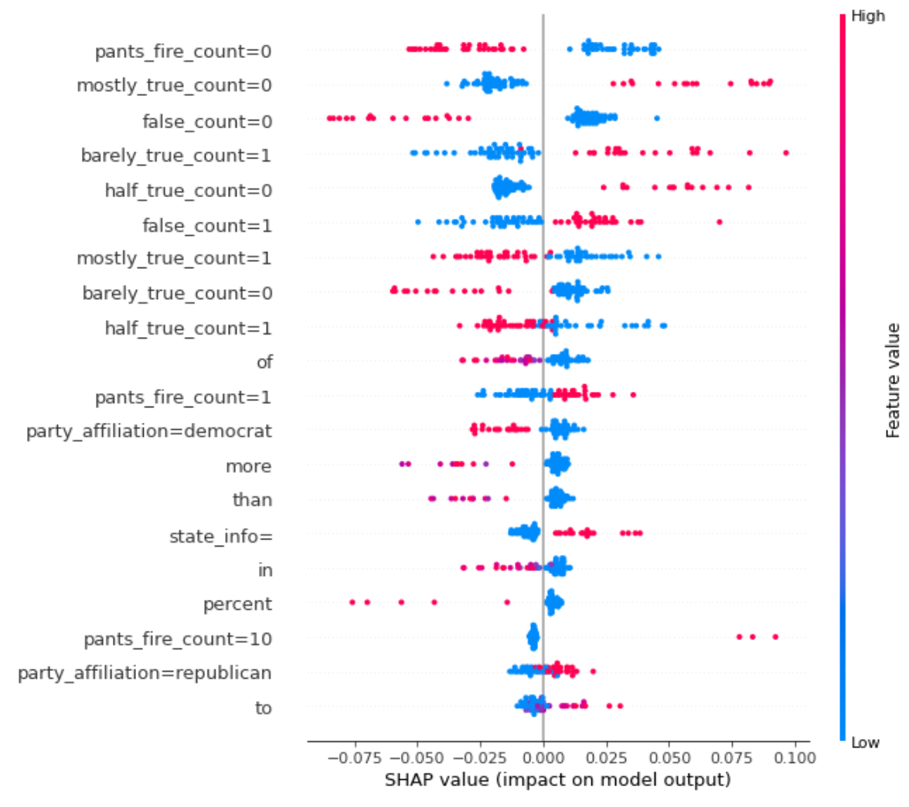

<figure>
    
</figure>

In this post, we will continue where our [previous post](/posts/machine-learning-project-model-v1/) left us and perform error analysis on the model we built. From here we will work toward a v2 version of our model.

As a reminder, recall that our goal is to apply a data-driven solution to the problem of fake news detection taking it from initial setup through to deployment. The phases we will conduct include the following:

1. [Ideation, organizing your codebase, and setting up tooling](/posts/setting-up-a-machine-learning-project/)
2. [Dataset acquisition and exploratory data analysis](/posts/performing-exploratory-data-analysis)
3. [Building and testing the pipeline with a v1 model](/posts/machine-learning-project-model-v1/)
4. **Performing error analysis and iterating toward a v2 model (this post!)**
5. Deploying the model and connecting a continuous integration solution

This article will focus on performing error analysis with an emphasis on understanding our model's behavior and finding places to improve. Full source code is [here](https://github.com/mihail911/fake-news).


## A Quick Recap

Recall that in our [last post](/posts/machine-learning-project-model-v1/) we built a feature-based random forest classifier as our first model. 

Our goal was to get some model up and running that could be trained via a configurable pipeline and provide immediate value to users. 

As a reminder, we were able to build a model that achieved roughly $74\%$ accuracy on a held-out test set for identifying whether a headline was fake or real.

But what does that even mean? Is this performance good enough? 

In a typical research setting, our work might stop here if our performance was state-of-the-art. We would write a paper, submit it in the hour before the midnight conference deadline, and be done with it. 

In the world of delivering real-world **ML value**, our work is really just beginning. 

At this point we would ideally deploy our model to users, get people interacting with it, and use those results to inform an improved model. This reflects the continuous feedback-loop based nature of ML product development (PC: [Josh Tobin](http://josh-tobin.com/)):

<figure>
    
</figure>

While we won't go that full route immediately, we will do something equally important which is to perform manual error and feature analysis on our model. 

This is a crucial step in working on any machine learning project as it helps us understand what our model has learned about our data, where we haven't provided enough of a signal to solve our problem, and what we need to do about it.

## Understanding Feature Importances

Let's start with understanding the most important features in our v1 model. We can start by computing the Gini importance of the features in our tree. This computes the total reduction in [Gini impurity](https://victorzhou.com/blog/gini-impurity/) brought by the feature during the training of the trees in our random forest. 

Support for these feature importances comes out-of-the-box with [Scikit-learn](https://scikit-learn.org/stable/modules/generated/sklearn.ensemble.RandomForestClassifier.html#sklearn.ensemble.RandomForestClassifier.feature_importances_). We can compute them [as follows](https://github.com/mihail911/fake-news/blob/master/notebooks/error_analysis.ipynb):

```python
def compute_impurity_feature_importance(model, feature_names: List[str], num_features: int = 35):
    importances = model.model.feature_importances_
    sorted_idx = importances.argsort()[::-1]
    for idx in sorted_idx[:num_features]:
        print(f"{feature_names[idx]} --- {importances[idx]}")
```

Here are the top features this produces:

```
false_count=0 --- 0.01788103750021081
barely_true_count=1 --- 0.013547527016297977
mostly_true_count=0 --- 0.012814332174567926
false_count=1 --- 0.012356274396352049
barely_true_count=0 --- 0.011642340204808786
half_true_count=0 --- 0.011123275790760898
pants_fire_count=0 --- 0.010704431737810377
the --- 0.009264955075530558
mostly_true_count=1 --- 0.009118849790203196
half_true_count=1 --- 0.00812081824119793
in --- 0.00806058304960812
of --- 0.007734625265523087
to --- 0.007070031612018406
pants_fire_count=1 --- 0.0068806431741690426
says --- 0.006082293331787273
on --- 0.005531578965784581
and --- 0.005017675857693454
```

As we can see, many of the top features are the bins [we created](https://github.com/mihail911/fake-news/blob/master/fake_news/utils/features.py) for the "credit history" counts. This is an interesting observation, as it suggests that knowing a speaker's past record of truthfulness will determine their behavior in the future. 

We also see some features that come from the ngram-based tokenization such as *in*, *of*, *and*, etc. On their own these don't seem that interesting because many of them are stopwords, words we wouldn't expect to contribute very much to the overall semantic meaning or truthfulness of a statement. 

This provides us some room for improvement: we can filter stopwords in a later model to bias it toward learning some more interesting lexical properties of the data. 

While looking at Gini importance is one way of understanding features, we can use more sophisticated techniques for model interpretability. One powerful technique for interpretability is computing [Shapley values](https://proceedings.neurips.cc/paper/2017/file/8a20a8621978632d76c43dfd28b67767-Paper.pdf). 

This technique is provided in a nice library called [SHAP](https://github.com/slundberg/shap). The SHAP values indicate how much each feature contributes to pushing a model's output from some base prediction value. 

When we apply this framework to analyzing our model's outputs on the validation set, we get this plot:

<figure>
    
</figure>

Understanding the above plot is pretty tricky so let's take an example. 

Consider the first feature listed: **pants\_fire\_count=0**. Recall that this means that the *pants_fire* credit history count (indicating blatant liars) for the speaker of the statement is in the first bin out of 10. That means they don't have many past instances of being blatant liars. 

Now if that feature has a high value (since these are binary features, that means it is 1 and the speaker doesn't have a lot of instances of being a blatant liar), then that will tend to push the value of the **FALSE** probability to be smaller. 

Or in other words, this will push the datapoint to have a higher chance of being labelled **TRUE**. Makes sense!

As you can see, a lot of the most important features are the various credit history bin features, which is consistent with our Gini importance analysis.

Another important set of features we are seeing is the party affiliation of the speaker. 

For this **particular** dataset, having a Democratic party affiliation tends to push the label toward **TRUE**. While this notion seems to be represented in our analysis, be careful with drawing broader conclusions as this may just indicate a dataset bias.

## Error Analysis

Now that we understand our feature importances, let's spend some time analyzing what kinds of errors our model makes. 

To do this, we will run our model over the validation set and find the datapoints for which it is least confident and incorrect, namely where the absolute difference between the probability of **TRUE** and **FALSE** is smallest.

These are examples for which our model got confused just barely in the wrong direction. 

We could also do an analysis of the incorrect examples for which our model is most confident, but for now we will look at the trickiest examples.

Here are a handful of them:

```
{'id': '47', 'statement_json': '4578.json', 'label': True, 'statement': 'Says that In 2009, I saved ratepayers around $500 million by persuading the Council to pursue a less expensive compliance mechanism if the City is required to treat Bull Run drinking water.', 'subject': 'city-budget,city-government,environment,public-health,water', 'speaker': 'amanda-fritz', 'speaker_title': 'portland city commissioner', 'state_info': '', 'party_affiliation': 'democrat', 'barely_true_count': 1.0, 'false_count': 1.0, 'half_true_count': 0.0, 'mostly_true_count': 2.0, 'pants_fire_count': 0.0, 'context': 'in campaign literature', 'justification': '(Does that mean the state would save water ratepayers $100 million to $180 million, depending on how you calculate cost?She came from the political minority, challenged Leonard, and ended up with a 5-0 vote in her favor.'} 

{'id': '70', 'statement_json': '4855.json', 'label': False, 'statement': 'Says Mitt Romney once supported President Obamas health care plan but now opposes it.', 'subject': 'health-care,message-machine-2012', 'speaker': 'democratic-national-committee', 'speaker_title': '', 'state_info': '', 'party_affiliation': 'none', 'barely_true_count': 8.0, 'false_count': 2.0, 'half_true_count': 10.0, 'mostly_true_count': 8.0, 'pants_fire_count': 0.0, 'context': 'a television ad', 'justification': 'But the video implies that Romney supported the federal law. We looked, but we couldnt find any instances when Romney endorsed the federal law. Instead, we found Romney criticized Obamas plan repeatedly, usually over the public option. After the public option was left out of the law, Romney still criticized the law as a federal power grab. Democrats could make an argument that Romney has changed position in opposing the type of plan he once supported. But in this ad, they imply he once supported Obamas proposal.'} 

{'id': '146', 'statement_json': '9210.json', 'label': False, 'statement': 'Pregnant women who stand for five to six hours at a time increase their risk of pre-term pregnancy by 80 percent.', 'subject': 'families,government-regulation,health-care,public-health,science,women,workers', 'speaker': 'michael-solomon', 'speaker_title': 'president, providence city council', 'state_info': 'rhode island', 'party_affiliation': 'democrat', 'barely_true_count': 1.0, 'false_count': 0.0, 'half_true_count': 0.0, 'mostly_true_count': 0.0, 'pants_fire_count': 0.0, 'context': 'a news release', 'justification': 'Providence City Council President Michael Solomon said, "Pregnant women who stand for five or six hours at a time increase their risk of pre-term pregnancy by 80 percent," attributing the statistic to the Women\'s Fund of Rhode Island.'}
...
```

In inspecting the second example, we see a political statement that on the surface seems plausible. 

Given our model only uses ngram features (in this case unigrams are the default) coupled with some coarse past history measures and a few details about the context of the statement, the prediction of truthfulness certainly seems like a toss-up. 

We have no history of Mitt Romney's statements on the bill which are really the crucial point in determining whether it is accurate. Without such evidence, it will always be quite difficult to really know whether something is true or not. 

An improved model would need to find a way to scrape relevant information from other news sources where the speaker in question (here Mitt Romney) made statements about the topic in question. 

## What Does the Data Tell Us?

The previous analysis introduces an interesting question around data ethics and model accountability.

Our initial model performed reasonably well on the given data using features such as "credit history" as well as the speaker party affiliation. 

While this did help us do well on this dataset, are those really the features we think should be most meaningful for the problem of fake news detection? 

You can see how that could very easily go down a rabbit hole of having our features codify the biases of our data. 

We have to be very careful in this respect to make sure that we are clear about what our model has accomplished: it has performed well on this **specific** fake news dataset, but we are still far from solving the more general problem.

Our dataset is small (roughly 10K datapoints) and we ourselves have not done any quality control on whether it accurately captures all the phenomena we need to be able to model in a fake news detection system. 

It's the best we have right now, so we'll keep using it, but we should acknowledge how partial our features may have become to this particular dataset. 

To combat this problem, we would need to take steps like increasing our dataset coverage so we can't do this well in offline evaluation through potentially spurious features like party affiliation.

## Model V2

We will now work on building another model on our dataset. When doing this we could leverage the new feature insights we gained from our feature and error analysis to iterate on our random forest model. 

Instead, we will see what we can learn through raw lexical and linguistic features alone using some of the new [Transformer-based models](http://jalammar.github.io/illustrated-transformer/) that have become commonplace in natural language processing.

Here we will leverage a [Roberta model](https://ai.facebook.com/blog/roberta-an-optimized-method-for-pretraining-self-supervised-nlp-systems/) to this task using the [HuggingFace Transformers library](https://huggingface.co/transformers/) combined with [Pytorch-lightning](https://github.com/PyTorchLightning/pytorch-lightning). The Roberta model will encode only the speaker statement in each datapoint, no additional fields from the data.

Given our [model interface](https://github.com/mihail911/fake-news/blob/master/fake_news/model/base.py) from the [previous post](/posts/machine-learning-project-model-v1/), we know exactly what functionality we need to provide. 

The **RobertaModel** will look something like this:

```python
class RobertaModel(Model):
    def __init__(self, config: Dict, load_from_ckpt: bool = False):
        self.config = config
        if load_from_ckpt:
            self.model = RobertaModule.load_from_checkpoint(
                os.path.join(config["model_output_path"], config["checkpoint_name"]),
                config=None)
        else:
            self.model = RobertaModule(config)
            checkpoint_callback = ModelCheckpoint(monitor="val_loss",
                                                  mode="min",
                                                  dirpath=config["model_output_path"],
                                                  filename="roberta-model-epoch={epoch}-val_loss={val_loss:.4f}",
                                                  save_weights_only=True)
            
            self.trainer = Trainer(max_epochs=self.config["num_epochs"],
                                   gpus=1 if torch.cuda.is_available() else None,
                                   callbacks=[checkpoint_callback],
                                   logger=False)
    
    def train(self,
              train_datapoints: List[Datapoint],
              val_datapoints: List[Datapoint],
              cache_featurizer: bool = False) -> None:
        train_data = FakeNewsTorchDataset(self.config, train_datapoints)
        val_data = FakeNewsTorchDataset(self.config, val_datapoints)
        train_dataloader = DataLoader(train_data,
                                      shuffle=True,
                                      batch_size=self.config["batch_size"],
                                      pin_memory=True)
        val_dataloader = DataLoader(val_data,
                                    shuffle=False,
                                    batch_size=16,
                                    pin_memory=True)
        
        self.trainer.fit(self.model,
                         train_dataloader=train_dataloader,
                         val_dataloaders=val_dataloader)
    
    def predict(self, datapoints: List[Datapoint]) -> np.array:
        data = FakeNewsTorchDataset(self.config, datapoints)
        dataloader = DataLoader(data,
                                batch_size=self.config["batch_size"],
                                pin_memory=True)
        self.model.eval()
        predicted = []
        self.model.cuda()
        with torch.no_grad():
            for idx, batch in enumerate(dataloader):
                output = self.model(input_ids=batch["ids"].cuda(),
                                    attention_mask=batch["attention_mask"].cuda(),
                                    token_type_ids=batch["type_ids"].cuda(),
                                    labels=batch["label"].cuda())
                predicted.append(output[1])
        return torch.cat(predicted, axis=0).cpu().detach().numpy()
```

Here we are leveraging the [RobertaModule](https://github.com/mihail911/fake-news/blob/master/fake_news/model/transformer_based.py) we defined:

```python
class RobertaModule(pl.LightningModule):
    def __init__(self, config: Dict):
        super().__init__()
        base_dir = os.path.dirname(os.path.dirname(os.path.dirname(__file__)))
        full_model_output_path = os.path.join(base_dir, config["model_output_path"])
        self.config = config
        self.classifier = RobertaForSequenceClassification.from_pretrained(config["type"],
                                                                           cache_dir=full_model_output_path)
    
    def forward(self,
                input_ids: np.array,
                attention_mask: np.array,
                token_type_ids: np.array,
                labels: np.array):
        output = self.classifier(input_ids=input_ids,
                                 attention_mask=attention_mask,
                                 token_type_ids=token_type_ids,
                                 labels=labels
                                 )
        return output
    
    def training_step(self, batch, batch_idx):
        output = self(input_ids=batch["ids"],
                      attention_mask=batch["attention_mask"],
                      token_type_ids=batch["type_ids"],
                      labels=batch["label"])
        self.log("train_loss", output[0])
        print(f"Train Loss: {output[0]}")
        return output[0]
    
    def validation_step(self, batch, batch_idx):
        output = self(input_ids=batch["ids"],
                      attention_mask=batch["attention_mask"],
                      token_type_ids=batch["type_ids"],
                      labels=batch["label"])
        self.log("val_loss", output[0])
        return output[0]
...
```

Thanks to our model interface and general training loop, we can run this to get the following test set performance:

```
INFO - 2021-01-16 20:37:05,693 - train_transformer.py - Test metrics: {'test f1': 0.7358813462635483, 'test accuracy': 0.6391270459859704, 'test auc': 0.6917187020672321, 'test true negative': 175, 'test false negative': 82, 'test false positive': 381, 'test true positive': 645}
```

So pure textual features from the statement aren't going to cut it alone. 

Further work (left as an exercise to the reader) could explore encoding some other fields (credit history, etc.) from the data as inputs to Roberta. 

In the [next post](/posts/machine-learning-project-model-deployment/), we'll look at deploying our model and setting up a continuous integration solution for our project!
