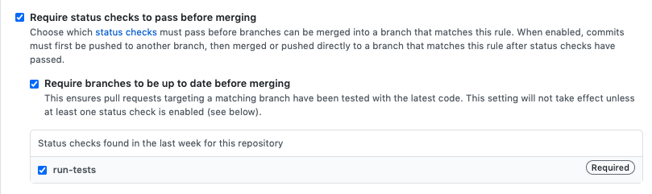

<figure>
    
</figure>

In this post, we will continue where our [previous post](/posts/machine-learning-project-error-analysis-model-v2/) left us and look at deploying our model and setting up a continuous integration system. This will allow us to constantly update, improve, and test our code.

As a reminder, recall that our goal is to apply a data-driven solution to the problem of fake news detection taking it from initial setup through to deployment. The phases we will conduct include the following:

1. [Ideation, organizing your codebase, and setting up tooling](/posts/setting-up-a-machine-learning-project/)
2. [Dataset acquisition and exploratory data analysis](/posts/performing-exploratory-data-analysis)
3. [Building and testing the pipeline with a v1 model](/posts/machine-learning-project-model-v1/)
4. [Performing error analysis and iterating toward a v2 model](/posts/machine-learning-project-error-analysis-model-v2/)
5. **Deploying the model and connecting a continuous integration solution (this post!)**

This article will focus on deploying our model including building a Chrome extension that can make calls to a REST API. 

Afterwards we will discuss how to setup continuous integration so that we can constantly update, test, and deploy the latest version of our project.

Full source code is [here](https://github.com/mihail911/fake-news).

## Setting Up a Prediction Rest API

As we mentioned in the [first post](/posts/setting-up-a-machine-learning-project/) our goal in this project was to build a model that we can deploy as a Chrome web extension. 

This will require the ability for the model make predictions in real-time, thereby necessitating an [online inference](https://mlinproduction.com/online-inference-for-ml-deployment-deployment-series-05/) solution.

There are two possible solutions at this point: 
1. Run the full model client-side (i.e. in the browser).
2. Run the model server-side and make [REST API](https://en.wikipedia.org/wiki/Representational_state_transfer) calls to the server.

With regards to (1), while there has been [some](https://www.tensorflow.org/js) [work](https://github.com/microsoft/onnxjs) on running full-models client-side, the ecosystem is not yet mature enough to make this the easiest solution. 

In the case of Scikit-learn models, the path forward for (1) involved compiling Python code to WebAssembly and then running it with [third-party libraries](https://github.com/iodide-project/pyodide).

We will opt, instead, for the more standard solution of building a REST API that allows us to interact with a model running server-side. 

To do that, we will leverage the super slick modern web framework: [FastAPI](https://fastapi.tiangolo.com/). Using FastAPI, the core of our REST API looks [like this](https://github.com/mihail911/fake-news/blob/master/fake_news/server/main.py):

```python
class Settings(BaseSettings):
    model_dir: str

app = FastAPI()
settings = Settings()

# Enable CORS
app.add_middleware(
    CORSMiddleware,
    allow_origins=["*"],
    allow_credentials=True,
    allow_methods=["*"],
    allow_headers=["*"],
)

# Load model
config = {
    "model_output_path": settings.model_dir,
    "featurizer_output_path": settings.model_dir
}
model = RandomForestModel(config)


class Statement(BaseModel):
    text: str


class Prediction(BaseModel):
    label: float
    probs: List[float]


@app.post("/api/predict-fakeness", response_model=Prediction)
def predict_fakeness(statement: Statement):
    datapoint = construct_datapoint(statement.text)
    probs = model.predict([datapoint])
    label = np.argmax(probs, axis=1)
    prediction = Prediction(label=label[0], probs=list(probs[0]))
    LOGGER.info(prediction)
    return prediction
```

Not too shabby at all. 

This defines a single REST endpoint called `/api/predict-fakeness` that ingests a textual statement, runs inference on appropriately-defined datapoint, and outputs a `Prediction` response object.

We can then run the server locally with the following command:

```
MODEL_DIR=/path/to/fake-news/model_checkpoints/random_forest uvicorn --reload main:app
```

## Building a Chrome Extension

Now that we have our server running, we will create a Chrome extension that can make calls to our API. 

The goal of our extension will be to allow a user browsing the Internet to highlight some segment of text (something like a news headline) and have the extension indicate whether the text is **FAKE** or **REAL**. 

For a good overview of how to build an AI-powered Chrome extension, check out [this post](https://dev.to/dabit3/how-to-build-an-ai-enabled-natural-language-synthesization-chrome-extension-1bhl). For our purposes the full extension code is [here](https://github.com/mihail911/fake-news/tree/master/deploy/extension). 

The core components are the `content.js`:

```javascript
console.log('loaded...');
const FAKE_NEWS_URL = "http://127.0.0.1:8000/api/predict-fakeness";
const RED = "red";
const GREEN = "#4be371";

let spanSelection = null;

async function detectFakeNews(text) {
    const data = {
        text: text
    }
    return fetch(FAKE_NEWS_URL, {
        method: "POST",
        headers: {
            "Content-Type": "application/json",
        },
        body: JSON.stringify(data),
    });
}

document.addEventListener("mouseup", (event) => {
    if (spanSelection) {
        // Reset and remove span selection
        document.body.removeChild(spanSelection);
        spanSelection = null;
    }
    let text = ""
    if (window.getSelection) {
        text = window.getSelection().toString();
    } else if (document.selection && document.selection.type != "Control") {
        text = document.selection.createRange().text;
    }
    if (text === "") return;
    detectFakeNews(text)
        .then(res => res.json())
        .then(data => {
            const imgURL = chrome.runtime.getURL("images/trump_amca_48.png");
            const spanElem = document.createElement("span");
            
            spanElem.className = "popup-tag";
            spanElem.style.display = "flex";
            spanElem.style.left = `${window.scrollX + event.clientX}px`;
            spanElem.style.top = `${window.scrollY + event.clientY}px`;
            let label;
            if (!data.label) {
                label = "FAKE!";
                spanElem.style.backgroundColor = RED;
            } else {
                label = "REAL!";
                spanElem.style.backgroundColor = GREEN;
            }
            spanElem.innerHTML = `
                 ${label}
            `;
            document.body.appendChild(spanElem);
            spanSelection = spanElem;

        })
        .catch((error) => {
            console.error("Error:", error);
        });;

});
```
and the `manifest.json` which defines the actual extension:

```python
{
  "name": "Fake News Detector",
  "version": "1.0",
  "description": "Detect fake news on your browser page",
  "permissions": [
    "activeTab",
    "storage",
    "declarativeContent"
  ],
  "browser_action": {
    "default_icon": {
      "16": "images/trump_amca_16.png",
      "32": "images/trump_amca_32.png",
      "48": "images/trump_amca_48.png",
      "128": "images/trump_amca_128.png"
    }
  },
  "icons": {
    "16": "images/trump_amca_16.png",
    "32": "images/trump_amca_32.png",
    "48": "images/trump_amca_48.png",
    "128": "images/trump_amca_128.png"
  },
  "web_accessible_resources": [
    "images/trump_amca_16.png",
    "images/trump_amca_32.png",
    "images/trump_amca_48.png",
    "images/trump_amca_128.png"
  ],
  "content_scripts": [
    {
      "matches": [
        "*://*/*"
      ],
      "js": [
        "content.js"
      ],
      "css": [
        "content.css"
      ],
      "run_at": "document_end"
    }
  ],
  "manifest_version": 2
}
```

When our extension is running live, we can test on a collection of news headlines to get something like this:


We are now officially running a fake news detecting browser extension that leverages a machine learning model. Super cool!

You'll notice the model isn't perfect by any means and we shouldn't expect it to be. 

As we discussed before, the dataset we trained on wasn't particularly big, and it's not clear it represented all the phenomena we wanted a good fake news dataset to capture.

In addition, it's not clear that the data we are seeing at inference time is consistent with the data the model was trained on. This is related to a common issue in building machine learning applications called [concept drift](https://en.wikipedia.org/wiki/Concept_drift).

Moreover our model doesn't use features we would expect to help like past relevant statements made by the speaker. 

In fact, we don't even have a way of detecting the actual speaker with the extension in its current format! 

All we have to go off of is the text of the headline, which [as we saw before](/posts/machine-learning-project-error-analysis-model-v2/) didn't provide the most salient features to the model. 

To really close the user feedback loop on our live model, we would want to improve the extension by allowing the user to indicate whether a prediction was **GOOD** or **BAD**. 

We would probably frame the question in the popup as **Was this helpful?**. 

By doing this, we would literally have our users annotate live data, thereby improving the dataset we use to learn our model. This would initiate a powerful data flywheel! 

This is left as an exercise to implement to the reader.

## Continuous Integration

We will now discuss continuous integration in the context of machine learning projects. First off, what is continuous integration?

[Continuous integration](https://www.atlassian.com/continuous-delivery/continuous-integration) (or CI) is a broader software engineering concept that refers to the practice of automating code changes across multiple contributors in a centralized fashion. 

This typically involves setting up an environment and tooling where code changes can be easily tracked, tested, and validated.

In a nutshell, CI is about scalable software engineering, enabling teams to collaborate on projects in reproducible, understandable, and rapid fashion. 

Many of the CI techniques applied to traditional software engineering projects apply to machine learning projects as well. For example, the fact that we are hosting our project in a [shared Github repository](https://github.com/mihail911/fake-news/tree/master/deploy/extension) is already an important component of CI. 

This allows multiple individuals to contribute to our codebase by submitting feature changes through pull requests. 

These pull requests can run against a shared suite of tests and be reviewed by other team members for functionality/style. 

If the pull request passes the test suite and is approved by other team members, then it can be merged into the main master branch of the project. 

Having a robust test suite is a crucial component of such a CI system. We already started building out [functionality tests](https://github.com/mihail911/fake-news/tree/master/tests) in [earlier posts](/posts/machine-learning-project-model-v1/). We will now take the next step of making this available to a CI workflow. 

More specifically, we will make it so that every time a contributor pushes to a remote branch the functionality tests will be run against the contributor's state of the codebase. 

To do that, we will leverage [Github actions](https://github.com/features/actions). Note, you could use 3rd party tools like [Travis CI](https://travis-ci.org/) but we will use Github's native features because of convenience.

We will define the following action:
```yaml
name: run-tests
on: [push]
defaults:
  run:
    working-directory: /home/fake-news
jobs:
  run-tests:
    runs-on: ubuntu-latest
    container:
      image: custom-docker-image
      credentials:
        username: ${{ secrets.DOCKERHUB_USERNAME }}
        password: ${{ secrets.DOCKERHUB_PAT }}
    steps:
      - name: Set PYTHONPATH env var
        run: echo "PYTHONPATH=$PYTHONPATH:/home/fake-news" >> $GITHUB_ENV
      - name: Set GE_DIR env var
        run: echo "GE_DIR=`pwd`" >> $GITHUB_ENV
      - name: Run unit tests
        run: pytest tests/
      - name: Run great expectations data tests
        working-directory: /home/fake-news/tests
        run: python great_expectations/validate_data.py

```

This action pulls a custom Docker image (**custom-docker-image** above, which needs to be provided), does a little bit of environment setup, and then executes our functionality tests. 

Our custom Docker image is built via the following Dockerfile:

```
FROM python:3.8

ADD . /home/fake-news

WORKDIR /home/fake-news

RUN pip install --no-cache-dir -r requirements.txt
```

Simple enough. Add all of our project files and install the relevant Python dependencies.

We define our own Docker image because it allows us to provide our data to Github actions for the Great Expectations tests. 

Admittedly, this isn't the most robust solution (what happens if our data becomes bigger than 10K datapoints). 

For a more robust solution that doesn't involve baking the data into the image, check out [Docker volumes](https://docs.docker.com/storage/volumes/).

Our Github action above will run every time a contributor pushes a commit to the repo. 

We can be even more specific and only trigger the action if there is a push made to the master branch. 

One additional piece of setup for the CI is to make it so that if our action doesn't pass (i.e. one of our tests fail) we aren't able to merge the feature request. 

In Github that can be enabled in the *Settings* of your repo:

<figure>
    
</figure>

Nice! So now we can rest assured that if someone commits something to master, the code has passed some suite of functionality tests. 

This doesn't guarantee that our code is correct, but at least it provides an initial gating mechanism. 

An important component of having functional CI for your project is ensuring that the project behavior is reproducible. 

In the case of a machine learning application, it should be very easy for a new contributor to the project to retrain any model.

To achieve that, we leverage [DVC](https://dvc.org/). DVC enables us to do a few things:

1. Version control our data using a Git-like interface.
2. Define workflows for various steps of model creation such as preprocessing, featurization, and training.

First off, we can track our raw dataset files (i.e. `data/raw/train2.tsv`) by running 
```
dvc add train2.tsv
```

This will create a corresponding `train2.tsv.dvc` file as well as a `.gitignore` which will prevent us from accidentally committing our (potentially large) `train2.tsv` data file. 

We can, however, freely commit (and we should!) the `train2.tsv.dvc` file to our repository. When a newcomer uses our project, they will have this file and by running a `dvc pull` they will be able to acquire the dataset from a remote storage system we can set up with DVC. 

Another very powerful feature of DVC is the ability to define version-controllable workflows, called **pipelines**. 

For example, we can define a pipeline for normalizing and cleaning our data, a pipeline for training our model, etc.

This is done by creating stages in a `dvc.yaml` file. It will look something like this:

```yaml
stages:
  compute-credit-bins:
    cmd: python scripts/compute_credit_bins.py --train-data-path data/processed/cleaned_train_data.json
      --output-path data/processed/optimal_credit_bins.json
    deps:
    - data/processed/cleaned_train_data.json
    outs:
    - data/processed/optimal_credit_bins.json
  normalize-and-clean-data:
    cmd: python scripts/normalize_and_clean_data.py --train-data-path data/raw/train2.tsv
      --val-data-path data/raw/val2.tsv --test-data-path data/raw/test2.tsv --output-dir
      data/processed
    deps:
    - data/raw/test2.tsv
    - data/raw/train2.tsv
    - data/raw/val2.tsv
    - scripts/normalize_and_clean_data.py
    outs:
    - data/processed/cleaned_test_data.json
    - data/processed/cleaned_train_data.json
    - data/processed/cleaned_val_data.json
  train-random-forest:
    cmd: python fake_news/train.py --config-file config/random_forest.json
    deps:
    - config/random_forest.json
    - data/processed/cleaned_test_data.json
    - data/processed/cleaned_train_data.json
    - data/processed/cleaned_val_data.json
    - data/processed/optimal_credit_bins.json
    - fake_news/train.py
    outs:
    - model_checkpoints/random_forest
```

As you can see the various pipelines define a series of dependencies, the command to be executed, and the output of that command. 

DVC is smart about detecting when you should re-run a pipeline because a dependency has changed and also tracks the outputs of your pipelines. 

When it comes to reproducing a stage like data normalization/cleaning, it's as simple as running:

```
dvc repro normalize-and-clean-data
```

One additional cool detail is if we define our dependencies and outputs carefully, we get a fully-formed pipeline execution graph (or a [DAG](https://en.wikipedia.org/wiki/Directed_acyclic_graph) rather). 

Therefore, if we run the `train-random-forest` stage, DVC can detect if a stage or dependency earlier in the DAG has changed, thereby re-running that as necessary before executing our stage of interest. Very cool! 

For full instructions on how to set up a stage, check out [this page](https://dvc.org/doc/command-reference/run).

One final point of discussion is about making our deployment process easy to reproduce. Here we are really starting to talk about [continuous deployment](https://www.atlassian.com/continuous-delivery/continuous-deployment), a close cousin to CI. 

Until now, we have deployed our model locally and interacted with our server in that fashion.

If we want to scale up our application however (what happens if we have 1000+ users), we need to find a way to deploy our model on a remote server through a cloud-provider that can autoscale as per our usage. 

We won't go the full way of setting up an autoscaling solution with a cloud-based web application. However, we will describe an important initial step which is creating a Docker image with our model that can be easily run on a virtual machine.

Again we will define an appropriate Dockerfile as follows:

```
FROM tiangolo/uvicorn-gunicorn-fastapi:python3.8 as base

ADD fake_news /home/fake-news/fake_news
ADD requirements.txt /home/fake-news/
ADD model_checkpoints/random_forest /home/fake-news/random_forest

WORKDIR /home/fake-news

ENV PYTHONPATH $PYTHONPATH:/home/fake-news

RUN pip install --no-cache-dir -r requirements.txt
```

This image builds off the [FastAPI web application base image](https://github.com/tiangolo/uvicorn-gunicorn-fastapi-docker) and simply embeds our model checkpoint into it. 

Now we can execute our containerized application as follows:

```
docker run -p 8000:80 -e MODEL_DIR="/home/fake-news/random_forest" -e MODULE_NAME="fake_news.server.main" created-image 
```

With this setup in place, we can easily deploy our model on any remote server that supports Docker. This is where we transition to really building scalable machine learning-based applications.

We could go a step further and create an image for handling training workflows, which would enable us to easily scale up training jobs on remote servers, but that is left as an exercise to the reader.

And with that we have completed our whirlwind tour through building a complete machine learning project from scratch. 

As a recap, we've touched on a number of different concepts in these posts: 

1. Defining your problem
2. Exploring and understanding your data
3. Using data insights to build initial models
4. Analyzing your model behavior and errors
5. Iterating on new models
6. Deploying our models so that we can get real user behavior data
7. Making our model development process scalable and robust

We've come a long way! 

There's still plenty more to do here, but hopefully this series has given you a snapshot of all the moving parts we need to get right for building a machine learning-powered application. 

If you have any questions, don't hesitate to reach out.

*Shameless Pitch Alert: If you're interested in practicing MLOps, data science, and data engineering concepts, check out [Confetti AI](https://www.confetti.ai/?utm_source=personal-blog&utm_medium=web&utm_campaign=machine-learning-project-model-deployment) the premier educational machine learning platform used by students at Harvard, Stanford, Berkeley, and more!*
