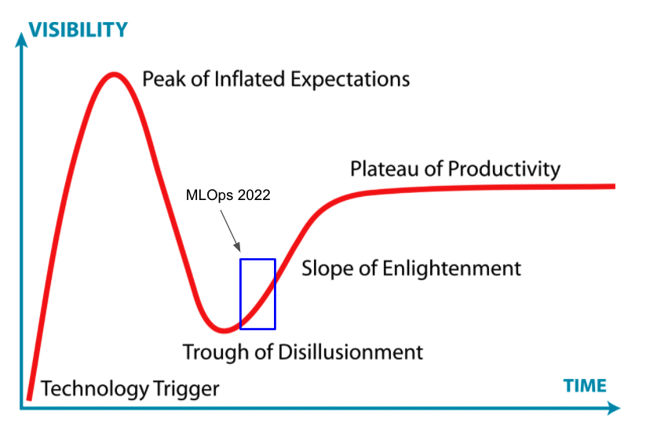

<figure>
    
</figure>

MLOps is a Shitshow, but that's to be expected

Does this sound familiar? You read an article that said machine learning was *the* job to get in 2022, being not only super in-demand but commanding among the [highest industry salaries around](https://artificialintelligence-news.com/2019/03/15/machine-learning-jobs-high-paying-demand/). That sounds nice: job security and money. What's not to like?

You decide you're going to go for it, learn the skills to be a machine learning engineer, do a few side projects to beef up your resume, and land that job. You're feeling good. I mean how hard could it possibly be?

You remember seeing on Twitter that there's some [course at Berkeley for full-stack deep learning](https://fullstackdeeplearning.com/) that's supposed to be really good. You do a few lessons and then see this diagram with the tooling required for the modern ML ecosystem:

<figure>
    
</figure>

Oof. That's a lot of stuff to learn. You've used some of this tech but what's Airflow? dBt? Weights & Biases? Streamlit? Ray? 

You feel a bit discouraged. So after a hard-day of reviewing course materials you decide you need some inspirational pick-me-ups. Venture capitalists are always good at thinking big, painting the promised land, getting people excited. 

You remember that one VC [Matt Turck](https://mattturck.com/) always does some annual review of what's hot in AI today. Snazzy new tech, that always gets you more pumped than a Boston Dynamics demo video. So you check out [his 2021 review](https://mattturck.com/data2021/) talking about the ML and data landscape. 

This is the first image you see:

<figure>
    
</figure>

What. The. Actual. Hell. 

You close your browser, pour yourself a glass of Scotch, and ponder the fickleness of life. Fin.

Today, the machine learning continues to be one of the most talked about and touted technology waves in society promising to revolutionize every corner of society. 

And yet the ecosystem is in a frenzied state. New fundamental science advances come out of every week. Startups and enterprises spray new developer tools into the market trying to capture a chunk of what promises to be a market worth between [$40-120 billion by 2025](https://searchsoftwarequality.techtarget.com/feature/Analysts-mixed-on-future-growth-of-MLOps-AutoML-tools). 

Things are moving fast and furious. And yet if you're just entering the discourse, how do you make sense of it all?

In this post, I want to focus the discussion about the state of machine learning operations (MLOps for short) today, where we are, where we are going. 

As a practitioner who's worked at leading AI organizations and also runs a [machine learning consultancy helping companies deliver data-driven value](https://www.pametandata.com/), I've experienced first-hand the trials and tribulations of bringing ML to the real world. I truly believe there's a lot to be optimistic about with machine learning, but the road is not without a handful of speed-bumps. 

Because Google Analytics tells me that 90% of readers are going to drop off after this intro, the TLDR of the post for those that want to be able to tell their colleagues "I got the gist of what he was saying."

**TLDR**: TODO!

Let's begin. 

# What's in a Name

Let's first start with some definitions. MLOps refers to the set of practices and tools to deploy and reliably maintain machine learning systems in production. In short, MLOps is the medium by which machine learning enters and exists in the real world. 

It's a multidisciplinary field that exists at the intersection of devops, data science, and software engineering. 

<figure>
    
</figure>

While there continue to be exciting new advances in AI research, today we are in the deployment phase of machine learning. As a consequence, we are seeing an overabundance of new tools being created to standardize and capture companies' workflows delivering machine learning value. 

In the Gartner technology hype cycle paradigm, we are gradually entering the Slope of Enlightenment where we've passed the AGI fear-mongering and organizations are now asking the serious operational questions about how they can get the best best bang for their machine learning buck.

<figure>
    
</figure>

# The State of Affairs Today
- MLOps is an a frenzied state with regards to tooling
- State of affairs is both incredibly exciting and anxiety-inducing. 
- so many stores: model store, feature store, evaluation store - they're all just fancy databases
- the people who really suffer are those newcomers to the field because the barrier to entry is really steep
  - analogy to webdev, lucky to have someone handhold me through the process
- unless you are a startup founder, many ML practitioners tend to be bearish on the current tooling landscape

- at least bimodal distribution of customer segment, not everyone has uber scale problems but they define the narrative
  - early wins companies
  - refer to josh tobin's designation
  - jacopo's resource
  - include plot of distribution of companies, long-tail distribution

# What MLOps Can Learn from CI/CD Revolution
- our abstractions are just not that clean yet, leaky in that many aspects of infrastructure trickle into data concerns
- mlops is a mess because there are leaky abstractions across the architecture boundaries, things being redefined
- We can look to past trends in tooling alla devops of 10+ years ago to see how things evolved

# Strong Predictions, Weakly Held
- Talk about things to look forward to - trends of the future
  - closing the loop on machine learning systems (monitoring)
  - declarative systems for ML, i do think analogy to DBs is an apt one
- talent shortage is still rampant
- Machine learning tapering Google trend, interest is slowing down?
  - Deployment phase of cycle

- data engineering as an artifact position of the transition

