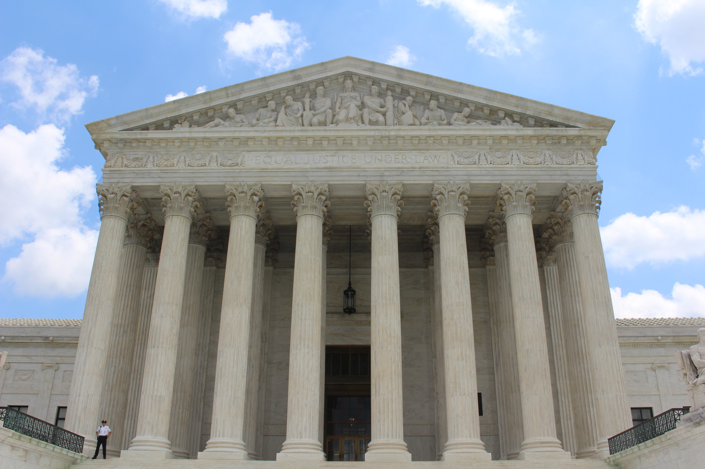

<figure>
    
    <figcaption>Photo by Claire Anderson</figcaption>
</figure>

United States financial regulation is complicated and messy. Between countless regulatory agencies with overlapping oversight, structural fragmentation, and largely reactive policies, our system lumbers forward like a Frankensteinian creature. 

As an engineer, I'm accustomed to the mantra of *move fast and break things.* When it comes to the financial system, however, that philosophy does not fly. And for good reason!

While that policy may be sufficient when you're recommending items in someone's Facebook social feed, in the financial context, hasty and poorly thought-out practices can undermine the entire global economic system including the lives of millions of people, as it did in the [2008 financial crisis](https://en.wikipedia.org/wiki/Financial_crisis_of_2007%E2%80%932008).

In this post, I will outline the US financial regulatory landscape by describing its motivational principles, organizational structure, and the history and responsibilities of the main regulatory bodies. With the recent tidal wave of fintech companies seeking to revolutionize and in some cases, overhaul the financial system, these groups stand to face regulatory headwinds. 

Building a financial services company is not like building a social networking product. To truly appreciate this, I believe it's worth understanding the main players in the US regulatory maze, how they interact, and why things are the way they are.

## Goals of Financial Regulation

Before we get into the nitty-gritty of the status quo, a natural question is: why do we need regulation at all? After all, this is 'Merica 🇺🇸. We love free markets, flirt with *laissez-faire* capitalism, and fear centralized government. 

The reality is a bit more complicated than that. The US financial system stands at the center of not just the financial lives of its 330M inhabitants but indirectly the lives of the entire world. Our banking system commands over $20T in assets! With that kind of monetary clout, it's clear that *some* regulation is necessary.  

However, that belief isn't universally held and in practice, instituting any guardrails can vary greatly with vastly different outcomes. As recently as the '08 financial crisis, regulators believed that financial firms knew themselves and their risks better than government agencies possibly could so these firms should be responsible for regulating and managing those risks. 

The outcomes of that attitude were disastrous. We got burned, and what followed was one of the [most sweeping pieces of financial regulation](https://www.investopedia.com/terms/d/dodd-frank-financial-regulatory-reform-bill.asp) in nearly a century. 

In the US, this constant see-saw in our attitudes toward regulation is not new and is largely responsible for the hodge-podged solution we've converged on. We want things to be as free as they can be, then 💩 hits the fan, and we react by introducing another agency to play watch-dog alongside the old dogs. 

It's analogous to having an open-wound with layers of band-aids. When a wound gets irritated, we don't take any of the old band-aids off. We just layer on a new one. 

At a high-level, the three primary objectives of financial regulation are as follows:
- Stability of the financial system
- Safety and soundness of individual firms
- Protection of investors and consumers through fair and transparent business conduct of financial institutions.

Different regulatory organizations that we will discuss below prioritize some of these tenets more than others (i.e. SEC for investor protection). 

Within this framework, regulators convey expectations through a combination of rule-based behavior (such as outlining strict policies for consumer protection and how to handle anti-money laundering) as well as more free-form principles-based behavior (typically concerning prudential matters such as management of a firm's liquidity, market, and capital risk).

Now let's see how this plays out in practice by looking at what regulatory bodies exist today and what their jobs are.

## Office of the Comptroller of the Currency

The OCC, or Office of the Comptroller of the Currency, is one of the three major federal bank regulators today and the oldest in the bunch. The OCC was created with the signing of the National Currency Act in 1863 by Abraham Lincoln. Prior to its creation, the US was coming out of a period known as the Free Banking Era where a collection of state-chartered banks operated independently throughout the country without federal regulation. During this period, each bank issued its own paper notes and bank failures were very common. 

To combat this tremendous financial instability, the OCC was established as an independent branch of the US Department of Treasury. Its responsibilities included organizing and administering a system of nationally-chartered banks and issuing a uniform national currency. 

Today the OCC is the primary regulator for 1200 national banks and federal savings associations, comprising 67\% of all US commercial banking assets. It has considerable power to fine institutions under its purview for what it regards as inadequate controls and compliance protocols. For an example of this, check out the [JP Morgan fine from last year](https://www.bankingdive.com/news/JPMorgan-office-comptroller-currency-fine-controls/589735/). 

## Federal Reserve System

While the establishment of the OCC was a great step forward in the US financial system with regards to standardizing the national currency and issuing national bank charters, the next few decades demonstrated some remaining gaping holes in the nation's decentralized banking system. 

Bank runs and panics were very common during those years culminating in the worst US financial crises up to that point in 1893 and 1907. Both of these events literally required J.P. Morgan to step in to arrange emergency loans for banks using his own personal wealth and network. 

Imagine how crazy that would be today: the banking system falls apart, and the government turns to Jeff Bezos to keep the banks afloat by issuing loans from his own assets. People can barely stomach him flying into space, let alone being the lender of last resort fo the entire financial system. 

By this point, Americans were ready to stomach their aversion to a centralized bank in the interest of stabilizing the US financial system, overseeing the nation's money supply, and making US credit more dependable. After several years of negotation, Congress established the Federal Reserve System in 1913 with the passing of the Federal Reserve Act. 

In addition to overseeing monetary policy, today the Federal Reserve is the primary regulator of state-chartered banks that are part of the Federal Reserve as well as bank holding companies, foreign branches of US national and state member banks, and state-chartered US branches of foreign banks. 

One strange regulatory artifact is that every national bank must be a member of the Federal Reserve System but they are regulated by the OCC. Like other federal bank regulators, the Fed has the power to fine financial institutions as it did with [Goldman Sachs last year](https://www.federalreserve.gov/newsevents/pressreleases/enforcement20201022a.htm).

## Federal Deposit Insurance Corporation

The Federal Deposit Insurance Corporation, or FDIC, is the last major federal bank regulator. To provide some historical context, in the 1920s and 1930s, bank failures were still very common nationally amid banks' exposure to volatile equity markets. This culminated in the 1929 stock market crash and subsequent Great Depression. 

With the passing of the 1933 Banking Act, the FDIC was created to help restore faith in the banking system by insuring deposits in institutions up to a certain amount for every consumer. This amount was \$2500 in the original law but has progressively been increased over the past few years, reaching \$250K in 2009. Note that this figure is per depositor, per bank, for each account ownership category. 

So when you see the phrase *FDIC-insured* on your bank's website, that means that even if your bank were to go up in flames in some cataclysmic apocalypse 🔥, you wouldn't lose any of your funds held with the bank up to \$250K. 

Today, the FDIC provides deposit insurance for some 5200 financial institutions. Of interesting note is that the FDIC does not receive any congressional appropriations but is rather funded via premiums that financial instituations pay for the insurance coverage. 

Since its establishment, it claims that no depositor has lost a single dollar of insured funds which is a pretty phenomenal success given a century of intermittent crashes and stress testing of the banking system. However, the existence of the FDIC has provoked controversy through the years, as one can see how providing banks with this safety net can invite riskier behavior on the part of these institutions. 

Outside of the insurance it provides, the FDIC also acts as the primary regulator of state-chartered banks that are not members of the Federal Reserve, so it is responsible for ensuring these organizations comply with consumer protection laws and also meet safety and soundness requirements. So yeah, they can [impose fines too](https://www.jdsupra.com/legalnews/fdic-fines-new-york-based-apple-bank-12-8070673/). 

## State Regulators

In addition, to the federal regulators mentioned above, each state also has its own financial regulatory authority that supervises banks and issues charters. In practice, virtually every state-chartered bank has both a state and a federal regulator. As you can imagine, this introduces the potential for conflicting oversight and regulatory arbitrage (i.e. when given two overlapping rules you have to follow, abide by the more favorable one). 

Depending on the state, the respective regulatory authorities may have more favorable working relationships with their banks than federal regulators.

## Securities and Exchange Commission

The Securities and Exchange Commission (SEC) is an independent federal regulatory agency established to protect and preserve the American securities markets. It was founded in 1934 through the Securities Exchange Act, a direct response to the 1929 stock market crash, and operates according to the following principle tenets:
- Protect investors
- Maintain fair, orderly, and efficient markets
- Facilitate capital formation through public and private securities offerings

American households' investments in securities are insured through the Securities Investor Protection Corporation (or SIPC) which provides up to \$500K of insurance in the event that your brokerage fails (not if your \$GME stock drops in value).

In addition, the SEC requires companies selling securities in the public markets to include appropriate disclosures about their businesses so that investors can evaluate the risks and rewards of purchasing the securities. 

The size of the markets that the SEC regulates are mind-blowing. Today the SEC oversees roughly \$97T in US securities trading annually! As a result, SEC enforcement actions are aggressive and unrelenting. Some \$1.2B was returned to harmed investors through various actions committed by wrongdoers last year. 

## Commodity Futures Trading Commission

The Commodity Futures Trading Commission (CFTC) is a federal regulatory agency that focuses on administering and supervising the US derivatives markets. While the agency was created in 1974, derivatives trading has an interesting history in the US, going as far back as the mid 1800s with the introduction of some of the earliest futures markets focusing on grains. 

Today the CFTC oversees a tremendous market for these alternative financial instruments. The gross value of over-the-counter derivatives was estimated to be about \$16T in the second half of 2020. With their regulatory powers, the CFTC also [fines a lot](https://twitter.com/CFTC). Given the ambiguous distinction between securities and derivatives instruments, the regulatory oversight between the CFTC and SEC can overlap requiring active collaboration (and sometimes generating conflict as is happening with crypto now) between the two agencies.

## National Credit Union Administration

The National Credit Union Administration, or NCUA, is the second US agency (besides the FDIC) that provides insurance to depositors in US depository institutions, focusing solely on federal credit unions. Established in 1970, the NCUA administers the National Credit Union Insurance Fund, which is backed by the full credit of the US government, and also insures member accounts up to \$250K. Today the NCUA insures, regulates, and supervises some 5000 credit unions.

## Consumer Financial Protection Bureau

The Consumer Financial Protection Bureau (CFPB) is the primary agency responsible for, well, consumer protection in financial matters. This regulatory purview includes banks, credit unions, mortgage servicing, securities firms, and more. 

Founded in July 2010 in response to the Great Recession as part of the Dodd-Frank Wall Street Reform and Consumer Protection Act, the CPFB consolidated the regulation of these issues under a single umbrella. Prior to its creation, consumer protection responsibilities were balkanized across seven different federal agencies. 

Today, any financial institution becomes regulated by the CFPB the moment its total assets exceed \$10B. This requirement persists some degree of regulatory fragmentation, as there are nearly 5000 regional banks alone that don't meet the threshold and therefore end up being regulated by one of the main banking agencies.

Increasingly, the CFPB has assumed responsibility for regulations that don't fit nicely into other organizations' purviews. For example, the CPFB oversees Section 1071 of Dodd-Frank which is a rule focusing on small-business (not consumer) data. 

Throughout its lifetime, the CFPB has alternated between being aggressive in enforcement actions for violation of consumer rights (\$6B in fines in 2015) to more lenient ($34M in fines in 2020). 

## Self-regulatory Organizations

Any overview of the US regulatory landscape is incomplete if we don't discuss self-regulatory organizations. These are typically private coalitions that enforce regulations and standards for some industry. While they can create rules and [even impose fines](https://www.finra.org/media-center/newsreleases/2021/finra-orders-record-financial-penalties-against-robinhood-financial), federal agency laws always supercede those of a self-regulatory organization and national agencies can dictate the organization's broader policy. 

In practice, federal agencies may delegate some amount of regulatory oversight to the appropriate self-regulatory organization. So think of the government agency like the principal at a school and the self-regulatory organization like your appointed hall monitor. 

One popular example of a self-regulatory organization is [FINRA](https://www.finra.org/#/), which writes and enforces rules concerning registered brokers in the US. FINRA also administers the exams securities professionals must pass to provide their services. 

Self-regulatory organizations present an intriguing regulatory conflict-of-interest. Because they are private and often run by member groups (like a credit union), there is an open question as to how strict these organizations can be expected to be in their rules given the bias built into the system.

## Department of Justice

While the Department of Justice (DOJ) doesn't only concern itself with overlooking financial matters, many of the above agencies such as the SEC, CFTC, and FINRA refer potential criminal matters to them for prosecution. Getting to this point for a financial institution is quite serious and significant fines [can be issued.](https://www.justice.gov/usao-ma/pr/state-street-corporation-pay-115-million-criminal-penalty-and-enter-deferred-prosecution)

## Final Thoughts

Now that we've completed our whirlwind tour of the main players in the US financial regulatory ecosystem, it's worth including a few notes: each state may also have its own slew of financial regulators (such as the Department of Financial Protection and Innovation in California), and there are several other bodies we have not discussed (such as the Federal Trade Commission) that get to swing the gavel in their own ways.

Hopefully it's clear how involved this whole ecosystem is. Through two centuries of largely reactive financial policies, we've converged on this intricate regulatory Venn Diagram. 

Many financial institutions deeply fear falling on the wrong side of the Financial Regulator but because of the ambiguous nature of laws and practice, their regulatory programs tend to be best-effort initiatives. 

On top of that, compliance and regulation are cost-centers for these groups, only impacting bottom line in the event of punitive measures. It's hard to justify being super proactive, unless you fear an impending fine. In the meantime, the compliance and risk officers at these institutions have their work cut out for them. 

## Further Reading

https://www.investopedia.com/articles/economics/08/federal-reserve.asp
https://www.occ.treas.gov/about/who-we-are/history/1866-1913/index-occ-history-1866-1913.html
https://www.federalreserveeducation.org/about-the-fed/history
https://www.frbsf.org/education/teacher-resources/what-is-the-fed/history/
https://www.fdic.gov/about/what-we-do/
https://www.federalreservehistory.org/essays/glass-steagall-act
https://www.ncua.gov/about-ncua/historical-timeline
https://www.investor.gov/introduction-investing/investing-basics/role-sec
https://www.sec.gov/about/what-we-do
https://www.bis.org/publ/otc_hy2105.htm
https://www.consumerfinance.gov/data-research/research-reports/building-the-cfpb/
https://www.latimes.com/business/story/2021-01-11/column-cfpb-biden

---

*Thanks to [Alex Johnson](https://twitter.com/AlexH_Johnson) and [Reggie Young](https://twitter.com/ReggieCYoung) for their insightful and nuanced feedback on earlier versions of this post. The good stuff is theirs. Any mistakes are mine.* 
