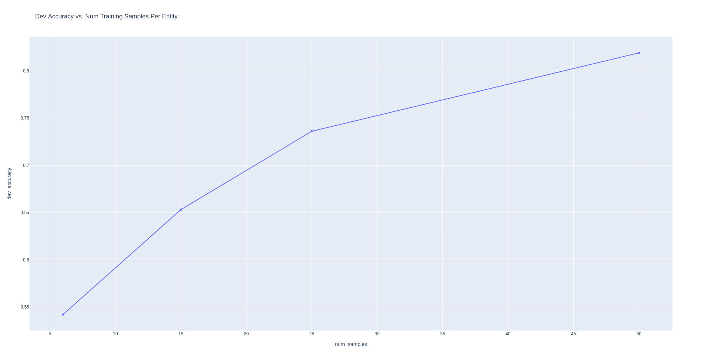

<figure>
    
</figure>

Since its announcement in 2020, [OpenAI's GPT3](https://openai.com/api/) model has taken the natural language processing community by storm, enabling a completely new paradigm for designing text-based applications and functionalities. 

In this article, I am going to walk through how to fine-tune a GPT3 model for your use-case. In particular, I will be building a named entity recognition system over a legal document dataset.

Let's begin. 


## GPT3 Background

GPT3 is a transformer-based large language model announced in this paper from [Brown et. al.](https://arxiv.org/abs/2005.14165). It is a massive 175B parameter language model, which at the time, was the largest model of its kind though it has since been [superceded](https://github.com/NVIDIA/Megatron-LM) [by](https://ai.googleblog.com/2022/04/pathways-language-model-palm-scaling-to.html) [others](https://arxiv.org/abs/2112.11446).

GPT3 was pretrained on a combined corpus of datasets including a filtered version of the [Common Crawl dataset](https://commoncrawl.org/), [WebText](https://github.com/jcpeterson/openwebtext), the [Books 1 and Books 2 datasets](https://paperswithcode.com/dataset/bookcorpus), and English-language Wikipedia. It used a standard language modeling objective based on a Transformer decoder.

While there is not a huge amount of novelty around the fundamental modeling architecture, GPT3 showed that at scale in terms of data and number of parameters, the model developed impressive few-shot and zero-shot learning capabilities. 

In order to elicit these capabilities, the model relies on what is called prompting, where it is provided a prompt with a set of natural language instructions describing a task and the model completes the prompt in a manner consistent with those instructions.

As one example, the model may be prompted to:
```
Translate the following sentence from English to Spanish.

The cat jumped over the moon.
```

to which the model will respond:
``` 
El gato saltó por encima de la luna.
```

This is super impressive because 1) we have not explicitly told the model how to perform translation (it has learned this implicitly from the data it was trained on) and 2) we are prompting the task in completely natural human language. 

The above is an example of prompting GPT3 in a zero-shot setting because have not given it any demonstration of how to perform the task. 

We could construct an alternate prompt where we do give the model a few examples of how to perform the desired task:
```
Translate from English to Spanish.
English: I like cats.
Spanish: Me gustan los gatos.

English: I went on a trip to the bahamas.
Spanish: Fui de viaje a las bahamas.

English: Tell me your biggest fear.
Spanish:
```

When prompted in this fashion, the model will respond:
```
Dime tu mayor miedo.
```

This is an example of few-shot learning, and various papers report improved performance on various tasks when the model is given several demonstrations of what it is being asked to do.

## Problem Setup

For our purposes, we will be developing a [named entity recognition](https://en.wikipedia.org/wiki/Named-entity_recognition) system for a legal dataset. Specifically we will be extracting spans of text from snippets in rental agreements and labeling them according to a prescribed taxonomy of legal terms.  

The dataset we will be using is based off of 179 lease agreements from [Leivaditi et. al.](https://arxiv.org/abs/2010.10386) and contains a taxonomy of 12 legal terms including:
```
designated_use
end_date
expiration_date_of_lease
extension_period
leased_space
lessee
lessor
notice_period
signing_date
start_date
term_of_payment
vat
```

## Finetuning

Interacting with GPT3, either for inference or finetuning, requires usage of the [OpenAI GPT3 API](https://beta.openai.com/docs/). 

In order to finetune our model,we first need to construct a training dataset in accordance with the OpenAI API specification. In this case, we need to provide a JSONL format with newline-delimited examples each of which is formatted as follows:
```
{
    "prompt": "Some prompt we provide.",
    "completion": "The expected completion from the model."
}
```

For our purposes, we construct a prompt of the following form:
```
Find the snippet of text containing the [LEGAL TERM] from the following statement in a legal contract: [STATEMENT FROM A CONTRACT]
```

Concretely, we get examples such as this one:
```
{
    "prompt": "Find the snippet of text containing the end date from the following statement in a legal contract: 6.1 Both parties agree that, the lease term commences from July 1, 2012 and ends on June 30, 2015. The unit rent per square meter of construction area of the Premises per day is adjusted to RMB Four Point Two Zero (RMB4.20), adding up to an annual rental of RMB Eight Million Two Hundred Seventy Thousand Seven Hundred Forty Nine Point Six Two (RMB8,270,749.62); \n\n-->\n\n", 
    "completion": " June 30, 2015\n###"
}
```

There are a few things to note here. First observe that we end each prompt with the sequence `\n\n-->\n\n`. This is to ensure the model knows when to actually start generating the completion to the prompt. This is a really important formatting step to include. 

In addition, we end each completion with the sequence `\n###` to also indicate when the model's completion of the prompt is done. It's important that this stop sequence does not appear in any completion, so make sure that it is unique. 

You also must start with your completion with whitespace due to the tokenization scheme used during training of the model. 

Finally, for our purposes because we are building an NER model, we need to teach the system how to abstain from extracting a snippet for a given term if there is no snippet in the text we provide it. Therefore, we include a handful of negative examples to the model in our training dataset such as the following
```
{
    "prompt": "Find the lessor from the following legal statement: LEASE TERM BEGINNING AND COMPLETION DATES\nDate of beginning 9/1/2007\nDate of completion 8/31/2008 \n\n-->\n\n", 
    "completion": " no entity\n###"
}
```

One empirical observation, the ratio of negative examples to positive examples in the dataset will have a big impact on the model's ability to extract certain named entities because it determines the degree to which our dataset is imbalanced. We must tune this carefully, otherwise the model will learn to just always predict `no entity`. In practice, I've found that for a dataset of a few hundred positive examples, providing three negative examples ends up striking a good balance.

Now we can turn to using the API.

First we need to install the Python SDK and export our API key:
```
pip install openai
export OPENAI_API_KEY=[SECRET_API_KEY]
```

Afterwards, we can use the installed commandline tool to validate our data file:
```
openai tools finetunes.prepare_data -f [JSONL-DATA-FILE]
```

This tool will give us suggestions for how to format the data in case we need to change something for optimal finetuning.

Once this is done, we can actually do the fine-tuning:
```
openai api fine_tunes.create -t [JSONL-DATA-FILE] -m [BASE_MODEL]
```

There are a handul of base GPT3 models provided in the API with the Davinci series being the largest, most capable, and most expensive to use. The lightest base model is the Ada series. 

OpenAI doesn't report official sizes for the models, but it seems likely based on their paper that the base models roughly align Ada, Babbage, Curie, and Davinci to 350M, 1.3B, 6.7B, and 175B parameters respectively.

For my experiments, I ended up using Curie and found it to perform reasonably well with only a handful of datapoints per label. 

Once we launch the finetuning, expect it to take on the order of 1-10 minutes though this has a big dependence on how much traffic the API is getting as well as how many examples you are providing for fine-tuning. 

In my experience, for several hundred examples in the train dataset, it took on the order of 5-7 minutes to fine-tune the model.


## Evaluation

Once our model is trained, the API provides us a unique identifier for the model which we can reference when we are invoking the inference endpoint. This identifier usually takes a form similar to: `curie:ft-personal-TIMESTAMP`.

Now we can invoke the new model either through the CLI or via the Python SDK. When using the Python SDK, our invocation will look like:
```
completion = openai.Completion.create(
                        model="curie:ft-personal-TIMESTAMP",
                        prompt="Extract the text snippet...",
                        top_p=1,
                        max_tokens=500,
                        stop=["\n###", "\n\n"])
```

We can plot the performance of our system for a fixed prompt and different numbers of examples for each label. Here we are evaluating on a fixed held out validation set. We get the following performance behavior of the model:

<figure>
    
</figure>

What's crazy is how with just 25 examples per label we can get nearly 75% accuracy, and when we scale to 50 examples per label we can exceed 82%. This demonstrates the powerful few-shot classification abilities of even the Curie series of the GPT3 model. 


## Final Thoughts

And with just a few simple lines of code, we have fine-tuned one of the largest and most powerful language processing models available today for our usecase. It's incredible that we've been able to build a custom model in this fashion, something that would be impossible to do using commodity consumer hardware. 

We'll conclude with a final set of considerations. First off, cost can still be a concern for using GPT3. For a single finetune run of a few hundred examples, it cost over $3. This makes running large-scale hyperparameter tuning experiments relatively intractable for hobbyists unless you have the funds to spare. 

Secondly, you should note that the performance of the model is quite sensitive to the prompt formulation. Modifying our prompt to say "from this statement" to "from the following legal statement" increased accuracy by ~6%. This certainly justifies the need for the emerging discipline of prompt engineering.

Good luck on your future usage of the GPT3 model. If you have any comments, questions, or concerns, don't hesitate to reach out!


