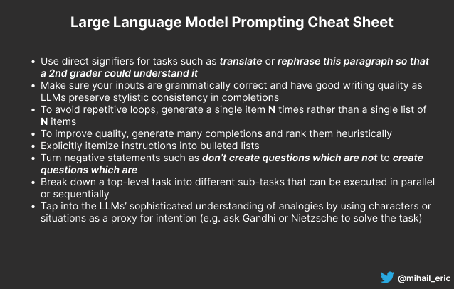
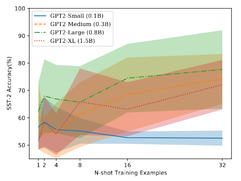
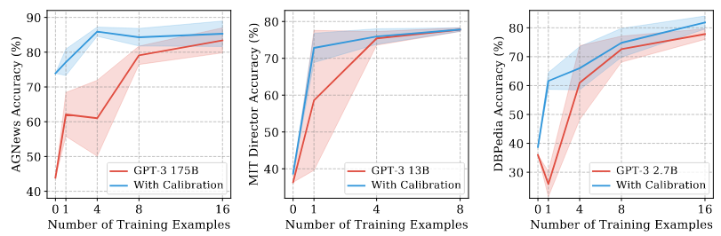

<figure>
    
</figure>

In recent years, with the release of large language models (LLMs) pretrained on massive text corpora, a new paradigm for building natural language processing systems has emerged. 

Rather than the conventional methodology of building text applications that has been used for decades and relies on a carefully curated, labelled training set, LLMs have birthed a new technique called **prompting**. 

In the prompting paradigm, a pretrained LLM is provided a snippet of text as an input and is expected to provide a relevant completion of this input. These inputs may describe a task being asked of the model such as:
```
Translate the following sentence from English to Spanish.

The cat jumped over the moon.
```

and the model is expected to return:
``` 
El gato saltó por encima de la luna.
```

The extraordinary thing about prompting is that if these inputs are appropriately crafted, a single LLM can be adapted to scores of diverse tasks such as summarization, question answering, SQL generation, and translation with a handful (or zero) training samples! 

Because the performance of these LLMs is so dependent on the inputs fed into them, researchers and industry practitioners have developed the discipline of **prompt engineering** which is intended to provide a set of principles and techniques for designing prompts to squeeze out the best performance from these machine learning behemoths. 

For this reason, prompt engineering is also sometimes called prompt programming or even [natural language programming](https://generative.ink/posts/methods-of-prompt-programming/).

In this post, I will provide a comprehensive review of the most interesting research, techniques, and use-cases in prompt engineering as applied to large language models. My goal is also to provide a set of actionable steps for being a more effective prompt engineer. 

If you're looking for a TLDR, here's a cheatsheet with tips/tricks when designing LLM prompts:

<figure>
	
</figure>

Otherwise, let's begin.


## Principles for Prompt Engineering

Prompting for large language models typically takes one of two forms: few-shot and zero-shot. In the few-shot setting, a translation prompt may be phrased as follows:
```
Translate from English to Spanish.
English: I like cats.
Spanish: Me gustan los gatos.

English: I went on a trip to the bahamas.
Spanish: Fui de viaje a las bahamas.

English: Tell me your biggest fear.
Spanish:
```
where the important thing to note is that the prompt includes a handful of examples showing how to perform the task of interest correctly. 

[Various research](https://arxiv.org/abs/2005.14165) claims that by providing these demonstrations, the LLM is *learning* how to perform the task on the fly.

In the zero-shot setting, no examples are provided in the prompt so the translation task is formulated as follows:

```
Translate the following sentence from English to Spanish.

The cat jumped over the moon.
```

Various research has shown intriguing prompt phenomena in LLMs. 

For example, [Lu et al.](https://arxiv.org/pdf/2104.08786.pdf) observed that in the few-shot setting, the order in which examples are provided in the prompt can make the difference between near state-of-the-art and random guess performance. 

This observation is agnostic to the LLM size (i.e. larger models suffer from the same problem as smaller models) and the subset of examples used for the demonstration (i.e. more examples in the prompt doesn't reduce variance). In addition, the performance of a given example ordering doesn't translate across model types. 

They then propose an entropy-based probing technique to generate the optimal prompt ordering without a development dataset. The approach is shown to robustly reduce variance for models even across diverse prompt templates. 

<figure>
	
	<figcaption>Performance of different LLMs as we increase the number of training samples in the prompt, demonstrating high variance across model sizes.</figcaption>
</figure>

[Zhao and Wallace et al.](https://arxiv.org/pdf/2102.09690.pdf) also do an in-depth study of the instability of few-shot prompting. They show that with few-shot prompts, LLMs suffer from three types of biases: 

- **Majority label bias**. They tend to predict training sample labels that appear frequently.
- **Recency bias**. They tend to predict answers near the end of the prompt.
- **Common token bias**. They tend to predict answers that appear frequently in the pretraining data.

They then describe a calibration technique designed to mitigate some of these biases, showing a reduction in variance and a 30% absolute accuracy bump.

<figure>
	
	<figcaption>Performance of different-sized LLMs depending on whether the models are calibrated to address biases or not.</figcaption>
</figure>

Other research by [Reynolds and McDonell](https://arxiv.org/pdf/2102.07350.pdf) makes the claim that *few-shot learning* is actually a misnomer and, in fact, LLMs use few-shot examples to locate an appropriate task in an existing space of tasks learned from the pretraining data.

This further justifies the need for really carefully-designed prompt engineering. Thus, they propose a few principles that should be employed when prompting:
- Use declarative and direct signifiers for tasks such as *translate* or *rephrase this paragraph so that a 2nd grader can understand it*.
- Use few-shot demonstrations when the task requires a bespoke format, recognizing that few-shot examples may be interpreted holistically by the model rather than as independent samples.
- Specify tasks using characters or characteristic situations as a proxy for an intention such as asking Gandhi or Nietzsche to solve a task. Here you are tapping into LLMs' sophisticated understanding of analogies.
- Constrain the possible completion output using careful syntactic and lexical prompt formulations such as saying *Translate this French **sentence** to English*  or by adding quotes around the French sentence.
- Encourage the model to break down problems into sub problems via step-by-step reasoning.

[Andrew Cantino](https://blog.andrewcantino.com/blog/2021/04/21/prompt-engineering-tips-and-tricks/) also provided a handful of practical tips and tricks for prompt engineering. These include:
- Make sure your inputs are grammatically correct and have good writing quality as LLMs tend to preserve stylistic consistency in their completions.
- Rather than generating a list of **N** items, generate a single item **N** times. This avoids the language model getting stuck in a repetitive loop.
- In order to improve output quality, generate many completions and then rank them heuristically.

[Mishra et al.](https://arxiv.org/pdf/2109.07830.pdf) perform an extensive empirical analysis of how to construct effective prompts for GPT3. They propose a set of reframing techniques for making an arbitrary prompt more likely to generate a successful completion. These techniques include:
- Use low-level patterns from other examples to make a given prompt easier to understand for an LLM.
- Explictly itemize instructions into bulleted lists. Turn negative statements such as *don't create questions which are not* to *create questions which are*.
- When possible, break down a top-level task into different sub-tasks that can be executed in parallel or sequentially.
- Avoid repeated and generic statements when trying to solve a very specific task. For example, instead of saying *Answer the following question* for a math problem, say *Calculate answer to the following question. You need to either add or subtract numbers...*

The researchers further demonstrate that their reframed prompts significantly improve performance in few-shot and zero-shot settings, generalize performance across model types, and are even able to outperform (smaller) traditionally supervised models. 
 
## Automated Prompt Generation

Given the finicky nature of manual prompt engineering, there have been a number of promising research efforts to develop automated prompting techniques. 

[Shin, Razeghi, and Logan et al.](https://aclanthology.org/2020.emnlp-main.346.pdf) developed a gradient-guided search technique for automatically producing prompts via a set of trigger tokens. When their technique was applied to masked language models (MLM), they were able to produce impressive performance on tasks such as sentiment analysis, natural language inference, and fact retrieval, even outperforming finetuned models in low-data regimes.

[Jiang and Xu et al.](https://watermark.silverchair.com/tacl_a_00324.pdf?token=AQECAHi208BE49Ooan9kkhW_Ercy7Dm3ZL_9Cf3qfKAc485ysgAAArswggK3BgkqhkiG9w0BBwagggKoMIICpAIBADCCAp0GCSqGSIb3DQEHATAeBglghkgBZQMEAS4wEQQM2owX5YtSdXpjV-uRAgEQgIICbiFIRZ2N5-ZjSsVvVpS-XpBuIN-JYsPqY9abB-KkzX31AQ1Pe1Ou6cJF84R7W1MjuCDc6oGv7Hws7n1YXbovGWgdfyKGZXv4FjlfwLeUo9Fk4BHzLrvanZ_CVtGpC9eFX8FoEnRzVhFlJb3-dYorzbEomACsbhTgSJ_pOWKCArc3Yr_Wf9m-hPpp4BGi90sI-P5wtLtY8haftJYdEDVi9SMi8R5NLj_GWgeFs5JufRhMM9xRwXJu2R4y6Vv7-wP3oQlfFPBlYFO_gdEQek74D_otcYDPlujm9hCUFtOeh018jaRT7thSHx8R-AcIPPntN0vsjDPnijsneZbfB0wwCmDDfxj9A7IzotcyVrcK0_uTvKDZfvA09FcPBlmoUcvQ1Xq_UZeV9FEn8d4Ih2cvPSduaVlRaKrub_7MjC9KPiAoQvEEH13QUf32pWswe_71rPdbLTSd0t2TacecO2OqaCcYF8WkgU3IZ9zoKCsBlFnWnVlQmAgG21PYHivfjLgzKd4r8hhVaAzxOxDbzyWmbC9auHT4DRRe8Pkw1fKl82lRYOw9dDtEPKQRAgXQ-ZB3NpXexOQo7akZ1Zx_2zxylHYErCDzHSEqQnvp4XlE-RKdkgUD95n9fPGE2httBmRzcpTh2rtuV645OPGj7SXayfoQv0CwVdNRRKGiD0RT4dyX5NueIF748z1lg7B4ubFBOqCCd__VMoHTOFuAZwnjR49dUJ0k1KyGHhNmS2ru3JL8cBHpixS5H2JomEDofmVpbIv83mIWgcdroVCT2Hhuvq7cr1BQUrQWvTsKWQhENrCnUHN4LLp43bgoYfkwg8I) proposed using mining and paraphrasing techniques to generate optimal prompts for MLM systems, demonstrating a nearly 10% boost in accuracy of relational knowledge extraction. 

[Li et al.](https://arxiv.org/pdf/2101.00190.pdf) created an alternative technique that uses a learned, continuous vector (called a *prefix*) that is prepended to the input of generative models whose other parameters are held fixed.

The researchers used prefix tuning for [GPT2](https://cdn.openai.com/better-language-models/language_models_are_unsupervised_multitask_learners.pdf) and [BART](https://arxiv.org/abs/1910.13461) generation and were able to outperform finetuned models with 1000x parameters in full-data and low-data settings.


## Survey of Prompting Use-cases

Part of the magic of LLMs is the sheer number of tasks they are able to perform reasonably well using nothing but few and zero-shot prompting techniques. [Some work](https://arxiv.org/pdf/2206.07682.pdf) argues that these emergent abilities only appear in large language models at a certain scale in terms of parameter size. 

Since their rise, LLMs have been applied in more formal academic contexts on everything from knowledge probing, information extraction, question answering, text classification, natural language inference, [dataset](https://arxiv.org/pdf/2202.04538.pdf) [generation](https://arxiv.org/pdf/2104.07540.pdf), and [much more](https://arxiv.org/pdf/2107.13586.pdf).

For a look at various applications built using LLMs, check out [this admittedly out-dated link](https://gptcrush.com/). 

Additionally for a neat collection of demonstrations showing prompt-based generation of everything from job application letters to dad jokes, check out [Gwern's article](https://www.gwern.net/GPT-3). Looking at some of these examples convinces me that there are some truly big paradigm shifts on the horizon in creative work.

If you want to keep up-to-date on the latest and greatest in prompt engineering tips and tricks, check out [Riley Goodside's work](https://twitter.com/goodside).

## Infrastructure for Prompt Engineering

While prompt engineering is still a relatively nascent concept, it clearly requires new interfaces for application development. There have been a number of projects released providing infrastructure for easier prompt design.

[Bach and Sanh et al.](https://arxiv.org/pdf/2202.01279.pdf) built PromptSource, an integrated development environment to systematize and crowdsource best practices for prompt engineering. This includes a templating languaging for defining data-linked prompts and general tools for prompt management.

In related work [Strobelt et al.](https://arxiv.org/pdf/2208.07852.pdf) developed PromptIDE, a handy visual platform to experiment with prompt variations, track prompt performance, and iteratively optimize prompts. 

I like the general direction of work like this because it suggests that if we systematize the search process for optimal prompts, then one outcome is an AutoML-style framework for prompt engineering.

While much of the work so far in prompting has focused on single-step prompt executions, we must weave together multiple prompting sequences to get more sophisticated applications. [Wu et al.](https://arxiv.org/pdf/2203.06566.pdf) formalize this in the notion of an LLM chain and propose PromptChainer as a tool to design these multi-step LLM applications. What's powerful about this platform is that it ties together not just prompting steps but also external API calls and user inputs, forming almost a [Webflow](https://webflow.com/) interface for prompt engineering. 

## Prompt Engineering Security

One interesting and concerning phenomenon observed in building LLM applications is the appearance of prompt-based security exploits. More specifically, [various](https://twitter.com/goodside/status/1569128808308957185?s=20&t=U5pyMwrmQ8NADdUIGFLG3A) [people](https://simonwillison.net/2022/Sep/12/prompt-injection/) have noted that by leveraging carefully-crafted inputs, LLMs can generate the "secret" prompts they use in the backend as well as leak credentials or other private information. This has drawn natural comparisons to old-school [SQL injection attacks](https://portswigger.net/web-security/sql-injection).

As of now, there are no robust mechanisms to address this issue. Instead people have proposed workarounds using [different formatting of the inputs](https://twitter.com/goodside/status/1569457230537441286), but it is clear more work needs to be done to prevent these vulnerabilities especially if LLMs will increasingly power more functionality for different applications in the future.


## Final Thoughts

Prompt engineering stands to fundamentally change how we develop language-based applications in the future. 

While there is exciting work being done in this field, one natural philosophical question that we are left with is whether prompting is really an art or a science. 

It's hard to say at this point, but significant energy is being spent by researchers and practitioners to understand the dynamics of these LLMs and what tasks they are able to perform. 

I personally like the analogy of prompting to designing effective Google searches. 

There are clearly better and worse ways to write queries against the Google search engine that solve your task, all of which exists because of the opaqueness of what Google is doing under the hood. While writing Google searches may seem like a fuzzy activity, the entire field of [SEO](https://developers.google.com/search/docs/fundamentals/seo-starter-guide) has emerged to help people get the most out of the magical Google algorithms. 

In the same way, prompting is clearly an effort to try to tame these LLMs and extract some value from the power captured in their parameters. While today it may seem a bit like pseudo-science, there are efforts to systematize it and there is too much value to capture in these LLMs to ignore these attempts and work entirely.

Will *prompt engineer* be an actual job title in the future or is this just an artifact of this current iteration of inferior models, something GPT-100 may make obsolete? 

Again it's hard to predict the future, but I am very bullish on auto-prompting techniques. Prompt engineering may evolve in the same way that hyperparameter tuning did where there *is* a bit of magic required to find the optimal learning rate, but we have still developed algorithms (grid search, random search, annealing, etc.) to make finding the right parameters easier. 

In any case, there's exciting stuff happening on the horizon in prompting for large language models. Keep an eye out for this field. 


## Further Reading

- [Prompt programming for LLMs: Beyond the few-shot paradigm](https://arxiv.org/pdf/2102.07350.pdf)
- [Reframing Instructional prompts in GPTK's Language](https://arxiv.org/pdf/2109.07830.pdf)
- [PromptSource](https://github.com/bigscience-workshop/promptsource)
- [AI Chains](https://arxiv.org/pdf/2110.01691.pdf)
- [Promptchainer](https://arxiv.org/pdf/2203.06566.pdf)
- [Making Pretrained Language Models Better Few Shot Learners](https://aclanthology.org/2021.acl-long.295.pdf)
- [Autoprompt: Eliciting Knowledge from Language Models with Automatically Generated Prompts](https://aclanthology.org/2020.emnlp-main.346.pdf)
- [Fantastically Ordered Prompts](https://arxiv.org/pdf/2104.08786.pdf)
- [Interactive and Visual Prompt Engineering for Ad-hoc Task Adaptation](https://arxiv.org/pdf/2208.07852.pdf)
- [Pretrain, prompt, and predict: A systematic survey of prompting methods in NLP](https://arxiv.org/pdf/2107.13586.pdf)
- [Calibrate before use: improving few shot performance of language models](https://arxiv.org/pdf/2102.09690.pdf)
- [GPT Crush](https://gptcrush.com/)
- [Fun](https://autoplot.app) [GPT3](https://twitter.com/goodside/status/1564379216271081473?s=20&t=b80W2bAXo1GpEj3GXFlKnw) [use-cases](https://twitter.com/goodside/status/1563989550808154113?s=20&t=b80W2bAXo1GpEj3GXFlKnw)
