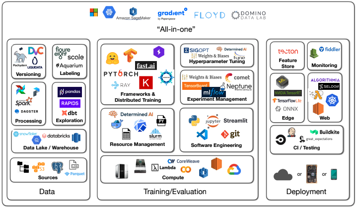
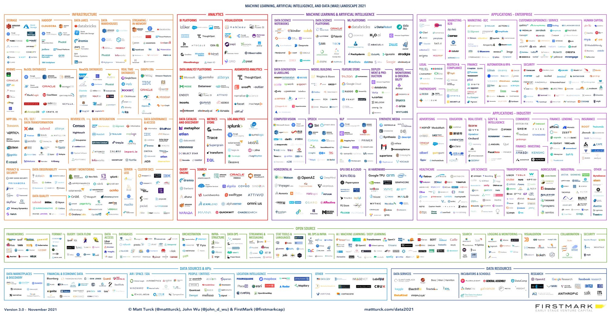
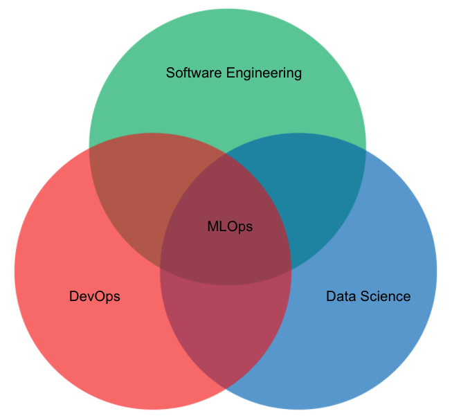
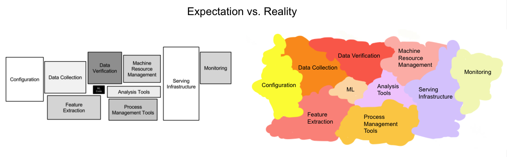
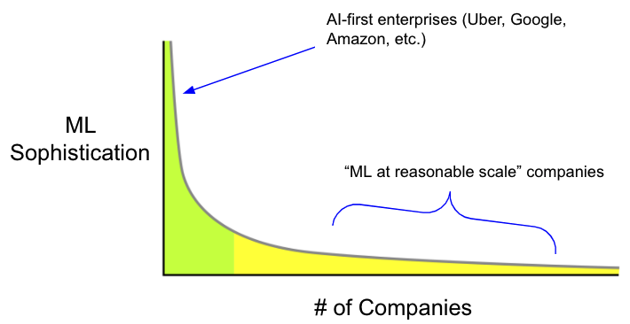

<figure>
    
</figure>

Does this sound familiar? You read an article that said doing machine learning was *the* job to get in 2022, being not only crazy in-demand but commanding among the [highest industry salaries around](https://artificialintelligence-news.com/2019/03/15/machine-learning-jobs-high-paying-demand/). 

That sounds nice: job security and money. What's not to like?

You decide you're going to go for it, learn the skills to be a machine learning engineer, do a few side projects to beef up your resume, and land that job. You're feeling good. I mean, how hard could it possibly be?

You remember seeing on Twitter that there's a [course at Berkeley for full-stack deep learning](https://fullstackdeeplearning.com/) that's supposed to be really good. You do a few lessons and then see this diagram with the tooling required for the modern ML ecosystem:

<figure>
    
</figure>

Oof. That's a lot of stuff to learn. You've used some of this tech, but what's Airflow? dBt? Weights & Biases? Streamlit? Ray? 

You feel a bit discouraged. So after a hard-day of reviewing course materials you decide you need some inspirational pick-me-ups from experts. 

Venture capitalists are always good at thinking big, painting the promised land, getting people excited. 

You remember that one VC [Matt Turck](https://mattturck.com/) always does some annual review of what's hot in AI today. 

Snazzy new tech. That always gets you more pumped than a Boston Dynamics demo video. 

So you check out [his 2021 review](https://mattturck.com/data2021/) talking about the ML and data landscape. 

This is the first image you see:

<figure>
    
</figure>

What. The. Actual. Hell.

You close your browser, pour yourself a glass of Scotch, and ponder the fickleness of life.

---

Today machine learning continues to be one of the most talked about and touted technology waves, promising to revolutionize every corner of society. 

And yet the ecosystem is in a frenzied state. 

New fundamental science advances come out of every week. Startups and enterprises spray new developer tools into the market trying to capture a chunk of what many speculate to be a market worth between [$40-120 billion by 2025](https://searchsoftwarequality.techtarget.com/feature/Analysts-mixed-on-future-growth-of-MLOps-AutoML-tools). 

Things are moving fast and furious. 

And yet if you're just entering the discourse, how do you make sense of it all?

In this post, I want to focus the discussion about the state of machine learning operations (MLOps) today, where we are, where we are going. 

As a practitioner who's worked at AI-forward organizations like Amazon Alexa and also runs a [machine learning consultancy](https://www.pametandata.com/?utm_source=website&utm_medium=blog&utm_campaign=mlops-is-a-mess), I've experienced first-hand the trials and tribulations of bringing ML to the real world. 

I truly believe there's a lot to be optimistic about with machine learning, but the road is not without some speed-bumps. 

Because Google Analytics tells me that ~87% of readers are going to drop off after this intro, here's the TLDR of the post for the busy reader. 

**TLDR**: MLOps today is in a very messy state with regards to tooling, practices, and standards. However, this is to be expected given that we are still in the early phases of broader enterprise machine learning adoption. As this transformation continues over the coming years, expect the dust to settle while ML-driven value becomes more widespread.

Let's begin. 

## What's in a Name

Let's first start with some definitions. 

MLOps refers to the set of practices and tools to deploy and reliably maintain machine learning systems in production. In short, MLOps is the medium by which machine learning enters and exists in the real world. 

It's a multidisciplinary field that exists at the intersection of devops, data science, and software engineering. 

<figure>
    
</figure>

While there continue to be exciting new advances in AI research, today we are in the deployment phase of machine learning.

In the Gartner hype cycle paradigm, we are gradually entering the Slope of Enlightenment where we've passed the AGI fear-mongering and [*Her*](https://en.wikipedia.org/wiki/Her_(film)) promises, and organizations are now asking the serious operational questions about how they can get the best bang for their machine learning buck.

<figure>
    
</figure>

## The State of Affairs Today

MLOps is in a wild state today with the tooling landscape offering more rare breeds than an Amazonian rainforest. 

To give an example, most practitioners would agree that monitoring your machine learning models in production is a crucial part of maintaining a robust, performant architecture. 

However when you get around to picking a provider I can name 6 different options without even trying: Fiddler, Arize, Evidently, Whylabs, Gantry, Arthur, etc. And we haven't even mentioned the pure data monitoring tools. 

Don't get me wrong: it's nice to have options. But are these monitoring tools really *so* differentiated that we need 6+ of them? And even when you select a monitoring tool, you still have to know what metrics to track which is often highly context-dependent. 

This further begs the question, is the market for monitoring really *so* big that these are all billion dollar companies?

At least with monitoring, there's generally agreement about what exact part of the machine learning life cycle these companies are trying to own. Other parts of the stack are not as crisply understood and accepted.  

To illustrate this point, it's become popular among companies to make every new tool they build for the MLOps stack some kind of a *store*. We started with [model stores](https://neptune.ai/blog/mlops-model-stores). Then [feature stores](https://www.tecton.ai/blog/what-is-a-feature-store/) emerged on the scene. Now we also have [metric stores](https://medium.com/airbnb-engineering/how-airbnb-achieved-metric-consistency-at-scale-f23cc53dea70). Oh also [evaluation stores](https://gantry.io/). 

My general take is that the machine learning community is particularly creative when it comes to making synonyms for *database*. 

A more serious thought is that the entire field is still standardizing the best way to architect fully-fledged ML pipelines. Achieving consensus around best practices will be a 5-10+ year transformation easily. 

During a particularly intriguing discussion among practitioners within the [MLOps community](https://mlops.community/), [Lina](https://www.linkedin.com/in/lina-weichbrodt-344a066a/?originalSubdomain=de) made a claim that the *ML stack* is about as general as the *backend programming development stack.* 

There's something very astute about that observation, the idea that a canonical *ML stack* is still not well-defined. 

In that light when we consider the phases of an MLOps pipeline, rather than a clear architecture diagram like the one from the [famous Sculley paper](https://proceedings.neurips.cc/paper/2015/file/86df7dcfd896fcaf2674f757a2463eba-Paper.pdf) today we have something that I call the MLOps Amoeba™.

<figure>
    
</figure>

We have a sense for what a lot of the right pieces are, but the true separation of concerns is still evolving. 

Hence MLOps tooling companies tend to enter the market addressing a certain niche and then inevitably start to expand amoeba-style into surrounding architectural responsibilities.

I believe that this tooling landscape with constantly shifting responsibilities and new lines in the sand is especially hardest for newcomers to the field. It's a pretty rough time to be taking your first steps into MLOps. 

I liken MLOps today to the state of modern web development, where new tools are coming on the market all the time and there are about 300 different combinations of frameworks that you can use to build a simple *Hello World* webapp. 

In these situations, my recommendation for newcomers is to:
1. Engage more experienced individuals to help you consider the options, think through different tech, and be a sounding board for "dumb" questions. 
2. Think carefully about the problem you are trying to solve and the [fundamental methodology needed to solve it](https://madewithml.com/#mlops), rather than getting too distracted by shiny tools or platforms. 
2. Spend a lot of time building real systems so that you can experience first-hand the painpoints that different tools address. 

And recognize that no one has all the answers. We're all still figuring out the *right* way to do things.

## You Can Start With ML at Reasonable Scale

One other thing worth nothing is that it's easy to get the impression that machine learning sophistication among enterprises is incredibly advanced. 

Based on my experience and those of other practitioners I've spoken with, the reality of ML maturation among enterprises is far more demure than we would be led to believe based on the tooling and funding landscape. 

The truth is there are only a handful of super sophisticated AI-first enterprises with robust machine learning infrastructure in place to handle their petabytes of data. 

Although most companies don't have that scale of data and hence those types of ML requirements, the AI-first enterprises end up defining the narrative of tooling and standards.

In reality, there's a huge long-tail distribution of awesome companies that are still figuring out their ML strategy.

<figure>
    
</figure>

These "ML at reasonable scale" companies (to use [Jacopo's terminology](http://www.jacopotagliabue.it/)), are fantastic businesses in their own right (in diverse verticals like automation, fashion, etc.) with good-sized proprietary datasets (hundreds of gigabytes to terabytes) that are still early in their ML adoption. 

These companies stand to get their first wins with ML and generally have pretty [low-hanging fruit](https://eugeneyan.com/writing/real-time-recommendations/#how-to-design-and-implement-an-mvp) to get those wins. They don't even necessarily require these super advanced sub-millisecond latency hyper-real-time pieces of infrastructure to start levelling up their machine learning. 

I believe that one of the big challenges for MLOps over the next 10 years will be helping to onboard these classes of businesses. 

This will require building friendly tools catered to ML-scarce engineering teams, improving internal infrastructure that isn't yet ready for advanced data work, and getting cultural buy-in from key business stakeholders.

## What MLOps Can Learn From DevOps Over the Years

To help us contextualize where we are in the MLOps progression and where we are going, it is useful to consider the analogy of the DevOps movement.

The adoption of DevOps practices in enterprises has been a multidecade-long transformation. For a long time prior to the introduction of DevOps, software engineering and IT (or Ops) teams operated as functionally separate entities. This siloed organization incurred massive inefficiencies in product releases and updates. 

Google was among the first organizations to recognize this inefficiency, introducing the role of a site reliability engineer in 2003 to help bridge the gap between developers and ops people. 

The principles of DevOps were further codified in a [landmark presentation](https://www.youtube.com/watch?v=LdOe18KhtT4) by John Allspaw and Paul Hammond in 2009 that argued enterprises should hire "ops who think like devs" and "devs who think like ops." 

Over the years as DevOps matured, we introduced concepts like continuous integration (and deployment) as well as new tools that have become staples of development teams around the world. 

Okay, history lesson aside, how do we tie this back? 

DevOps is an interesting case study for understanding MLOps for a number of reasons:

1. It underscores the long period of transformation required for enterprise adoption.
2. It shows how the movement is comprised of both tooling advances as well as shifts in cultural mindset at organizations. Both must march forward hand-in-hand.
3. It highlights the emerging need for practitioners with [cross-functional skills and expertise](https://netflixtechblog.com/full-cycle-developers-at-netflix-a08c31f83249). Silos be damned.

MLOps today is in a frazzled state, but that's to be expected. It's still unclear how to best define clean abstractions around infrastructure, development, and data concerns. 

We will adopt new practices and methodologies. Tools will come and go. There are a lot of questions, and as a community we are actively hypothesizing answers. The movement is still in its early innings. 

## Strong Predictions, Weakly Held

Now that we've discussed the state of things, I'd like to spend some time describing things to look forward to. 

These trends for the future are an anecdotal combination of many discussions with ML practitioners as well as a healthy sprinkling of the stuff I'm most excited about.

From a technology and architectural perspective, there are a few things we'll continue to see investment in:

- **Closing the loop in machine learning systems.** Right now many machine learning systems still largely adhere to a unidirectional flow of information from data source to prediction. But this leads to stale and fundamentally broken pipelines. We need to close these loops so the pipelines become more intelligent and flexible. The first step to achieving this is having a good monitoring system. While I did bash a bit on monitoring in earlier parts of this post, I do believe we should continue to think about monitoring of systems both at the predictive modeling layer as well as at the more upstream data layer. This is something that [Shreya](https://www.shreya-shankar.com/rethinking-ml-monitoring-1/) has done a lot of good writing about. 
- **Declarative systems for machine learning**. For a few years now, we've already seen the modeling tooling for ML become commoditized with the advent of software like [PyTorch](https://pytorch.org/) as well as higher-level libraries like [HF Transformers](https://huggingface.co/docs/transformers/index). This is all a welcome step for the field, but I believe we can do even more. Democratizing access to something involves developing abstractions that hide unnecessary implementation details for downstream users. [Declarative machine learning systems](https://arxiv.org/abs/2107.08148) are some of the most exciting next phases of this modeling evolution. Enabling a whole new generation of domain experts to apply ML to their problems requires tools that approximate what [Webflow and others](https://webflow.com/) did for web development.
- **Real-time machine learning**. ML systems are data-driven by design, and so for most applications having up-to-date data allows for more accurate predictions. Real-time ML can mean a lot of things, but in general it's better to have fresher models. This is something we will continue to see investment in over the next few years, as building real-time systems is a difficult infrastructure challenge. I should add that I don't believe many companies (especially those at the "reasonable scale" described above) need real-time ML to get their first wins. But eventually we'll get to the point where it's not a huge lift to integrate these types of systems from day 1. [Chip](https://huyenchip.com/2020/12/27/real-time-machine-learning.html) has done very good work on this front.
- **Better data management**. Data is the life-blood of every machine learning system, and in a future world where ML powers most enterprise functions, data is the life-blood of every organization. And yet, I think we have a long way to go with developing tools for management of data across its lifecycle from sourcing and curating to labelling and analyzing. Don't get me wrong: I love Snowflake as much as the next person. But I believe we can do better than just a handful of siloed tables sitting around in an organization's VPN. How can we make it easy for data practitioners to quickly answer questions about what data they have, what they can do with the data, and what they still need? [Data discovery tools](https://eugeneyan.com/writing/data-discovery-platforms/) are some of the early steps in addressing these questions. In my experience, the deficiencies in tooling are especially pronounced when we consider unstructured data.
- **Merging business insight tooling with data science/machine learning workflows**. The tooling around business insights has always been [more mature](https://www.hashpath.com/2020/11/build-a-modern-data-analytics-stack-from-scratch-in-under-an-hour/) than that of data science. One reason for this has to do with the fact that data analysts' output tends to be more readily surfaced to business leaders, and hence BI tooling investment is deemed more critical to an organization's bottom line. As we get to the point where data science outputs more directly deliver value to organizations, I believe we will see an increasing synergy amongst the two stacks. When all is said and done, machine learning is a tool that can enable more efficient operations, improved metrics, and better products. In that way, its goals are not that different from those of BI.

And now stepping back from the tech, here are a few meta trends we will see moving forward:

- **Talent shortage remains rampant**. For many organizations these days, it's hard to attract quality machine learning talent. When the big tech companies are dropping a median salary of [$330K/year](https://aipaygrad.es/) for AI talent, you can only imagine how heated the recruiting playing field is. It'll take years for the supply to eventually normalize the demand. In the meantime this shortage will continue to justify companies' investment in MLOps tooling: if you can't hire a machine learning engineer, try to replace them! 
- **Increasing consolidation around end-to-end platforms**. The big 3 cloud providers (AWS, GCP, Azure) and other specialized players ([DataRobot](https://www.datarobot.com/), [Databricks](https://databricks.com/), [Dataiku](https://www.dataiku.com/)) are all aggressively trying to own practitioner's end-to-end ML workflows. While I don't think any E2E solution is prime-time ready just yet, these companies have a few things going for them: 1) oodles of capital to trample (sorry, acquire) smaller players, 2) convenience of use in exchange for lack of flexibility and a cost premium, and 3) the inertia of brand (i.e the "no one got fired for buying IBM" syndrome). 
- **Cultural adoption of machine learning thinking**. As we continue to get more advanced tooling, organizations will adopt a machine learning mindset around their products and teams. In many ways, this also echoes the cultural shift that happened as [DevOps principles](https://www.atlassian.com/agile/devops) were adopted. A few things we can expect to see here are more holistic systems thinking (break the silos), augmenting feedback loops in products, and instilling a mentality of continual experimentation and learning. 

Phew, that was a long post. If you're still with me, thanks for reading. 

While MLOps is messy today, I am as optimistic as ever for the value machine learning promises to deliver for society. There are so many domains where data-driven techniques can deliver efficiency gains, insights, and improved outcomes. 

And all the pieces are lining up: an evolving tool chain to build systems that will get better, [educational](https://madewithml.com/) [offerings](https://stanford-cs329s.github.io/) to help train the next wave of practitioners, and a broader recognition that conscious investment in ML is essential for organizations.

The future is bright.

*Shameless Pitch Alert: If you're interested in cool generative AI tools, I'm currently building the [most advanced AI-powered image and video editor](https://storia.ai/lab?utm_source=website&utm_campaign=mihail-personal-page) which has been used by thousands of marketers, designers, and creatives to drastically improve their speed and quality of visual asset creation.*

*Thanks to [Goku Mohandas](https://twitter.com/gokumohandas), [Shreya Shankar](https://twitter.com/sh_reya), [Eugene Yan](https://twitter.com/eugeneyan), [Demetrios Brinkmann](https://twitter.com/Dpbrinkm), and [Sarah Catanzaro](https://twitter.com/sarahcat21) for their insightful and thoughtful feedback on earlier versions of this post. The good stuff is theirs. Any bad jokes are mine.* 
