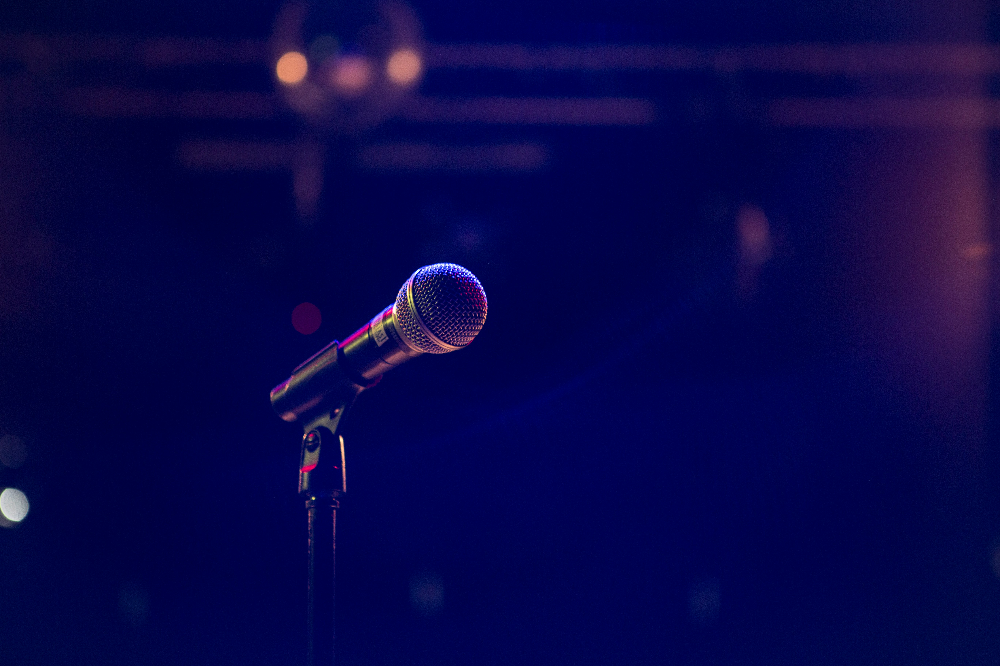
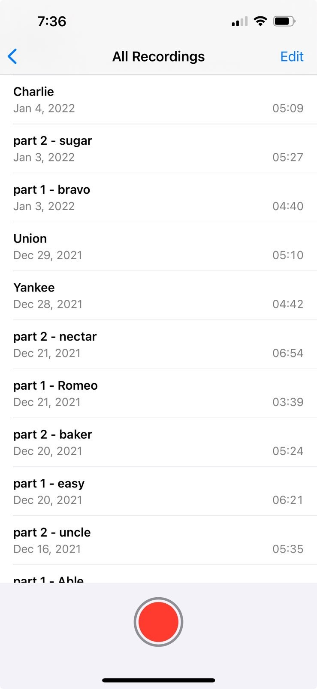
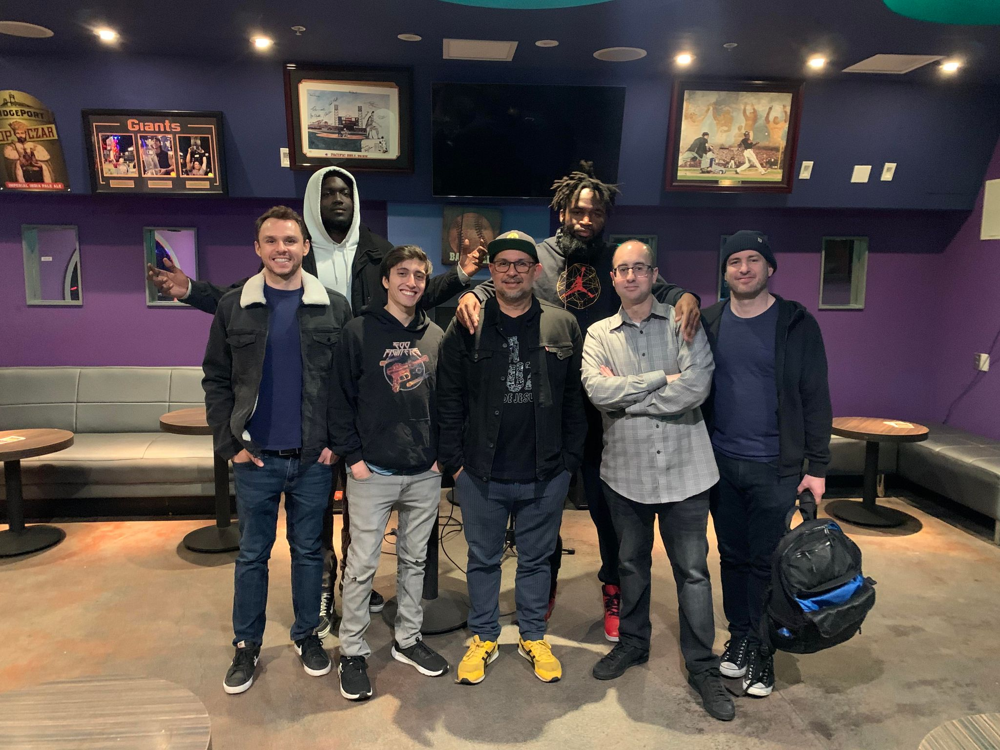
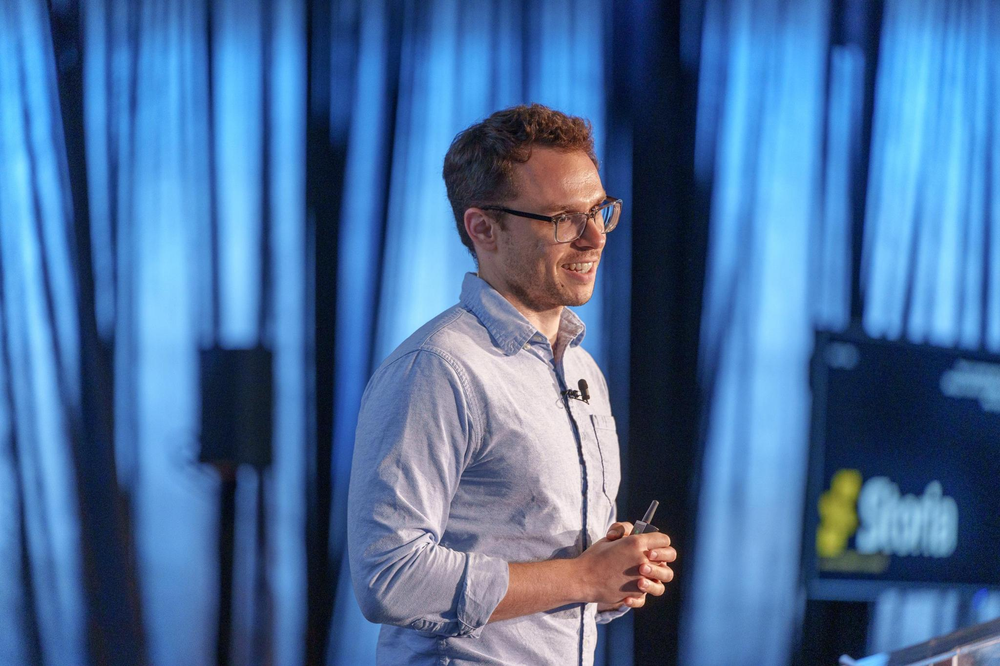
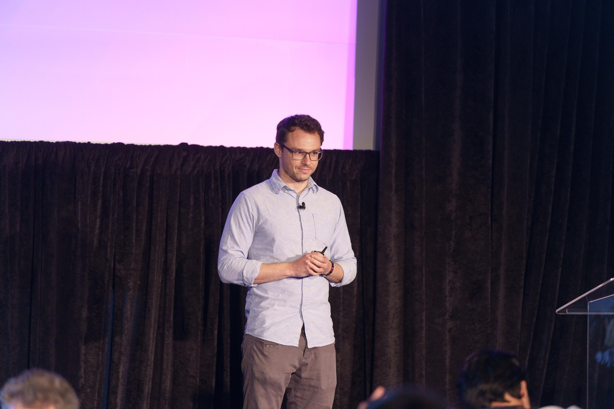
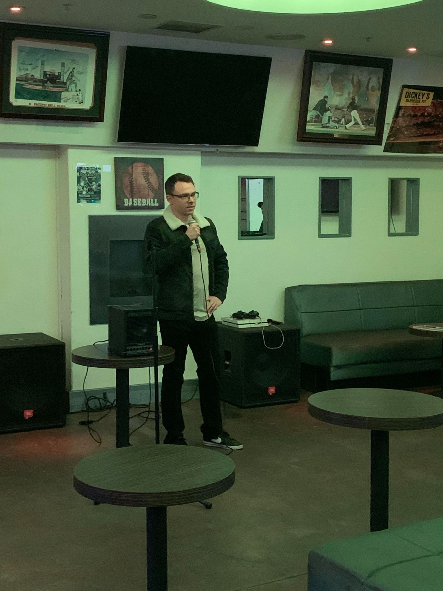
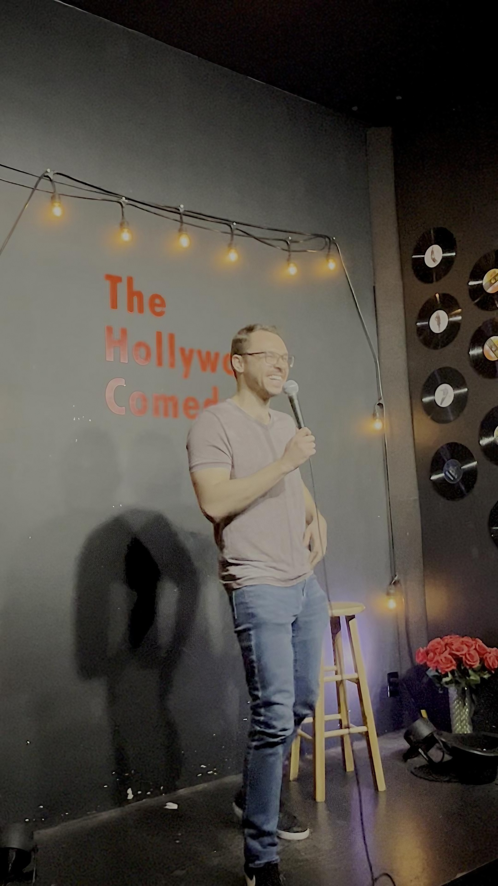

<figure>
    
</figure>

Software engineers don't typically do standup comedy. It's not something we're known for.

Two years ago, I decided to try my hand at comedy. 

Since then I've done over 100 open mics and shows trying to get strangers to laugh at my jokes.

And next fall my Netflix special will be released (as soon as I get the producers to stop putting it in the **horror** category). 

Here's what I've learned. 

## But...but...why?

Ok for starters, why would a software engineer even want to do standup comedy? 

First and foremost, I wanted to get better at public speaking. I had seen and done years of academic and industry presentations, and I felt 99.5\% of them (myself included) absolutely sucked. No one has ever mentioned an academic talk in the same breath as [Martin Luther King's famous speech](https://www.youtube.com/watch?v=vP4iY1TtS3s&t=305s&ab_channel=RAREFACTS) or [Churchill's WWII call to action](https://www.youtube.com/watch?v=MkTw3_PmKtc&ab_channel=JimmyThatcher).

Tough standard to compare to admittedly.

But I wanted to learn how to own a room through oration, how to feel the ebs and flows of a crowd, to guide an audience to a place and incite feeling in them like a flame. 

I had previously done a public speaking course in college and tried [Toastmasters](https://www.toastmasters.org/) but neither really clicked for me. 

Toastmasters seemed too nice. It felt like a support group for people who were afraid of public speaking. 

I wanted to be in a place where I could bomb and feel the full weight of it, where no one was socially obligated to save you from discomfort. 

And let me tell you: there is nothing like the deafening silence of a comedy crowd to make you reconsider all your life choices.

Finally, I had always loved watching comedy. I had been a standup fan for years and genuinely enjoyed making my friends laugh. 

This was enough motivation for me to seriously try my hand at standup. 

## On deck is...

<figure>
	<blockquote>
		
You look like Mark Zuckerberg trying to do comedy.

		<footer>
			<cite>— Every comedian that came after me at mics </cite>
		</footer>
	</blockquote>
</figure>

With that I went about going to my first standup open mic. Because I was living in Los Angeles at the time, picking a spot was [relatively](https://www.ianirarousso.com/la-open-mic-lists) [easy](https://thecomedybureau.com/). LA is one of two epicenters of comedy in the US (NY being the other) and so there are literally dozens of mics every single evening. 

I picked one, wrote some material, rehearsed it a bunch with friends, and showed up at [Badger & Jam](https://www.instagram.com/badgerandjam/) on December 7, 2021. 

There are ways to make your first comedy mic more bearable. You can tell people at the start of your set that it's your first time, and you will almost certainly get pity laughter. Or you get hammered. 

I did neither. 

I wanted to learn how to emotionally conquer the situation without a crutch. 

You know how they say that even if you feel yourself shaking onstage, the audience can't actually see it? 

The audience at my first mic **definitely** saw it. I don't think my body ever shook so much for an oral presentation in my life. 

The stage light came on, and I was immediately blinded by how strong it was. 5 minutes truly felt like an eternity. 

I wish I could tell you I was a natural. I wish I could tell you that I had people rolling in laughter. But comedy is no fairy-tale world.

I. Bombed. Hard. Not a single laugh. Maybe half a chuckle (probably from someone on Instagram). 

After my set, I sat down and literally thought I was going to get sucked into my chair. I was so embarrassed. 

When the shock wore off, I realized no one actually gave a crap or would even remember what just happened. 

I started paying more attention to the other comedians' sets and the experience was magical. People were opening up on stage as if they were reading from their diaries. I heard about abortions, breakups, lost love, drugs, traumatic relationships. 

As someone in tech who went to good schools, had a stable job, and so ended up largely interacting with people who at least outwardly have their shit together, it felt like I was seeing a whole different side of humanity. I could live my entire life and still never encounter some of the stories I heard coming from the stage.

It felt so visceral, so raw, so unhinged. There's a reason why people say standup comedy is like therapy (and at $5/5 min it's certainly the cheapest therapy you can get). Somehow even in the at times vast misfortune of everyday life, these people found ways to laugh. What an incredible art form. 

I was hooked. 

After the mic ended, I went to the host and finally admitted it was my first time so I could get feedback. The biggest advice given to me was *just do it again*. Most people get scared after their harrowingly bad experience and never come back.

Since that first time onstage, I've done over 100 open mics around Los Angeles and the Bay Area. 

In the early days, I was bombing a lot. So to make the process of bombing a bit more palatable, I named every set where I bombed after a US nuclear weapon detonation codename. This is what the recordings of my sets looked like in my phone:

<figure>
    
    <figcaption>It turns out the US has done quite a few nuclear bomb detonations in the past few decades.</figcaption>
</figure>

These days I still bomb every so often. Sometimes it's just an audience thing, sometimes it's me. But as my writing and performative abilities have gotten better, I also consistently have sets where I'm on fire. 

## How do you come up with ideas?

There are comedians that are naturally comfortable on stage, and their [presence is funny enough](https://www.youtube.com/watch?v=rQvCKbuZOgo&ab_channel=CompanyTimeProductions). I am not one of those people.

There are comedians that are great writers and because of that they can get away with being a bit more stiff onstage.

The true comedic gems are writers *and* performers. 

Because I chose standup comedy as the medium to practice public speaking, I needed to invest in joke writing outside of  only practicing my stage presence.

So I learned how jokes are constructed by reading a few fantastic books including [Judy Carter's classic](https://www.amazon.com/NEW-Comedy-Bible-Ultimate-Performing/dp/1947480847) and [Jared Volle's playbook](https://www.amazon.com/gp/product/1098949323/ref=ppx_yo_dt_b_search_asin_title?ie=UTF8&psc=1). Of course, you can't pick up comedy from a book, but understanding the theory of joke structure made me better at analyzing why great comedians are funny and how I can apply that to my own writing.

My writing process is different from what people might think of for comedy. I don't just sit down, look around the room, and say *hmmm potatoes, what's funny about that?*

Instead I try to be as observant of my surroundings as possible. Whenever I see something I think is funny, weird, dumb, or just makes me pause, I write down a thought in a living document on my phone. These are often the seeds of my joke premises. 

As cliché as it sounds, I believe everyday life is comedy's best inspiration because when you step back, it's hard not to look around you and find all this life stuff to be downright absurd and funny.

One wonderful byproduct of my foray into comedy is I've become a lot more open to new experiences and adventures. Regardless of what happens, I'll almost always get some good comedic fodder out of it.

In practice, a lot of my humor centers around interpersonal relationships, my experiences as an immigrant in the US, family dynamics, and going to boarding school. I also love playing with ridiculous situations that I've encountered in the different places I've lived.

## Unintended Consequences

As I've continued to embed myself deeply into the comedy world, some interesting things have happened to me. I've been invited to perform at comedy showcases and had the opportunity to share the stage with professional comedians. 

<figure>
    
</figure>

I also hosted my own open mic in the Bay Area for a while (and am now actively seeking a new venue to bring back that mic). 

One question that remains is how much has comedy really helped me achieve the goals I originally set when getting into standup? I'll answer that with a story.

Last summer I did a demo day for an [AWS-sponsored generative AI accelerator](https://aws.amazon.com/startups/learn/aws-announces-21-startups-selected-for-the-aws-generative-ai-accelerator) [my startup](https://storia.ai) was a part of. The demo was held at the Metreon City View in San Francisco in front of a few hundred journalists, investors, engineers, and startup operators. 

Midway through my presentation, there was an AV failure and my demo slides became unresponsive. I suddenly had a few hundred pairs of eyes on me, an auditorium of deafening silence, and a botched script I couldn't use anymore. 

Sound like the worst thing that could ever happen onstage?  

Instead of panicking, I got excited. I used the opportunity to break out some of my standup material (at least the clean stuff).

People laughed, the slides became functional again, and I was able to finish my presentation. It was such a memorable moment that people came up to me afterward to congratulate me on how I handled the situation. 

*"You're the comedian, right?"* 

<figure>
    
    <figcaption>At my AWS generative AI accelerator demo day</figcaption>
</figure>

<figure>
    
    <figcaption>All eyes on me at demo day</figcaption>
</figure>

<figure>
    
    <figcaption>At a comedy showcase</figcaption>
</figure>

<figure>
    
    <figcaption>Performing in LA</figcaption>
</figure>

## What’s next?

While I've learned a lot in the last two years, I am still a complete novice by comedy standards. 

I love the art form and perform regularly whenever I can. There's a long way to go to get better, but I'm enjoying the journey, even every time I bomb on stage.

I'm also trying to Instagram more (for comedy), [so connect with me](https://www.instagram.com/themihaileric/) if you enjoyed this or I can help in any way.

