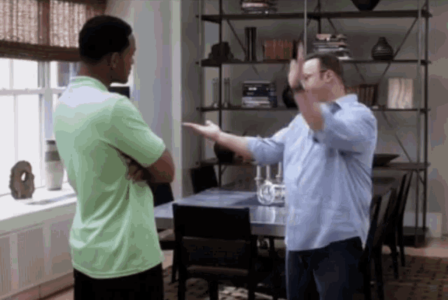
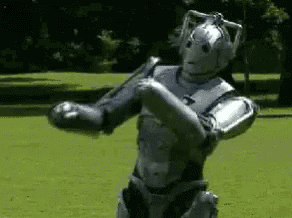

<figure>
    
</figure>

Confession time.

I built an AI agent that feeds me smooth lines to say to my gf (basically AI hitch). I call it **Rizzotto**.

It was just a meme idea I made for a hackathon, but ever since I started using it, she says I've been very empathetic and a great listener!

Do I tell her?

Technical Breakdown: I started with just prompt engineering but that was WAY too generic.

Vanilla ChatGPT has about as much rizz as the people who made it (downside of using RLHF).

So I busted out a web scraper and pointed it to her socials and LI.

Throw this in a vector DB + combine this with multi-shot & the rizzults suddenly became pretty good!

Little known fact: the *r* in RAG stands for *rizz*.

<figure>
    
</figure>

Next step was realtime rizz recommendations. I added 
[Deepgram](https://deepgram.com/)
for streaming ASR, then had Rizzotto text me topics while we were on a date.

I also added speaker diarization so Rizzotto could tell me when I was being cringe.

As it turns out, AI thinks I’m a modern day Steve Urkel.

<figure>
    
</figure>

Now the agent can spit low-latency game, but it still has one major blindspot: LLMs suck at being witty.

Solution: I added 
[Hume AI](https://www.hume.ai/)
 emotion detection to track what made her laugh, then used that to fine tune the model.

This was a quick hack but there’s still a lot of low-hanging rizz to build:

-  Gamify it, so when I say rizzy things on my own, I win badges/rankings (buttery rizzotto, spicy chorizzo, dark chocolate rizzcotti)
- Remember what we've talked about so it can come up with inside jokes
- Send me date ideas based on things she’s brought up (“she said she misses her cat - you guys should do a taxidermy workshop!”)

Any other ideas?

<figure>
    
</figure>

—

People keep asking me if they can try it. I’m kind of uncomfortable that they’re also trying to rizz up my gf, but fine I’ll share.

Here’s the signup list: [Rizzotto waitlit](https://t.co/p4PsSvIYyw).

